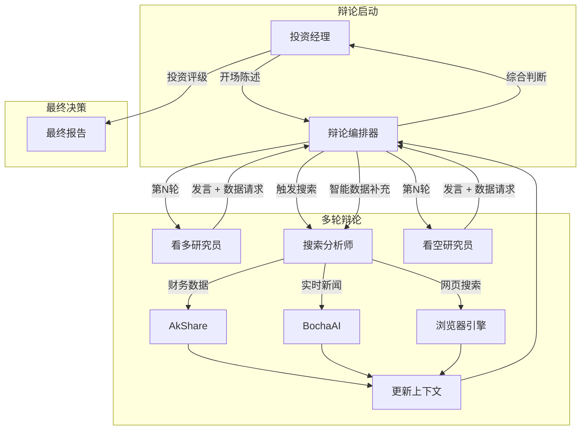

# FinnewsHunter：金融新闻驱动的多智能体投资决策平台

<div align="center">
  
</div>

基于 [AgenticX](https://github.com/DemonDamon/AgenticX) 框架构建的企业级金融新闻分析系统，融合实时新闻流、深度量化分析和多智能体辩论机制。

FinnewsHunter 不再局限于传统的文本分类，而是部署多智能体战队（NewsAnalyst, Researcher 等），实时监控新浪财经、每经网、金融界、证券时报等多源财经资讯。利用大模型进行深度解读、情感分析与市场影响评估，并结合知识图谱挖掘潜在的投资机会与风险，为量化交易提供决策级别的阿尔法信号。

---

## 🎯 项目特色

- ✅ **AgenticX 原生**: 深度集成 AgenticX 框架，使用 Agent、Tool、Workflow 等核心抽象
- ✅ **智能体驱动**: NewsAnalyst 智能体自动分析新闻情感和市场影响
- ✅ **多厂商 LLM 支持**: 支持百炼、OpenAI、DeepSeek、Kimi、智谱 5 大厂商，前端一键切换
- ✅ **股票 K 线分析**: 集成 akshare 真实行情数据，支持日K/分K多周期展示
- ✅ **股票智能搜索**: 支持代码和名称模糊查询，预加载 5000+ A股数据
- ✅ **完整技术栈**: FastAPI + PostgreSQL + Milvus + Redis + React
- ✅ **实时搜索**: 支持标题、内容、股票代码多维度搜索，关键词高亮
- ✅ **生产就绪**: Docker Compose 一键部署，日志、监控完备

---

## 🏗️ 系统架构


系统采用分层架构设计：
- **M6 前端交互层**: React + TypeScript + Shadcn UI
- **M1 平台服务层**: FastAPI Gateway + Task Manager
- **M4/M5 智能体协同层**: AgenticX Agent + Debate Workflow
- **M2/M3 基础设施层**: Crawler Service + LLM Service + Embedding
- **M7-M11 存储与学习层**: PostgreSQL + Milvus + Redis + ACE Framework

---

## 🚀 快速开始

### 前置条件

- Python 3.11+
- Docker & Docker Compose
- (可选) OpenAI API Key 或本地 LLM
- Node.js 18+ (前端开发)

### 1. 安装 AgenticX

```bash
cd /Users/damon/myWork/AgenticX
pip install -e .
```

### 2. 安装后端依赖

```bash
cd FinnewsHunter/backend
pip install -r requirements.txt
```

### 3. 配置环境变量

```bash
cd FinnewsHunter/backend
cp env.example .env
# 编辑 .env 文件，填入 LLM API Key 等配置
```

**多厂商 LLM 配置说明：**

系统支持 5 个 LLM 厂商，至少配置一个即可使用：

| 厂商 | 环境变量 | 获取地址 |
|------|----------|----------|
| 百炼（阿里云） | `DASHSCOPE_API_KEY` | https://dashscope.console.aliyun.com/ |
| OpenAI | `OPENAI_API_KEY` | https://platform.openai.com/api-keys |
| DeepSeek | `DEEPSEEK_API_KEY` | https://platform.deepseek.com/ |
| Kimi（Moonshot） | `MOONSHOT_API_KEY` | https://platform.moonshot.cn/ |
| 智谱 | `ZHIPU_API_KEY` | https://open.bigmodel.cn/ |

**示例配置（推荐百炼）：**

```bash
# 百炼（阿里云）- 推荐，国内访问快
DASHSCOPE_API_KEY=sk-your-dashscope-key
DASHSCOPE_BASE_URL=https://dashscope.aliyuncs.com/compatible-mode/v1
BAILIAN_MODELS=qwen-plus,qwen-max,qwen-turbo

# 可选：其他厂商
OPENAI_API_KEY=sk-your-openai-key
DEEPSEEK_API_KEY=sk-your-deepseek-key
```

### 4. 启动基础服务（PostgreSQL、Redis、Milvus）

```bash
cd FinnewsHunter
docker compose -f deploy/docker-compose.dev.yml up -d postgres redis milvus-etcd milvus-minio milvus-standalone
```

### 5. 初始化数据库

```bash
cd FinnewsHunter/backend
python init_db.py
```

### 5.1 初始化股票数据（可选，用于股票搜索功能）

```bash
cd FinnewsHunter/backend
python -m app.scripts.init_stocks
# 将从 akshare 获取全部 A 股数据（约 5000+ 只）并存入数据库
```

### 6. 启动后端API服务

```bash
cd FinnewsHunter/backend
uvicorn app.main:app --reload --host 0.0.0.0 --port 8000
```

### 7. 启动Celery Worker和Beat（自动爬取）

```bash
# 新开一个终端
cd FinnewsHunter
docker compose -f deploy/docker-compose.dev.yml up -d celery-worker celery-beat
```

### 8. 启动前端服务

```bash
# 新开一个终端
cd FinnewsHunter/frontend
npm install  # 首次需要安装依赖
npm run dev
```

### 9. 访问应用

- **前端界面**: http://localhost:3000
- **后端 API**: http://localhost:8000
- **API 文档**: http://localhost:8000/docs

---

## 🔄 服务管理

### 查看所有服务状态

```bash
cd FinnewsHunter
docker compose -f deploy/docker-compose.dev.yml ps
```

### 重启所有服务

```bash
cd FinnewsHunter

# 重启Docker服务（基础设施 + Celery）
docker compose -f deploy/docker-compose.dev.yml restart

# 如果后端API是独立启动的，需要手动重启
# Ctrl+C 停止后端进程，然后重新运行：
cd backend
uvicorn app.main:app --reload --host 0.0.0.0 --port 8000
```

### 重启特定服务

```bash
cd FinnewsHunter

# 只重启Celery（应用代码更改后）
docker compose -f deploy/docker-compose.dev.yml restart celery-worker celery-beat

# 只重启数据库
docker compose -f deploy/docker-compose.dev.yml restart postgres

# 只重启Redis
docker compose -f deploy/docker-compose.dev.yml restart redis
```

### 停止所有服务

```bash
cd FinnewsHunter
docker compose -f deploy/docker-compose.dev.yml down
```

### 查看日志

```bash
cd FinnewsHunter

# 查看Celery Worker日志
docker compose -f deploy/docker-compose.dev.yml logs -f celery-worker

# 查看Celery Beat日志（定时任务调度）
docker compose -f deploy/docker-compose.dev.yml logs -f celery-beat

# 查看PostgreSQL日志
docker compose -f deploy/docker-compose.dev.yml logs -f postgres

# 查看所有服务日志
docker compose -f deploy/docker-compose.dev.yml logs -f
```

---

## 🗑️ 重置数据库

### 方式1：使用一键重置脚本（推荐）⭐

```bash
cd FinnewsHunter

# 执行重置脚本
./reset_all_data.sh

# 输入 yes 确认
```

**脚本会自动完成：**
1. ✅ 清空PostgreSQL中的所有新闻和任务数据
2. ✅ 清空Redis缓存
3. ✅ 重置数据库自增ID（从1重新开始）
4. ✅ 清空Celery调度文件
5. ✅ 自动重启Celery服务

**执行后等待：**
- 5-10分钟系统会自动重新爬取数据
- 访问前端查看新数据

---

### 方式2：手动重置（高级）

#### 步骤1：清空PostgreSQL数据

```bash
# 进入PostgreSQL容器
docker exec -it finnews_postgres psql -U finnews -d finnews_db
```

在PostgreSQL命令行中执行：

```sql
-- 清空新闻表
DELETE FROM news;

-- 清空任务表
DELETE FROM crawl_tasks;

-- 清空分析表
DELETE FROM analyses;

-- 重置自增ID
ALTER SEQUENCE news_id_seq RESTART WITH 1;
ALTER SEQUENCE crawl_tasks_id_seq RESTART WITH 1;
ALTER SEQUENCE analyses_id_seq RESTART WITH 1;

-- 验证结果（应该都是0）
SELECT 'news表', COUNT(*) FROM news;
SELECT 'crawl_tasks表', COUNT(*) FROM crawl_tasks;
SELECT 'analyses表', COUNT(*) FROM analyses;

-- 退出
\q
```

#### 步骤2：清空Redis缓存

```bash
cd FinnewsHunter
docker exec finnews_redis redis-cli FLUSHDB
```

#### 步骤3：清空Celery调度文件

```bash
cd FinnewsHunter/backend
rm -f celerybeat-schedule*
```

#### 步骤4：重启Celery服务

```bash
cd FinnewsHunter
docker compose -f deploy/docker-compose.dev.yml restart celery-worker celery-beat
```

#### 步骤5：验证数据已清空

```bash
# 检查新闻数量（应该是0）
docker exec finnews_postgres psql -U finnews -d finnews_db -c "SELECT COUNT(*) FROM news;"

# 检查Redis（应该是0或很小）
docker exec finnews_redis redis-cli DBSIZE

# 查看Celery是否开始爬取
docker compose -f deploy/docker-compose.dev.yml logs -f celery-beat
# 应该看到每分钟触发10个爬取任务
```

---

### 方式3：使用Python脚本重置

```bash
cd FinnewsHunter/backend
python reset_database.py
# 输入 yes 确认
```

---

### 方式4：快速手动清理（一行命令）🔥

**适用场景：** 当重置脚本不工作时，使用此方法最快速

```bash
cd FinnewsHunter

# 步骤1：清空数据库表
docker exec finnews_postgres psql -U finnews -d finnews_db -c "DELETE FROM news; DELETE FROM crawl_tasks; DELETE FROM analyses;"

# 步骤2：重置自增ID
docker exec finnews_postgres psql -U finnews -d finnews_db -c "ALTER SEQUENCE news_id_seq RESTART WITH 1; ALTER SEQUENCE crawl_tasks_id_seq RESTART WITH 1; ALTER SEQUENCE analyses_id_seq RESTART WITH 1;"

# 步骤3：清空Redis缓存
docker exec finnews_redis redis-cli FLUSHDB

# 步骤4：清空Celery调度文件
rm -f backend/celerybeat-schedule*

# 步骤5：重启Celery服务
docker compose -f deploy/docker-compose.dev.yml restart celery-worker celery-beat

# 步骤6：验证是否清空（应该显示0）
docker exec finnews_postgres psql -U finnews -d finnews_db -c "SELECT COUNT(*) FROM news;"
```

**执行后立即刷新浏览器：**
- Mac: `Command + Shift + R`
- Windows: `Ctrl + Shift + R`

---

### 🖥️ 清除前端缓存（重要！）

**数据清空后，前端可能仍显示旧数据，这是因为浏览器缓存。**

#### 方法1：硬刷新浏览器（推荐）⭐

**Mac系统：**
```
按 Command + Shift + R
或 Command + Option + R
```

**Windows/Linux系统：**
```
按 Ctrl + Shift + R
或 Ctrl + F5
```

#### 方法2：开发者工具清空缓存

1. 按 `F12` 打开开发者工具
2. 右键点击刷新按钮（地址栏旁边）
3. 选择 **"清空缓存并硬性重新加载"**

#### 方法3：清除浏览器缓存

1. **Chrome/Edge:**
   - `Command + Shift + Delete` (Mac) 或 `Ctrl + Shift + Delete` (Windows)
   - 勾选"缓存的图片和文件"
   - 时间范围选择"全部"
   - 点击"清除数据"

2. **刷新页面后，再次硬刷新**
   - 确保React Query缓存也被清除

#### 方法4：重启前端开发服务器（最彻底）

```bash
# 在前端终端按 Ctrl+C 停止服务
# 然后重新启动
cd FinnewsHunter/frontend
npm run dev
```

---

## 📊 重置后的数据恢复时间线

| 时间 | 事件 | 预期结果 |
|------|------|----------|
| 0分钟 | 执行重置脚本 | 数据库清空，Redis清空 |
| 1分钟 | Celery Beat开始调度 | 10个爬取任务被触发 |
| 2-5分钟 | 第一批新闻保存 | 数据库开始有数据 |
| 5-10分钟 | 所有源都有数据 | 前端可看到100+条新闻 |
| 30分钟 | 数据持续增长 | 500+条新闻 |
| 1小时 | 稳定运行 | 1000-2000条新闻 |

**注意：**
- 重置后需要等待5-10分钟才能看到新数据
- **前端必须硬刷新**（Command+Shift+R / Ctrl+Shift+R）清除缓存
- 不要频繁重置，会影响系统稳定性

**重置后立即硬刷新前端的步骤：**
1. 执行重置命令
2. **立即**在浏览器按 `Command + Shift + R` (Mac) 或 `Ctrl + Shift + R` (Windows)
3. 等待5-10分钟后再次刷新查看新数据

---

## ⚠️ 爬虫状态检查

### 查看哪些源正常工作

```bash
cd FinnewsHunter

# 查看各源的新闻数量
docker exec finnews_postgres psql -U finnews -d finnews_db -c "
SELECT source, COUNT(*) as count 
FROM news 
WHERE created_at > NOW() - INTERVAL '1 hour'
GROUP BY source 
ORDER BY count DESC;
"

# 查看最近的爬取任务状态
docker exec finnews_postgres psql -U finnews -d finnews_db -c "
SELECT source, 
       crawled_count, 
       saved_count, 
       status,
       error_message 
FROM crawl_tasks 
WHERE created_at > NOW() - INTERVAL '10 minutes'
ORDER BY created_at DESC 
LIMIT 20;
"
```

### 查看爬取错误

```bash
cd FinnewsHunter

# 查看ERROR日志
docker compose -f deploy/docker-compose.dev.yml logs celery-worker | grep ERROR

# 查看特定源的问题
docker compose -f deploy/docker-compose.dev.yml logs celery-worker | grep "jwview"
```

---

## 📚 使用指南

### 自动爬取模式（推荐）⭐

**系统已配置10个新闻源的自动爬取：**

1. 🌐 新浪财经
2. 🐧 腾讯财经
3. 💰 金融界
4. 📊 经济观察网
5. 📈 财经网
6. 📉 21经济网
7. 📰 每日经济新闻
8. 🎯 第一财经
9. 📧 网易财经
10. 💎 东方财富

**工作方式：**
- ✅ Celery Beat 每1分钟自动触发所有源的爬取
- ✅ 自动去重（URL级别）
- ✅ 智能时间筛选（保留24小时内新闻）
- ✅ 股票关键词筛选
- ✅ 无需手动操作

**查看爬取进度：**

```bash
# 查看Celery Beat调度日志
cd FinnewsHunter
docker compose -f deploy/docker-compose.dev.yml logs -f celery-beat

# 查看Celery Worker执行日志
docker compose -f deploy/docker-compose.dev.yml logs -f celery-worker
```

---

### 手动刷新（立即获取最新）

**方式 1: 通过前端**
1. 访问 http://localhost:3000/news
2. 点击右上角"🔄 立即刷新"按钮
3. 系统会立即触发爬取，约2分钟后数据更新

**方式 2: 通过 API**
```bash
# 强制刷新新浪财经
curl -X POST "http://localhost:8000/api/v1/news/refresh?source=sina"

# 强制刷新所有源（需要逐个调用）
for source in sina tencent jwview eeo caijing jingji21 nbd yicai 163 eastmoney; do
  curl -X POST "http://localhost:8000/api/v1/news/refresh?source=$source"
  sleep 1
done
```

---

### 查看新闻列表

**方式 1: 通过前端（推荐）**
- 访问 http://localhost:3000
- 首页：查看来源统计和最新新闻
- 新闻流：按来源和情感筛选新闻

**方式 2: 通过 API**

```bash
# 获取所有来源的最新新闻（200条）
curl "http://localhost:8000/api/v1/news/latest?limit=200"

# 获取特定来源的新闻
curl "http://localhost:8000/api/v1/news/latest?source=sina&limit=50"

# 按情感筛选（使用旧接口）
curl "http://localhost:8000/api/v1/news/?sentiment=positive&limit=20"

# 获取所有可用的新闻源列表
curl "http://localhost:8000/api/v1/news/sources"
```

---

### 分析新闻

**方式 1: 通过前端**
- 在新闻卡片上点击"✨ 分析"按钮
- 等待3-5秒查看分析结果
- 点击新闻卡片打开详情抽屉，查看完整分析内容

**方式 2: 通过 API**
```bash
# 分析指定ID的新闻（使用默认模型）
curl -X POST http://localhost:8000/api/v1/analysis/news/1

# 分析新闻（指定模型）
curl -X POST http://localhost:8000/api/v1/analysis/news/1 \
  -H "Content-Type: application/json" \
  -d '{"provider": "bailian", "model": "qwen-max"}'

# 查看分析结果
curl http://localhost:8000/api/v1/analysis/1
```

---

### 切换 LLM 模型

**前端操作：**
1. 点击右上角的模型选择器（显示当前模型名称）
2. 在下拉菜单中选择不同的厂商和模型
3. 选择后自动保存，后续分析将使用新模型

**支持的模型：**
- 🔥 **百炼**: qwen-plus, qwen-max, qwen-turbo, qwen-long
- 🤖 **OpenAI**: gpt-4, gpt-4-turbo, gpt-3.5-turbo
- 🧠 **DeepSeek**: deepseek-chat, deepseek-coder
- 🌙 **Kimi**: moonshot-v1-8k, moonshot-v1-32k, moonshot-v1-128k
- 🔮 **智谱**: glm-4, glm-4-plus, glm-4-air

**API 获取可用模型列表：**
```bash
curl http://localhost:8000/api/v1/llm/config
```

---

### 搜索新闻

**前端操作：**
1. 在顶部搜索框输入关键词
2. 支持搜索：标题、内容、股票代码、来源
3. 匹配的关键词会高亮显示
4. 搜索带有 300ms 防抖，输入停止后自动搜索

**搜索示例：**
- 搜索股票代码：`600519`（贵州茅台）
- 搜索关键词：`新能源`、`半导体`
- 搜索来源：`sina`、`eastmoney`

---

### 查看新闻详情

**前端操作：**
1. 点击任意新闻卡片
2. 右侧滑出详情抽屉，展示：
   - 📰 新闻标题和来源
   - 📊 情感评分（利好/利空/中性）
   - 📈 关联股票代码
   - 📝 完整新闻内容
   - 🤖 AI 分析结果（Markdown 格式）
   - 🔗 原文链接
3. 点击"复制分析内容"可复制 Markdown 格式的分析报告

---

### 股票 K 线分析

**前端操作：**
1. 访问 http://localhost:3000/stocks/SH600519（贵州茅台示例）
2. 使用右上角搜索框输入股票代码或名称（如 `茅台`、`600519`）
3. 选择时间周期：日K、60分、30分、15分、5分、1分
4. 图表支持：
   - 📈 K 线蜡烛图（OHLC）
   - 📊 成交量柱状图
   - 📉 MA 均线（5/10/30/60日）

**API 操作：**

```bash
# 获取 K 线数据（日线，默认180条）
curl "http://localhost:8000/api/v1/stocks/SH600519/kline?period=daily&limit=180"

# 获取分钟 K 线（60分钟线）
curl "http://localhost:8000/api/v1/stocks/SH600519/kline?period=60m&limit=200"

# 搜索股票
curl "http://localhost:8000/api/v1/stocks/search/realtime?q=茅台&limit=10"

# 查看数据库中的股票数量
curl "http://localhost:8000/api/v1/stocks/count"
```

---

### 按来源筛选查看

**前端操作：**

1. **首页（Dashboard）**
   - 查看"新闻来源统计"卡片
   - 点击任意来源按钮筛选
   - 显示该来源的新闻数量和列表

2. **新闻流页面**
   - 顶部有10个来源筛选按钮
   - 点击切换查看不同来源
   - 支持来源+情感双重筛选

**API操作：**

```bash
# 查看新浪财经的新闻
curl "http://localhost:8000/api/v1/news/latest?source=sina&limit=50"

# 查看每日经济新闻
curl "http://localhost:8000/api/v1/news/latest?source=nbd&limit=50"

# 查看所有来源
curl "http://localhost:8000/api/v1/news/latest?limit=200"
```

---

## 🏗️ 项目结构

```
FinnewsHunter/
├── backend/                    # 后端服务
│   ├── app/
│   │   ├── agents/            # 智能体定义（NewsAnalyst）
│   │   ├── api/v1/            # FastAPI 路由
│   │   │   ├── analysis.py    # 分析 API
│   │   │   ├── llm_config.py  # LLM 配置 API（新增）
│   │   │   └── news_v2.py     # 新闻 API
│   │   ├── core/              # 核心配置（config, database）
│   │   ├── models/            # SQLAlchemy 数据模型
│   │   ├── services/          # 业务服务
│   │   │   ├── llm_service.py # LLM 服务（支持多厂商）
│   │   │   └── analysis_service.py
│   │   ├── storage/           # 存储封装（Milvus）
│   │   └── tools/             # AgenticX 工具（Crawler, Cleaner）
│   ├── env.example            # 环境变量模板
│   └── requirements.txt       # Python 依赖
├── frontend/                  # React 前端
│   └── src/
│       ├── components/        # 组件
│       │   ├── ModelSelector.tsx    # LLM 模型选择器（新增）
│       │   ├── NewsDetailDrawer.tsx # 新闻详情抽屉（新增）
│       │   └── HighlightText.tsx    # 关键词高亮（新增）
│       ├── context/           # React Context
│       ├── hooks/             # 自定义 Hooks
│       │   └── useDebounce.ts # 防抖 Hook（新增）
│       ├── layout/            # 布局组件
│       └── pages/             # 页面组件
├── deploy/                    # 部署配置
│   └── docker-compose.dev.yml # Docker Compose 配置
└── .dev-docs/                 # 开发文档
```

---

## 🧪 测试与验收

### MVP 验收标准

- [x] 新闻爬取成功并存入 PostgreSQL
- [x] NewsAnalyst 调用 LLM 完成分析
- [x] 分析结果包含情感评分
- [x] 前端能够展示新闻和分析结果
- [x] 支持多厂商 LLM 动态切换
- [x] 新闻详情展示完整分析内容
- [x] 实时搜索和筛选功能

### 测试流程

1. **启动所有服务**
   ```bash
   ./start.sh
   ```

2. **检查 Docker 容器状态**
   ```bash
   docker ps
   # 应看到: postgres, redis, milvus-standalone, milvus-etcd, milvus-minio
   ```

3. **测试新闻爬取**
   ```bash
   curl -X POST http://localhost:8000/api/v1/news/crawl \
     -H "Content-Type: application/json" \
     -d '{"source": "sina", "start_page": 1, "end_page": 1}'
   
   # 等待 5-10 秒后查看结果
   curl http://localhost:8000/api/v1/news/?limit=5
   ```

4. **测试智能体分析**
   ```bash
   # 获取第一条新闻的ID
   NEWS_ID=$(curl -s http://localhost:8000/api/v1/news/?limit=1 | jq '.[0].id')
   
   # 触发分析
   curl -X POST http://localhost:8000/api/v1/analysis/news/$NEWS_ID
   
   # 查看分析结果
   curl http://localhost:8000/api/v1/analysis/1
   ```

5. **测试前端界面**
   - 打开 `frontend/index.html`
   - 点击"爬取新闻"并等待完成
   - 选择一条新闻点击"分析"
   - 查看情感评分是否显示

---

## 🔧 故障排查

### 问题 1: 数据库连接失败

**症状：** 后端启动报错 `could not connect to database`

**解决方法：**

```bash
cd FinnewsHunter

# 检查 PostgreSQL 是否启动
docker ps | grep postgres

# 查看日志
docker compose -f deploy/docker-compose.dev.yml logs postgres

# 重启容器
docker compose -f deploy/docker-compose.dev.yml restart postgres

# 等待30秒后重试后端启动
```

---

### 问题 2: Celery任务不执行

**症状：** 前端显示新闻数量为0，没有自动爬取

**排查步骤：**

```bash
cd FinnewsHunter

# 1. 检查Celery Worker是否运行
docker ps | grep celery

# 2. 查看Celery Beat日志（应该看到每分钟触发任务）
docker compose -f deploy/docker-compose.dev.yml logs celery-beat --tail=100

# 3. 查看Celery Worker日志（查看任务执行情况）
docker compose -f deploy/docker-compose.dev.yml logs celery-worker --tail=100

# 4. 检查Redis连接
docker exec finnews_redis redis-cli PING
# 应该返回 PONG

# 5. 重启Celery服务
docker compose -f deploy/docker-compose.dev.yml restart celery-worker celery-beat
```

---

### 问题 3: 爬取失败（404错误）

**症状：** Celery日志显示 `404 Client Error: Not Found`

**原因：** 新闻网站URL已变更

**解决方法：**

```bash
# 1. 手动访问URL验证是否可用
curl -I https://finance.caijing.com.cn/

# 2. 如果URL变更，更新对应爬虫的配置
# 编辑 backend/app/tools/{source}_crawler.py
# 更新 BASE_URL 和 STOCK_URL

# 3. 清理Python缓存
cd FinnewsHunter/backend
find . -type d -name __pycache__ -exec rm -rf {} + 2>/dev/null || true

# 4. 重启Celery
cd ..
docker compose -f deploy/docker-compose.dev.yml restart celery-worker celery-beat
```

---

### 问题 4: 只有新浪财经有数据

**症状：** 其他9个来源没有新闻

**可能原因：**
1. Celery Beat配置不完整
2. 爬虫代码有错误
3. 网站URL不正确

**解决方法：**

```bash
cd FinnewsHunter

# 1. 检查Celery Beat配置
docker compose -f deploy/docker-compose.dev.yml logs celery-beat | grep "crawl-"
# 应该看到10个定时任务（crawl-sina, crawl-tencent, ..., crawl-eastmoney）

# 2. 手动测试单个源的爬取
docker exec -it finnews_celery_worker python -c "
from app.tools import get_crawler_tool
crawler = get_crawler_tool('nbd')  # 测试每日经济新闻
news = crawler.crawl()
print(f'爬取到 {len(news)} 条新闻')
"

# 3. 查看数据库中各源的数据量
docker exec finnews_postgres psql -U finnews -d finnews_db -c "
SELECT source, COUNT(*) as count 
FROM news 
GROUP BY source 
ORDER BY count DESC;
"

# 4. 如果某个源一直失败，查看详细错误
docker compose -f deploy/docker-compose.dev.yml logs celery-worker | grep "ERROR"
```

---

### 问题 5: LLM 调用失败

**症状：** 分析功能不工作，报错 `LLM Provider NOT provided`

**解决方法：**

```bash
cd FinnewsHunter/backend

# 1. 检查 API Key 是否配置
grep -E "DASHSCOPE_API_KEY|OPENAI_API_KEY|DEEPSEEK_API_KEY" .env

# 2. 检查 Base URL 是否正确（百炼必须配置）
grep DASHSCOPE_BASE_URL .env
# 应该是: https://dashscope.aliyuncs.com/compatible-mode/v1

# 3. 验证 LLM 配置 API 是否正常
curl http://localhost:8000/api/v1/llm/config | jq '.providers[].has_api_key'
# 至少有一个返回 true

# 4. 如果使用百炼，确保配置完整
cat >> .env << EOF
DASHSCOPE_API_KEY=sk-your-key
DASHSCOPE_BASE_URL=https://dashscope.aliyuncs.com/compatible-mode/v1
BAILIAN_MODELS=qwen-plus,qwen-max
EOF

# 5. 重启后端服务
```

---

### 问题 6: 前端显示空白或CORS错误

**症状：** 前端无法加载数据，浏览器Console显示CORS错误

**解决方法：**

```bash
# 1. 检查后端CORS配置
cd FinnewsHunter/backend
grep BACKEND_CORS_ORIGINS .env
# 应该包含 http://localhost:3000

# 2. 检查前端API地址配置
cd ../frontend
cat .env
# VITE_API_URL 应该是 http://localhost:8000

# 3. 硬刷新浏览器
# Chrome/Edge: Ctrl+Shift+R (Windows) 或 Cmd+Shift+R (Mac)

# 4. 重启前端开发服务器
npm run dev
```

---

### 问题 7: Milvus 连接失败

**症状：** 向量搜索功能不工作

**解决方法：**

```bash
cd FinnewsHunter

# Milvus 需要较长启动时间（约 60 秒）
docker compose -f deploy/docker-compose.dev.yml logs milvus-standalone

# 检查健康状态
docker inspect finnews_milvus | grep -A 10 Health

# 重启Milvus相关服务
docker compose -f deploy/docker-compose.dev.yml restart milvus-etcd milvus-minio milvus-standalone
```

---

### 问题 8: 数据统计不准确

**症状：** 首页显示的新闻数和实际不符

**解决方法：**

```bash
# 使用重置脚本清空数据重新开始
cd FinnewsHunter
./reset_all_data.sh
```

---

### 常用调试命令

```bash
cd FinnewsHunter

# 查看所有容器状态
docker compose -f deploy/docker-compose.dev.yml ps

# 查看某个服务的完整日志
docker compose -f deploy/docker-compose.dev.yml logs celery-worker --tail=500

# 进入容器调试
docker exec -it finnews_celery_worker bash

# 查看数据库连接
docker exec finnews_postgres psql -U finnews -d finnews_db -c "\conninfo"

# 查看Redis连接
docker exec finnews_redis redis-cli INFO

# 测试网络连通性
docker exec finnews_celery_worker ping -c 3 postgres
```

---

## ⚡ 快速参考（常用命令）

### 项目目录

```bash
cd FinnewsHunter
```

### 一键操作

```bash
# 启动所有服务
docker compose -f deploy/docker-compose.dev.yml up -d

# 停止所有服务
docker compose -f deploy/docker-compose.dev.yml down

# 重启Celery（代码更新后）
docker compose -f deploy/docker-compose.dev.yml restart celery-worker celery-beat

# 清空所有数据重新开始
./reset_all_data.sh
```

### 查看状态

```bash
# 服务状态
docker compose -f deploy/docker-compose.dev.yml ps

# 新闻数量
docker exec finnews_postgres psql -U finnews -d finnews_db -c "SELECT source, COUNT(*) FROM news GROUP BY source;"

# 任务数量
docker exec finnews_postgres psql -U finnews -d finnews_db -c "SELECT status, COUNT(*) FROM crawl_tasks GROUP BY status;"

# Redis缓存
docker exec finnews_redis redis-cli DBSIZE
```

### 查看日志

```bash
# Celery Beat（定时调度）
docker compose -f deploy/docker-compose.dev.yml logs -f celery-beat

# Celery Worker（任务执行）
docker compose -f deploy/docker-compose.dev.yml logs -f celery-worker

# PostgreSQL
docker compose -f deploy/docker-compose.dev.yml logs -f postgres

# 所有服务
docker compose -f deploy/docker-compose.dev.yml logs -f
```

### 直接访问

- **前端**: http://localhost:3000
- **后端API**: http://localhost:8000
- **API文档**: http://localhost:8000/docs

---

## 📊 数据库结构

### News（新闻表）
- id, title, content, url, source
- publish_time, stock_codes
- sentiment_score, is_embedded

### Analysis（分析表）
- id, news_id, agent_name
- sentiment, sentiment_score, confidence
- analysis_result, structured_data

### Stock（股票表）
- id, code, name, industry, market

---

## 🛠️ 开发指南

### 添加新的爬虫

1. 继承 `BaseCrawler` 类
2. 实现 `crawl()` 方法
3. 注册到 `tools/__init__.py`

示例：
```python
# backend/app/tools/custom_crawler.py
from .crawler_base import BaseCrawler

class CustomCrawlerTool(BaseCrawler):
    name = "custom_crawler"
    
    def crawl(self, start_page, end_page):
        # 实现爬取逻辑
        pass
```

### 使用增强版爬虫（可选）

对于需要 JS 渲染或智能内容提取的场景，可使用增强版爬虫：

```python
from app.tools.crawler_enhanced import crawl_url, EnhancedCrawler

# 快速爬取单个 URL
article = crawl_url("https://finance.sina.com.cn/xxx", engine='auto')
print(article.to_markdown())

# 获取 LLM 消息格式（多模态）
llm_messages = article.to_llm_message()

# 批量爬取（带缓存）
crawler = EnhancedCrawler(use_cache=True)
articles = crawler.crawl_batch(urls, delay=1.0)
```

**支持的引擎：**
- `requests`: 基础 HTTP 请求（默认）
- `playwright`: JS 渲染（需安装 `playwright install chromium`）
- `jina`: Jina Reader API（需配置 `JINA_API_KEY`）
- `auto`: 自动选择最佳引擎

**安装可选依赖：**

```bash
pip install markdownify readabilipy playwright
playwright install chromium  # 可选，用于 JS 渲染
```

---

### 添加新的智能体

1. 继承 `Agent` 类
2. 定义 role、goal、backstory
3. 实现业务方法

示例：
```python
# backend/app/agents/risk_analyst.py
from agenticx import Agent

class RiskAnalystAgent(Agent):
    def __init__(self, llm_provider):
        super().__init__(
            name="RiskAnalyst",
            role="风险分析师",
            goal="评估投资风险",
            llm_provider=llm_provider
        )
```

---

## 多智能体辩论架构

FinnewsHunter 的核心特色是 **多空辩论机制**，通过多个专业智能体的协作与对抗，深度挖掘个股的投资价值和风险。

### 核心参与角色

| 智能体 | 角色定位 | 核心职责 |
|--------|----------|----------|
| **BullResearcher** | 看多研究员 | 挖掘增长潜力、核心利好、估值优势 |
| **BearResearcher** | 看空研究员 | 识别下行风险、负面催化剂、反驳乐观预期 |
| **SearchAnalyst** | 搜索分析师 | 动态获取数据（AkShare/BochaAI/浏览器搜索） |
| **InvestmentManager** | 投资经理 | 主持辩论、评估论点质量、做出最终决策 |

### 辩论数据流架构



### 动态搜索机制

辩论过程中，智能体可以通过特定格式请求额外数据：

```
[SEARCH: "最近的毛利率数据" source:akshare]   -- 从 AkShare 获取财务数据
[SEARCH: "行业竞争格局分析" source:bochaai]   -- 从 BochaAI 搜索新闻
[SEARCH: "近期资金流向" source:akshare]       -- 获取资金流向
[SEARCH: "竞品对比分析"]                       -- 自动选择最佳数据源
```

**支持的数据源：**
- **AkShare**: 财务指标、K线行情、资金流向、机构持仓
- **BochaAI**: 实时新闻搜索、分析师报告
- **浏览器搜索**: 百度资讯、搜狗、360等多引擎搜索
- **知识库**: 历史新闻和分析数据

---

## 📈 路线图

### Phase 1: MVP（已完成） ✅
- [x] 项目基础设施
- [x] 数据库模型
- [x] 爬虫工具重构（10个新闻源）
- [x] LLM 服务集成
- [x] NewsAnalyst 智能体
- [x] FastAPI 路由
- [x] React + TypeScript 前端

### Phase 1.5: 多厂商 LLM 支持（已完成） ✅
- [x] 支持 5 大 LLM 厂商（百炼、OpenAI、DeepSeek、Kimi、智谱）
- [x] 前端动态模型切换
- [x] LLM 配置 API（`/api/v1/llm/config`）
- [x] 新闻详情抽屉（完整内容 + AI 分析）
- [x] 实时搜索功能（多维度 + 关键词高亮）
- [x] Markdown 渲染（支持表格、代码块）
- [x] 一键复制分析报告

### Phase 1.6: 股票分析与增强爬虫（已完成） ✅
- [x] 股票 K 线图（集成 akshare + klinecharts）
- [x] 多周期支持（日K/60分/30分/15分/5分/1分）
- [x] 股票搜索（代码/名称模糊查询，预加载 5000+ A股）
- [x] 增强版爬虫模块
  - [x] 多引擎支持（Requests/Playwright/Jina）
  - [x] 智能内容提取（readabilipy + 启发式算法）
  - [x] 内容质量评估与自动重试
  - [x] 缓存机制和统一 Article 模型

### Phase 2: 多智能体辩论（已完成） ✅
- [x] BullResearcher & BearResearcher 智能体
- [x] SearchAnalyst 搜索分析师（动态数据获取）
- [x] InvestmentManager 投资经理决策
- [x] 辩论编排器（DebateOrchestrator）
- [x] 动态搜索机制（辩论中按需获取数据）
- [x] 三种辩论模式：并行分析、实时辩论、快速分析
- [ ] 实时 WebSocket 推送（进行中）
- [ ] 智能体执行轨迹可视化（进行中）

### Phase 3: 知识增强（计划中）
- [ ] 金融知识图谱（Neo4j）
- [ ] 智能体记忆系统
- [ ] GraphRetriever 图检索

### Phase 4: 自我进化（计划中）
- [ ] ACE 框架集成
- [ ] 投资策略 Playbook
- [ ] 决策效果评估与学习

---

## 📄 许可证

本项目遵循 AgenticX 的许可证。

---

## 🙏 致谢

- [AgenticX](https://github.com/yourusername/AgenticX) - 多智能体框架
- [FastAPI](https://fastapi.tiangolo.com/) - Web 框架
- [Milvus](https://milvus.io/) - 向量数据库
- [阿里云百炼](https://dashscope.console.aliyun.com/) - LLM 服务
- [Shadcn UI](https://ui.shadcn.com/) - 前端组件库

---

## ⭐ Star History

如果你觉得这个项目对你有帮助，欢迎给个 Star ⭐️！

[](https://star-history.com/#DemonDamon/FinnewsHunter&Date)

---

**Built with ❤️ using AgenticX**

