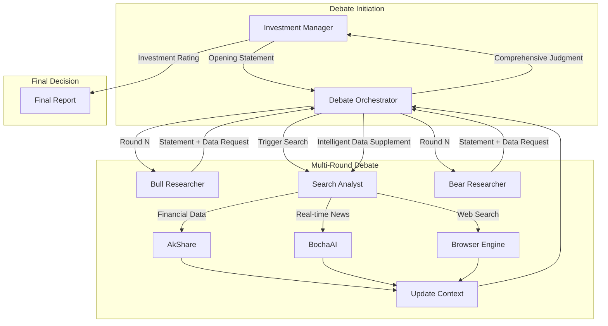

# FinnewsHunter: Multi-Agent Investment Decision Platform Driven by Financial News

<div align="right">
  <a href="README_zn.md">中文版</a> | <a href="README.md">English</a>
</div>

<div align="center">
  
</div>

An enterprise-grade financial news analysis system built on the [AgenticX](https://github.com/DemonDamon/AgenticX) framework, integrating real-time news streams, deep quantitative analysis, and multi-agent debate mechanisms.

FinnewsHunter goes beyond traditional text classification by deploying multi-agent teams (NewsAnalyst, Researcher, etc.) to monitor multiple financial news sources in real-time, including Sina Finance, National Business Daily, Financial World, Securities Times, and more. It leverages large language models for deep interpretation, sentiment analysis, and market impact assessment, combined with knowledge graphs to mine potential investment opportunities and risks, providing decision-level alpha signals for quantitative trading.

---

## 🎯 Project Features

- ✅ **AgenticX Native**: Deeply integrated with AgenticX framework, using core abstractions like Agent, Tool, and Workflow
- ✅ **AgenticX Component Integration**: Direct use of AgenticX's `BailianEmbeddingProvider` and `MilvusStorage`, avoiding reinventing the wheel
- ✅ **Agent-Driven**: NewsAnalyst agent automatically analyzes news sentiment and market impact
- ✅ **Multi-Provider LLM Support**: Supports 5 major LLM providers (Bailian, OpenAI, DeepSeek, Kimi, Zhipu), switchable with one click in the frontend
- ✅ **Batch Operations**: Supports batch selection, batch deletion, and batch analysis of news, improving operational efficiency
- ✅ **Stock K-Line Analysis**: Integrated with akshare real market data, supporting daily/minute K-line multi-period display
- ✅ **Intelligent Stock Search**: Supports code and name fuzzy queries, pre-loaded with 5000+ A-share data
- ✅ **Complete Tech Stack**: FastAPI + PostgreSQL + Milvus + Redis + React
- ✅ **Real-time Search**: Supports multi-dimensional search by title, content, stock code, with keyword highlighting
- ✅ **Async Vectorization**: Background async vectorization execution, non-blocking analysis flow
- ✅ **Production Ready**: One-click deployment with Docker Compose, complete logging and monitoring

---

## 🏗️ System Architecture


The system adopts a layered architecture design:
- **M6 Frontend Interaction Layer**: React + TypeScript + Shadcn UI
- **M1 Platform Service Layer**: FastAPI Gateway + Task Manager
- **M4/M5 Agent Collaboration Layer**: AgenticX Agent + Debate Workflow
- **M2/M3 Infrastructure Layer**: Crawler Service + LLM Service + Embedding
- **M7-M11 Storage & Learning Layer**: PostgreSQL + Milvus + Redis + ACE Framework

---

## 🚀 Quick Start

### Prerequisites

- Python 3.11+
- Docker & Docker Compose
- (Optional) OpenAI API Key or local LLM
- Node.js 18+ (for frontend development)

### 1. Install AgenticX

```bash
cd /Users/damon/myWork/AgenticX
pip install -e .
```

### 2. Install Backend Dependencies

```bash
cd FinnewsHunter/backend
pip install -r requirements.txt
```

### 3. Configure Environment Variables

```bash
cd FinnewsHunter/backend
cp env.example .env
# Edit .env file and fill in LLM API Key and other configurations
```

**Multi-Provider LLM Configuration:**

The system supports 5 LLM providers, at least one needs to be configured:

| Provider | Environment Variable | Registration URL |
|----------|---------------------|------------------|
| Bailian (Alibaba Cloud) | `DASHSCOPE_API_KEY` | https://dashscope.console.aliyun.com/ |
| OpenAI | `OPENAI_API_KEY` | https://platform.openai.com/api-keys |
| DeepSeek | `DEEPSEEK_API_KEY` | https://platform.deepseek.com/ |
| Kimi (Moonshot) | `MOONSHOT_API_KEY` | https://platform.moonshot.cn/ |
| Zhipu | `ZHIPU_API_KEY` | https://open.bigmodel.cn/ |

**Example Configuration (Recommended: Bailian):**

```bash
# Bailian (Alibaba Cloud) - Recommended, fast access in China
DASHSCOPE_API_KEY=sk-your-dashscope-key
DASHSCOPE_BASE_URL=https://dashscope.aliyuncs.com/compatible-mode/v1
BAILIAN_MODELS=qwen-plus,qwen-max,qwen-turbo

# Optional: Other providers
OPENAI_API_KEY=sk-your-openai-key
DEEPSEEK_API_KEY=sk-your-deepseek-key
```

### 4. Start Base Services (PostgreSQL, Redis, Milvus)

```bash
cd FinnewsHunter
docker compose -f deploy/docker-compose.dev.yml up -d postgres redis milvus-etcd milvus-minio milvus-standalone
```

### 5. Initialize Database

```bash
cd FinnewsHunter/backend
python init_db.py
```

### 5.1 Initialize Stock Data (Optional, for stock search functionality)

```bash
cd FinnewsHunter/backend
python -m app.scripts.init_stocks
# Will fetch all A-share data (approximately 5000+ stocks) from akshare and save to database
```

### 6. Start Backend API Service

```bash
cd FinnewsHunter/backend
uvicorn app.main:app --reload --host 0.0.0.0 --port 8000
```

### 7. Start Celery Worker and Beat (Auto Crawling)

```bash
# Open a new terminal
cd FinnewsHunter
docker compose -f deploy/docker-compose.dev.yml up -d celery-worker celery-beat
```

### 8. Start Frontend Service

```bash
# Open a new terminal
cd FinnewsHunter/frontend
npm install  # First time requires dependency installation
npm run dev
```

### 9. Access Application

- **Frontend Interface**: http://localhost:3000
- **Backend API**: http://localhost:8000
- **API Documentation**: http://localhost:8000/docs

---

## 🔄 Service Management

### View All Service Status

```bash
cd FinnewsHunter
docker compose -f deploy/docker-compose.dev.yml ps
```

### Restart All Services

```bash
cd FinnewsHunter

# Restart Docker services (infrastructure + Celery)
docker compose -f deploy/docker-compose.dev.yml restart

# If backend API is started independently, manually restart it
# Press Ctrl+C to stop backend process, then rerun:
cd backend
uvicorn app.main:app --reload --host 0.0.0.0 --port 8000
```

### Restart Specific Service

```bash
cd FinnewsHunter

# Restart only Celery (after code changes)
docker compose -f deploy/docker-compose.dev.yml restart celery-worker celery-beat

# Restart only database
docker compose -f deploy/docker-compose.dev.yml restart postgres

# Restart only Redis
docker compose -f deploy/docker-compose.dev.yml restart redis
```

### Stop All Services

```bash
cd FinnewsHunter
docker compose -f deploy/docker-compose.dev.yml down
```

### View Logs

```bash
cd FinnewsHunter

# View Celery Worker logs
docker compose -f deploy/docker-compose.dev.yml logs -f celery-worker

# View Celery Beat logs (scheduled task dispatch)
docker compose -f deploy/docker-compose.dev.yml logs -f celery-beat

# View PostgreSQL logs
docker compose -f deploy/docker-compose.dev.yml logs -f postgres

# View all service logs
docker compose -f deploy/docker-compose.dev.yml logs -f
```

---

## 🗑️ Reset Database

### Method 1: Use One-Click Reset Script (Recommended) ⭐

```bash
cd FinnewsHunter

# Execute reset script
./reset_all_data.sh

# Enter yes to confirm
```

**The script will automatically complete:**
1. ✅ Clear all news and task data in PostgreSQL
2. ✅ Clear Redis cache
3. ✅ Reset database auto-increment IDs (restart from 1)
4. ✅ Clear Celery schedule files
5. ✅ Automatically restart Celery services

**After execution, wait:**
- 5-10 minutes for the system to automatically re-crawl data
- Access frontend to view new data

---

### Method 2: Manual Reset (Advanced)

#### Step 1: Clear PostgreSQL Data

```bash
# Enter PostgreSQL container
docker exec -it finnews_postgres psql -U finnews -d finnews_db
```

Execute in PostgreSQL command line:

```sql
-- Clear news table
DELETE FROM news;

-- Clear task table
DELETE FROM crawl_tasks;

-- Clear analysis table
DELETE FROM analyses;

-- Reset auto-increment IDs
ALTER SEQUENCE news_id_seq RESTART WITH 1;
ALTER SEQUENCE crawl_tasks_id_seq RESTART WITH 1;
ALTER SEQUENCE analyses_id_seq RESTART WITH 1;

-- Verify results (should all be 0)
SELECT 'news table', COUNT(*) FROM news;
SELECT 'crawl_tasks table', COUNT(*) FROM crawl_tasks;
SELECT 'analyses table', COUNT(*) FROM analyses;

-- Exit
\q
```

#### Step 2: Clear Redis Cache

```bash
cd FinnewsHunter
docker exec finnews_redis redis-cli FLUSHDB
```

#### Step 3: Clear Celery Schedule Files

```bash
cd FinnewsHunter/backend
rm -f celerybeat-schedule*
```

#### Step 4: Restart Celery Services

```bash
cd FinnewsHunter
docker compose -f deploy/docker-compose.dev.yml restart celery-worker celery-beat
```

#### Step 5: Verify Data Cleared

```bash
# Check news count (should be 0)
docker exec finnews_postgres psql -U finnews -d finnews_db -c "SELECT COUNT(*) FROM news;"

# Check Redis (should be 0 or very small)
docker exec finnews_redis redis-cli DBSIZE

# Check if Celery has started crawling
docker compose -f deploy/docker-compose.dev.yml logs -f celery-beat
# Should see 10 crawl tasks triggered per minute
```

---

### Method 3: Use Python Script Reset

```bash
cd FinnewsHunter/backend
python reset_database.py
# Enter yes to confirm
```

---

### Method 4: Quick Manual Cleanup (One-Line Commands) 🔥

**Use Case:** When reset script doesn't work, this is the fastest method

```bash
cd FinnewsHunter

# Step 1: Clear database tables
docker exec finnews_postgres psql -U finnews -d finnews_db -c "DELETE FROM news; DELETE FROM crawl_tasks; DELETE FROM analyses;"

# Step 2: Reset auto-increment IDs
docker exec finnews_postgres psql -U finnews -d finnews_db -c "ALTER SEQUENCE news_id_seq RESTART WITH 1; ALTER SEQUENCE crawl_tasks_id_seq RESTART WITH 1; ALTER SEQUENCE analyses_id_seq RESTART WITH 1;"

# Step 3: Clear Redis cache
docker exec finnews_redis redis-cli FLUSHDB

# Step 4: Clear Celery schedule files
rm -f backend/celerybeat-schedule*

# Step 5: Restart Celery services
docker compose -f deploy/docker-compose.dev.yml restart celery-worker celery-beat

# Step 6: Verify cleared (should display 0)
docker exec finnews_postgres psql -U finnews -d finnews_db -c "SELECT COUNT(*) FROM news;"
```

**Immediately refresh browser after execution:**
- Mac: `Command + Shift + R`
- Windows: `Ctrl + Shift + R`

---

### 🖥️ Clear Frontend Cache (Important!)

**After data is cleared, frontend may still display old data due to browser cache.**

#### Method 1: Hard Refresh Browser (Recommended) ⭐

**Mac System:**
```
Press Command + Shift + R
or Command + Option + R
```

**Windows/Linux System:**
```
Press Ctrl + Shift + R
or Ctrl + F5
```

#### Method 2: Developer Tools Clear Cache

1. Press `F12` to open developer tools
2. Right-click the refresh button (next to address bar)
3. Select **"Empty Cache and Hard Reload"**

#### Method 3: Clear Browser Cache

1. **Chrome/Edge:**
   - `Command + Shift + Delete` (Mac) or `Ctrl + Shift + Delete` (Windows)
   - Check "Cached images and files"
   - Time range select "All time"
   - Click "Clear data"

2. **After refreshing page, hard refresh again**
   - Ensure React Query cache is also cleared

#### Method 4: Restart Frontend Dev Server (Most Thorough)

```bash
# Press Ctrl+C in frontend terminal to stop service
# Then restart
cd FinnewsHunter/frontend
npm run dev
```

---

## 📊 Data Recovery Timeline After Reset

| Time | Event | Expected Result |
|------|-------|----------------|
| 0 min | Execute reset script | Database cleared, Redis cleared |
| 1 min | Celery Beat starts scheduling | 10 crawl tasks triggered |
| 2-5 min | First batch of news saved | Database starts having data |
| 5-10 min | All sources have data | Frontend can see 100+ news |
| 30 min | Data continues growing | 500+ news |
| 1 hour | Stable operation | 1000-2000 news |

**Notes:**
- Need to wait 5-10 minutes after reset to see new data
- **Frontend must hard refresh** (Command+Shift+R / Ctrl+Shift+R) to clear cache
- Don't reset frequently, affects system stability

**Steps to immediately hard refresh frontend after reset:**
1. Execute reset command
2. **Immediately** press `Command + Shift + R` (Mac) or `Ctrl + Shift + R` (Windows) in browser
3. Wait 5-10 minutes then refresh again to view new data

---

## ⚠️ Crawler Status Check

### Check Which Sources Are Working

```bash
cd FinnewsHunter

# View news count by source
docker exec finnews_postgres psql -U finnews -d finnews_db -c "
SELECT source, COUNT(*) as count 
FROM news 
WHERE created_at > NOW() - INTERVAL '1 hour'
GROUP BY source 
ORDER BY count DESC;
"

# View recent crawl task status
docker exec finnews_postgres psql -U finnews -d finnews_db -c "
SELECT source, 
       crawled_count, 
       saved_count, 
       status,
       error_message 
FROM crawl_tasks 
WHERE created_at > NOW() - INTERVAL '10 minutes'
ORDER BY created_at DESC 
LIMIT 20;
"
```

### View Crawl Errors

```bash
cd FinnewsHunter

# View ERROR logs
docker compose -f deploy/docker-compose.dev.yml logs celery-worker | grep ERROR

# View specific source issues
docker compose -f deploy/docker-compose.dev.yml logs celery-worker | grep "jwview"
```

---

## 📚 User Guide

### Auto Crawl Mode (Recommended) ⭐

**System is configured with automatic crawling for 10 news sources:**

1. 🌐 Sina Finance
2. 🐧 Tencent Finance
3. 💰 Financial World
4. 📊 Economic Observer
5. 📈 Caijing.com
6. 📉 21st Century Business Herald
7. 📰 National Business Daily
8. 🎯 Yicai
9. 📧 NetEase Finance
10. 💎 East Money

**How it works:**
- ✅ Celery Beat automatically triggers crawling for all sources every 1 minute
- ✅ Automatic deduplication (URL level)
- ✅ Smart time filtering (keep news within 24 hours)
- ✅ Stock keyword filtering
- ✅ No manual operation needed

**View crawl progress:**

```bash
# View Celery Beat scheduling logs
cd FinnewsHunter
docker compose -f deploy/docker-compose.dev.yml logs -f celery-beat

# View Celery Worker execution logs
docker compose -f deploy/docker-compose.dev.yml logs -f celery-worker
```

---

### Manual Refresh (Get Latest Immediately)

**Method 1: Via Frontend**
1. Visit http://localhost:3000/news
2. Click the "🔄 Refresh Now" button in the top right
3. System will immediately trigger crawling, data updates in about 2 minutes

**Method 2: Via API**
```bash
# Force refresh Sina Finance
curl -X POST "http://localhost:8000/api/v1/news/refresh?source=sina"

# Force refresh all sources (need to call individually)
for source in sina tencent jwview eeo caijing jingji21 nbd yicai 163 eastmoney; do
  curl -X POST "http://localhost:8000/api/v1/news/refresh?source=$source"
  sleep 1
done
```

---

### View News List

**Method 1: Via Frontend (Recommended)**
- Visit http://localhost:3000
- Homepage: View source statistics and latest news
- News Feed: Filter news by source and sentiment
- Batch selection support: Use checkboxes to select multiple news, supports Shift key range selection
- Batch operations: Select all/deselect all, batch delete, batch analyze

**Method 2: Via API**

```bash
# Get latest news from all sources (200 items)
curl "http://localhost:8000/api/v1/news/latest?limit=200"

# Get news from specific source
curl "http://localhost:8000/api/v1/news/latest?source=sina&limit=50"

# Filter by sentiment (using old API)
curl "http://localhost:8000/api/v1/news/?sentiment=positive&limit=20"

# Get all available news source list
curl "http://localhost:8000/api/v1/news/sources"
```

---

### Batch Operations on News

**Frontend Operations:**
1. **Batch Selection**:
   - Click checkbox on the left of news card to select single news
   - Hold Shift key and click for range selection
   - Use "Select All" button in top toolbar to select all news in current filter results
   - Selection state automatically clears when switching news source or filter conditions

2. **Batch Delete**:
   - After selecting multiple news, click "Batch Delete" button in top toolbar
   - After confirming delete dialog, selected news will be deleted
   - List automatically refreshes after deletion

3. **Batch Analysis**:
   - After selecting multiple news, click "Batch Analyze" button in top toolbar
   - System will analyze selected news sequentially, showing progress and result statistics
   - After analysis completes, shows success/failure count

**API Operations:**
```bash
# Batch delete news
curl -X POST "http://localhost:8000/api/v1/news/batch/delete" \
  -H "Content-Type: application/json" \
  -d '{"news_ids": [1, 2, 3]}'

# Batch analyze news
curl -X POST "http://localhost:8000/api/v1/analysis/batch" \
  -H "Content-Type: application/json" \
  -d '{"news_ids": [1, 2, 3], "provider": "bailian", "model": "qwen-plus"}'
```

---

### Analyze News

**Method 1: Via Frontend**
- Click "✨ Analyze" button on news card
- Wait 3-5 seconds to view analysis results
- Click news card to open detail drawer, view complete analysis content

**Method 2: Via API**
```bash
# Analyze news with specified ID (using default model)
curl -X POST http://localhost:8000/api/v1/analysis/news/1

# Analyze news (specify model)
curl -X POST http://localhost:8000/api/v1/analysis/news/1 \
  -H "Content-Type: application/json" \
  -d '{"provider": "bailian", "model": "qwen-max"}'

# View analysis results
curl http://localhost:8000/api/v1/analysis/1
```

---

### Switch LLM Model

**Frontend Operations:**
1. Click model selector in top right (shows current model name)
2. Select different provider and model from dropdown menu
3. Selection automatically saves, subsequent analyses will use new model

**Supported Models:**
- 🔥 **Bailian**: qwen-plus, qwen-max, qwen-turbo, qwen-long
- 🤖 **OpenAI**: gpt-4, gpt-4-turbo, gpt-3.5-turbo
- 🧠 **DeepSeek**: deepseek-chat, deepseek-coder
- 🌙 **Kimi**: moonshot-v1-8k, moonshot-v1-32k, moonshot-v1-128k
- 🔮 **Zhipu**: glm-4, glm-4-plus, glm-4-air

**API to Get Available Model List:**
```bash
curl http://localhost:8000/api/v1/llm/config
```

---

### Search News

**Frontend Operations:**
1. Enter keywords in top search box
2. Supports search: title, content, stock code, source
3. Matching keywords will be highlighted
4. Search has 300ms debounce, automatically searches after input stops

**Search Examples:**
- Search stock code: `600519` (Kweichow Moutai)
- Search keywords: `新能源` (new energy), `半导体` (semiconductor)
- Search source: `sina`, `eastmoney`

---

### View News Details

**Frontend Operations:**
1. Click any news card
2. Detail drawer slides out from right, displaying:
   - 📰 News title and source
   - 📊 Sentiment score (positive/negative/neutral)
   - 📈 Associated stock codes
   - 📝 Complete news content
   - 🤖 AI analysis results (Markdown format)
   - 🔗 Original article link
3. Click "Copy Analysis Content" to copy analysis report in Markdown format

---

### Stock K-Line Analysis

**Frontend Operations:**
1. Visit http://localhost:3000/stocks/SH600519 (Kweichow Moutai example)
2. Use top right search box to enter stock code or name (e.g., `茅台` (Moutai), `600519`)
3. Select time period: Daily K, 60min, 30min, 15min, 5min, 1min
4. Chart supports:
   - 📈 K-line candlestick chart (OHLC)
   - 📊 Volume bar chart
   - 📉 MA moving averages (5/10/30/60 day)

**API Operations:**

```bash
# Get K-line data (daily, default 180 items)
curl "http://localhost:8000/api/v1/stocks/SH600519/kline?period=daily&limit=180"

# Get minute K-line (60-minute line)
curl "http://localhost:8000/api/v1/stocks/SH600519/kline?period=60m&limit=200"

# Search stocks
curl "http://localhost:8000/api/v1/stocks/search/realtime?q=茅台&limit=10"

# View stock count in database
curl "http://localhost:8000/api/v1/stocks/count"
```

---

### Filter by Source

**Frontend Operations:**

1. **Homepage (Dashboard)**
   - View "News Source Statistics" card
   - Click any source button to filter
   - Display news count and list for that source

2. **News Feed Page**
   - Top has 10 source filter buttons
   - Click to switch and view different sources
   - Supports source + sentiment dual filtering

**API Operations:**

```bash
# View Sina Finance news
curl "http://localhost:8000/api/v1/news/latest?source=sina&limit=50"

# View National Business Daily news
curl "http://localhost:8000/api/v1/news/latest?source=nbd&limit=50"

# View all sources
curl "http://localhost:8000/api/v1/news/latest?limit=200"
```

---

## 🏗️ Project Structure

```
FinnewsHunter/
├── backend/                    # Backend service
│   ├── app/
│   │   ├── agents/            # Agent definitions (NewsAnalyst, debate agents, etc.)
│   │   ├── api/v1/            # FastAPI routes
│   │   │   ├── analysis.py    # Analysis API (supports batch analysis)
│   │   │   ├── llm_config.py  # LLM config API
│   │   │   ├── news_v2.py     # News API (supports batch delete)
│   │   │   └── ...
│   │   ├── core/              # Core configuration (config, database, redis, neo4j)
│   │   ├── models/            # SQLAlchemy data models
│   │   ├── services/          # Business services
│   │   │   ├── llm_service.py      # LLM service (multi-provider support)
│   │   │   ├── analysis_service.py # Analysis service (async vectorization)
│   │   │   ├── embedding_service.py # Vectorization service (based on AgenticX BailianEmbeddingProvider)
│   │   │   └── stock_data_service.py # Stock data service
│   │   ├── storage/           # Storage wrapper
│   │   │   └── vector_storage.py # Milvus vector storage (based on AgenticX MilvusStorage)
│   │   ├── tasks/             # Celery tasks
│   │   └── tools/              # AgenticX tools (Crawler, Cleaner)
│   ├── tests/                 # Test and utility scripts
│   │   ├── check_milvus_data.py           # Check Milvus vector storage data
│   │   ├── check_news_embedding_status.py # Check news vectorization status
│   │   └── manual_vectorize.py           # Manually vectorize specified news
│   ├── env.example            # Environment variable template
│   └── requirements.txt       # Python dependencies
├── frontend/                  # React frontend
│   └── src/
│       ├── components/        # Components
│       │   ├── ModelSelector.tsx    # LLM model selector
│       │   ├── NewsDetailDrawer.tsx # News detail drawer
│       │   └── HighlightText.tsx    # Keyword highlighting
│       ├── context/           # React Context
│       ├── hooks/             # Custom Hooks
│       │   └── useDebounce.ts # Debounce Hook
│       ├── layout/            # Layout components
│       └── pages/             # Page components
│           └── NewsListPage.tsx # News list page (supports batch operations)
├── deploy/                    # Deployment configuration
│   ├── docker-compose.dev.yml # Docker Compose configuration
│   ├── Dockerfile.celery     # Celery image build file
│   └── celery-entrypoint.sh  # Celery container startup script
├── conclusions/               # Module summary documentation
│   ├── backend/              # Backend module summaries
│   └── frontend/             # Frontend module summaries
└── .dev-docs/                 # Development documentation
```

---

## 🧪 Testing & Acceptance

### MVP Acceptance Criteria

- [x] News crawling successful and saved to PostgreSQL
- [x] NewsAnalyst calls LLM to complete analysis
- [x] Analysis results include sentiment scores
- [x] Frontend can display news and analysis results
- [x] Support multi-provider LLM dynamic switching
- [x] News details display complete analysis content
- [x] Real-time search and filtering functionality
- [x] Batch selection, batch delete, batch analysis functionality
- [x] Vectorization and storage services based on AgenticX
- [x] Async vectorization, non-blocking analysis flow

### Testing Process

1. **Start All Services**
   ```bash
   ./start.sh
   ```

2. **Check Docker Container Status**
   ```bash
   docker ps
   # Should see: postgres, redis, milvus-standalone, milvus-etcd, milvus-minio
   ```

3. **Test News Crawling**
   ```bash
   curl -X POST http://localhost:8000/api/v1/news/crawl \
     -H "Content-Type: application/json" \
     -d '{"source": "sina", "start_page": 1, "end_page": 1}'
   
   # Wait 5-10 seconds then check results
   curl http://localhost:8000/api/v1/news/?limit=5
   ```

4. **Test Agent Analysis**
   ```bash
   # Get first news ID
   NEWS_ID=$(curl -s http://localhost:8000/api/v1/news/?limit=1 | jq '.[0].id')
   
   # Trigger analysis
   curl -X POST http://localhost:8000/api/v1/analysis/news/$NEWS_ID
   
   # View analysis results
   curl http://localhost:8000/api/v1/analysis/1
   ```

5. **Test Frontend Interface**
   - Open `frontend/index.html`
   - Click "Crawl News" and wait for completion
   - Select a news item and click "Analyze"
   - Check if sentiment score is displayed

---

## 🔧 Troubleshooting

### Issue 1: Database Connection Failed

**Symptom:** Backend startup error `could not connect to database`

**Solution:**

```bash
cd FinnewsHunter

# Check if PostgreSQL is running
docker ps | grep postgres

# View logs
docker compose -f deploy/docker-compose.dev.yml logs postgres

# Restart container
docker compose -f deploy/docker-compose.dev.yml restart postgres

# Wait 30 seconds then retry backend startup
```

---

### Issue 2: Celery Tasks Not Executing

**Symptom:** Frontend shows 0 news count, no automatic crawling

**Troubleshooting Steps:**

```bash
cd FinnewsHunter

# 1. Check if Celery Worker is running
docker ps | grep celery

# 2. View Celery Beat logs (should see tasks triggered every minute)
docker compose -f deploy/docker-compose.dev.yml logs celery-beat --tail=100

# 3. View Celery Worker logs (check task execution)
docker compose -f deploy/docker-compose.dev.yml logs celery-worker --tail=100

# 4. Check Redis connection
docker exec finnews_redis redis-cli PING
# Should return PONG

# 5. Restart Celery services
docker compose -f deploy/docker-compose.dev.yml restart celery-worker celery-beat
```

---

### Issue 3: Crawling Failed (404 Error)

**Symptom:** Celery logs show `404 Client Error: Not Found`

**Cause:** News website URL has changed

**Solution:**

```bash
# 1. Manually visit URL to verify if available
curl -I https://finance.caijing.com.cn/

# 2. If URL changed, update corresponding crawler configuration
# Edit backend/app/tools/{source}_crawler.py
# Update BASE_URL and STOCK_URL

# 3. Clear Python cache
cd FinnewsHunter/backend
find . -type d -name __pycache__ -exec rm -rf {} + 2>/dev/null || true

# 4. Restart Celery
cd ..
docker compose -f deploy/docker-compose.dev.yml restart celery-worker celery-beat
```

---

### Issue 4: Only Sina Finance Has Data

**Symptom:** Other 9 sources have no news

**Possible Causes:**
1. Celery Beat configuration incomplete
2. Crawler code has errors
3. Website URL incorrect

**Solution:**

```bash
cd FinnewsHunter

# 1. Check Celery Beat configuration
docker compose -f deploy/docker-compose.dev.yml logs celery-beat | grep "crawl-"
# Should see 10 scheduled tasks (crawl-sina, crawl-tencent, ..., crawl-eastmoney)

# 2. Manually test single source crawling
docker exec -it finnews_celery_worker python -c "
from app.tools import get_crawler_tool
crawler = get_crawler_tool('nbd')  # Test National Business Daily
news = crawler.crawl()
print(f'Crawled {len(news)} news items')
"

# 3. View data volume by source in database
docker exec finnews_postgres psql -U finnews -d finnews_db -c "
SELECT source, COUNT(*) as count 
FROM news 
GROUP BY source 
ORDER BY count DESC;
"

# 4. If a source keeps failing, view detailed errors
docker compose -f deploy/docker-compose.dev.yml logs celery-worker | grep "ERROR"
```

---

### Issue 5: LLM Call Failed

**Symptom:** Analysis functionality not working, error `LLM Provider NOT provided`

**Solution:**

```bash
cd FinnewsHunter/backend

# 1. Check if API Key is configured
grep -E "DASHSCOPE_API_KEY|OPENAI_API_KEY|DEEPSEEK_API_KEY" .env

# 2. Check if Base URL is correct (Bailian must configure)
grep DASHSCOPE_BASE_URL .env
# Should be: https://dashscope.aliyuncs.com/compatible-mode/v1

# 3. Verify LLM config API is normal
curl http://localhost:8000/api/v1/llm/config | jq '.providers[].has_api_key'
# At least one should return true

# 4. If using Bailian, ensure complete configuration
cat >> .env << EOF
DASHSCOPE_API_KEY=sk-your-key
DASHSCOPE_BASE_URL=https://dashscope.aliyuncs.com/compatible-mode/v1
BAILIAN_MODELS=qwen-plus,qwen-max
EOF

# 5. Restart backend service
```

---

### Issue 6: Frontend Shows Blank or CORS Error

**Symptom:** Frontend cannot load data, browser Console shows CORS error

**Solution:**

```bash
# 1. Check backend CORS configuration
cd FinnewsHunter/backend
grep BACKEND_CORS_ORIGINS .env
# Should include http://localhost:3000

# 2. Check frontend API address configuration
cd ../frontend
cat .env
# VITE_API_URL should be http://localhost:8000

# 3. Hard refresh browser
# Chrome/Edge: Ctrl+Shift+R (Windows) or Cmd+Shift+R (Mac)

# 4. Restart frontend dev server
npm run dev
```

---

### Issue 7: Milvus Connection Failed

**Symptom:** Vector search functionality not working

**Solution:**

```bash
cd FinnewsHunter

# Milvus requires longer startup time (approximately 60 seconds)
docker compose -f deploy/docker-compose.dev.yml logs milvus-standalone

# Check health status
docker inspect finnews_milvus | grep -A 10 Health

# Restart Milvus related services
docker compose -f deploy/docker-compose.dev.yml restart milvus-etcd milvus-minio milvus-standalone
```

---

### Issue 8: Data Statistics Inaccurate

**Symptom:** Homepage shows news count doesn't match actual

**Solution:**

```bash
# Use reset script to clear data and start fresh
cd FinnewsHunter
./reset_all_data.sh
```

---

### Common Debugging Commands

```bash
cd FinnewsHunter

# View all container status
docker compose -f deploy/docker-compose.dev.yml ps

# View complete logs for a service
docker compose -f deploy/docker-compose.dev.yml logs celery-worker --tail=500

# Enter container for debugging
docker exec -it finnews_celery_worker bash

# View database connection
docker exec finnews_postgres psql -U finnews -d finnews_db -c "\conninfo"

# View Redis connection
docker exec finnews_redis redis-cli INFO

# Test network connectivity
docker exec finnews_celery_worker ping -c 3 postgres
```

---

## ⚡ Quick Reference (Common Commands)

### Project Directory

```bash
cd FinnewsHunter
```

### One-Click Operations

```bash
# Start all services
docker compose -f deploy/docker-compose.dev.yml up -d

# Stop all services
docker compose -f deploy/docker-compose.dev.yml down

# Restart Celery (after code updates)
docker compose -f deploy/docker-compose.dev.yml restart celery-worker celery-beat

# Clear all data and start fresh
./reset_all_data.sh
```

### View Status

```bash
# Service status
docker compose -f deploy/docker-compose.dev.yml ps

# News count
docker exec finnews_postgres psql -U finnews -d finnews_db -c "SELECT source, COUNT(*) FROM news GROUP BY source;"

# Task count
docker exec finnews_postgres psql -U finnews -d finnews_db -c "SELECT status, COUNT(*) FROM crawl_tasks GROUP BY status;"

# Redis cache
docker exec finnews_redis redis-cli DBSIZE
```

### View Logs

```bash
# Celery Beat (scheduled dispatch)
docker compose -f deploy/docker-compose.dev.yml logs -f celery-beat

# Celery Worker (task execution)
docker compose -f deploy/docker-compose.dev.yml logs -f celery-worker

# PostgreSQL
docker compose -f deploy/docker-compose.dev.yml logs -f postgres

# All services
docker compose -f deploy/docker-compose.dev.yml logs -f
```

### Direct Access

- **Frontend**: http://localhost:3000
- **Backend API**: http://localhost:8000
- **API Documentation**: http://localhost:8000/docs

---

## 📊 Database Structure

### News Table
- id, title, content, url, source
- publish_time, stock_codes
- sentiment_score, is_embedded

### Analysis Table
- id, news_id, agent_name
- sentiment, sentiment_score, confidence
- analysis_result, structured_data

### Stock Table
- id, code, name, industry, market

---

## 🛠️ Development Guide

### Add New Crawler

1. Inherit `BaseCrawler` class
2. Implement `crawl()` method
3. Register in `tools/__init__.py`

Example:
```python
# backend/app/tools/custom_crawler.py
from .crawler_base import BaseCrawler

class CustomCrawlerTool(BaseCrawler):
    name = "custom_crawler"
    
    def crawl(self, start_page, end_page):
        # Implement crawling logic
        pass
```

### Use Enhanced Crawler (Optional)

For scenarios requiring JS rendering or intelligent content extraction, use enhanced crawler:

```python
from app.tools.crawler_enhanced import crawl_url, EnhancedCrawler

# Quick crawl single URL
article = crawl_url("https://finance.sina.com.cn/xxx", engine='auto')
print(article.to_markdown())

# Get LLM message format (multimodal)
llm_messages = article.to_llm_message()

# Batch crawl (with cache)
crawler = EnhancedCrawler(use_cache=True)
articles = crawler.crawl_batch(urls, delay=1.0)
```

**Supported Engines:**
- `requests`: Basic HTTP requests (default)
- `playwright`: JS rendering (requires `playwright install chromium`)
- `jina`: Jina Reader API (requires `JINA_API_KEY` configuration)
- `auto`: Automatically select best engine

**Install Optional Dependencies:**

```bash
pip install markdownify readabilipy playwright
playwright install chromium  # Optional, for JS rendering
```

---

### Add New Agent

1. Inherit `Agent` class
2. Define role, goal, backstory
3. Implement business methods

Example:
```python
# backend/app/agents/risk_analyst.py
from agenticx import Agent

class RiskAnalystAgent(Agent):
    def __init__(self, llm_provider):
        super().__init__(
            name="RiskAnalyst",
            role="Risk Analyst",
            goal="Assess investment risks",
            llm_provider=llm_provider
        )
```

---

### Using AgenticX Components

FinnewsHunter deeply integrates AgenticX framework core components to avoid reinventing the wheel:

#### 1. Embedding Service

The system uses `agenticx.embeddings.BailianEmbeddingProvider` as the core embedding engine:

```python
from app.services.embedding_service import EmbeddingService

# Synchronous interface (for sync contexts)
embedding_service = EmbeddingService()
vector = embedding_service.embed_text("text content")

# Asynchronous interface (recommended for async contexts)
vector = await embedding_service.aembed_text("text content")

# Batch processing (Provider handles internal batching)
vectors = embedding_service.embed_batch(["text1", "text2", "text3"])
```

**Features**:
- Redis caching support to avoid duplicate calculations
- Automatic text length limit handling (6000 characters)
- Both sync and async interfaces to avoid event loop conflicts

#### 2. Vector Storage (Milvus)

The system uses `agenticx.storage.vectordb_storages.milvus.MilvusStorage` as the vector database:

```python
from app.storage.vector_storage import VectorStorage

vector_storage = VectorStorage()

# Store single vector
vector_storage.store_embedding(
    news_id=1,
    text="news content",
    embedding=[0.1, 0.2, ...]
)

# Batch storage
vector_storage.store_embeddings_batch([
    {"news_id": 1, "text": "content1", "embedding": [...]},
    {"news_id": 2, "text": "content2", "embedding": [...]}
])

# Similarity search
results = vector_storage.search_similar(query_vector=[...], top_k=10)

# Get statistics (with query count fallback mechanism)
stats = vector_storage.get_stats()
```

**Features**:
- Direct use of AgenticX MilvusStorage, no duplicate implementation
- Compatibility interface for simplified calls
- Query count fallback when `num_entities` is inaccurate
- Async operation support to avoid blocking

#### 3. Async Embedding Best Practices

In async contexts (e.g., FastAPI routes), use async interfaces:

```python
from app.services.embedding_service import EmbeddingService
from app.storage.vector_storage import VectorStorage

async def analyze_news(news_id: int, text: str):
    embedding_service = EmbeddingService()
    vector_storage = VectorStorage()
    
    # Use async interface to avoid event loop conflicts
    embedding = await embedding_service.aembed_text(text)
    
    # Store vector asynchronously in background (non-blocking)
    asyncio.create_task(
        vector_storage.store_embedding(news_id, text, embedding)
    )
    
    # Continue with analysis logic...
```

**Notes**:
- In async contexts, use `aembed_text()` instead of `embed_text()`
- Embedding operations run asynchronously in background, non-blocking
- Milvus `flush()` operation is optimized, not executed by default (relies on auto-flush)

---

## Multi-Agent Debate Architecture

FinnewsHunter's core feature is the **bull-bear debate mechanism**, through collaboration and confrontation of multiple professional agents, deeply mining investment value and risks of individual stocks.

### Core Participants

| Agent | Role | Core Responsibilities |
|-------|------|---------------------|
| **BullResearcher** | Bull Researcher | Mine growth potential, core positives, valuation advantages |
| **BearResearcher** | Bear Researcher | Identify downside risks, negative catalysts, refute optimistic expectations |
| **SearchAnalyst** | Search Analyst | Dynamically acquire data (AkShare/BochaAI/browser search) |
| **InvestmentManager** | Investment Manager | Host debate, evaluate argument quality, make final decisions |

### Debate Data Flow Architecture



### Dynamic Search Mechanism

During debate, agents can request additional data through specific format:

```
[SEARCH: "Recent gross margin data" source:akshare]   -- Get financial data from AkShare
[SEARCH: "Industry competition analysis" source:bochaai]   -- Search news from BochaAI
[SEARCH: "Recent fund flows" source:akshare]       -- Get fund flows
[SEARCH: "Competitor comparison analysis"]                       -- Automatically select best data source
```

**Supported Data Sources:**
- **AkShare**: Financial indicators, K-line market data, fund flows, institutional holdings
- **BochaAI**: Real-time news search, analyst reports
- **Browser Search**: Baidu News, Sogou, 360 and other multi-engine search
- **Knowledge Base**: Historical news and analysis data

---

## 📈 Roadmap

### Phase 1: MVP (Completed) ✅
- [x] Project infrastructure
- [x] Database models
- [x] Crawler tool refactoring (10 news sources)
- [x] LLM service integration
- [x] NewsAnalyst agent
- [x] FastAPI routes
- [x] React + TypeScript frontend

### Phase 1.5: Multi-Provider LLM Support (Completed) ✅
- [x] Support 5 major LLM providers (Bailian, OpenAI, DeepSeek, Kimi, Zhipu)
- [x] Frontend dynamic model switching
- [x] LLM config API (`/api/v1/llm/config`)
- [x] News detail drawer (complete content + AI analysis)
- [x] Real-time search functionality (multi-dimensional + keyword highlighting)
- [x] Markdown rendering (supports tables, code blocks)
- [x] One-click copy analysis report

### Phase 1.6: Stock Analysis & Enhanced Crawler (Completed) ✅
- [x] Stock K-line charts (integrated akshare + klinecharts)
- [x] Multi-period support (Daily K/60min/30min/15min/5min/1min)
- [x] Stock search (code/name fuzzy query, pre-loaded 5000+ A-shares)
- [x] Enhanced crawler module
  - [x] Multi-engine support (Requests/Playwright/Jina)
  - [x] Intelligent content extraction (readabilipy + heuristic algorithms)
  - [x] Content quality assessment and auto-retry
  - [x] Cache mechanism and unified Article model

### Phase 1.7: AgenticX Deep Integration & Batch Operations (Completed) ✅
- [x] Migrated to AgenticX BailianEmbeddingProvider (removed redundant batch processing logic)
- [x] Migrated to AgenticX MilvusStorage (simplified storage wrapper, removed duplicate code)
- [x] Async vectorization interfaces (aembed_text/aembed_batch), avoid event loop conflicts
- [x] Background async vectorization, non-blocking analysis flow
- [x] Milvus statistics optimization (query count fallback mechanism)
- [x] Frontend batch selection functionality (checkboxes + Shift range selection)
- [x] Batch delete news functionality
- [x] Batch analyze news functionality (with progress display and result statistics)
- [x] Docker Compose optimization (Celery image build, improved startup performance)

### Phase 2: Multi-Agent Debate (Completed) ✅
- [x] BullResearcher & BearResearcher agents
- [x] SearchAnalyst search analyst (dynamic data acquisition)
- [x] InvestmentManager investment manager decision
- [x] Debate orchestrator (DebateOrchestrator)
- [x] Dynamic search mechanism (on-demand data acquisition during debate)
- [x] Three debate modes: parallel analysis, real-time debate, quick analysis
- [ ] Real-time WebSocket push (in progress)
- [ ] Agent execution trace visualization (in progress)

### Phase 3: Knowledge Enhancement (Planned)
- [ ] Financial knowledge graph (Neo4j)
- [ ] Agent memory system
- [ ] GraphRetriever graph retrieval

### Phase 4: Self-Evolution (Planned)
- [ ] ACE framework integration
- [ ] Investment strategy Playbook
- [ ] Decision effectiveness evaluation and learning

---

## 📄 License

This project follows the AgenticX license.

---

## 🙏 Acknowledgments

- [AgenticX](https://github.com/yourusername/AgenticX) - Multi-agent framework
- [FastAPI](https://fastapi.tiangolo.com/) - Web framework
- [Milvus](https://milvus.io/) - Vector database
- [Alibaba Cloud Bailian](https://dashscope.console.aliyun.com/) - LLM service
- [Shadcn UI](https://ui.shadcn.com/) - Frontend component library

---

## ⭐ Star History

If you find this project helpful, please give it a Star ⭐️!

[](https://star-history.com/#DemonDamon/FinnewsHunter&Date)

---

**Built with ❤️ using AgenticX**
