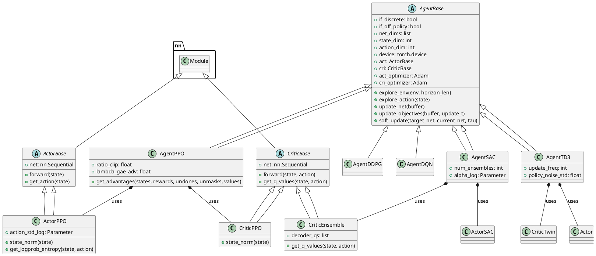
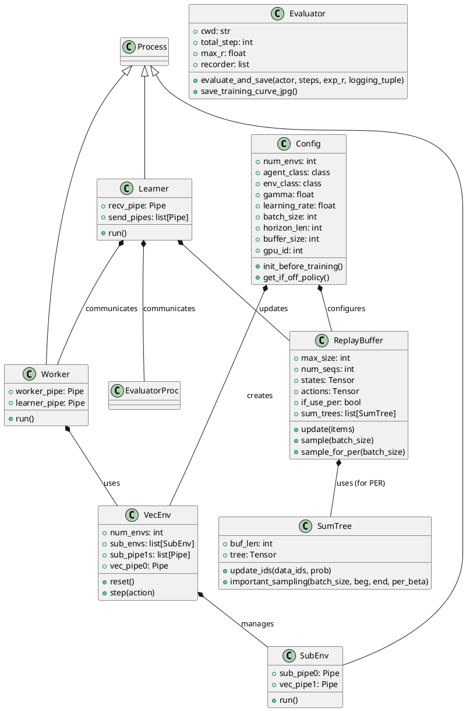
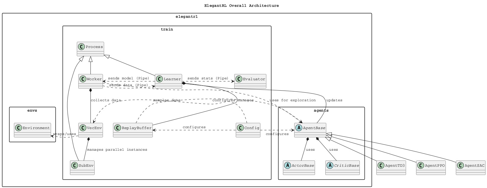

# ElegantRL - In-Depth Source Code Analysis

## Phase 1: Global Scan & Planning

### 1.1. Full Directory Structure

```
The ElegantRL project is structured to separate the core reinforcement learning logic from examples, documentation, and utility components. The core logic resides primarily in the `elegantrl` directory, which is further divided into functional modules: `agents`, `envs`, and `train`.

```
/home/ubuntu/ElegantRL
|____.github/             # GitHub configuration files (e.g., FUNDING.yml)
|____docs/                # Documentation source files (using Sphinx/reStructuredText)
|____elegantrl/           # Core Reinforcement Learning Library
| |______init__.py        # Package initialization
| |____agents/            # Implementations of various DRL agents (AgentBase, AgentPPO, AgentSAC, etc.)
| |____envs/              # Custom and wrapper environments (StockTradingEnv, CustomGymEnv, etc.)
| |____train/             # Core training components (config, evaluator, replay_buffer, run)
|____examples/            # Scripts demonstrating how to use the library with different algorithms and environments
|____figs/                # Figures and images used in documentation and README
|____helloworld/          # Simple, single-file examples for quick start and tutorials
|____requirements.txt     # Python dependencies
|____rlsolver/            # A separate, specialized solver component, likely for combinatorial optimization (CO) problems
|____unit_tests/          # Test files for agents, environments, and training components
```

The primary focus is on the `elegantrl` directory, which contains the fundamental components of the DRL library. The separation into `agents`, `envs`, and `train` enforces a clear modular design, making the codebase maintainable and extensible. The top-level folders like `examples`, `helloworld`, and `unit_tests` serve to support the core library by providing usage demonstrations and ensuring code quality. The `rlsolver` folder suggests a specialized application of the DRL framework to optimization problems.
```

### 1.2. Core Folders for Analysis

- **elegantrl/agents**: Contains the base class `AgentBase` and concrete implementations for various Deep Reinforcement Learning (DRL) algorithms, including on-policy (PPO, A2C) and off-policy (SAC, TD3, DDPG, DQN) methods, as well as multi-agent extensions (MADDPG, MAPPO, QMix, VDN).
- **elegantrl/envs**: Houses custom and specialized environment implementations, such as `StockTradingEnv` for financial applications and wrappers for vectorized environments.
- **elegantrl/train**: Manages the training infrastructure, including configuration (`config.py`), the main execution logic (`run.py`), experience storage (`replay_buffer.py`), and performance monitoring (`evaluator.py`).

## Phase 2: Module-by-Module Deep Analysis

### 1. Module: `elegantrl/agents`

**Core Responsibility:** Implements the core logic for Deep Reinforcement Learning (DRL) agents, defining the interaction between the agent and the environment, and managing the policy and value networks.

**Key Files and Functions:**
- **`AgentBase.py`**: Defines the abstract base class `AgentBase` for all DRL agents. It handles initialization parameters (network dimensions, environment info, hyperparameters), device management (CPU/GPU), exploration logic (`explore_env`, `explore_action`), network update boilerplate (`update_net`, `optimizer_backward`, `soft_update`), and utility network classes (`ActorBase`, `CriticBase`, `build_mlp`).
- **`AgentPPO.py`**: Implements the **Proximal Policy Optimization (PPO)** algorithm, an on-policy method. It extends `AgentBase` and includes specific logic for Generalized Advantage Estimation (GAE), ratio clipping, and entropy regularization. It also contains `AgentA2C` as a simpler variant.
- **`AgentSAC.py`**: Implements the **Soft Actor-Critic (SAC)** algorithm, an off-policy, maximum entropy DRL method. It uses an ensemble of critics (`CriticEnsemble`) and includes logic for automatic temperature parameter (`alpha`) adjustment.
- **`AgentTD3.py`**: Implements the **Twin Delayed DDPG (TD3)** algorithm, an off-policy method that improves upon DDPG with clipped double Q-learning and delayed policy updates. It includes `AgentDDPG` as a simpler variant.
- **`AgentDQN.py`**: Implements **Deep Q-Network (DQN)** and its variants (Double DQN, Dueling DQN) for discrete action spaces.
- **`MAgent*.py`**: Contains multi-agent extensions like `MAgentMADDPG`, `MAgentMAPPO`, `MAgentQMix`, and `MAgentVDN`, which adapt single-agent algorithms for multi-agent systems.

**Core Implementation Details:**
- **Network Abstraction**: Agents rely on `ActorBase` and `CriticBase` (defined in `AgentBase.py`) which are essentially wrappers around PyTorch `nn.Module`s built using the `build_mlp` utility.
- **Exploration**: The `explore_env` method is central, handling the collection of trajectories from the environment, distinguishing between single-environment (`_explore_one_env`) and vectorized environment (`_explore_vec_env`) scenarios.
- **Update Logic**: The `update_net` method orchestrates the training. The core difference between on-policy (PPO) and off-policy (SAC, TD3) agents is evident here: PPO calculates advantages and reward sums from the collected batch, while off-policy agents sample from the `ReplayBuffer`.

### 2. Module: `elegantrl/envs`

**Core Responsibility:** Provides custom and specialized environment interfaces, particularly for financial and multi-agent tasks, and handles the creation of vectorized environments.

**Key Files and Functions:**
- **`CustomGymEnv.py`**: A template or wrapper for integrating custom environments that follow the OpenAI Gym/Gymnasium interface.
- **`StockTradingEnv.py`**: A specialized environment for financial reinforcement learning, a key feature of the AI4Finance foundation. It defines the state, action, and reward space for a stock trading problem.
- **`PlanIsaacGymEnv.py`**: Integration with NVIDIA's Isaac Gym for highly parallelized, high-performance simulation environments.
- **`PointChasingEnv.py`**: A simple multi-agent environment used for testing and demonstration of multi-agent algorithms.

**Core Implementation Details:**
- **Standard Interface**: All environments adhere to the standard `reset()` and `step()` methods, ensuring compatibility with the `AgentBase`'s exploration logic.
- **Vectorization**: The concept of a vectorized environment (`VecEnv` in `config.py`) is crucial, allowing multiple environment instances to run in parallel, which is essential for the "Massively Parallel" aspect of ElegantRL.

### 3. Module: `elegantrl/train`

**Core Responsibility:** Manages the overall training workflow, configuration, data storage, and performance evaluation.

**Key Files and Functions:**
- **`config.py`**: Defines the `Config` class, which holds all hyperparameters and environment metadata. It includes logic to automatically determine if an agent is on-policy or off-policy (`get_if_off_policy`) and contains the `VecEnv` and `SubEnv` classes for parallel environment execution using Python's `multiprocessing.Pipe` and `Process`.
- **`replay_buffer.py`**: Implements the `ReplayBuffer` class for off-policy algorithms. It supports both standard sampling and **Prioritized Experience Replay (PER)** using the `SumTree` data structure.
- **`run.py`**: Contains the main entry points for training (`train_agent`, `train_agent_single_process`, `train_agent_multiprocessing`). It defines the `Learner`, `Worker`, and `EvaluatorProc` classes for distributed training using Python's `multiprocessing`.
- **`evaluator.py`**: Implements the `Evaluator` class for logging, saving checkpoints, and calculating performance metrics (average return, steps, loss values). It supports both single and vectorized environment evaluation and includes utilities for plotting the learning curve.

**Core Implementation Details:**
- **Parallelism**: The multi-process architecture in `run.py` is the backbone of ElegantRL's "Massively Parallel" claim. `Worker` processes collect experience from environments, and the `Learner` process updates the agent's networks, communicating via `Pipe`s.
- **Data Flow**: In off-policy training, `Worker`s send collected experience to the `Learner`, which stores it in the `ReplayBuffer` and samples batches for network updates. In on-policy training, the collected experience is used directly for a few epochs of updates before being discarded.

### Module PlantUML Diagrams

### 1. `elegantrl/agents` Module Diagram (Simplified Core)



### 2. `elegantrl/train` Module Diagram (Core Components)



## Phase 3: Overall Architecture & Summary

### 3.1. Overall Architecture Analysis

#### 3.1.1. Core Abstractions

The ElegantRL architecture is built around a set of highly modular and decoupled abstractions, primarily focused on the Actor-Critic paradigm and parallel execution.

1.  **Agent (`AgentBase`)**: The central abstraction for any DRL algorithm. It encapsulates the policy (`act`), value function (`cri`), optimization logic, and exploration strategy. Concrete implementations like `AgentPPO` and `AgentSAC` inherit from this base class, ensuring a consistent interface for the training loop.
2.  **Network (`ActorBase`, `CriticBase`)**: These define the neural network structures for the policy and value functions, respectively. They are decoupled from the agent logic, allowing for flexible network designs (e.g., `CriticTwin` for TD3, `CriticEnsemble` for SAC).
3.  **Configuration (`Config`)**: A single source of truth for all hyperparameters, environment details, and training settings. This abstraction simplifies experiment management and ensures consistency across the entire framework.
4.  **Experience Storage (`ReplayBuffer`, `SumTree`)**: Manages the collection and sampling of experience. The inclusion of `SumTree` for Prioritized Experience Replay (PER) highlights the focus on sample efficiency.
5.  **Parallelism Components (`Learner`, `Worker`, `VecEnv`)**: These are the core components enabling the "Massively Parallel" design. The `Learner` handles model updates, while `Worker`s handle environment interaction, and `VecEnv` manages multiple environment instances in parallel processes (`SubEnv`).

**Design Philosophy: Massively Parallel and Modular DRL**
ElegantRL's design philosophy is centered on two main pillars:

1.  **Decoupled Parallelism**: The framework adopts a clear separation between the **data collection** (exploration) and the **model update** (learning) phases, a design common in high-throughput DRL systems. `Worker` processes run in parallel to collect massive amounts of experience, which is then asynchronously sent to the `Learner` process for efficient GPU-based training. This maximizes hardware utilization and significantly speeds up training.
2.  **Modularity and Extensibility**: The codebase is highly modular, with clear boundaries between the `agents`, `envs`, and `train` components. This modularity makes it easy to implement new algorithms (by extending `AgentBase`), integrate new environments, or swap out core components like the `ReplayBuffer`.

**Lifecycle Management**
The training lifecycle is managed by the `run.py` module:

1.  **Initialization**: The `Config` object is initialized, and the `Learner`, `Worker`s, and `EvaluatorProc` processes are instantiated.
2.  **Exploration (Worker)**: Each `Worker` process continuously interacts with its assigned `VecEnv` instances, collecting trajectories.
3.  **Learning (Learner)**: The `Learner` receives batches of experience from all `Worker`s. It stores them in the `ReplayBuffer`, samples a batch, calculates the loss, updates the networks, and soft-updates the target networks.
4.  **Synchronization**: The `Learner` periodically sends the updated policy network parameters back to the `Worker`s.
5.  **Evaluation (Evaluator)**: The `Evaluator` process runs evaluation episodes, logs performance metrics, and handles model checkpointing.

#### 3.1.2. Component Interactions

The inter-component communication is primarily handled by Python's `multiprocessing.Pipe` for inter-process communication (IPC), enabling the asynchronous and parallel nature of the framework.

| Component | Role | Communication Pattern | Data Flow |
| :--- | :--- | :--- | :--- |
| **Worker** | Experience Collector | Sends data to `Learner` via `Pipe`. Receives model parameters from `Learner` via `Pipe`. | Trajectories (states, actions, rewards, etc.) -> `Learner`. Latest `Actor` state dict -> `Worker`. |
| **Learner** | Model Updater | Receives data from `Worker`s. Sends model to `Worker`s and `Evaluator`. | Trajectories from `Worker`s -> `ReplayBuffer`. Sampled batches from `ReplayBuffer` -> `Agent` for update. |
| **VecEnv** | Parallel Environment Manager | Manages multiple `SubEnv` processes using `Pipe`s. | Actions from `Worker` -> `SubEnv`. New states, rewards, dones from `SubEnv` -> `Worker`. |
| **ReplayBuffer** | Experience Storage | Accessed exclusively by the `Learner` process. | Stores trajectories from `Worker`s. Provides sampled batches to `Learner`'s `Agent`. |
| **Evaluator** | Performance Monitor | Receives training statistics from `Learner` via `Pipe`. | Training metrics (step, avgR, losses) -> `Evaluator`. |

**Key Interaction Flow (Off-Policy Training):**

1.  **Exploration**: `Worker` receives the latest `Actor` from `Learner`.
2.  **Data Collection**: `Worker` calls `agent.explore_env(VecEnv)`, which executes `VecEnv.step()` across all `SubEnv`s in parallel, collecting a batch of trajectories.
3.  **Data Transfer**: `Worker` sends the collected trajectories (e.g., 2048 steps * 8 environments) to the `Learner` via a `Pipe`.
4.  **Storage**: `Learner` receives the data and calls `ReplayBuffer.update()`.
5.  **Learning**: `Learner` repeatedly calls `ReplayBuffer.sample()` and passes the batch to `agent.update_net()`.
6.  **Synchronization**: After a set number of learning steps, `Learner` sends the updated `Actor` weights back to the `Worker`s.
7.  **Monitoring**: Periodically, `Learner` sends performance metrics to the `Evaluator` for logging and checkpointing.

### 3.2. Overall Architecture PlantUML Diagram



### 3.3. Design Patterns & Highlights

#### 3.3.1. Design Patterns

ElegantRL leverages several established software and reinforcement learning design patterns to achieve its modularity, stability, and performance goals.

1.  **Actor-Critic Pattern (Reinforcement Learning Pattern)**
    *   **Description**: Separates the policy (Actor) that selects actions from the value function (Critic) that estimates the expected return.
    *   **Implementation**:
        *   `AgentBase` is the abstract base for the entire pattern.
        *   `ActorBase` and `CriticBase` define the network interfaces.
        *   **Example (AgentPPO.py)**: The `AgentPPO` class explicitly instantiates `self.act = ActorPPO(...)` and `self.cri = CriticPPO(...)`, and the `update_objectives` method uses both to calculate the actor and critic losses.

2.  **Target Network Pattern (Reinforcement Learning Pattern)**
    *   **Description**: Used in off-policy algorithms (DDPG, TD3, SAC) to stabilize training by using a separate, delayed-update copy of the Q-network.
    *   **Implementation**:
        *   The `AgentBase` constructor initializes `self.act_target` and `self.cri_target`.
        *   The static method `AgentBase.soft_update(target_net, current_net, tau)` implements the exponential moving average (EMA) update rule.
        *   **Example (AgentTD3.py)**: The `update_objectives` method calculates the target Q-value using `next_q = self.cri_target.get_q_values(next_state, next_action).min(dim=1)[0]`.

3.  **Factory Method Pattern (Software Design Pattern)**
    *   **Description**: Defines an interface for creating an object, but lets subclasses alter the type of objects that will be created.
    *   **Implementation**:
        *   The `Config` object stores `self.agent_class` and `self.env_class`.
        *   The `run.py` module uses these classes to instantiate the actual objects: `agent = args.agent_class(...)` and `env = build_env(args.env_class, ...)`.

4.  **Strategy Pattern (Software Design Pattern)**
    *   **Description**: Defines a family of algorithms, encapsulates each one, and makes them interchangeable.
    *   **Implementation**:
        *   The core training loop in `run.py` interacts only with the `AgentBase` interface (`agent.explore_env`, `agent.update_net`).
        *   The specific implementation is encapsulated within the concrete strategy classes (`AgentPPO`, `AgentSAC`), making them interchangeable.

5.  **Observer Pattern (Software Design Pattern)**
    *   **Description**: Defines a one-to-many dependency between objects so that when one object changes state, all its dependents are notified and updated automatically.
    *   **Implementation**:
        *   The `Learner` acts as the Subject, generating updated model parameters.
        *   The `Worker`s and `Evaluator` act as Observers, receiving the updated model parameters (or performance data) via the IPC `Pipe`s.

#### 3.3.2. Project Highlights

ElegantRL's design includes several innovative features that contribute to its high performance and usability:

*   **Massively Parallel Architecture (Cloud-Native DRL)**: The core highlight is the clear separation of concerns into `Learner` (GPU-heavy computation) and multiple `Worker`s (CPU-heavy environment interaction), communicating via IPC. This design is highly scalable and is explicitly optimized for cloud-native DRL applications, allowing for efficient utilization of multi-core CPUs and single/multi-GPU setups.
*   **Vectorized Environment Support (`VecEnv`)**: The framework natively supports running multiple environment instances in parallel within a single `Worker` process, dramatically increasing the data throughput (samples per second) and reducing the wall-clock time required for training. This is a crucial feature for on-policy algorithms like PPO.
*   **Prioritized Experience Replay (PER) with `SumTree`**: The implementation of PER in `replay_buffer.py` using a dedicated `SumTree` data structure is a highlight. It ensures that the most "surprising" or high-error transitions are sampled more frequently, leading to faster convergence and better sample efficiency for off-policy methods.
*   **Unified Agent Interface (`AgentBase`)**: By abstracting the core DRL logic into `AgentBase`, the framework provides a clean, consistent API for all algorithms (PPO, SAC, TD3, DQN, etc.). This significantly lowers the barrier to entry for users wanting to compare or switch between different algorithms.
*   **Financial Reinforcement Learning Focus**: The inclusion of specialized environments like `StockTradingEnv` and the project's association with the AI4Finance-Foundation indicate a strong focus on applying DRL to complex financial problems, which often require the stability and efficiency ElegantRL provides.

### 3.4. Summary & Recommendations

#### 3.4.1. Potential Improvements

Based on the code structure and design, the following areas could be considered for improvement:

1.  **Standardize Environment Interface**: The `elegantrl/envs` module contains custom environment implementations. While functional, adopting the latest Gymnasium API standards more strictly, possibly through a dedicated wrapper layer, would improve compatibility with the broader RL ecosystem and future-proof the environment integrations.
2.  **Configuration Management**: The `Config` class is a simple data container. For large-scale experiments, migrating to a more robust configuration management system (e.g., Hydra, Gin-config) would allow for easier tracking, overriding, and composition of hyperparameter sets, especially for the multi-GPU and multi-process setups.
3.  **Network Abstraction for Complex Architectures**: The current network building utility (`build_mlp`) is limited to simple Multi-Layer Perceptrons. Expanding the network module to include more complex, pre-built architectures (e.g., ResNets, attention-based models) or a more flexible network composition API would simplify the implementation of state-of-the-art DRL agents that require specialized network structures.
4.  **Asynchronous Communication Overhead**: The reliance on Python's `multiprocessing.Pipe` for IPC, while simple, can introduce serialization/deserialization overhead, especially when transferring large batches of data (tensors) between `Worker` and `Learner`. Investigating more efficient IPC mechanisms like shared memory (e.g., PyTorch's `multiprocessing.shared_memory` or Ray) could further reduce latency and increase the overall throughput.
5.  **Type Hinting and Documentation**: While type hints are present, expanding their use, especially in the core `AgentBase` and `run.py` components, along with more comprehensive docstrings, would significantly improve code readability and maintainability for secondary developers.

#### 3.4.2. Secondary Development Guide

For developers looking to extend or build upon the ElegantRL framework, the following guide provides the best path for code exploration and secondary development:

1.  **Implement a New Agent (Algorithm)**:
    *   **Start with `AgentBase.py`**: Create a new class (e.g., `AgentNewRL`) that inherits from `AgentBase`.
    *   **Define Networks**: Implement the specific Actor and Critic network architectures required by the new algorithm (e.g., `ActorNewRL`, `CriticNewRL`), inheriting from `ActorBase` and `CriticBase`.
    *   **Override `__init__`**: Initialize the new agent, setting algorithm-specific hyperparameters and instantiating the new networks.
    *   **Override `update_objectives`**: This is the most critical step. Implement the algorithm's core loss functions and optimization steps here.

2.  **Integrate a New Environment**:
    *   **Follow Gym/Gymnasium Standard**: Ensure the new environment implements the standard `__init__`, `reset`, and `step` methods.
    *   **Use `elegantrl/envs` as a Template**: If the environment is complex, use `StockTradingEnv.py` as a template for structuring the state, action, and reward logic.
    *   **Vectorization**: Ensure the environment is compatible with the `VecEnv` wrapper defined in `config.py` for high throughput.

3.  **Explore the Training Workflow**:
    *   **Configuration**: All experiments start with `config.py`. Understand how to set `agent_class`, `env_class`, and key hyperparameters.
    *   **Execution**: The `run.py` module is the entry point. Focus on the `train_agent_multiprocessing` function to understand how `Learner` and `Worker` processes are launched and communicate.
    *   **Data Flow**: Trace the data from `Worker.run()` (collection) through the `Pipe` to `Learner.run()` (storage and update) to fully grasp the parallel data pipeline.

4.  **Debugging and Monitoring**:
    *   **Logging**: Use the `Evaluator` in `evaluator.py` to monitor training progress.
    *   **PyTorch Debugging**: Standard PyTorch debugging techniques can be applied directly within the `update_objectives` methods.

