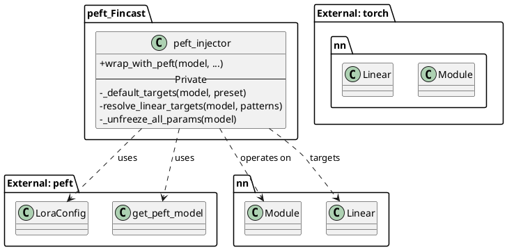
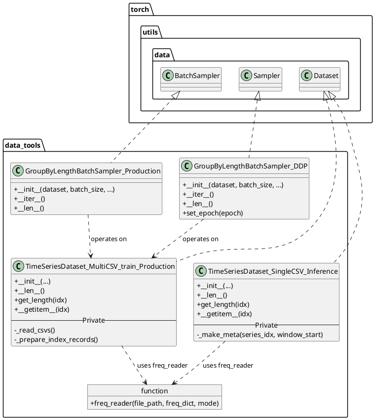
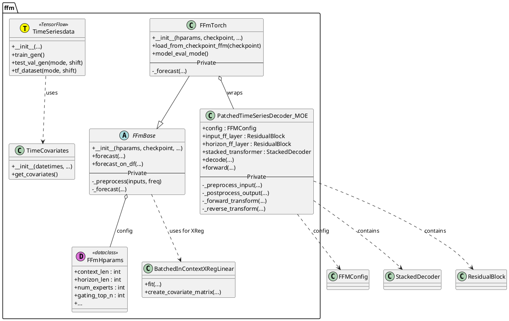
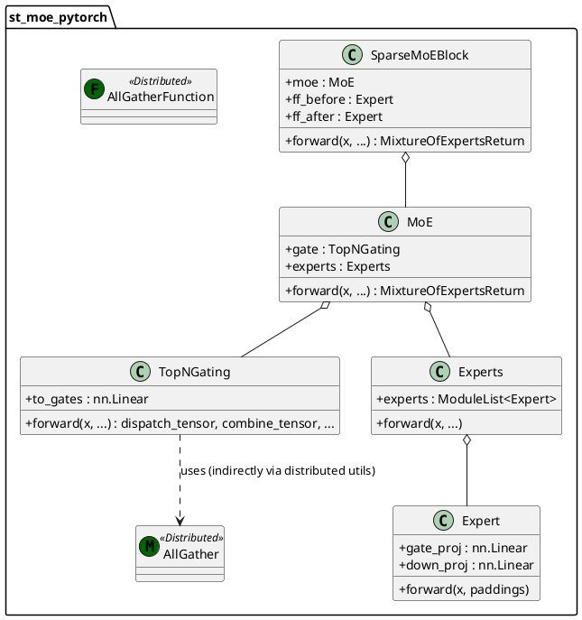
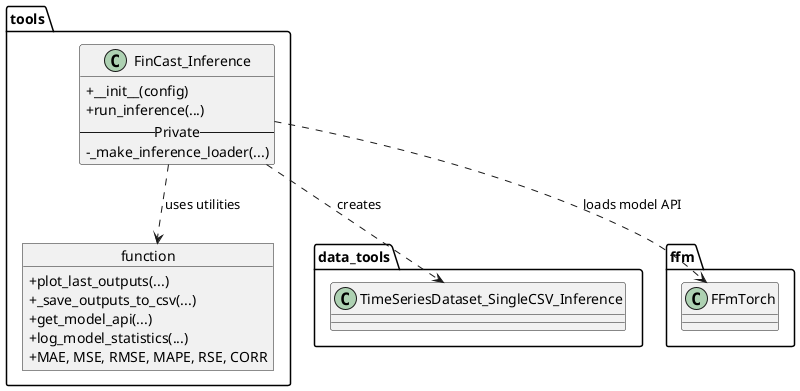

# FinCast-fts - In-Depth Source Code Analysis

## Phase 1: Global Scan & Planning

### 1.1. Full Directory Structure

```
**Project Name:** FinCast-fts
**Project Path:** /home/ubuntu/FinCast-fts

```
/home/ubuntu/FinCast-fts
|____.git/ (EXCLUDE: Git version control metadata)
|____.gitattributes (EXCLUDE: Git configuration)
|____.gitignore (EXCLUDE: Files to ignore for Git)
|____Inference/ (EXCLUDE: Jupyter notebook for model inference and demonstration)
| |____inference_future.ipynb
|____LICENSE (EXCLUDE: Project license)
|____README.md (EXCLUDE: Project documentation)
|____dep_install.sh (EXCLUDE: Script for dependency installation)
|____env_setup.sh (EXCLUDE: Script for environment setup)
|____experiments/ (EXCLUDE: Scripts for running long-horizon benchmarks and evaluations)
| |____long_horizon_benchmarks/
| | |____Freq_map_eval.py
| | |____run_eval_ffm.py
| | |____run_eval_ffm_dataset.py
| | |____run_eval_ffm_stock.py
|____notebooks/ (EXCLUDE: Jupyter notebook for result summary and visualization)
| |____result_summary.ipynb
|____paper.pdf (EXCLUDE: Associated research paper)
|____peft_Fincast/ (CORE: Implementation for Parameter-Efficient Fine-Tuning (PEFT) integration)
| |____peft_injector.py
|____pics/ (EXCLUDE: Example images)
| |____example1_APPL.png
| |____example2_ETHUSD.png
|____requirement_v2.txt (EXCLUDE: Project dependencies list)
|____scripts/ (EXCLUDE: Shell scripts for running PEFT and evaluation)
| |____Fincast_PEFT/
| | |____local_4090_t1.sh
| |____Fincast_eval/
| | |____eval_stock_loop.sh
| | |____eval_stock_loop_supervised42.sh
|____setup.py (EXCLUDE: Python package setup file)
|____src/ (CORE: Main source code directory)
| |______init__.py
| |____data_tools/ (CORE: Data loading, processing, and batch sampling utilities)
| | |____Inference_dataset.py
| | |____TSdataset.py
| | |____batch_sampler.py
| | |____batch_sampler_ddp.py
| |____ffm/ (CORE: Core Financial Foundation Model (FFM) implementation)
| | |______init__.py
| | |____data_loader.py
| | |____ffm_base.py
| | |____ffm_torch_moe.py
| | |____pytorch_patched_decoder_MOE.py
| | |____time_features.py
| | |____xreg_lib.py
| |____st_moe_pytorch/ (CORE: Implementation of the Spatio-Temporal Mixture of Experts (ST-MoE) layer)
| | |______init__.py
| | |____distributed.py
| | |____st_moe_pytorch.py
| |____tools/ (CORE: General utility functions, metrics, model utils, and visualization)
| | |______init__.py
| | |____inference_utils.py
| | |____metrics.py
| | |____model_utils.py
| | |____result_vis_plt.ipynb
| | |____utils.py
| |____unit_test/ (EXCLUDE: Contains a unit test script)
| | |____BS_DDP_tc4.py
```

The project is organized into five core logical modules under the root and `src/` directory: `peft_Fincast` for model adaptation, `src/data_tools` for data pipeline, `src/ffm` for the core model logic, `src/st_moe_pytorch` for the MoE implementation, and `src/tools` for utilities. The rest of the folders contain non-core elements like scripts, notebooks, and documentation.
```

### 1.2. Core Folders for Analysis

- `/home/ubuntu/FinCast-fts/peft_Fincast`: Implementation for Parameter-Efficient Fine-Tuning (PEFT) integration.
- `/home/ubuntu/FinCast-fts/src/data_tools`: Data loading, processing, and batch sampling utilities.
- `/home/ubuntu/FinCast-fts/src/ffm`: Core Financial Foundation Model (FFM) implementation.
- `/home/ubuntu/FinCast-fts/src/st_moe_pytorch`: Spatio-Temporal Mixture of Experts (ST-MoE) layer implementation.
- `/home/ubuntu/FinCast-fts/src/tools`: General utility functions, metrics, and model utilities.

## Phase 2: Module-by-Module Deep Analysis

## Module Analysis

The FinCast-fts project is structured around a core deep learning model, the Financial Foundation Model (FFM), and its supporting infrastructure for data handling, training utilities, and inference. The architecture is heavily influenced by the TimesFM design, with significant modifications to incorporate a Spatio-Temporal Mixture of Experts (ST-MoE) layer.

### 1. Module: `peft_Fincast` (Parameter-Efficient Fine-Tuning)

*   **Files**: `peft_injector.py`
*   **Core Responsibility**: This module is responsible for integrating Parameter-Efficient Fine-Tuning (PEFT), specifically LoRA (Low-Rank Adaptation) or DoRA, into the pre-trained FFM. This allows for efficient fine-tuning of the large model on downstream tasks by only training a small fraction of new parameters.
*   **Key Implementation Details**:
    *   **`wrap_with_peft` Function**: The main entry point, which takes the base model and LoRA hyperparameters (`lora_r`, `lora_alpha`, `lora_dropout`, `lora_targets_preset`). It uses the external `peft` library's `LoraConfig` and `get_peft_model` to inject the adapters.
    *   **Target Selection (`_default_targets`)**: Defines presets for selecting which linear layers (`nn.Linear`) within the FFM should receive LoRA adapters. Presets include:
        *   `attn`: Targets the attention mechanism's query/key/value projection (`qkv_proj`) and output projection (`o_proj`).
        *   `attn_mlp`: Extends `attn` to include the feed-forward layers in both the input and horizon blocks.
        *   `attn_mlp_gating`: Further extends to include the MoE gating mechanism (`moe.gate.to_gates`), indicating a focus on routing behavior.
        *   `experts_heavy`: Targets the most parameters by including the experts themselves (`experts.experts`, `gate_proj`, `down_proj`).

### 2. Module: `src/data_tools` (Data Handling and Batching)

*   **Files**: `Inference_dataset.py`, `TSdataset.py`, `batch_sampler.py`, `batch_sampler_ddp.py`
*   **Core Responsibility**: Manages the entire data pipeline, from reading raw CSV files to preparing batched, windowed, and optionally masked time-series data for both training and inference.
*   **Key Implementation Details**:
    *   **`TimeSeriesDataset_MultiCSV_train_Production` (`TSdataset.py`)**: The primary training dataset class. It reads multiple CSVs, converts multi-column data into a collection of univariate series, applies Z-score normalization (`sklearn.preprocessing.StandardScaler`), and generates sliding windows with a configurable stride (`data_slice_interval`) and variable context lengths (`possible_context_lengths`). It also implements input masking (`mask_ratio`) for potential pre-training objectives.
    *   **`TimeSeriesDataset_SingleCSV_Inference` (`Inference_dataset.py`)**: A specialized dataset for inference on a single CSV, supporting both "last window" and "sliding window" modes. It returns metadata for traceability, which is crucial for post-inference analysis and plotting.
    *   **`GroupByLengthBatchSampler_Production` (`batch_sampler.py`)**: A custom PyTorch `BatchSampler` that groups samples by their context length (`get_length`). This is a critical optimization, as it eliminates the need for padding within a batch, maximizing GPU efficiency for the Transformer architecture.
    *   **`GroupByLengthBatchSampler_DDP` (`batch_sampler_ddp.py`)**: Extends the batch sampler for Distributed Data Parallel (DDP) training, ensuring that all ranks process a synchronized, deterministically shuffled subset of the data.

### 3. Module: `src/ffm` (Financial Foundation Model Core)

*   **Files**: `data_loader.py`, `ffm_base.py`, `ffm_torch_moe.py`, `pytorch_patched_decoder_MOE.py`, `time_features.py`, `xreg_lib.py`
*   **Core Responsibility**: Contains the model definition, configuration, base API, and components for handling time-series features and external regressors.
*   **Key Implementation Details**:
    *   **`FFmBase` (`ffm_base.py`)**: Defines the abstract interface for the FFM API, including shared utilities like `_normalize` and `_renormalize` for per-time-series normalization. It also includes the complex logic for integrating **eXogenous Regressors (XReg)**, supporting two modes: "timesfm + xreg" (forecast residuals) and "xreg + timesfm" (forecast on residuals).
    *   **`FFmTorch` (`ffm_torch_moe.py`)**: The concrete PyTorch implementation of the FFM API. It initializes the core model (`PatchedTimeSeriesDecoder_MOE`) and implements the inference loop (`_forecast`), handling checkpoint loading (including compiled models) and device placement (CPU/GPU).
    *   **`PatchedTimeSeriesDecoder_MOE` (`pytorch_patched_decoder_MOE.py`)**: The main model class. It implements the Transformer-based decoder architecture, which operates on time-series patches.
        *   **Patching**: Input time-series are reshaped into patches (`[B, N, P]`) before being passed to the transformer.
        *   **Feature Injection**: It uses a `ResidualBlock` (`input_ff_layer`) to project the concatenated time-series patch and padding mask (`[P*2]`) into the model's hidden dimension.
        *   **Frequency Embedding**: A learnable embedding (`freq_emb`) is added to the input to condition the model on the time-series frequency (e.g., high, medium, low).
        *   **Output Head**: A final `ResidualBlock` (`horizon_ff_layer`) projects the transformer output to the prediction horizon, outputting both the mean and multiple quantiles.
    *   **`TimesFMDecoderLayer` (`pytorch_patched_decoder_MOE.py`)**: The core building block of the transformer stack. It consists of:
        *   **Attention**: `TimesFMAttention` (a standard multi-head attention with RMSNorm).
        *   **Mixture of Experts (MoE)**: `SparseMoEBlock` (from `st_moe_pytorch`) is used as the feed-forward network, which is the key architectural innovation.
    *   **`TimeCovariates` (`time_features.py`)**: Extracts a rich set of time-based features (minute, hour, day of week/month/year, month/week of year) and optional holiday features, which are then normalized.

### 4. Module: `src/st_moe_pytorch` (Spatio-Temporal MoE)

*   **Files**: `distributed.py`, `st_moe_pytorch.py`
*   **Core Responsibility**: Provides the implementation for the Mixture of Experts (MoE) layer, which is integrated into the FFM's transformer blocks. This module is adapted from a general-purpose MoE library.
*   **Key Implementation Details**:
    *   **`MoE` (`st_moe_pytorch.py`)**: The main MoE class, composed of a `TopNGating` router and an `Experts` container.
        *   **`TopNGating`**: The router computes raw gate logits, applies Gumbel noise (during training), and uses a differentiable top-K selection to choose the top `top_n` experts for each token. It also calculates auxiliary losses (`balance_loss`, `router_z_loss`) to encourage balanced expert usage.
        *   **`Experts`**: A container for the individual `Expert` modules (which are simple MLPs). It handles the dispatching of tokens to the selected experts and combining the outputs.
    *   **`SparseMoEBlock`**: Wraps the `MoE` layer, adding pre- and post-feed-forward layers (`ff_before`, `ff_after`) and a residual connection, which is noted in the source code as a stabilization technique.
    *   **`distributed.py`**: Contains utility functions (`all_gather_variable_dim`, `AllGatherFunction`) for handling distributed communication (All-Gather) of variable-sized tensors, necessary for efficient distributed training of MoE models.

### 5. Module: `src/tools` (Utilities)

*   **Files**: `inference_utils.py`, `metrics.py`, `model_utils.py`, `utils.py`
*   **Core Responsibility**: Provides miscellaneous utilities for model loading, evaluation, metrics calculation, and visualization.
*   **Key Implementation Details**:
    *   **`inference_utils.py`**: Contains the high-level `FinCast_Inference` class, which orchestrates the entire inference process: dataset creation, model loading, running the `DataLoader`, and post-processing the results. It also includes functions for plotting (`plot_last_outputs`) and saving outputs to CSV.
    *   **`metrics.py`**: Implements standard time-series evaluation metrics using NumPy, including MAE, MSE, RMSE, MAPE, MSPE, RSE, and CORR.
    *   **`model_utils.py`**: Simple helper to instantiate the FFM model (`FFM`) and its configuration (`FFmHparams`) from a checkpoint path.
    *   **`utils.py`**: Provides logging and parameter counting utilities (`log_model_statistics`) for tracking model size and configuration.

---
## Module PlantUML Diagrams

### 1. Module: `peft_Fincast`



### 2. Module: `src/data_tools`



### 3. Module: `src/ffm` (Core Model)



### 4. Module: `src/st_moe_pytorch` (Spatio-Temporal MoE)



### 5. Module: `src/tools` (Utilities)



### Module PlantUML Diagrams

### 1. Module: `peft_Fincast`


### 2. Module: `src/data_tools`


### 3. Module: `src/ffm` (Core Model)


### 4. Module: `src/st_moe_pytorch` (Spatio-Temporal MoE)


### 5. Module: `src/tools` (Utilities)


## Phase 3: Overall Architecture & Summary

### 3.1. Overall Architecture Analysis

#### 3.1.1. Core Abstractions

## Core Abstractions, Design Philosophy, and Lifecycle Management

The FinCast-fts project implements a sophisticated architecture for financial time-series forecasting, centered on the **Financial Foundation Model (FFM)**. Its design is characterized by a set of powerful abstractions and a clear philosophy focused on scalability, efficiency, and predictive richness.

### Core Abstractions

The system is built upon four primary abstractions that govern how time-series data is processed and modeled:

1.  **Time-Series Patch**: The fundamental unit of data input is not a single time step but a **patch** (defined by `patch_len`, typically 32). The input time-series is segmented into a sequence of overlapping or non-overlapping patches, transforming the 1D series into a 2D sequence (`[N_patches, Patch_len]`). This patching mechanism is a core component of the underlying TimesFM architecture, enabling the Transformer to process local temporal patterns efficiently.
2.  **Frequency Embedding**: The model explicitly handles time-series data of varying frequencies (e.g., high, medium, low) by introducing a **Frequency Embedding** (`freq_emb`). This categorical embedding is added to the input representation, allowing the single FFM to condition its internal weights and attention mechanisms based on the inherent periodicity and characteristics of the input data.
3.  **Spatio-Temporal Mixture of Experts (ST-MoE)**: This is the central architectural innovation. The traditional Feed-Forward Network (FFN) within the Transformer block is replaced by a **SparseMoEBlock**. This abstraction allows the model to scale its parameter count dramatically (via multiple "experts") while maintaining a constant computational cost during inference. For any given input token (patch), a router selects only the top $K$ experts to process the data, enabling high capacity with sparse activation.
4.  **Quantile Forecast**: The model's output is abstracted beyond a simple point prediction (mean/median). The final layer predicts a full set of **Quantiles** (e.g., 0.1, 0.5, 0.9), providing a complete predictive distribution. This is essential for financial applications where risk assessment and uncertainty quantification are critical.

### Design Philosophy

The project's design adheres to three key philosophical tenets:

*   **Foundation Model Paradigm**: The FFM is designed as a large, pre-trained model capable of zero-shot or few-shot generalization across diverse financial time-series datasets. The goal is to capture universal temporal patterns and financial market dynamics, making it a powerful base model for various downstream tasks.
*   **Efficiency and Scalability**: The combination of **ST-MoE** and **Parameter-Efficient Fine-Tuning (PEFT)** drives the efficiency philosophy. ST-MoE ensures that the model can scale its capacity (number of experts) without a proportional increase in computational load. PEFT, implemented via the `peft_Fincast` module, allows for rapid, low-resource fine-tuning by only training small, low-rank adapters (LoRA) instead of the entire massive model.
*   **Data-Centric Optimization**: The use of the custom `GroupByLengthBatchSampler` is a pragmatic design choice to maximize hardware utilization. By grouping time-series samples by their context length, the system eliminates the need for zero-padding within batches, ensuring that all computation is meaningful and accelerating the training process significantly.

### Lifecycle Management

The project's lifecycle is clearly delineated across its modules:

| Phase | Module(s) Responsible | Key Components |
| :--- | :--- | :--- |
| **Data Ingestion & Preparation** | `src/data_tools`, `src/ffm/time_features.py` | `TSdataset`, `Inference_dataset`, `TimeCovariates` |
| **Training Optimization** | `src/data_tools` | `GroupByLengthBatchSampler_Production`, `GroupByLengthBatchSampler_DDP` |
| **Model Definition & Training** | `src/ffm`, `src/st_moe_pytorch` | `PatchedTimeSeriesDecoder_MOE`, `MoE`, `Expert` |
| **Model Adaptation** | `peft_Fincast` | `peft_injector.py` (LoRA/DoRA) |
| **Inference & Evaluation** | `src/tools` | `FinCast_Inference`, `metrics.py`, `plot_last_outputs` |

The `FinCast_Inference` class acts as the central orchestrator for the inference lifecycle, managing the loading of the model, the data flow from the `Inference_dataset`, and the final post-processing and visualization of the quantile forecasts.

#### 3.1.2. Component Interactions

## Component Interactions, Data Flow, and Communication Patterns

The FinCast-fts architecture is a tightly integrated system where data flows sequentially from raw input through data preparation, model processing, and finally to output generation. The core interaction pattern is a pipeline-style data transformation, with a critical internal loop governed by the Mixture of Experts (MoE) mechanism.

### 1. Data Flow Pipeline

The overall data flow can be broken down into three main stages:

| Stage | Source Module | Destination Module | Data Transformation |
| :--- | :--- | :--- | :--- |
| **Input & Preprocessing** | Raw CSV Files | `src/data_tools` | Raw time-series data is read, normalized (Z-score), and segmented into context windows and future horizons. Time features (e.g., day of week, month) are extracted by `TimeCovariates` and potentially used as eXogenous Regressors (XReg). |
| **Model Forward Pass** | `src/data_tools` (Batches) | `src/ffm` (Model) | Batches of time-series windows (`x_context`, `x_padding`, `freq`) are fed into the `PatchedTimeSeriesDecoder_MOE`. The input is patched, normalized, and embedded with frequency information. |
| **Output & Post-processing** | `src/ffm` (Forecasts) | `src/tools` | The model outputs a tensor of mean and quantile forecasts. This is denormalized, sliced to the required horizon, and then processed by `FinCast_Inference` for saving to CSV or visualization (`plot_last_outputs`). |

### 2. Core Model Interaction: The Transformer Block with MoE

The most complex interaction occurs within the `PatchedTimeSeriesDecoder_MOE` (the FFM). Each layer of the `StackedDecoder` (a `TimesFMDecoderLayer`) involves a sequence of interactions:

1.  **Input**: The hidden state (`hidden_states`) from the previous layer enters the current layer.
2.  **Attention**: The hidden state first passes through the **TimesFMAttention** module. This is a standard self-attention mechanism, where the input interacts with itself to capture long-range temporal dependencies.
3.  **Normalization**: The output of the attention block is normalized using **RMSNorm** before entering the MoE block.
4.  **MoE Routing (Sparse Activation)**:
    *   The normalized hidden state enters the **SparseMoEBlock**.
    *   The **TopNGating** module (the router) calculates the probability of sending the token (patch) to each expert.
    *   It selects the top $K$ experts (e.g., $K=2$) based on these probabilities.
    *   A **Dispatch Tensor** is created, which maps each token to its selected expert(s) and their position within the expert's mini-batch.
5.  **Expert Computation**:
    *   The tokens are dispatched to the **Experts** module.
    *   Each expert (a simple MLP) processes its assigned subset of tokens in parallel.
6.  **MoE Combination**:
    *   The **Combine Tensor** (containing the weights from the router) is used to aggregate the outputs from the activated experts back into the original sequence order and dimension.
7.  **Output**: The combined output is added to the input via a residual connection, and the process repeats for the next layer.

This sparse activation pattern is the key communication pattern: it ensures that only a small, dynamic subset of the model's total parameters is activated for any given input, enabling the model's high capacity.

### 3. Communication Patterns (Distributed)

The `src/st_moe_pytorch/distributed.py` module reveals the project's design for handling distributed training (DDP), which is essential for scaling MoE models:

*   **All-Gather for Variable-Sized Tensors**: The `AllGather` class and its underlying `AllGatherFunction` are designed to collect tensors from all Distributed Data Parallel (DDP) ranks. Crucially, it handles **variable sequence lengths** (`all_gather_variable_dim`).
    *   In a typical MoE setup, the tokens dispatched to an expert on one GPU might have a different batch size than the tokens dispatched to the same expert on another GPU.
    *   The `AllGather` mechanism ensures that the necessary data is collected across all ranks, padded to a uniform size (`max_size`), and then unpadded after the operation, allowing for correct processing and gradient flow in a distributed environment.

This pattern is a low-level optimization to ensure that the MoE's routing and expert computation can be correctly synchronized and scaled across multiple GPUs.

### 4. External Regressor (XReg) Interaction

The `FFmBase` class includes complex logic for integrating external regressors using `xreg_lib.py`. This interaction is highly configurable:

*   **Data Preparation**: The `BatchedInContextXRegLinear` class prepares the time-series data (`targets`) and the external covariates (numerical, categorical, static, dynamic) into a flattened, batched matrix format (`x_train`, `x_test`).
*   **Two-Way Interaction**:
    *   **Mode 1 (`timesfm + xreg`)**: The FFM forecasts the time-series, and the XReg model is trained on the *residuals* (the difference between the FFM's forecast and the true value). The final forecast is the FFM output plus the XReg residual forecast.
    *   **Mode 2 (`xreg + timesfm`)**: The XReg model is trained on the *raw time-series*. The FFM is then trained on the *residuals* (the difference between the XReg model's forecast and the true value). The final forecast is the XReg output plus the FFM residual forecast.

This flexible interaction pattern allows the FFM to focus on complex, non-linear temporal dependencies while offloading the modeling of linear, exogenous effects to a simpler, more interpretable linear regression model.

### 3.2. Overall Architecture PlantUML Diagram

```plantuml
@startuml
@startuml FinCast_Architecture_v4
!theme toy

title FinCast-fts Overall Architecture

' Define Modules (Packages)
package "Data Pipeline (src/data_tools)" as Data {
    class TSdataset
    class Inference_dataset
    class BatchSampler
}

package "Model Core (src/ffm)" as FFM {
    class FFmTorch
    class PatchedTimeSeriesDecoder_MOE
    class TimeCovariates
    class BatchedInContextXRegLinear
}

package "MoE Implementation (src/st_moe_pytorch)" as MoE {
    class SparseMoEBlock
    class MoE_Router
    class Expert_MLP
}

package "Utilities & Inference (src/tools)" as Tools {
    class FinCast_Inference
    class Metrics
}

package "Adaptation (peft_Fincast)" as PEFT {
    class peft_injector
}

' External Entities
[Raw CSV Data] as RawData
[External Libraries] as ExtLibs

' 1. Data Flow
RawData --> TSdataset : Reads
TSdataset --> FFmTorch : Supplies Batches

' 2. Model Instantiation and Configuration
FFmTorch o-- PatchedTimeSeriesDecoder_MOE : Instantiates

' 3. Model Structure (FFM)
PatchedTimeSeriesDecoder_MOE o-- SparseMoEBlock : Uses (in Transformer Layer)
PatchedTimeSeriesDecoder_MOE ..> TimeCovariates : Uses for Time Features
PatchedTimeSeriesDecoder_MOE ..> BatchedInContextXRegLinear : Uses for XReg

' 4. MoE Structure
SparseMoEBlock o-- MoE_Router : Routes Tokens
SparseMoEBlock o-- Expert_MLP : Executes Computation

' 5. Inference and Output
FinCast_Inference ..> Inference_dataset : Uses Dataset
FinCast_Inference ..> FFmTorch : Calls Forecast API
FinCast_Inference ..> Metrics : Calculates Performance
FFmTorch --> FinCast_Inference : Returns Forecasts

' 6. Adaptation
peft_injector ..> PatchedTimeSeriesDecoder_MOE : Wraps Model for Fine-Tuning

' 7. Data Flow within Data Module
TSdataset ..> BatchSampler : Uses for Batching

' 8. External Dependencies
ExtLibs .up.> MoE : (einops, torch.distributed)
ExtLibs .up.> PEFT : (peft library)

@enduml
@enduml
```

### 3.3. Design Patterns & Highlights

#### 3.3.1. Design Patterns

## Design Patterns

The FinCast-fts codebase employs several established software design patterns and specialized architectural patterns common in deep learning to achieve modularity, flexibility, and performance.

### 1. Architectural Pattern: Mixture of Experts (MoE)

The core architectural pattern is the **Mixture of Experts (MoE)**, which is implemented in the `src/st_moe_pytorch` module and integrated into the FFM's transformer layers.

*   **Pattern**: Replaces the standard Feed-Forward Network (FFN) with a collection of expert networks and a trainable gating network (router).
*   **Implementation**:
    *   The `MoE` class in `st_moe_pytorch.py` encapsulates the entire mechanism.
    *   The `TopNGating` component acts as the router, using a soft-max over logits to determine the weight of each expert for a given token.
    *   The `Expert` class represents the individual, specialized MLPs.
*   **Code Example (from `st_moe_pytorch.py`):**
    ```python
    # MoE class initialization
    self.gate = TopNGating(...)
    self.experts = Experts(...)

    # MoE forward pass
    dispatch_tensor, combine_tensor, balance_loss, router_z_loss = self.gate(x, ...)
    expert_inputs = einsum('b n d, b n e c -> b e c d', x, dispatch_tensor)
    expert_outputs = self.experts(expert_inputs, ...)
    output = einsum('b e c d, b n e c -> b n d', expert_outputs, combine_tensor)
    ```

### 2. Structural Pattern: Adapter

The **Adapter Pattern** is used to reconcile the core model implementation with the desired external API interface.

*   **Pattern**: Converts the interface of a class into another interface clients expect.
*   **Implementation**: The `FFmTorch` class (`ffm_torch_moe.py`) acts as an adapter, inheriting from the abstract `FFmBase` (`ffm_base.py`) and wrapping the concrete PyTorch model (`PatchedTimeSeriesDecoder_MOE`). This allows the model to conform to the TimesFM-inspired API (`forecast`, `forecast_on_df`) while using a custom PyTorch implementation.

### 3. Behavioral Pattern: Strategy

The integration of eXogenous Regressors (XReg) follows the **Strategy Pattern**, allowing the user to select one of two distinct XReg integration methods at runtime.

*   **Pattern**: Defines a family of algorithms, encapsulates each one, and makes them interchangeable.
*   **Implementation**: The `FFmBase` class's `forecast_with_xreg` method accepts an `xreg_mode` parameter (`"timesfm + xreg"` or `"xreg + timesfm"`), which determines the strategy for combining the FFM forecast with the linear regressor (`BatchedInContextXRegLinear`).

### 4. Creational Pattern: Factory Method

A simple form of the **Factory Method Pattern** is used for model instantiation.

*   **Pattern**: Defines an interface for creating an object, but lets subclasses decide which class to instantiate.
*   **Implementation**: The `get_model_FFM` function in `src/tools/model_utils.py` centralizes the logic for creating the FFM model instance (`FFM`) and its configuration (`FFmHparams`) from a checkpoint path, abstracting the complex setup from the main inference logic.

### 5. Idiomatic Pattern: Skip Connections (Residual Block)

The **Residual Block** pattern is fundamental to the stability and training of deep neural networks.

*   **Pattern**: Adds the input of a layer to its output, bypassing one or more layers.
*   **Implementation**:
    *   The `ResidualBlock` class in `pytorch_patched_decoder_MOE.py` explicitly implements this pattern for the input and horizon feed-forward layers.
    *   The `TimesFMDecoderLayer` and `SparseMoEBlock` also utilize residual connections around their main computational units (attention and MoE).
*   **Code Example (from `pytorch_patched_decoder_MOE.py`):**
    ```python
    class ResidualBlock(nn.Module):
        # ... (hidden_layer, output_layer, residual_layer defined)
        def forward(self, x):
            hidden = self.hidden_layer(x)
            output = self.output_layer(hidden)
            residual = self.residual_layer(x)
            return output + residual # The skip connection
    ```

#### 3.3.2. Project Highlights

## Project Highlights

The FinCast-fts project showcases several innovative features and design choices that contribute to its effectiveness, extensibility, and efficiency in financial time-series forecasting.

*   **Spatio-Temporal Mixture of Experts (ST-MoE) Integration**:
    *   **Highlight**: The core innovation is the seamless integration of the MoE architecture into the Transformer decoder, replacing the standard FFN. This allows the model to achieve a massive parameter count (high capacity) while maintaining a low, constant computational cost during the forward pass (sparse activation).
    *   **Benefit**: This is crucial for foundation models, as it enables the FFM to learn highly specialized patterns (experts) for different types of time-series or market regimes without becoming prohibitively slow or expensive to run. The `st_moe_pytorch` module, with its custom `TopNGating` and auxiliary loss functions, ensures the experts are used efficiently and balanced during training.

*   **Efficient Training via Length-Based Batching**:
    *   **Highlight**: The use of the custom `GroupByLengthBatchSampler` in `src/data_tools` is a significant performance optimization. This sampler groups time-series samples with identical context lengths into the same batch.
    *   **Benefit**: In a Transformer architecture, padding is a major source of wasted computation. By eliminating intra-batch padding, the project maximizes the utilization of GPU memory and compute, leading to faster training times and higher throughput, especially when dealing with time-series of varying lengths.

*   **Parameter-Efficient Fine-Tuning (PEFT) Support**:
    *   **Highlight**: The dedicated `peft_Fincast` module provides first-class support for PEFT techniques like LoRA and DoRA. It includes predefined presets (`attn`, `attn_mlp_gating`, `experts_heavy`) to target specific layers for adapter injection.
    *   **Benefit**: This design choice directly addresses the challenge of fine-tuning large foundation models. Instead of retraining the entire FFM, users can fine-tune a small set of parameters (the adapters) for a new task, drastically reducing training time, memory footprint, and storage requirements for task-specific models. This enhances the model's **extensibility** to new financial datasets.

*   **Comprehensive Time-Series Feature Engineering**:
    *   **Highlight**: The `TimeCovariates` class in `src/ffm/time_features.py` extracts a rich, normalized set of temporal features (e.g., minute-of-hour, day-of-year, holiday proximity).
    *   **Benefit**: This feature set provides the model with explicit, high-quality information about the time context, which is vital for financial data where seasonality and calendar effects (like holidays) are strong predictors. This design improves the model's **flexibility** and predictive power across different time granularities.

*   **Quantile Forecasting for Risk Management**:
    *   **Highlight**: The model's output head is designed to predict not just the mean, but a full distribution of quantiles (e.g., 0.1 to 0.9).
    *   **Benefit**: In finance, point forecasts are often insufficient. By providing a full predictive distribution, the FFM enables advanced risk management, Value-at-Risk (VaR) calculations, and confidence interval estimation, making the model's output more **actionable** for trading and investment strategies.

### 3.4. Summary & Recommendations

#### 3.4.1. Potential Improvements

## Improvement Suggestions

Based on the comprehensive analysis of the FinCast-fts codebase, the following suggestions are proposed to address potential performance bottlenecks, optimize the architecture, and enhance code quality.

### 1. Performance Bottlenecks and Optimization

| Area | Suggestion | Rationale and Impact |
| :--- | :--- | :--- |
| **Data Loading (CPU)** | Implement a more efficient data loading mechanism for large-scale datasets, potentially using Apache Arrow or Parquet format instead of CSV. | The current implementation in `TSdataset.py` relies on `pd.read_csv` and `np.vstack`, which can be slow and memory-intensive for massive financial datasets. Using columnar formats and memory-mapped files can significantly reduce I/O overhead and memory usage. |
| **XReg Solver** | Replace the JAX-based `BatchedInContextXRegLinear` with a PyTorch-native or highly optimized C++/CUDA linear algebra solver (e.g., using `torch.linalg.solve`). | The current XReg implementation in `xreg_lib.py` uses JAX, which introduces a dependency on a separate ecosystem and requires data transfer between PyTorch (model) and JAX (XReg). A unified PyTorch solution would eliminate this overhead and simplify the dependency stack. |
| **MoE Dispatch** | Optimize the MoE dispatch and combine operations for GPU. | The `st_moe_pytorch` module relies heavily on `einsum` and tensor manipulation (`rearrange`, `pack`, `unpack`). While flexible, these operations can be less performant than highly optimized custom CUDA kernels used in production-grade MoE implementations (e.g., Fairseq's Fused MoE). Investigating a fused kernel implementation for the dispatch/combine steps could yield significant speedups. |

### 2. Architecture Optimization

*   **Decouple FFM from XReg**: The tight coupling of the FFM (`FFmBase`) with the XReg logic makes the core model API complex. It is recommended to separate the XReg functionality into a standalone wrapper class that takes a trained FFM model and applies the XReg logic externally. This would simplify the `FFmBase` interface and make the core model more modular.
*   **Standardize Configuration Management**: The current configuration is spread across `FFmHparams` (dataclass) and `FFMConfig` (dataclass). It is recommended to consolidate all hyperparameters into a single, canonical configuration class (e.g., using `dataclasses` or `pydantic`) and pass this single object throughout the system. This improves clarity and reduces the risk of inconsistent parameter settings.
*   **Refactor `pytorch_patched_decoder_MOE.py`**: This file is excessively large (over 800 lines) and contains multiple classes (`FFMConfig`, `TimesFMAttention`, `TimesFMDecoderLayer`, `PatchedTimeSeriesDecoder_MOE`). Breaking this file into smaller, more focused modules (e.g., `attention.py`, `decoder_layer.py`, `model.py`) would significantly improve code navigation and maintainability.

### 3. Code Quality and Maintainability

*   **Type Hinting and Docstrings**: While type hints are present, consistency can be improved, especially in utility functions and complex tensor manipulation code. Comprehensive docstrings following a standard format (e.g., Google or NumPy style) should be added to all public methods and classes, particularly in the `st_moe_pytorch` module, which is complex due to its distributed nature.
*   **Remove Redundant TensorFlow Code**: The `src/ffm/data_loader.py` file contains a TensorFlow-based data loader (`TimeSeriesdata`). Since the rest of the project is PyTorch-native, this file appears to be vestigial code from the original TimesFM project. It should be removed or clearly marked as deprecated to avoid confusion and unnecessary dependencies.
*   **Consistent Naming Conventions**: The project uses a mix of naming conventions (e.g., `FFmTorch`, `PatchedTimeSeriesDecoder_MOE`, `peft_injector`). Adopting a consistent style (e.g., all classes using `PascalCase` and all functions using `snake_case`) across all modules would enhance readability.

#### 3.4.2. Secondary Development Guide

## Secondary Development Guide

This guide provides a structured approach for exploring the FinCast-fts codebase and conducting secondary development, such as fine-tuning, adding new features, or integrating new data sources.

### 1. Code Exploration Path

To understand the project, follow the data flow and model architecture sequentially:

1.  **Data Preparation (`src/data_tools`)**:
    *   Start with `src/data_tools/TSdataset.py` to understand how raw CSV data is converted into univariate time-series and how sliding windows are generated for training.
    *   Examine `src/data_tools/batch_sampler.py` to grasp the length-based batching optimization, which is crucial for efficient training.
2.  **Model Core and Configuration (`src/ffm`)**:
    *   Review `src/ffm/ffm_base.py` and `src/ffm/ffm_torch_moe.py` to understand the high-level API and model loading process.
    *   The core model logic is in `src/ffm/pytorch_patched_decoder_MOE.py`. Focus on the `PatchedTimeSeriesDecoder_MOE` class, particularly the `_preprocess_input` method (patching, normalization) and the `forward` method (Transformer stack, frequency embedding).
3.  **Architectural Innovation (`src/st_moe_pytorch`)**:
    *   Deep dive into `src/st_moe_pytorch/st_moe_pytorch.py`. This module defines the MoE mechanism. Understanding the `TopNGating` (router) and `MoE` (expert dispatch/combine) is key to modifying the model's capacity or routing behavior.

### 2. Best Practices for Fine-Tuning (PEFT)

The recommended path for secondary development is **Parameter-Efficient Fine-Tuning (PEFT)** using the provided `peft_Fincast` module.

*   **Select a Target Preset**: Use the `peft_injector.py` to wrap your pre-trained FFM. Start with a minimal preset like `"attn"` or `"attn_mlp"` to ensure stability. For maximum capacity increase, use `"experts_heavy"`.
*   **Hyperparameter Tuning**: Focus on tuning the LoRA rank (`lora_r`) and alpha (`lora_alpha`). A higher rank increases the number of trainable parameters and model capacity but also increases memory usage.
*   **Training Loop**: The fine-tuning process should be identical to the original training loop, but only the LoRA adapter parameters will have `requires_grad=True`.

### 3. Adding New Features

*   **New Time Features**: To add a new temporal covariate (e.g., lunar cycle, specific market hours), modify the `TimeCovariates` class in `src/ffm/time_features.py`. Ensure the new feature is correctly normalized and added to the output DataFrame.
*   **New Exogenous Regressors (XReg)**: If you are adding new external data (e.g., sentiment scores, macroeconomic indicators), ensure they are prepared in the `FFmBase`'s `forecast_with_xreg` method and integrated into the `BatchedInContextXRegLinear` in `src/ffm/xreg_lib.py`. This requires providing the new data as `dynamic_numerical_covariates` or `static_numerical_covariates` to the XReg fitting process.
*   **Custom Expert**: To experiment with a different expert architecture (e.g., a different activation function or a deeper MLP), modify the `Expert` class definition in `src/st_moe_pytorch/st_moe_pytorch.py`. Ensure the input and output dimensions remain consistent with the model's `hidden_size`.

