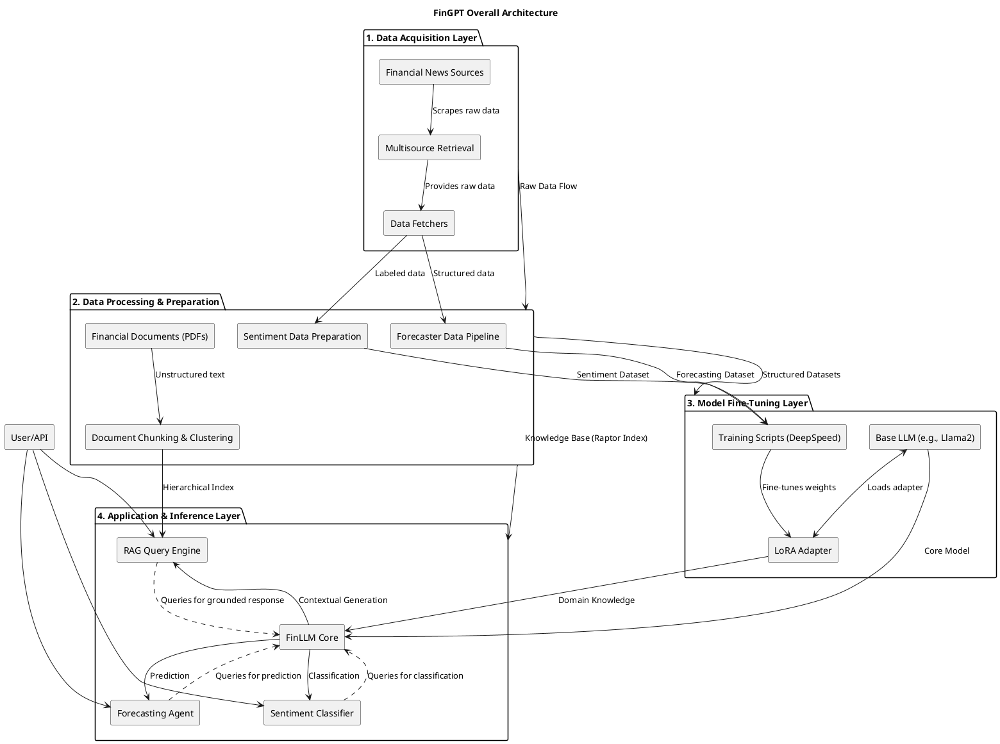

# FinGPT - In-Depth Source Code Analysis

## Phase 1: Global Scan & Planning

### 1.1. Full Directory Structure

```
The FinGPT repository is structured as a collection of distinct, yet related, sub-projects, each focusing on a specific financial application of Large Language Models (LLMs). This modular structure facilitates independent development and deployment of different FinLLM capabilities.

```
/home/ubuntu/FinGPT/
├── fingpt/
│   ├── FinGPT_Benchmark/             # Module 1: Benchmarking and Fine-tuning Utilities
│   │   ├── benchmarks/               # Contains scripts for various financial NLP benchmarks (e.g., ConvFinQA, FiQA).
│   │   ├── data/                     # Data download and preparation scripts for benchmarks.
│   │   ├── train_lora.py             # Script for LoRA-based fine-tuning of models on benchmark datasets.
│   │   └── utils.py                  # Utility functions for model path parsing, dataset loading, and tokenization.
│   ├── FinGPT_FinancialReportAnalysis/ # Module 2: Financial Report Analysis (RAG)
│   │   ├── reportanalysis.ipynb      # Jupyter notebook demonstrating the RAG analysis flow.
│   │   └── utils/                    # Core RAG implementation, including document formatting and clustering (Raptor).
│   │       ├── earning_calls.py      # Utilities for processing earning call transcripts.
│   │       ├── format_pdf.py         # Utilities for formatting PDF documents.
│   │       └── rag.py                # Core implementation of the Recursive Abstractive Clustering (Raptor) RAG system.
│   ├── FinGPT_Forecaster/            # Module 3: Financial Forecasting
│   │   ├── AAAI-Good-Data/           # Sub-module for a specific dataset/training configuration (e.g., AAAI paper data).
│   │   ├── FinGPT-Forecaster-Chinese/ # Sub-module for Chinese-specific forecasting data and models.
│   │   ├── app.py                    # Streamlit or Flask application for the forecaster interface.
│   │   ├── data_pipeline.py          # Script for data acquisition, prompt generation, and dataset creation.
│   │   ├── data.py                   # Core data preparation functions.
│   │   ├── indices.py                # Definitions of financial indices (DOW, EURO-STOXX, CRYPTO).
│   │   └── prompt.py                 # Functions for generating prompts for the LLM.
│   ├── FinGPT_MultiAgentsRAG/        # Module 4: Multi-Agent RAG and Evaluation (Experimental)
│   │   ├── Evaluation_methods/       # Contains evaluation scripts (HaluEval, MMLU, TruthfulQA).
│   │   ├── Fine_tune_model/          # Notebooks for fine-tuning models (e.g., GLM2, Llama2).
│   │   ├── MultiAgents/              # Notebooks demonstrating multi-agent inference.
│   │   └── RAG/                      # Notebooks for RAG implementation.
│   ├── FinGPT_Others/                # Module 5: Miscellaneous/Older Projects
│   │   ├── FinGPT_Low_Code_Development/ # Low-code development examples.
│   │   ├── FinGPT_Robo_Advisor/      # Robo-advisor examples.
│   │   └── FinGPT_Trading/           # Trading examples.
│   ├── FinGPT_RAG/                   # Module 6: General RAG and Data Scraping
│   │   ├── instruct-FinGPT/          # Scripts for supervised fine-tuning (SFT) and inference.
│   │   └── multisource_retrieval/    # Web scraping and data retrieval utilities.
│   │       ├── external_LLMs/        # Utilities for external LLM integration.
│   │       ├── scrapers/             # Specific web scrapers (Yahoo, CNBC, Google, etc.).
│   │       └── utils/                # Classification and formatting utilities.
│   ├── FinGPT_Sentiment_Analysis_v1/ # Module 7: Sentiment Analysis (Older Version)
│   └── FinGPT_Sentiment_Analysis_v3/ # Module 8: Sentiment Analysis (Latest Version)
│       ├── benchmark/                # Benchmarking notebooks.
│       ├── data/                     # Data preparation notebooks.
│   │   └── training_parallel/        # Parallel training scripts (e.g., using DeepSpeed).
├── requirements.txt                  # Project dependencies.
└── setup.py                          # Installation script.
```
```

### 1.2. Core Folders for Analysis

*   `/home/ubuntu/FinGPT/fingpt/FinGPT_Benchmark`: Contains the infrastructure for evaluating and fine-tuning FinLLMs on various financial NLP tasks. It includes utilities for data preparation, model loading, and LoRA-based training.
*   `/home/ubuntu/FinGPT/fingpt/FinGPT_FinancialReportAnalysis/utils`: Houses the core logic for the RAG system applied to financial documents, notably the **Raptor** (Recursive Abstractive Clustering) implementation for document chunking and summarization.
*   `/home/ubuntu/FinGPT/fingpt/FinGPT_Forecaster`: Contains the complete pipeline for financial forecasting, from data acquisition and prompt engineering to dataset creation for model training.
*   `/home/ubuntu/FinGPT/fingpt/FinGPT_RAG/multisource_retrieval`: The primary module for web scraping and multi-source data retrieval, which is a critical component for feeding real-time financial news into the LLM.
*   `/home/ubuntu/FinGPT/fingpt/FinGPT_Sentiment_Analysis_v3`: The latest implementation for sentiment analysis model training, including parallel training configurations and benchmarking tools.

## Phase 2: Module-by-Module Deep Analysis

### Module 1: FinGPT_Benchmark
- **Core Responsibility**: Provides a standardized environment for fine-tuning and evaluating various base LLMs (Llama2, ChatGLM2, Qwen, etc.) on financial tasks using the LoRA technique.
- **Key Files**:
    - `utils.py`: Defines model-specific LoRA target modules (`lora_module_dict`), prompt templates (`template_dict`), model path parsing (`parse_model_name`), and a robust dataset loading mechanism (`load_dataset`) that supports replication and remote/local loading.
    - `train_lora.py`: The main training script. It loads the model, tokenizer, and dataset, applies LoRA configuration, and uses the Hugging Face `Trainer` with DeepSpeed for efficient, parallelized fine-tuning. It also integrates with **WandB** for experiment tracking.
- **Implementation Details**: The `tokenize` function in `utils.py` is critical, handling the concatenation of instruction, input, and output, and ensuring the sequence length does not exceed the model's maximum length, a common challenge in LLM fine-tuning. The use of `parse_model_name` centralizes the mapping between a simple model name (e.g., 'llama2') and its corresponding Hugging Face repository path.

### Module 2: FinGPT_FinancialReportAnalysis/utils
- **Core Responsibility**: Implements the **Raptor** (Recursive Abstractive Clustering) RAG framework for processing large financial documents (like earning call transcripts or PDFs) by recursively clustering and summarizing text chunks to create a hierarchical index.
- **Key Files**:
    - `rag.py`: Contains the `Raptor` class. This class uses **UMAP** for dimensionality reduction and **Gaussian Mixture Model (GMM)** with **BIC** for optimal cluster determination. The key methods are `recursive_embed_cluster_summarize` and `text_spliter`, which implement the hierarchical chunking and summarization process.
    - `format_pdf.py`: Handles the initial processing and formatting of PDF documents.
    - `earning_calls.py`: Contains specific logic for handling earning call data.
- **Implementation Details**: The `Raptor` class is a sophisticated implementation of hierarchical RAG. It first splits the text using `RecursiveCharacterTextSplitter`, then iteratively applies embedding, UMAP reduction, GMM clustering (using BIC for optimal cluster count), and LLM-based summarization. This recursive process creates a multi-layered knowledge base, significantly improving the context quality for RAG queries on long documents.

### Module 3: FinGPT_Forecaster
- **Core Responsibility**: Manages the end-to-end pipeline for generating structured financial forecasting datasets suitable for LLM fine-tuning.
- **Key Files**:
    - `data_pipeline.py`: The orchestrator. It defines the flow: 1) Acquire data for symbols in a given index (DOW, EURO, CRYPTO) via `prepare_data_for_symbol`. 2) Generate prompts and query an external LLM (GPT-4) for forecasts/rationales via `query_gpt4`. 3) Transform the results into a final training dataset via `create_dataset`.
    - `indices.py`: Simple file defining lists of stock/crypto symbols for different indices.
    - `prompt.py`: Contains the logic for constructing the detailed, structured prompts used to query the external LLM for forecasting.
- **Implementation Details**: The pipeline is a strong example of using an LLM for data labeling and rationale generation. The `query_gpt4` function is the bottleneck, as it relies on an external, non-deterministic API call to enrich the raw financial data with LLM-generated forecasts and explanations, which are then used as the "output" for the fine-tuning dataset.

### Module 4: FinGPT_RAG/multisource_retrieval
- **Core Responsibility**: A comprehensive web scraping and data retrieval layer designed to gather real-time financial news from multiple sources, which serves as the knowledge base for the RAG system.
- **Key Files**:
    - `news_scraper.py`: The main scraping logic. It uses `requests` and `BeautifulSoup` for static scraping and includes logic for handling various financial news sites (Seeking Alpha, Reuters, Bloomberg, Yahoo, CNBC, MarketWatch). It also contains a `select_column_and_classify` function, suggesting an interactive or GUI-driven workflow for data labeling.
    - `scrapers/`: Sub-directory containing site-specific scraping implementations (e.g., `scrape_yahoo.py`, `scrape_cnbc.py`).
    - `external_LLMs/`: Utilities for tokenization and interaction with external LLMs (e.g., ChatGPT, g4f).
- **Implementation Details**: The scraping logic is highly decentralized, with a central dispatcher (`scraping_by_url` in `news_scraper.py`) delegating to site-specific scrapers. This design is necessary due to the varied HTML structures of different news sites but makes the system fragile to website changes. The use of `similarity_score` attempts to filter for relevance before extracting the full article text.

### Module 5: FinGPT_Sentiment_Analysis_v3
- **Core Responsibility**: Provides the latest, optimized training pipeline for sentiment analysis models, focusing on efficiency and parallel processing.
- **Key Files**:
    - `training_parallel/train_lora.py`: A specialized LoRA training script, similar to the benchmark one but with custom `ModifiedTrainer` and `data_collator` classes. The `ModifiedTrainer` overrides `compute_loss` and `prediction_step` to handle the specific input/output format of the sentiment task, and customizes `save_model` to only save the LoRA adapter weights. It is configured for DeepSpeed and parallel training.
- **Implementation Details**: The custom `ModifiedTrainer` is a key feature, allowing the project to bypass the standard Hugging Face Trainer's assumptions about loss calculation and model saving, which is often necessary when working with specialized models like ChatGLM or when only saving adapter weights. The `data_collator` handles padding and label masking specific to the sentiment fine-tuning task.

### Module PlantUML Diagrams

@startuml FinGPT_Benchmark
title FinGPT_Benchmark Module Class Diagram

package "HuggingFace/PEFT" {
    class AutoModelForCausalLM
    class AutoTokenizer
    class TrainingArguments
    class Trainer
    class LoraConfig
    class get_peft_model
}

package "Datasets" {
    class Dataset
    class concatenate_datasets
}

package "Benchmark Utilities" {
    class Utils {
        + template_dict: Dict
        + lora_module_dict: Dict
        + get_prompt(template, instruction, input_text)
        + tokenize(args, tokenizer, feature)
        + parse_model_name(name, from_remote)
        + load_dataset(names, from_remote)
    }
    class TrainLoRA {
        - main(args)
    }
}

TrainLoRA ..> Utils : uses
TrainLoRA ..> AutoModelForCausalLM : loads
TrainLoRA ..> AutoTokenizer : loads
TrainLoRA ..> TrainingArguments : configures
TrainLoRA ..> Trainer : initializes
TrainLoRA ..> LoraConfig : configures
TrainLoRA ..> get_peft_model : applies
TrainLoRA ..> concatenate_datasets : combines
Utils ..> Dataset : loads
Utils ..> AutoTokenizer : uses in tokenize

@enduml

@startuml FinGPT_FinancialReportAnalysis_RAG
title FinGPT_FinancialReportAnalysis RAG Module Class Diagram

package "LangChain/Utils" {
    class ChatPromptTemplate
    class StrOutputParser
    class RecursiveCharacterTextSplitter
}

package "Clustering/Reduction" {
    class UMAP
    class GaussianMixture
}

class Raptor {
    - model: LLM
    - embd: Embeddings
    + global_cluster_embeddings(embeddings, dim)
    + local_cluster_embeddings(embeddings, dim)
    + get_optimal_clusters(embeddings) : int
    + GMM_cluster(embeddings, threshold) : Tuple[labels, n_clusters]
    + perform_clustering(embeddings, dim, threshold) : List[np.ndarray]
    + embed(texts) : np.ndarray
    + embed_cluster_texts(texts) : DataFrame
    + fmt_txt(df) : str
    + embed_cluster_summarize_texts(texts, level) : Tuple[DataFrame, DataFrame]
    + recursive_embed_cluster_summarize(texts, level, n_levels) : Dict
    + text_spliter(text, chunk_size_tok, level, n_levels) : List[str]
}

Raptor ..> UMAP : uses for reduction
Raptor ..> GaussianMixture : uses for clustering
Raptor ..> ChatPromptTemplate : uses for summarization prompt
Raptor ..> StrOutputParser : uses for summarization output
Raptor ..> RecursiveCharacterTextSplitter : uses for initial chunking
Raptor "1" *-- "1" UMAP
Raptor "1" *-- "1" GaussianMixture
Raptor "1" *-- "1" ChatPromptTemplate
Raptor "1" *-- "1" StrOutputParser
Raptor "1" *-- "1" RecursiveCharacterTextSplitter

@enduml

@startuml FinGPT_Forecaster
title FinGPT_Forecaster Module Class Diagram

package "Data Components" {
    class Indices {
        + DOW_30: List[str]
        + EURO_STOXX_50: List[str]
        + CRYPTO: List[str]
    }
    class Data {
        + prepare_data_for_symbol(symbol, data_dir, start_date, end_date, with_basics)
        + query_gpt4(index, data_dir, start_date, end_date, min_past_weeks, max_past_weeks, with_basics)
        + create_dataset(index, data_dir, start_date, end_date, train_ratio, with_basics)
    }
    class Prompt {
        + get_all_prompts(index, data_dir, start_date, end_date, min_past_weeks, max_past_weeks, with_basics)
    }
    class DataInferenceFetch {
        + get_curday()
        + fetch_all_data()
        + get_all_prompts_online()
    }
}

class DataPipeline {
    + main(args)
}

DataPipeline ..> Indices : uses
DataPipeline ..> Data : uses
DataPipeline ..> Prompt : uses
DataPipeline ..> DataInferenceFetch : uses

@enduml

@startuml FinGPT_RAG_MultisourceRetrieval
title FinGPT_RAG Multisource Retrieval Module Class Diagram

package "Web Scraping Tools" {
    class BeautifulSoup
    class requests_get
    class split_sentence
    class similarity_score
}

package "Site Specific Scrapers" {
    class ScrapeYahoo
    class ScrapeCNBC
    class ScrapeMarketScreener
    class ScrapeGoogle
}

class NewsScraper {
    + scraping_by_url(link, subject) : Tuple[url, subject]
    + scrape_bloomberg(subject) : List[str]
    + scrape_reuters(subject) : Tuple[url, subject]
    + scrape_market_watch_article_page(url, subject) : Tuple[url, subject]
    + select_column_and_classify() : void
}

NewsScraper ..> BeautifulSoup : uses
NewsScraper ..> requests_get : uses
NewsScraper ..> split_sentence : uses
NewsScraper ..> similarity_score : uses
NewsScraper ..> ScrapeYahoo : delegates
NewsScraper ..> ScrapeCNBC : delegates
NewsScraper ..> ScrapeMarketScreener : delegates
NewsScraper ..> ScrapeGoogle : delegates

@enduml

@startuml FinGPT_Sentiment_Analysis_v3
title FinGPT_Sentiment_Analysis_v3 Training Module Class Diagram

package "HuggingFace/PEFT" {
    class AutoModel
    class AutoTokenizer
    class TrainingArguments
    class Trainer
    class LoraConfig
    class get_peft_model
}

class ModifiedTrainer extends Trainer {
    + compute_loss(model, inputs, return_outputs=False)
    + prediction_step(model, inputs, prediction_loss_only, ignore_keys)
    + save_model(output_dir)
}

class CastOutputToFloat {
    + forward(x)
}

class TrainLoRA {
    + main()
}

class DataCollator {
    + data_collator(features: list) : dict
}

TrainLoRA ..> AutoModel : loads
TrainLoRA ..> AutoTokenizer : loads
TrainLoRA ..> TrainingArguments : configures
TrainLoRA ..> ModifiedTrainer : initializes
TrainLoRA ..> LoraConfig : configures
TrainLoRA ..> get_peft_model : applies
ModifiedTrainer ..> DataCollator : uses (via trainer init)
TrainLoRA ..> DataCollator : uses

@enduml

## Phase 3: Overall Architecture & Summary

### 3.1. Overall Architecture Analysis

#### 3.1.1. Core Abstractions

The FinGPT project is built upon a **modular, LLM-centric, and data-driven design philosophy**, aiming to provide an accessible, open-source framework for financial LLMs. The core abstractions are centered around three main pillars: **Parameter-Efficient Fine-Tuning (PEFT)**, **Hierarchical Retrieval-Augmented Generation (RAG)**, and **End-to-End Data Pipelines**.

The **LoRA Adapter** is the central abstraction for the model layer. Instead of fine-tuning the entire large language model, the project utilizes LoRA (Low-Rank Adaptation) to inject a small number of trainable parameters into the base LLM (e.g., Llama2, ChatGLM2). This abstraction allows for efficient domain adaptation with minimal computational resources, making the project highly accessible. The `lora_module_dict` in `FinGPT_Benchmark/utils.py` explicitly manages which modules of different base models are targeted for adaptation, demonstrating a flexible approach to model heterogeneity.

The **Raptor (Recursive Abstractive Clustering)** system, implemented in `FinGPT_FinancialReportAnalysis/utils/rag.py`, is the key abstraction for handling large, unstructured financial documents. It abstracts the complex process of document chunking, embedding, dimensionality reduction (UMAP), optimal clustering (GMM/BIC), and recursive summarization into a single, hierarchical RAG index. This allows the LLM to retrieve context from multiple levels of abstraction (raw text, cluster summaries, meta-summaries), significantly improving the quality of grounded responses.

The **Data Pipeline** abstraction, exemplified by `FinGPT_Forecaster/data_pipeline.py`, manages the entire lifecycle of creating a structured dataset. This pipeline abstracts data acquisition, prompt engineering, external LLM querying (e.g., GPT-4 for labeling/rationales), and final dataset transformation into a sequential, reproducible process.

The project’s **lifecycle management** follows a clear sequence:
1.  **Data Acquisition**: Raw financial data (news, reports) is gathered via the `multisource_retrieval` layer.
2.  **Data Preparation**: Data is cleaned, structured, and transformed into domain-specific datasets (Forecasting, Sentiment) or hierarchical RAG indices (Raptor).
3.  **Model Adaptation**: Base LLMs are fine-tuned using the LoRA Adapter via the `train_lora.py` scripts.
4.  **Application**: The adapted FinLLM is deployed within application agents (Forecaster, Sentiment Classifier, RAG Query Engine) to serve end-user tasks.

#### 3.1.2. Component Interactions

The FinGPT architecture is characterized by a unidirectional, layered data flow, starting from external sources and culminating in the application layer.

**Data Flow:**
1.  **External Sources** (Websites, APIs, PDFs) feed into the **Data Acquisition Layer** (`multisource_retrieval`).
2.  The **Scraper/Retriever** component extracts raw text and links.
3.  Raw text is routed to two main paths:
    *   **Structured Dataset Path**: Text is processed by `data_pipeline.py` (Forecaster) or similar scripts (Sentiment) to generate `instruction` and `output` pairs, often involving an external LLM (GPT-4) for initial labeling or rationale generation. This results in a Hugging Face `Dataset` object.
    *   **RAG Index Path**: Large documents are processed by the **Raptor** component (`rag.py`), which generates a multi-level index of summaries and embeddings.
4.  The **Fine-Tuning Layer** (`train_lora.py`) consumes the structured `Dataset` and applies the LoRA Adapter to the **Base LLM**.
5.  The resulting **FinLLM Core** (Base LLM + LoRA Adapter) is used by the **Application Agents** (RAG Query Engine, Forecaster Agent, Sentiment Classifier) for inference.

**Communication Patterns:**
*   **Hugging Face Ecosystem**: The primary communication pattern for model training is the Hugging Face `Trainer` class, which manages the entire training loop, including data loading, optimization, and checkpointing. This is heavily integrated with the **PEFT** library for LoRA.
*   **LangChain-Style Chains**: The RAG component in `rag.py` uses a functional chain pattern (`prompt | self.model | StrOutputParser()`) for summarization, a pattern popularized by LangChain, demonstrating a clear separation of prompt, model, and output parsing.
*   **Inter-Module Python Calls**: Data flow within the pipelines (e.g., `data_pipeline.py` calling `indices.py`, `data.py`, and `prompt.py`) relies on standard Python function and class imports, maintaining a tightly coupled but clear execution sequence.
*   **External API Calls**: The system communicates with external services for two main purposes: web scraping (`requests`, `BeautifulSoup` in `news_scraper.py`) and external LLM querying (e.g., `query_gpt4` in `data.py`, which is assumed to make an API call).

### 3.2. Overall Architecture PlantUML Diagram



### 3.3. Design Patterns & Highlights

#### 3.3.1. Design Patterns

The FinGPT codebase employs several established software design patterns to manage complexity and promote modularity:

1.  **Adapter Pattern (LoRA)**:
    *   **Description**: The LoRA mechanism acts as an adapter, allowing a new interface (domain-specific fine-tuning) to be used with an existing class (the frozen base LLM).
    *   **Implementation**: In `FinGPT_Benchmark/train_lora.py`, the `LoraConfig` and `get_peft_model` functions wrap the `AutoModelForCausalLM` instance, effectively adapting its behavior for financial tasks without modifying its massive original weights.
    *   **Code Example**:
        ```python
        # FinGPT_Benchmark/train_lora.py
        peft_config = LoraConfig(
            task_type=TaskType.CAUSAL_LM,
            r=8,
            lora_alpha=32,
            target_modules=lora_module_dict[args.base_model], # The adaptation logic
            # ...
        )
        model = get_peft_model(model, peft_config) # The adapter application
        ```

2.  **Pipeline Pattern (Data Flow)**:
    *   **Description**: A sequence of processing steps where the output of one step becomes the input of the next.
    *   **Implementation**: The `main` function in `FinGPT_Forecaster/data_pipeline.py` clearly defines the pipeline stages: Acquire Data -> Generate Prompt/Query GPT-4 -> Transform to Training Format.
    *   **Code Example**:
        ```python
        # FinGPT_Forecaster/data_pipeline.py (Simplified)
        # 1. Acquire data
        for symbol in tqdm(index):
            prepare_data_for_symbol(symbol, data_dir, start_date, end_date, with_basics=with_basics)
        # 2. Generate prompt and query GPT-4
        query_gpt4(index, data_dir, start_date, end_date, min_past_weeks, max_past_weeks, with_basics=with_basics)
        # 3. Transform into training format
        dataset = create_dataset(index, data_dir, start_date, end_date, train_ratio, with_basics=with_basics)
        ```

3.  **Strategy Pattern (Model Configuration)**:
    *   **Description**: Defines a family of algorithms, encapsulates each one, and makes them interchangeable.
    *   **Implementation**: The `lora_module_dict` in `FinGPT_Benchmark/utils.py` holds different strategies (target modules) for applying LoRA based on the specific base model architecture (e.g., `chatglm2` uses `query_key_value`, while `llama2` uses `q_proj`, `k_proj`, `v_proj`).
    *   **Code Example**:
        ```python
        # FinGPT_Benchmark/utils.py
        lora_module_dict = {
            'chatglm2': ['query_key_value'],
            'llama2': ['q_proj', 'k_proj', 'v_proj'],
            # ...
        }
        # ...
        target_modules=lora_module_dict[args.base_model],
        ```

4.  **Composite Pattern (Raptor RAG)**:
    *   **Description**: Composes objects into tree structures to represent part-whole hierarchies.
    *   **Implementation**: The `recursive_embed_cluster_summarize` function in `rag.py` recursively processes summaries from one level as the "documents" for the next level, creating a hierarchical index where a cluster summary is a composite of its underlying document chunks.

#### 3.3.2. Project Highlights

The FinGPT project demonstrates several innovative features that enhance its utility and flexibility in the financial domain:

*   **Hierarchical RAG with Raptor**: The most innovative feature is the **Raptor** RAG system. By combining **UMAP** (dimensionality reduction) and **Gaussian Mixture Models (GMM)** for clustering, it creates a multi-level index of document summaries. This allows the RAG engine to retrieve not just granular text chunks but also high-level conceptual summaries, leading to more coherent and contextually rich answers from the LLM.
*   **Accessibility through PEFT**: The core focus on **LoRA-based fine-tuning** significantly lowers the barrier to entry for financial LLM development. It allows researchers and developers to adapt massive models to financial tasks using consumer-grade GPUs, promoting the open-source spirit of the project.
*   **End-to-End Financial Forecasting Pipeline**: The `FinGPT_Forecaster` module provides a complete, runnable example of how to convert raw market data into a structured, LLM-ready dataset, including the crucial step of using an external LLM for generating rationales and labels. This is a highly valuable, innovative feature for quantitative finance.
*   **Robust Multisource Data Retrieval**: The dedicated `multisource_retrieval` component, with its site-specific scrapers (Yahoo, CNBC, Bloomberg), ensures the LLM can be grounded in up-to-date, real-world financial news, which is critical for time-sensitive financial applications.

### 3.4. Summary & Recommendations

#### 3.4.1. Potential Improvements

While the project is robust, several areas could be improved to enhance performance, maintainability, and architectural clarity:

*   **Standardization and Code Consolidation**:
    *   **Suggestion**: Consolidate the redundant `train_lora.py` and `utils.py` files found in multiple sub-projects (`FinGPT_Benchmark`, `FinGPT_Forecaster`, `FinGPT_Sentiment_Analysis_v3`).
    *   **Benefit**: Reduces code duplication, simplifies maintenance, and ensures a single source of truth for core utilities like `tokenize` and `load_dataset`.
*   **External Dependency Abstraction**:
    *   **Suggestion**: Abstract the external LLM calls (e.g., `query_gpt4` in `data.py`) into a dedicated, configurable service layer (e.g., an `ExternalLLMService` class).
    *   **Benefit**: Decouples the data pipeline from specific LLM providers, making it easier to switch between GPT-4, Claude, or other models, and simplifies API key management.
*   **RAG System Optimization**:
    *   **Suggestion**: The Raptor RAG system is computationally intensive due to UMAP and GMM clustering. Implement caching for the clustered embeddings and summaries, especially for static documents like financial reports.
    *   **Benefit**: Reduces processing time and cost for repeated queries or application restarts.
*   **Web Scraping Robustness**:
    *   **Suggestion**: The `news_scraper.py` is highly dependent on HTML structure. Implement more resilient scraping techniques (e.g., using a general-purpose content extraction library) and add robust retry logic with exponential backoff to handle transient network errors and rate limits.

#### 3.4.2. Secondary Development Guide

For developers looking to explore or extend the FinGPT codebase, the following path is recommended:

1.  **Initial Exploration (Fine-Tuning)**:
    *   Start by examining the **FinGPT_Benchmark** module. The `utils.py` file is essential for understanding model-specific configurations (LoRA targets) and data handling.
    *   Review `train_lora.py` to grasp the standard fine-tuning workflow using Hugging Face and LoRA. This is the template for all model adaptation tasks.

2.  **Understanding Data Flow (Forecasting)**:
    *   The **FinGPT_Forecaster** module provides the clearest example of an end-to-end pipeline. Analyze `data_pipeline.py` to see how raw data is transformed into a structured dataset suitable for LLM training.

3.  **Secondary Development - New Application Agent**:
    *   To create a new financial application (e.g., a Merger & Acquisition Agent), the best approach is to reuse the existing components:
        *   **Data**: Use the `multisource_retrieval` scrapers to gather M&A news.
        *   **Model**: Use the `FinGPT_Benchmark/train_lora.py` script to fine-tune a base LLM on a new M&A-specific dataset.
        *   **RAG**: If the task involves large documents (e.g., SEC filings), integrate the **Raptor** system from `FinGPT_FinancialReportAnalysis/utils/rag.py` to build the knowledge base.

4.  **Contribution Focus**:
    *   Focus contributions on developing new, robust scrapers in the `multisource_retrieval/scrapers` directory or creating new, standardized financial datasets for the community.
    *   When adding new models, ensure the `lora_module_dict` in the core `utils.py` is updated with the correct target modules.

