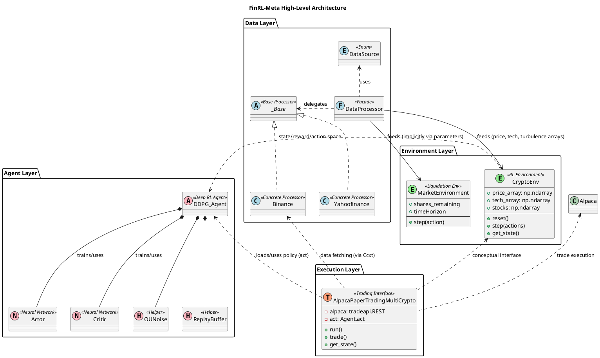

# FinRL-Meta - In-Depth Source Code Analysis

## Phase 1: Global Scan & Planning

### 1.1. Full Directory Structure

```
The project structure is highly modular, with the core logic encapsulated within the `meta/` directory. This design facilitates clear separation of concerns between data handling, environment simulation, and agent implementation.

```
FinRL-Meta/
├── meta/                               # Core library source code for FinRL-Meta framework.
│   ├── agents/                         # DRL Agent implementations and wrappers for various DRL libraries (ElegantRL, RLLib, Stable-Baselines3).
│   ├── config.py                       # Global configuration constants, including ticker lists, time zones, and API key placeholders.
│   ├── data_processor.py               # The Facade class that orchestrates the entire data pipeline, selecting and running the appropriate data source processor.
│   ├── data_processors/                # Module containing concrete implementations for fetching and cleaning data from different financial APIs.
│   │   ├── _base.py                    # Abstract base class defining the common interface for all data processors (Strategy Pattern).
│   │   ├── yahoofinance.py             # Implementation for fetching data from Yahoo Finance.
│   │   ├── binance.py                  # Implementation for fetching data from Binance.
│   │   └── ...                         # Other data source implementations (Alpaca, Tushare, etc.).
│   ├── env_crypto_trading/             # Module for cryptocurrency trading environments.
│   │   ├── env_multiple_crypto.py      # Multi-asset cryptocurrency trading environment, adhering to the OpenAI Gym interface.
│   │   ├── env_btc_ccxt.py             # Single-asset Bitcoin trading environment.
│   │   └── alpaca_paper_trade_multicrypto.py # Interface for live/paper trading execution using the Alpaca API.
│   └── env_execution_optimizing/       # Module for specialized execution optimization problems.
│       └── liquidation/                # Sub-module for the optimal liquidation problem.
│           ├── env_execution_optimizing.py # Market environment based on the Almgren-Chriss model.
│           ├── ddpg_agent.py           # Implementation of the DDPG agent for continuous control.
│           └── model.py                # Neural network definitions (Actor and Critic) for the DDPG agent.
├── README.md                           # Project documentation and usage examples.
├── setup.py                            # Python package setup file.
└── ...                                 # Non-core files (e.g., examples, notebooks, docs).
```
The structure clearly delineates the **Data Layer** (`data_processors/`), the **Environment Layer** (`env_crypto_trading/`, `env_execution_optimizing/`), and the **Agent Layer** (`agents/`, `liquidation/ddpg_agent.py`), supporting the project's modular design philosophy. The use of a central `data_processor.py` and `config.py` provides global control and configuration points. The separation of environments into distinct domains (crypto trading vs. execution optimizing) allows for specialized modeling of market dynamics.
```

### 1.2. Core Folders for Analysis

*   `/home/ubuntu/FinnewsHunter/thirdparty/FinRL-Meta/meta/data_processors`: Contains the core logic for fetching, cleaning, and transforming financial market data from various sources.
*   `/home/ubuntu/FinnewsHunter/thirdparty/FinRL-Meta/meta/env_crypto_trading`: Contains the reinforcement learning environments and live trading interfaces for cryptocurrency portfolio management.
*   `/home/ubuntu/FinnewsHunter/thirdparty/FinRL-Meta/meta/env_execution_optimizing/liquidation`: Contains the specialized environment and DRL agent implementation for the optimal trade execution (liquidation) problem.
*   `/home/ubuntu/FinnewsHunter/thirdparty/FinRL-Meta/meta/agents`: Contains the wrappers and base classes for integrating various external DRL libraries.

## Phase 2: Module-by-Module Deep Analysis

## Module Analysis

### 1. Module: `meta/agents`
*   **Files Enumerated**: `elegantrl_models.py`, `rllib_models.py`, `stablebaselines3_models.py`.
*   **Module Core Responsibility**: To provide a standardized interface and wrappers for integrating various external Deep Reinforcement Learning (DRL) libraries (ElegantRL, RLLib, Stable-Baselines3) with the FinRL-Meta environments. This module abstracts the library-specific agent creation and training logic.
*   **Key File Identification**:
    *   `stablebaselines3_models.py`: Contains the `DRLAgent` class, which acts as a wrapper for Stable-Baselines3 algorithms (e.g., A2C, PPO, DDPG). It handles the creation of the agent, training, and testing, providing a unified API for the main workflow.
    *   `elegantrl_models.py`: Provides similar wrappers for ElegantRL agents.
    *   `rllib_models.py`: Provides wrappers for RLLib agents.
*   **Core Implementation**: The `DRLAgent` classes typically take an environment, a model name, and hyperparameters. They encapsulate the boilerplate code for agent initialization, model saving/loading, and the training loop (`train_model`, `get_model`).
*   **Dependencies**: Depends heavily on external DRL libraries (Stable-Baselines3, ElegantRL, RLLib) and the custom environments defined in the `meta/env_...` modules.

### 2. Module: `meta/data_processors`
*   **Files Enumerated**: `_base.py`, `alpaca.py`, `binance.py`, `ccxt.py`, `tushare.py`, `yahoofinance.py`.
*   **Module Core Responsibility**: To provide concrete implementations for fetching, cleaning, and transforming raw financial data from various sources into a standardized format (Pandas DataFrame) and ultimately into NumPy arrays for the RL environments.
*   **Key File Identification**:
    *   `_base.py`: Defines the abstract base class `_Base`, which outlines the common interface (`download_data`, `clean_data`, `add_technical_indicator`, `df_to_array`) that all concrete processors must implement. This is the core of the Strategy Pattern.
    *   `yahoofinance.py`: Implements data fetching using the `yfinance` library, including specific logic for price adjustment and handling time intervals.
    *   `binance.py`: Implements data fetching from the Binance exchange, handling specific API calls and data aggregation logic.
*   **Core Implementation**: The `download_data` methods handle API interaction. The `clean_data` methods are crucial for filling missing values and ensuring data integrity. The `df_to_array` method transforms the final DataFrame into the required NumPy arrays (`price_array`, `tech_array`, `turbulence_array`) for the RL environment.
*   **Dependencies**: Depends on external data libraries (`yfinance`, `ccxt`, `tushare`, `alpaca_trade_api`) and common data science libraries (`pandas`, `numpy`).

### 3. Module: `meta/env_crypto_trading`
*   **Files Enumerated**: `alpaca_paper_trade_multicrypto.py`, `create_crypto_env.py`, `env_btc_ccxt.py`, `env_multiple_crypto.py`.
*   **Module Core Responsibility**: To define the simulation environments for cryptocurrency trading and provide an interface for live/paper trading execution.
*   **Key File Identification**:
    *   `env_multiple_crypto.py`: Defines the `CryptoEnv` class, the primary multi-asset RL environment. It implements the core `reset()` and `step()` methods, managing the portfolio state (cash, stocks) and calculating the reward based on asset value change.
    *   `alpaca_paper_trade_multicrypto.py`: Defines `AlpacaPaperTradingMultiCrypto`, which acts as the execution layer. It loads a trained DRL policy, fetches real-time data, infers an action, and executes trades via the Alpaca API.
*   **Core Implementation**: The `CryptoEnv.step()` method contains the critical trading logic: action normalization (to handle large price differences), transaction cost calculation, and portfolio update. The state is constructed by stacking normalized cash, stocks, and a lookback window of technical indicators.
*   **Dependencies**: Depends on the `meta/data_processors` for data, and external libraries like `gym`, `numpy`, `pandas`, and `alpaca_trade_api`.

### 4. Module: `meta/env_execution_optimizing/liquidation`
*   **Files Enumerated**: `ddpg_agent.py`, `env_execution_optimizing.py`, `model.py`, `utils.py`.
*   **Module Core Responsibility**: To provide a specialized environment and DRL agent for the optimal trade execution problem, specifically the Almgren-Chriss liquidation model.
*   **Key File Identification**:
    *   `env_execution_optimizing.py`: Defines `MarketEnvironment`, which models the stock price dynamics under market impact (permanent and temporary) and calculates the reward based on the Almgren-Chriss utility function.
    *   `ddpg_agent.py`: Defines the `Agent` class, a standard implementation of the DDPG algorithm, including `Actor` and `Critic` networks, `ReplayBuffer`, and `OU_Noise`.
*   **Core Implementation**: The `MarketEnvironment.step()` method is the core, implementing the price evolution and market impact equations. The DDPG `Agent.learn()` method implements the standard DDPG update rules for the Actor and Critic networks.
*   **Dependencies**: Depends on `numpy`, `torch`, and standard DRL components.

### Module PlantUML Diagrams


@startuml
title Agents Module (Stable-Baselines3)

abstract class BaseCallback {
    + _on_step()
}

class TensorboardCallback {
    + _on_step(): bool
}

class DRLAgent {
    + __init__(env)
    + get_model(model_name, policy, policy_kwargs, model_kwargs, verbose, seed)
    + train_model(model, tb_log_name, total_timesteps)
    + DRL_prediction(model, environment)
    + DRL_prediction_load_from_file(model_name, environment, cwd)
}

class DRLEnsembleAgent {
    + __init__(df, train_period, ...)
    + get_model(model_name, env, ...)
    + train_model(model, model_name, tb_log_name, iter_num, total_timesteps)
    + get_validation_sharpe(iteration, model_name)
    + DRL_validation(model, test_data, test_env, test_obs)
    + DRL_prediction(model, name, last_state, iter_num, ...)
    + run_ensemble_strategy(A2C_model_kwargs, PPO_model_kwargs, DDPG_model_kwargs, timesteps_dict)
}

TensorboardCallback --|> BaseCallback
DRLAgent ..> MODELS : uses
DRLEnsembleAgent ..> MODELS : uses
DRLEnsembleAgent ..> DRLAgent : uses methods

note right of DRLAgent::get_model
  Initializes SB3 model (A2C, PPO, DDPG, SAC, TD3)
  Handles action noise configuration
end note

note right of DRLEnsembleAgent::run_ensemble_strategy
  Core logic for rolling-window training
  and model selection based on Sharpe ratio
end note

@enduml

@startuml
skinparam classAttributeIconVisible true

package "Data Processors" {
    enum DataSource {
        akshare
        alpaca
        alphavantage
        baostock
        binance
        ccxt
        iexcloud
        joinquant
        quandl
        quantconnect
        ricequant
        tushare
        wrds
        yahoofinance
    }

    abstract class _Base {
        + data_source: str
        + start_date: str
        + end_date: str
        + time_interval: str
        + dataframe: pd.DataFrame
        --
        + download_data(ticker_list: List[str])
        + clean_data()
        + fillna()
        + add_technical_indicator(tech_indicator_list: List[str])
        + add_turbulence()
        + calculate_turbulence(): pd.DataFrame
        + add_vix()
        + df_to_array(tech_indicator_list: List[str], if_vix: bool)
        + calc_nonstandard_time_interval(): str
        + transfer_standard_ticker_to_nonstandard(ticker: str): str
        + save_data(path)
        + load_data(path)
    }

    class DataProcessor {
        - processor: _Base
        + data_source: DataSource
        + start_date: str
        + end_date: str
        + time_interval: str
        + dataframe: pd.DataFrame
        --
        + __init__(data_source: DataSource, ...)
        + download_data(ticker_list)
        + clean_data()
        + add_technical_indicator(tech_indicator_list: List[str])
        + add_turbulence()
        + add_vix()
        + df_to_array(if_vix: bool): np.array
        + data_split(df, start, end)
        + fillna()
        + run(ticker_list: str, technical_indicator_list: List[str], if_vix: bool)
    }

    class Yahoofinance {
        + download_data(ticker_list: List[str])
    }

    class Alpaca {
        + api: tradeapi.REST
        + download_data(ticker_list)
        + clean_data()
        + get_trading_days(start, end)
    }

    class Binance {
        + download_data(ticker_list: List[str])
        + dataframe_with_limit(symbol)
        + fetch_n_combine(startDate, endDate, tickers)
    }

    class Tushare {
        + token: str
        + adj: str
        + download_data(ticker_list: List[str])
    }

    DataProcessor o-- _Base : delegates
    _Base <|-- Yahoofinance
    _Base <|-- Alpaca
    _Base <|-- Binance
    _Base <|-- Tushare
    DataProcessor o-- DataSource : uses
}

@enduml

@startuml
skinparam classAttributeIconVisible true

package "RL Environments (meta.envs)" {

    package "Crypto Trading" {
        class CryptoEnv {
            + lookback: int
            + initial_cash: float
            + buy_cost_pct: float
            + sell_cost_pct: float
            + price_array: np.ndarray
            + tech_array: np.ndarray
            + stocks: np.ndarray
            --
            + __init__(config, lookback, initial_capital, ...)
            + reset(): np.ndarray
            + step(actions): (np.ndarray, float, bool, None)
            + get_state(): np.ndarray
            - _generate_action_normalizer()
        }

        class BitcoinEnv {
            + stock_dim: int = 1
            + initial_account: float
            + transaction_fee_percent: float
            --
            + __init__(...)
            + reset(): np.ndarray
            + step(action): (np.ndarray, float, bool, None)
            + draw_cumulative_return(...)
            - load_data(...)
        }

        class AlpacaPaperTradingMultiCrypto {
            - alpaca: tradeapi.REST
            - act: AgentPPO.act
            - CCTX_time_interval: str
            - time_interval: int
            - stocks: np.ndarray
            - cash: float
            --
            + __init__(...)
            + run()
            + trade()
            + get_state()
            + submitOrder(qty, stock, side, resp)
        }

        class create_crypto_env {
            + create_train_env(...)
            + create_test_env(...)
        }

        CryptoEnv <.. create_crypto_env : creates
        BitcoinEnv .up.|> CryptoEnv : specialized single-asset env (conceptual)
        AlpacaPaperTradingMultiCrypto ..> CryptoEnv : uses concepts (state/action space)
        AlpacaPaperTradingMultiCrypto ..> meta.data_processors.Ccxt : data source
        AlpacaPaperTradingMultiCrypto ..> elegantrl.agent.AgentPPO : loads agent
    }

    package "Execution Optimizing" {
        class Agent << (A, #FF7700) DDPG Agent >> {
            + state_size: int
            + action_size: int
            - actor_local: Actor
            - critic_local: Critic
            - noise: OUNoise
            - memory: ReplayBuffer
            --
            + __init__(state_size, action_size, random_seed)
            + step(state, action, reward, next_state, done)
            + act(state, add_noise=True)
            + learn(experiences, gamma)
            + soft_update(local_model, target_model, tau)
        }

        class OUNoise {
            - mu: np.ndarray
            - theta: float
            - sigma: float
            --
            + __init__(size, seed, mu, theta, sigma)
            + reset()
            + sample()
        }

        class ReplayBuffer {
            - memory: deque
            - experience: namedtuple
            --
            + __init__(action_size, buffer_size, batch_size, seed)
            + add(state, action, reward, next_state, done)
            + sample()
        }

        Agent *-- OUNoise : uses
        Agent *-- ReplayBuffer : uses
        Agent ..> Actor : trains
        Agent ..> Critic : trains
    }
}

@enduml


## Phase 3: Overall Architecture & Summary

### 3.1. Overall Architecture Analysis

#### 3.1.1. Core Abstractions

## Core Abstractions, Design Philosophy, and Lifecycle Management

The FinRL-Meta project is built upon a highly modular and layered architecture, primarily following the **Facade** and **Strategy** design patterns to achieve flexibility and extensibility. The core abstractions revolve around three main components: Data, Environment, and Agent.

### 1. Data Abstraction
The data layer abstracts the complex process of connecting to various financial data sources (e.g., Yahoo Finance, Binance, Alpaca) into a unified interface.

*   **`DataSource` Enum**: This is the fundamental abstraction, listing all supported data providers (`akshare`, `alpaca`, `yahoofinance`, etc.).
*   **`_Base` Class**: An abstract base class (`meta/data_processors/_base.py`) that defines the common interface for all concrete data processors. It includes core methods like `download_data()`, `clean_data()`, `add_technical_indicator()`, and `df_to_array()`. This enforces a standard contract across all data sources.
*   **`DataProcessor` Class**: This acts as a **Facade** (`meta/data_processor.py`). It takes a `DataSource` enum in its constructor and dynamically instantiates the corresponding concrete processor (e.g., `Yahoofinance`, `Binance`). Its `run()` method orchestrates the entire data pipeline: download, clean, add indicators, and transform the data into NumPy arrays (`price_array`, `tech_array`, `turbulence_array`) suitable for the RL environment.

### 2. Environment Abstraction
The environment layer provides a standard interface for the Deep Reinforcement Learning (DRL) agents, adhering to the OpenAI Gym standard (`reset`, `step`).

*   **`CryptoEnv` / `BitcoinEnv`**: These classes (`meta/env_crypto_trading/env_multiple_crypto.py`, `meta/env_crypto_trading/env_btc_ccxt.py`) abstract the trading logic, portfolio management, and reward calculation. They manage the state space (cash, holdings, technical indicators) and the action space (buy/sell/hold).
*   **State Representation**: The state is a flattened NumPy array, typically a concatenation of normalized cash, normalized stock holdings, and a lookback window of normalized technical indicators. This design choice simplifies the state space for DRL algorithms.

### 3. Agent and Execution Abstraction
The agent layer is designed to be decoupled from the core framework, allowing for easy integration of external DRL libraries (e.g., ElegantRL).

*   **`DDPG_Agent`**: A concrete implementation of a DRL agent, demonstrating the use of the **Actor-Critic** architecture for continuous action spaces. It uses helper classes like `ReplayBuffer` and `OU_Noise`.
*   **`AlpacaPaperTradingMultiCrypto`**: This class in the execution layer acts as a bridge between the trained DRL policy and a live trading API (Alpaca). It handles the real-time data fetching, state construction, policy inference, and order submission, managing the entire **live trading lifecycle**.

### Lifecycle Management
The typical lifecycle involves:
1.  **Initialization**: `DataProcessor` is initialized with a `DataSource` and time parameters.
2.  **Data Preparation**: `DataProcessor.run()` fetches and processes historical data, outputting NumPy arrays.
3.  **Environment Setup**: An environment (`CryptoEnv`) is instantiated with the processed data arrays.
4.  **Training/Testing**: A DRL agent interacts with the environment using `reset()` and `step()` methods.
5.  **Deployment (Live Trading)**: The trained agent's policy is loaded into an execution class (`AlpacaPaperTradingMultiCrypto`), which runs a continuous loop to fetch real-time data, generate actions, and execute trades. The `run()` method in this class manages the continuous trading loop.

#### 3.1.2. Component Interactions

## Component Interactions, Data Flow, and Communication Patterns

The FinRL-Meta architecture is characterized by a clear separation of concerns, with data flowing sequentially from the Data Layer to the Environment Layer, and control/action signals flowing between the Environment and the Agent Layer.

### 1. Data Flow (Offline/Training Phase)

The primary data flow during the offline training phase is a one-way pipeline from the data source to the reinforcement learning environment.

| Source Component | Target Component | Data Format | Communication Pattern | Description |
| :--- | :--- | :--- | :--- | :--- |
| **Data Processor** | **RL Environment** | NumPy Arrays | Synchronous Call | The `DataProcessor.run()` method orchestrates the data pipeline, culminating in the output of three key NumPy arrays: `price_array`, `tech_array`, and `turbulence_array`. These arrays, which represent the entire historical dataset, are passed directly to the `CryptoEnv` constructor. |
| **RL Environment** | **DRL Agent** | NumPy Array (State) | Synchronous Call | In each `step()` call, the `CryptoEnv` calculates the next state (`get_state()`) and returns it to the DRL agent. The state is a flattened, normalized vector of market data and portfolio information. |

The `DataProcessor` acts as a **Strategy Pattern** selector, dynamically choosing a concrete data source module (e.g., `Yahoofinance`, `Binance`) based on the `DataSource` enum provided by the user. This ensures that the downstream components (the RL environments) only interact with the standardized NumPy array format, completely decoupling them from the complexities of external APIs.

### 2. Control Flow (Training Phase)

The control flow adheres strictly to the standard **OpenAI Gym interface** for reinforcement learning.

1.  **Initialization**: The DRL training loop calls `env.reset()`. The environment initializes the portfolio (cash, stocks) and returns the initial state vector.
2.  **Action Selection**: The DRL agent receives the state and uses its neural network policy (`Actor.forward()`) to select an action (a continuous vector of target stock allocations).
3.  **State Transition**: The DRL training loop calls `env.step(action)`.
4.  **Environment Logic**: Inside `env.step()`, the environment:
    *   Applies the action (simulates trades, updating `cash` and `stocks`).
    *   Calculates the reward (change in total asset value).
    *   Advances the time step.
    *   Determines the next state (`get_state()`).
    *   Checks for termination (`done`).
5.  **Feedback**: The environment returns `(next_state, reward, done, info)` to the agent, closing the loop.

### 3. Communication Patterns (Online/Live Trading Phase)

The `AlpacaPaperTradingMultiCrypto` class manages the real-time interaction with external services, introducing asynchronous and external API communication.

1.  **Real-Time Data Fetch**: The `get_state()` method within the live trading class uses a data processor (specifically `Ccxt` in the example) to fetch the latest market data via HTTP requests to the exchange API (e.g., Binance). This is a synchronous, blocking call to retrieve the necessary historical lookback window.
2.  **Policy Inference**: The fetched data is transformed into the state vector, which is then passed to the loaded DRL policy (`self.act(s_tensor)`). This is a local, synchronous operation.
3.  **Trade Execution**: The resulting action is translated into market orders. The `submitOrder()` method uses the Alpaca API (`alpaca.submit_order()`) to send the order to the broker. This is typically an external, asynchronous HTTP call, although the provided code wraps it in a `threading.Thread` and uses `join()` to make it functionally synchronous within the main loop, ensuring one trade is processed before the next time step.

This layered design ensures that the core RL logic remains clean and platform-agnostic, while the complexity of external data fetching and live execution is encapsulated in dedicated modules.

### 3.2. Overall Architecture PlantUML Diagram



### 3.3. Design Patterns & Highlights

#### 3.3.1. Design Patterns

## Design Patterns Used in the Codebase

The FinRL-Meta project effectively utilizes several software design patterns to achieve modularity, flexibility, and maintainability, particularly in handling diverse data sources and complex reinforcement learning components.

### 1. Facade Pattern (DataProcessor)
The `DataProcessor` class (`meta/data_processor.py`) serves as a **Facade** to the entire data processing subsystem. It provides a simple, unified interface (`run()`, `download_data()`, `clean_data()`) for the complex operations of fetching, cleaning, and transforming data from multiple sources.

*   **Implementation**: The `DataProcessor.__init__` method takes a `DataSource` enum and dynamically instantiates the appropriate concrete processor (e.g., `Yahoofinance`, `Binance`). All subsequent method calls on `DataProcessor` are delegated to the internal concrete processor instance.
*   **Code Example (meta/data_processor.py)**:
    ```python
    class DataProcessor:
        def __init__(self, data_source: DataSource, ...):
            # ... dynamic instantiation logic ...
            self.processor = processor_dict.get(self.data_source)(...)

        def download_data(self, ticker_list):
            self.processor.download_data(ticker_list=ticker_list)
            self.dataframe = self.processor.dataframe
    ```

### 2. Strategy Pattern (Data Processors)
The various data source classes (e.g., `Yahoofinance`, `Alpaca`, `Binance`) implement the **Strategy Pattern**. They all inherit from the abstract base class `_Base` (`meta/data_processors/_base.py`), which defines the common interface (the "Strategy"). Each concrete class provides its own specific implementation (the "Concrete Strategy") for methods like `download_data()` and `clean_data()`, tailored to the requirements of its respective API.

*   **Implementation**: The `_Base` class defines the contract, and classes like `Yahoofinance` and `Binance` provide the specific logic for their data fetching and cleaning. The `DataProcessor` (the "Context") selects and uses the appropriate strategy object.
*   **Code Example (meta/data_processors/_base.py)**:
    ```python
    class _Base:
        def download_data(self, ticker_list: List[str]):
            pass # Defined in concrete classes
    ```

### 3. Actor-Critic Pattern (DDPG Agent)
The Deep Deterministic Policy Gradient (DDPG) agent implementation (`meta/env_execution_optimizing/liquidation/ddpg_agent.py`) is a prime example of the **Actor-Critic** architecture, a fundamental pattern in Reinforcement Learning.

*   **Implementation**: The agent consists of two main neural networks:
    *   **Actor (`Actor` class)**: The policy network that takes the state as input and outputs the action (the policy).
    *   **Critic (`Critic` class)**: The value network that takes the state and action as input and outputs the Q-value (the value function).
*   **Code Example (meta/env_execution_optimizing/liquidation/ddpg_agent.py)**:
    ```python
    # Actor Network (w/ Target Network)
    self.actor_local = Actor(state_size, action_size, random_seed).to(device)
    # Critic Network (w/ Target Network)
    self.critic_local = Critic(state_size, action_size, random_seed).to(device)

    # In learn method:
    # Q_targets = r + γ * critic_target(next_state, actor_target(next_state))
    ```

### 4. Template Method Pattern (RL Environment)
The base environment structure, particularly in `CryptoEnv` and `BitcoinEnv`, follows the **Template Method Pattern**. The base class defines the skeleton of the algorithm (`reset`, `step`) but defers the implementation of specific steps (like state normalization or action scaling) to helper methods or configuration parameters.

*   **Implementation**: The `step()` method in `CryptoEnv` is the template, which calls the concrete implementation of action normalization via `_generate_action_normalizer()` and applies the core trading logic. The overall structure is inherited from the OpenAI Gym interface, which itself is a form of the Template Method.
*   **Code Example (meta/env_crypto_trading/env_multiple_crypto.py)**:
    ```python
    class CryptoEnv:
        # ...
        def step(self, actions) -> (np.ndarray, float, bool, None):
            # Template step 1: Normalize action (deferred to helper)
            for i in range(self.action_dim):
                norm_vector_i = self.action_norm_vector[i]
                actions[i] = actions[i] * norm_vector_i

            # Template step 2: Execute trades (core logic)
            # ... sell logic ...
            # ... buy logic ...

            # Template step 3: Update state and calculate reward (core logic)
            # ...
    ```

#### 3.3.2. Project Highlights

## Project Highlights: Innovative Features, Extensibility, and Flexibility Design

The FinRL-Meta project exhibits several innovative features and strong design choices that contribute to its extensibility and flexibility, making it a robust platform for financial reinforcement learning research and application.

*   **Unified Data Pipeline Abstraction**:
    *   **Innovation**: The use of the `DataProcessor` Facade over a set of concrete data source strategies (`Yahoofinance`, `Binance`, etc.) is a major highlight. This design abstracts away the heterogeneity of financial data APIs, which often have different data formats, time zone conventions, and rate limits.
    *   **Flexibility**: Researchers can easily add support for a new data source by simply creating a new class that inherits from `_Base` and implementing the required methods. The core RL environment remains completely unaware of the data source's origin, only consuming the standardized NumPy arrays.

*   **Decoupled RL Environment and Agent**:
    *   **Extensibility**: The core RL environments (`CryptoEnv`, `MarketEnvironment`) are designed to be agnostic to the specific DRL algorithm used. They adhere to the standard OpenAI Gym interface (`reset`, `step`), which is the universal contract for RL. This allows the project to seamlessly integrate agents from different DRL libraries (e.g., ElegantRL, Stable-Baselines3, RLLib), as seen in the `AlpacaPaperTradingMultiCrypto` class which dynamically loads the policy.
    *   **Innovation**: The environment state space is carefully engineered to be a fixed-size, normalized vector, making it directly compatible with standard deep learning models (e.g., fully connected layers in the Actor/Critic networks). The normalization factors (e.g., `cash * 2**-18`) are hardcoded to scale the state variables into a manageable range for neural network training.

*   **Real-Time Trading Integration**:
    *   **Innovation**: The inclusion of the `AlpacaPaperTradingMultiCrypto` module demonstrates a clear path from research to real-world application. This module encapsulates the complexity of live trading, including API communication, order submission, and real-time state construction. It bridges the gap between a simulated environment and a live paper trading account.
    *   **Flexibility**: By separating the trading logic from the core RL environment, the project allows for different execution strategies (e.g., market orders, limit orders, different brokers) to be implemented without modifying the core training environment.

*   **Domain-Specific Environment Modeling**:
    *   **Innovation**: The `MarketEnvironment` for execution optimization, based on the Almgren-Chriss model, is a sophisticated, domain-specific environment. It models complex financial phenomena like **permanent and temporary market impact** and uses a reward function based on the change in the Almgren-Chriss utility function. This highlights the project's focus on advanced financial modeling beyond simple portfolio management.
    *   **Extensibility**: The environment is parameterized with financial constants (`ANNUAL_VOLAT`, `BID_ASK_SP`, `LLAMBDA1`), allowing researchers to easily modify the market dynamics to test the robustness of their agents under different simulated conditions.

### 3.4. Summary & Recommendations

#### 3.4.1. Potential Improvements

## Improvement Suggestions: Performance, Architecture, and Code Quality

Based on the comprehensive analysis of the FinRL-Meta codebase, the following suggestions are proposed to enhance performance, optimize the architecture, and improve overall code quality.

### 1. Performance Bottlenecks and Optimization

| Area | Bottleneck/Issue | Suggestion for Improvement |
| :--- | :--- | :--- |
| **Data Processing (Pandas)** | Excessive use of `pd.concat()` and `df.append()` in data processors (e.g., `Yahoofinance.download_data`). These operations create new DataFrames in memory, leading to significant performance degradation and memory overhead, especially with large datasets. | **Pre-allocate Lists and Concatenate Once**: Instead of appending to a DataFrame in a loop, collect the individual DataFrames into a Python list and perform a single `pd.concat(list_of_dfs)` operation outside the loop. |
| **State Normalization** | Hardcoded magic numbers for state normalization (e.g., `cash * 2**-18`, `stocks * 2**-3`) are used across multiple environment files (`CryptoEnv`, `BitcoinEnv`). This makes tuning and debugging difficult. | **Centralize Normalization Constants**: Define all normalization constants in a single configuration file (e.g., `meta/config.py`) and load them dynamically. This improves maintainability and allows for easier hyperparameter tuning of the state space. |
| **Live Trading Latency** | The `AlpacaPaperTradingMultiCrypto.trade()` method uses `threading.Thread` with `join()` for `submitOrder`. This effectively makes the order submission synchronous and blocks the main trading loop, increasing latency. | **Asynchronous Order Submission**: Implement true asynchronous order submission using `asyncio` and non-blocking API calls (if supported by the Alpaca SDK) or a dedicated, non-blocking worker queue/process for trade execution. |

### 2. Architecture Optimization

*   **Formalize the Environment Base Class**: Currently, the RL environments (`CryptoEnv`, `BitcoinEnv`) do not explicitly inherit from a common abstract base class, other than the implicit contract of the OpenAI Gym interface.
    *   **Suggestion**: Introduce a formal `BaseEnv` class in `meta/envs/_base.py` that inherits from `gym.Env` (or a modern equivalent) and defines abstract methods for `_calculate_reward()`, `_update_portfolio()`, and `_get_state()`. This would enforce a stricter contract and improve the clarity of the environment's responsibilities.
*   **Decouple DRL Library Loading**: The `AlpacaPaperTradingMultiCrypto` class contains hardcoded imports and logic for `elegantrl` (lines 7164-7175). This tightly couples the execution layer to a specific DRL framework.
    *   **Suggestion**: Use a **Factory Pattern** to load the agent. The execution class should only accept a path to a saved model and a configuration, and a separate utility function should handle the framework-specific loading and policy instantiation.

### 3. Code Quality and Maintainability

*   **Consistent Type Hinting**: While some files use type hints, consistency is lacking across the entire codebase.
    *   **Suggestion**: Adopt comprehensive Python type hinting for all function signatures and class attributes. This significantly improves code readability, enables static analysis tools, and reduces runtime errors.
*   **Magic Number Elimination**: The `MarketEnvironment` in the execution optimization module is heavily parameterized with financial constants (e.g., `LLAMBDA1 = 1e-6`, `NUM_N = 60`).
    *   **Suggestion**: Move all these constants to a dedicated configuration file or a class-level attribute with clear documentation, making the environment's parameters transparent and easily adjustable.
*   **Refactor `AlpacaPaperTradingMultiCrypto` State Logic**: The state construction logic in `get_state()` is complex, involving multiple array stacking and normalization steps.
    *   **Suggestion**: Encapsulate the state construction into a dedicated `StateBuilder` class or a static method. This would isolate the complex logic and make the state representation easier to verify and modify.

#### 3.4.2. Secondary Development Guide

## Secondary Development Guide: Best Practices for Code Exploration and Extension

This guide provides a structured approach for developers looking to explore, modify, or extend the FinRL-Meta codebase.

### 1. Code Exploration Path

Start your exploration by focusing on the three core layers of the architecture:

1.  **Configuration and Entry Point (`meta/config.py` and `meta/data_processor.py`)**:
    *   Examine `meta/config.py` to understand the global constants, default ticker lists, and time zone settings.
    *   Review `meta/data_processor.py` to grasp how data sources are selected and the standardized data arrays (`price_array`, `tech_array`, `turbulence_array`) are generated. This is the **input** to the entire RL system.

2.  **Environment Layer (`meta/env_crypto_trading/`)**:
    *   Focus on `meta/env_crypto_trading/env_multiple_crypto.py` (`CryptoEnv`). This is the heart of the simulation.
    *   Analyze the `__init__`, `reset()`, and `step(actions)` methods to understand the state space definition, reward function, and transaction logic (cost calculation, portfolio update).

3.  **Agent/Execution Layer (`meta/env_execution_optimizing/` and `meta/env_crypto_trading/`)**:
    *   For DRL implementation details, study `meta/env_execution_optimizing/liquidation/ddpg_agent.py` and `model.py` to see the Actor-Critic network structure and training loop.
    *   For real-world application, examine `meta/env_crypto_trading/alpaca_paper_trade_multicrypto.py` to understand how a trained policy is deployed for live trading.

### 2. Best Practices for Extension

*   **Adding a New Data Source**:
    1.  Create a new file in `meta/data_processors/` (e.g., `new_source.py`).
    2.  Define a class that inherits from `meta/data_processors/_base._Base`.
    3.  Implement the required methods, especially `download_data()` and `clean_data()`, ensuring the final `self.dataframe` adheres to the expected format (columns: `time`, `open`, `high`, `low`, `close`, `volume`, `tic`).
    4.  Update the `DataSource` enum and the `processor_dict` mapping in `meta/data_processor.py` to include your new class.

*   **Creating a New Trading Environment**:
    1.  Create a new file in `meta/envs/` (e.g., `env_forex_trading.py`).
    2.  Define a new environment class (e.g., `ForexEnv`) that mimics the structure of `CryptoEnv`, implementing `reset()` and `step()`.
    3.  Crucially, redefine the **state space** (`self.state_dim`) and **action space** (`self.action_dim`) to match the requirements of the new domain (e.g., different asset types, different technical indicators).
    4.  Adjust the reward function and transaction cost logic to reflect the new market's characteristics.

*   **Integrating a New DRL Algorithm**:
    1.  Ensure your new algorithm's policy can be loaded and called with a NumPy state array to return a NumPy action array.
    2.  If integrating into the live trading module, modify the agent loading section in `AlpacaPaperTradingMultiCrypto.__init__` to correctly load your new model and expose the `self.act` function.
    3.  If the new algorithm requires a different environment interface (e.g., discrete action space), you will need to create a new environment wrapper that translates the continuous actions of the existing environments into the required format.

