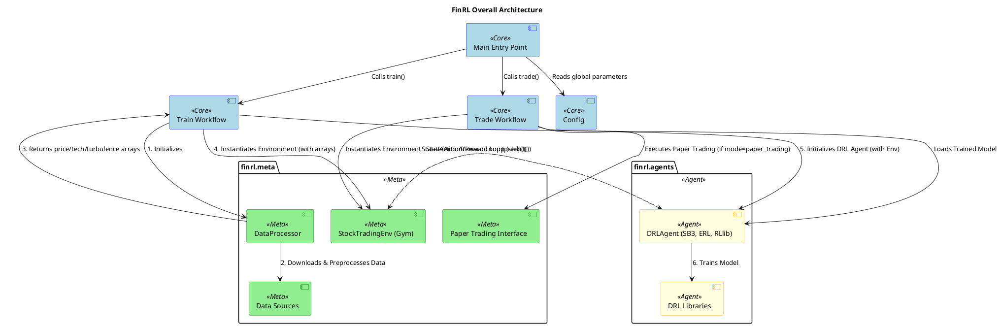

# FinRL - In-Depth Source Code Analysis

## Phase 1: Global Scan & Planning

### 1.1. Full Directory Structure

```
The FinRL project structure is organized into a core Python package (`finrl`) and several supporting directories, following a clear separation of concerns for a machine learning framework.

```
FinRL/
├── .git/                     # Git version control metadata (Excluded from analysis)
├── .github/                  # GitHub configuration (e.g., issue templates, workflows) (Excluded)
├── docker/                   # Docker setup for containerized environments (Excluded)
├── docs/                     # Documentation source files (Excluded)
├── examples/                 # Jupyter notebooks and scripts demonstrating usage (Excluded)
├── figs/                     # Project figures and logos (Excluded)
├── finrl/                    # **CORE SOURCE CODE PACKAGE** - The heart of the framework
│   ├── agents/               # **DRL Agents and Wrappers**: Integrates and adapts various DRL libraries (Stable-Baselines3, ElegantRL, RLlib) to the FinRL environment interface.
│   │   ├── elegantrl/        # Integration with ElegantRL DRL library
│   │   ├── portfolio_optimization/ # Specific agents for portfolio optimization tasks
│   │   ├── rllib/            # Integration with RLlib DRL library
│   │   └── stablebaselines3/ # Integration with Stable-Baselines3 DRL library
│   ├── applications/         # **Financial Application Templates**: Provides end-to-end examples and specific configurations for different financial tasks.
│   │   ├── cryptocurrency_trading/
│   │   ├── high_frequency_trading/
│   │   ├── portfolio_allocation/
│   │   └── stock_trading/    # Example implementations for stock trading, including ensemble methods
│   ├── meta/                 # **Meta/Environment Components**: The infrastructure layer for data and environment modeling.
│   │   ├── data_processors/  # Data acquisition and feature engineering from various sources (Yahoo, Alpaca, etc.)
│   │   ├── env_*/            # Custom OpenAI Gym environments for different financial tasks (stock trading, crypto, portfolio)
│   │   ├── paper_trading/    # Real-time/paper trading integration (e.g., Alpaca)
│   │   └── preprocessor/     # Legacy/alternative data downloaders
│   ├── config.py             # Global configuration constants (dates, indicators, model params)
│   ├── main.py               # Main entry point for CLI (train, test, trade modes)
│   ├── train.py              # Core DRL training workflow logic
│   ├── trade.py              # Core trading workflow logic (backtesting/paper trading)
│   └── plot.py               # Utility for plotting results and performance metrics
├── unit_tests/               # Unit tests (Excluded)
└── ...                       # Other configuration files (README, LICENSE, setup.py, etc.) (Excluded)
```
The structure is highly modular, with the `finrl` package acting as the primary container. The **`meta`** module handles the crucial task of transforming raw financial data into a standardized Reinforcement Learning problem (State, Action, Reward), while the **`agents`** module abstracts the complexity of different DRL algorithms. The top-level files (`main.py`, `train.py`, `trade.py`) serve as the **orchestration layer**, tying these components together to execute the full DRL pipeline. This design ensures that the core logic is separated from configuration, data handling, and algorithm implementation.
```

### 1.2. Core Folders for Analysis

*   `/home/ubuntu/FinRL/finrl`: The root of the core package, containing entry points and global configurations.
*   `/home/ubuntu/FinRL/finrl/agents`: The module responsible for integrating and wrapping various DRL libraries (Stable-Baselines3, ElegantRL, RLlib) into a unified `DRLAgent` interface.
*   `/home/ubuntu/FinRL/finrl/meta`: The meta-module that provides the necessary infrastructure for DRL in finance, including data processing, custom Gym environments, and paper trading interfaces.
*   `/home/ubuntu/FinRL/finrl/applications`: Contains application-specific, end-to-end examples and templates for different financial tasks.

## Phase 2: Module-by-Module Deep Analysis

## 1. Core/Entry Module (`finrl`)

**Module Core Responsibility**: This module serves as the **entry point** and **orchestrator** for the entire FinRL workflow. It defines global configurations and implements the high-level logic for the three main modes of operation: `train`, `test`, and `trade`.

**Key File Identification**:
*   `config.py`: Defines all global constants, including data directories (`DATA_SAVE_DIR`), date ranges (`TRAIN_START_DATE`), technical indicators (`INDICATORS` - e.g., `macd`, `rsi_30`), and default DRL model hyperparameters (`A2C_PARAMS`, `PPO_PARAMS`, etc.). This file centralizes all experiment parameters.
*   `main.py`: The command-line interface entry point. It parses the `--mode` argument (`train`, `test`, `trade`) and calls the corresponding function from `finrl.train`, `finrl.test`, or `finrl.trade`. It ensures necessary directories are created for saving data and models.
*   `train.py`: Implements the DRL training pipeline. It orchestrates the data flow: `DataProcessor` -> `download_data` -> `clean_data` -> `add_technical_indicator` -> `df_to_array` -> `StockTradingEnv` configuration -> `DRLAgent` initialization and `train_model`. It supports conditional loading of agents from `elegantrl`, `rllib`, or `stable_baselines3`.
*   `trade.py`: Implements the trading pipeline, supporting two sub-modes: `backtesting` (which delegates to `finrl.test`) and `paper_trading` (which uses the `AlpacaPaperTrading` class from the `meta` module).

## 2. Meta/Environment Module (`finrl/meta`)

**Module Core Responsibility**: This is the **infrastructure layer** that adapts financial data and tasks into the standard Reinforcement Learning paradigm (Gym environments). It handles data acquisition, feature engineering, and the definition of the trading environment's state, action, and reward space.

**Key File Identification**:
*   `data_processor.py`: The main facade class, `DataProcessor`. It acts as a factory/wrapper for various data source-specific processors (e.g., `YahooFinanceProcessor`, `AlpacaProcessor`). It provides a unified interface for data downloading, cleaning, adding technical indicators, and converting the final DataFrame into the NumPy arrays (`price_array`, `tech_array`, `turbulence_array`) required by the Gym environments.
*   `data_processors/processor_yahoofinance.py`: A concrete implementation of a data processor. It uses the `yfinance` library (and potentially Selenium for scraping) to fetch data and includes methods for data cleaning and feature engineering (e.g., adding the VIX index).
*   `env_stock_trading/env_stocktrading.py`: The core custom Gym environment, `StockTradingEnv`.
    *   **State Space**: A 1D NumPy array representing `[cash, stock_price_1, ..., stock_price_N, stock_shares_1, ..., stock_shares_N, tech_indicator_1, ..., tech_indicator_M, turbulence]`.
    *   **Action Space**: A continuous `Box` space, where each element corresponds to the percentage of total assets to allocate to a stock (ranging from -1 to 1, representing sell/buy).
    *   **Reward Function**: The reward is the change in the total portfolio value (cash + stock holdings) between the current step and the previous step, scaled by `reward_scaling`.
    *   **Turbulence**: The environment incorporates a **turbulence index** (`risk_indicator_col`) to model market volatility. If turbulence exceeds a threshold, the agent is forced to liquidate all positions, a critical risk management mechanism.

## 3. Agent Module (`finrl/agents`)

**Module Core Responsibility**: This module provides the necessary **wrappers and interfaces** to seamlessly integrate popular DRL libraries (Stable-Baselines3, ElegantRL, RLlib) with the custom FinRL Gym environments. This abstracts the DRL implementation details from the main workflow.

**Key File Identification**:
*   `stablebaselines3/models.py`: Defines the `DRLAgent` class, which wraps SB3 models (A2C, PPO, SAC, TD3, DDPG). It uses the **Adapter Pattern** to make SB3 algorithms conform to the FinRL training and prediction interface. The `DRL_prediction` method handles the testing/backtesting loop using the trained model on a vectorized environment (`DummyVecEnv`).
*   `elegantrl/models.py`: Defines the `DRLAgent` class for ElegantRL integration. This wrapper is more tightly coupled with the environment's internal arrays (`price_array`, `tech_array`) as ElegantRL uses a custom `Config` object for environment and agent setup.
*   `portfolio_optimization/algorithms.py`: Contains specific algorithms for portfolio optimization, demonstrating the framework's flexibility beyond standard stock trading.

## 4. Application Module (`finrl/applications`)

**Module Core Responsibility**: This module provides **ready-to-use, end-to-end examples** for various financial tasks. These files serve as templates and demonstrations, showing how to combine the `meta` (data/env) and `agents` (DRL models) modules to solve a specific problem.

**Key File Identification**:
*   `stock_trading/ensemble_stock_trading.py`: A key example demonstrating the use of an **ensemble strategy** where multiple DRL agents (e.g., PPO, A2C, DDPG) are trained and their performance is validated to select the best one for trading. This highlights a key feature of the FinRL framework.
*   Other files (e.g., `cryptocurrency_trading`, `portfolio_allocation`) provide specialized configurations and environment settings for those specific domains, showcasing the framework's adaptability.

### Module PlantUML Diagrams

@startuml Module_Meta
title FinRL Meta Module (Data and Environment)

package "finrl.meta" {
    class DataProcessor {
        - processor: AbstractProcessor
        + __init__(data_source, ...)
        + download_data(...)
        + clean_data(...)
        + add_technical_indicator(...)
        + add_turbulence(...)
        + add_vix(...)
        + df_to_array(...) : price_array, tech_array, turbulence_array
    }

    package "data_processors" {
        interface AbstractProcessor {
            + download_data()
            + clean_data()
            + add_technical_indicator()
            + add_turbulence()
            + add_vix()
            + df_to_array()
        }
        class YahooFinanceProcessor
        class AlpacaProcessor
        class WrdsProcessor
    }

    package "env_stock_trading" {
        class StockTradingEnv {
            - df: DataFrame
            - state: np.array
            - day: int
            - initial_amount: int
            - asset_memory: list
            + __init__(...)
            + step(actions) : state, reward, done, info
            + reset() : state
            + _sell_stock(index, action)
            + _buy_stock(index, action)
            + get_sb_env() : DummyVecEnv
        }
        StockTradingEnv -up-|> gym.Env
    }

    package "paper_trading" {
        class AlpacaPaperTrading {
            - api_key
            - api_secret
            - model
            + run()
        }
    }
}

DataProcessor o-- AbstractProcessor : uses
YahooFinanceProcessor -up-|> AbstractProcessor
AlpacaProcessor -up-|> AbstractProcessor
WrdsProcessor -up-|> AbstractProcessor

StockTradingEnv ..> DataProcessor : receives arrays from df_to_array()
AlpacaPaperTrading ..> StockTradingEnv : uses for state/action logic

@enduml

@startuml Module_Agents
title FinRL Agents Module (DRL Wrappers)

package "finrl.agents" {
    interface DRLAgentInterface {
        + get_model(model_name, ...)
        + train_model(model, ...)
        + DRL_prediction(model, environment)
    }

    package "stablebaselines3" {
        class DRLAgent_SB3 {
            - env: StockTradingEnv
            + get_model(model_name, ...)
            + train_model(model, ...)
            + DRL_prediction(model, environment)
        }
        class TensorboardCallback
    }

    package "elegantrl" {
        class DRLAgent_ElegantRL {
            - env_config
            + get_model(model_name, model_kwargs)
            + train_model(model, cwd, total_timesteps)
        }
    }

    package "rllib" {
        class DRLAgent_RLlib {
            + get_model(model_name)
            + train_model(model, ...)
        }
    }
}

DRLAgent_SB3 -up-|> DRLAgentInterface
DRLAgent_ElegantRL -up-|> DRLAgentInterface
DRLAgent_RLlib -up-|> DRLAgentInterface

DRLAgent_SB3 ..> TensorboardCallback : uses
DRLAgent_SB3 ..> StockTradingEnv : wraps/uses
DRLAgent_ElegantRL ..> StockTradingEnv : wraps/uses

@enduml

@startuml Module_Core
title FinRL Core Module (Orchestration)

package "finrl" {
    class Config {
        + TRAIN_START_DATE
        + INDICATORS
        + PPO_PARAMS
        + ...
    }

    class Main {
        + main()
        + build_parser()
    }

    class Train {
        + train(...)
    }

    class Trade {
        + trade(...)
    }
}

Main ..> Config : reads constants
Main ..> Train : calls train()
Main ..> Trade : calls trade()

Train ..> DataProcessor : uses for data prep
Train ..> StockTradingEnv : instantiates environment
Train ..> DRLAgentInterface : uses for model training

Trade ..> StockTradingEnv : instantiates environment
Trade ..> DRLAgentInterface : uses for prediction (backtesting)
Trade ..> AlpacaPaperTrading : uses for paper trading

@enduml

## Phase 3: Overall Architecture & Summary

### 3.1. Overall Architecture Analysis

#### 3.1.1. Core Abstractions

The FinRL framework is fundamentally built on the **Reinforcement Learning (RL) Paradigm** applied to quantitative finance, adhering closely to the **OpenAI Gym interface** for environment standardization.

**Core Abstractions**:
1.  **Data Processor**: This serves as an abstraction layer over diverse financial data sources (Yahoo Finance, Alpaca, WRDS, etc.). It is responsible for standardizing raw data into a clean, feature-engineered format (DataFrame) suitable for the RL environment. This abstraction ensures the core DRL logic remains independent of the data source.
2.  **Environment (`StockTradingEnv`)**: This is the central abstraction that models the financial market as a Markov Decision Process (MDP). It rigorously defines the three core components of the RL problem:
    *   **State**: The observation space, which includes cash, stock prices, stock shares, technical indicators, and the market turbulence index.
    *   **Action**: The action space, a continuous `Box` representing the normalized allocation of total assets to each stock (ranging from -1 for selling to 1 for buying).
    *   **Reward**: The immediate reward, calculated as the change in the total portfolio value (cash + stock holdings) between time steps.
3.  **DRL Agent Wrapper (`DRLAgent`)**: This is a critical abstraction over different DRL libraries (Stable-Baselines3, ElegantRL, RLlib). It allows users to swap out the underlying DRL algorithm with minimal code changes, promoting modularity, experimentation, and comparison of different algorithms on the same financial task.

**Design Philosophy**:
*   **Modularity and Extensibility**: The clear separation of concerns between Data (`DataProcessor`), Environment (`Env`), and Algorithm (`DRLAgent`) is the cornerstone of the design. This structure allows for easy extension: new data sources require only a new processor implementation, new financial tasks require a new Gym environment, and new DRL algorithms require a new `DRLAgent` wrapper.
*   **Risk-Awareness**: The framework demonstrates a focus on real-world risk management by explicitly including a **turbulence index** in the state space. The environment's logic includes a mechanism for forced liquidation of all positions if market turbulence exceeds a predefined threshold, a crucial feature for financial stability.
*   **Ensemble Learning Focus**: The design encourages the use of ensemble strategies, as evidenced by the application templates, to mitigate the high variance and improve the robustness of DRL models in volatile financial markets.

**Lifecycle Management**:
The lifecycle is managed by the core orchestration scripts (`main.py`, `train.py`, `trade.py`). The process flows from configuration (`config.py`) -> data preparation (`DataProcessor`) -> environment setup (`StockTradingEnv`) -> model training (`DRLAgent`) -> model persistence (saving trained models) -> and finally, deployment for backtesting or paper trading. This sequential, modular lifecycle ensures reproducibility and clear debugging paths.

#### 3.1.2. Component Interactions

The FinRL system follows a clear, sequential data flow, primarily orchestrated by the `train.py` and `trade.py` scripts, ensuring a structured pipeline from data to decision-making.

**1. Data Acquisition and Preprocessing**:
The process begins in `train.py` which calls the `DataProcessor` (from `finrl/meta/data_processor.py`). The `DataProcessor` acts as a facade, instantiating a source-specific processor (e.g., `YahooFinanceProcessor` in `finrl/meta/data_processors/processor_yahoofinance.py`). This processor fetches raw financial data, cleans it, adds technical indicators, and incorporates market volatility measures like the VIX index. The final output is a set of three NumPy arrays: `price_array`, `tech_array`, and `turbulence_array`, which are passed back to the core workflow.

**2. Environment Initialization**:
These NumPy arrays are used to configure and instantiate the custom Gym environment, typically `StockTradingEnv` (from `finrl/meta/env_stock_trading/env_stocktrading.py`). The environment uses these arrays to define its state space and to simulate the passage of time (days), making the financial market an accessible Markov Decision Process (MDP) for the DRL agent.

**3. Training Loop (Agent-Environment Interaction)**:
The `train.py` script initializes the appropriate `DRLAgent` wrapper (e.g., `DRLAgent_SB3` from `finrl/agents/stablebaselines3/models.py`) and calls its `train_model()` method.
*   **Interaction**: The DRL model interacts with the `StockTradingEnv` by calling `env.step(action)`. The DRL model outputs an `action` (a normalized portfolio allocation vector).
*   **Execution**: The `StockTradingEnv.step()` method executes the simulated trade, updates the portfolio state (`self.state`), calculates the `reward` (change in portfolio value), and returns the new state, reward, and terminal status to the DRL algorithm.
*   Training results are logged via the `TensorboardCallback` for monitoring.

**4. Testing/Trading Loop**:
The `trade.py` or `test.py` scripts handle post-training execution.
*   The trained model is loaded via `DRLAgent.DRL_prediction()`.
*   The model predicts an action for each day in the test/trade period, and the environment is stepped through.
*   For performance evaluation, the `asset_memory` and `actions_memory` are recorded.
*   For **paper trading**, the `AlpacaPaperTrading` class in `finrl/meta/paper_trading/alpaca.py` continuously monitors the market and executes trades via the Alpaca API based on the DRL model's predictions, bridging the gap between simulation and real-world application.

### 3.2. Overall Architecture PlantUML Diagram



### 3.3. Design Patterns & Highlights

#### 3.3.1. Design Patterns

The FinRL codebase effectively utilizes several software design patterns to achieve its goals of modularity, extensibility, and separation of concerns.

1.  **Adapter Pattern**
    *   **Description**: This pattern allows the interface of an existing class to be used as another interface. In FinRL, it is used to unify the interfaces of disparate DRL libraries.
    *   **Implementation**: The `DRLAgent` classes in `finrl/agents/stablebaselines3/models.py`, `finrl/agents/elegantrl/models.py`, and `finrl/agents/rllib/models.py` all conform to a common interface (`get_model`, `train_model`, `DRL_prediction`). Each class adapts the specific API calls of its underlying DRL library (SB3, ElegantRL, or RLlib) to this single, unified interface, allowing the core `train.py` script to treat them interchangeably.

2.  **Factory Method Pattern (Implicit)**
    *   **Description**: This pattern provides an interface for creating objects in a superclass, but allows subclasses to alter the type of objects that will be created.
    *   **Implementation**: The `DataProcessor` class in `finrl/meta/data_processor.py` acts as a simple factory. Based on the `data_source` string passed to its constructor (e.g., `"alpaca"`, `"yahoofinance"`), it dynamically instantiates the correct concrete data processor object (e.g., `AlpacaProcessor`, `YahooFinanceProcessor`).
    *   **Code Example (from `data_processor.py`)**:
        ```python
        class DataProcessor:
            def __init__(self, data_source, ...):
                if data_source == "alpaca":
                    self.processor = Alpaca(...)
                elif data_source == "yahoofinance":
                    self.processor = YahooFinance()
                # ... other data sources
        ```

3.  **Strategy Pattern**
    *   **Description**: This pattern defines a family of algorithms, encapsulates each one, and makes them interchangeable. Strategy lets the algorithm vary independently from the clients that use it.
    *   **Implementation**: The overall training workflow in `train.py` allows the user to select a "strategy" (the DRL algorithm, e.g., PPO, SAC, DDPG) and the DRL library (e.g., `stable_baselines3`, `elegantrl`) at runtime. The `train` function then dynamically loads and uses the corresponding `DRLAgent` and DRL model based on these parameters, enabling easy comparison of different trading strategies.

#### 3.3.2. Project Highlights

The FinRL framework includes several innovative features and design choices that enhance its utility and flexibility for financial reinforcement learning:

*   **Unified DRL Framework**: FinRL provides a single, consistent API that abstracts away the differences between multiple state-of-the-art DRL libraries, including Stable-Baselines3, ElegantRL, and RLlib. This allows researchers and practitioners to easily switch between and compare algorithms (e.g., PPO, SAC, DDPG) without modifying the core data or environment logic.
*   **Financial Market Modeling with Risk Awareness**: The custom Gym environments, such as `StockTradingEnv`, are specifically tailored for finance. They incorporate essential real-world elements like **transaction costs** (`buy_cost_pct`, `sell_cost_pct`) and, critically, a **turbulence index**. This index is used to model market volatility, and the environment enforces a **risk-management mechanism** (forced liquidation) when turbulence exceeds a threshold, making the simulation more realistic and risk-aware.
*   **Data Source Agnosticism**: Through the `DataProcessor` abstraction, the framework achieves a high degree of data source agnosticism. The same DRL pipeline can be run on data from various providers (Yahoo Finance, Alpaca, WRDS, etc.) by simply changing a configuration parameter, significantly reducing the effort required for data integration.
*   **Real-World Readiness and Paper Trading**: The inclusion of a dedicated `trade.py` module with the `AlpacaPaperTrading` class provides a direct and seamless path from backtesting to live paper trading. This feature is a major highlight, enabling users to test their trained agents in a simulated live market environment before committing real capital.
*   **Ensemble Learning Support**: The framework is explicitly designed to facilitate the training and validation of multiple agents, supporting robust **ensemble strategies** (as demonstrated in `ensemble_stock_trading.py`). This is a key feature for improving the stability and performance of DRL models in the highly stochastic financial domain.

### 3.4. Summary & Recommendations

#### 3.4.1. Potential Improvements

The FinRL framework is robust, but several areas can be optimized to improve performance, maintainability, and flexibility:

1.  **Environment Performance and Vectorization**:
    *   **Issue**: The core `StockTradingEnv` in `env_stocktrading.py` is implemented using standard Python/Pandas/NumPy logic, which can be slow for high-frequency or large-scale backtesting due to Python's overhead in the simulation loop.
    *   **Suggestion**: Implement a fully **vectorized environment** for training. This involves processing all time steps for all assets in parallel using NumPy or a library like JAX/PyTorch, drastically reducing the number of Python function calls and improving training speed. The current `DummyVecEnv` wrapper only vectorizes the environment interface, not the internal simulation logic.

2.  **Data Acquisition Reliability and Brittle Code**:
    *   **Issue**: The `YahooFinanceProcessor` shows a mix of `yfinance` library usage and brittle web scraping techniques (Selenium/BeautifulSoup) for data acquisition. Web scraping is highly susceptible to breaking when the target website's structure changes.
    *   **Suggestion**: Standardize data acquisition to rely solely on stable, official APIs (like Alpaca, which is already integrated) or robust data providers. Remove the reliance on Selenium/scraping to ensure long-term stability and maintainability of the data pipeline.

3.  **Configuration Management Modernization**:
    *   **Issue**: The use of global constants in `config.py` is simple but limits the flexibility required for complex, reproducible experiments. Modifying a global constant affects all parts of the code.
    *   **Suggestion**: Adopt a modern configuration management library like **Hydra** or use **Pydantic Settings**. This would allow for structured, hierarchical configuration files (YAML/JSON), easy command-line overrides, and better separation of configuration from the core codebase, making experiment tracking and parameter tuning more robust.

4.  **Code Quality and Documentation**:
    *   **Issue**: While type hints are present, the documentation, particularly docstrings for the core `DRLAgent` methods and environment parameters, could be more comprehensive.
    *   **Suggestion**: Enforce a documentation standard (e.g., NumPy or Google style docstrings) for all public methods and classes. This will significantly improve code clarity and reduce the learning curve for secondary developers.

#### 3.4.2. Secondary Development Guide

The FinRL framework is designed for extensibility, making secondary development straightforward by focusing on the three core modular components: Data, Environment, and Agent.

1.  **Start with `config.py`**:
    *   The first step for any new experiment is to define the scope by modifying the global constants in `finrl/config.py`. This includes setting the `TRAIN_START_DATE`, `TRAIN_END_DATE`, the list of `INDICATORS`, and the hyperparameters for the DRL models (e.g., `PPO_PARAMS`).

2.  **Define the Task (Environment)**:
    *   For standard tasks (stock trading, crypto), use the existing environments in `finrl/meta/env_stock_trading`.
    *   To create a new financial task (e.g., options trading, futures), create a new custom Gym environment class that inherits from `gym.Env` and defines the unique state, action, and reward mechanisms specific to that task. Ensure the `step()` method correctly calculates the reward and updates the state based on the action.

3.  **Prepare Data (DataProcessor)**:
    *   If your data source is supported (Yahoo, Alpaca, etc.), use the existing `DataProcessor` facade.
    *   To integrate a new data source, create a new `processor_yourname.py` file in `finrl/meta/data_processors`. This new class must implement the required methods: `download_data`, `clean_data`, `add_technical_indicator`, and crucially, `df_to_array` to convert the data into the NumPy arrays expected by the environment.

4.  **Select/Implement Agent**:
    *   Choose a DRL library (Stable-Baselines3 is recommended for its comprehensive documentation). The `DRLAgent` wrappers handle the integration.
    *   To add a new DRL algorithm not currently supported, extend the appropriate `DRLAgent` class in `finrl/agents` and implement the `get_model`, `train_model`, and `DRL_prediction` methods to wrap the new algorithm's API.

5.  **Execute via `main.py`**:
    *   Use the command-line interface (`python main.py --mode=train`) to execute the workflow. The orchestration logic in `main.py`, `train.py`, and `trade.py` will handle the rest, ensuring the data, environment, and agent are correctly linked.

This modular approach ensures that developers can focus on one component at a time without needing to rewrite the entire pipeline.

