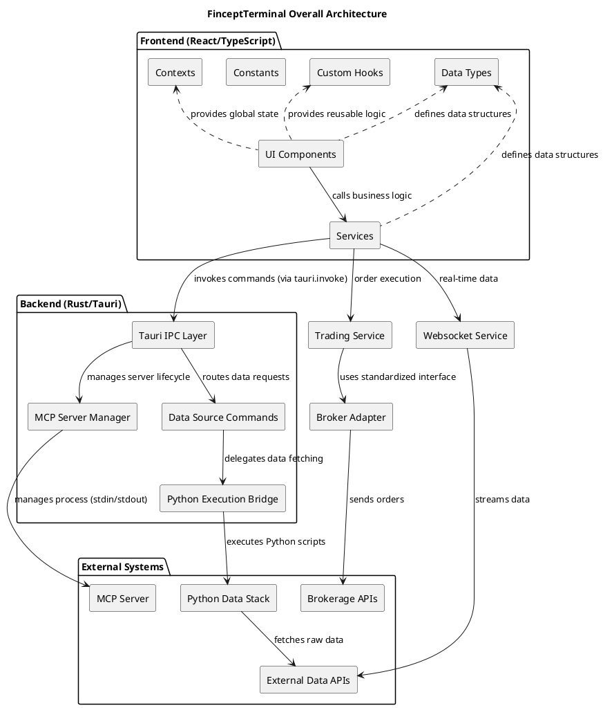

# FinceptTerminal - In-Depth Source Code Analysis

## Phase 1: Global Scan & Planning

### 1.1. Full Directory Structure

```
/home/ubuntu/FinnewsHunter/thirdparty/FinceptTerminal (Root of the project)
|-- .github (Configuration for GitHub workflows and templates)
|-- docs (Project documentation, likely Docusaurus or similar)
|-- fincept-terminal-desktop (The main application source code)
|   |-- public (Static assets for the frontend)
|   |-- src-tauri (Rust backend code for Tauri)
|   |   |-- src (Core Rust source files)
|   |   |   |-- commands (Tauri commands for data fetching and utilities, over 30 data sources)
|   |   |   |-- data_sources (Rust-side data source implementations)
|   |   |   |-- utils (Utility functions, notably the Python execution bridge)
|   |   |   |-- lib.rs (Main Rust library, process management, IPC setup)
|   |   |   |-- main.rs (Tauri entry point)
|   |-- src (TypeScript/React frontend code)
|   |   |-- assets (Frontend static assets)
|   |   |-- components (Reusable UI components)
|   |   |   |-- tabs (Major feature views like data-mapping, trading, portfolio, node-editor)
|   |   |   |-- ui (Design system components)
|   |   |-- constants (Application-wide configuration values)
|   |   |-- contexts (React Context providers for global state)
|   |   |-- hooks (Custom React hooks for logic reuse)
|   |   |-- lib (Frontend utility functions)
|   |   |-- services (Core business logic and data orchestration)
|   |   |   |-- backtesting (Logic for backtesting strategies)
|   |   |   |-- websocket (Real-time data handling)
|   |   |   |-- trading (Order management logic)
|   |   |-- stockBrokers (Brokerage API integration adapters, e.g., ZerodhaKite)
|   |   |-- types (TypeScript interfaces and type definitions)
|   |   |-- App.tsx (Main React application component)
|-- images (Marketing and documentation images)

The project structure clearly delineates the **Hybrid Architecture**. The `fincept-terminal-desktop` directory houses the core application, split into the `src-tauri` (Rust backend) and `src` (React/TypeScript frontend) folders. This separation of concerns is fundamental, with the Rust layer managing system-level tasks and the Python bridge, while the TypeScript layer handles the rich user interface and business logic via services. The extensive `commands` directory in the Rust backend highlights the project's focus on being a comprehensive financial data aggregator.
```

### 1.2. Core Folders for Analysis

*   `/home/ubuntu/FinnewsHunter/thirdparty/FinceptTerminal/fincept-terminal-desktop/src-tauri/src`: The core Rust backend, handling IPC, process management, and data source delegation.
*   `/home/ubuntu/FinnewsHunter/thirdparty/FinceptTerminal/fincept-terminal-desktop/src/components`: The React frontend's presentation layer, including all UI elements and feature views.
*   `/home/ubuntu/FinnewsHunter/thirdparty/FinceptTerminal/fincept-terminal-desktop/src/services`: The frontend's business logic layer, containing core features like workflow management, backtesting, and trading.
*   `/home/ubuntu/FinnewsHunter/thirdparty/FinceptTerminal/fincept-terminal-desktop/src/stockBrokers`: Brokerage integration adapters, implementing the Adapter Pattern for trading.
*   `/home/ubuntu/FinnewsHunter/thirdparty/FinceptTerminal/fincept-terminal-desktop/src/types`: Shared TypeScript interfaces and type definitions for application-wide data structures.
*   `/home/ubuntu/FinnewsHunter/thirdparty/FinceptTerminal/fincept-terminal-desktop/src/constants`: Application-wide configuration values and magic strings.
*   `/home/ubuntu/FinnewsHunter/thirdparty/FinceptTerminal/fincept-terminal-desktop/src/contexts`: React Context providers for global state management.
*   `/home/ubuntu/FinnewsHunter/thirdparty/FinceptTerminal/fincept-terminal-desktop/src/hooks`: Custom React hooks for logic reuse across components.

## Phase 2: Module-by-Module Deep Analysis

## Module 1: `src-tauri/src` (Rust Backend)

**Core Responsibility:** The Rust backend, built with Tauri, serves as the **core application logic and data gateway**. Its primary function is to manage system-level interactions, handle inter-process communication (IPC) with the frontend, and act as a secure, performant bridge to various external data sources and computational backends (like Python). It is responsible for managing the lifecycle of external processes, such as the MCP (Model Context Protocol) server.

**Key Files and Functions:**
*   `lib.rs`: Defines the core state management (`MCPState` and `MCPProcess`) for external processes.
*   `commands/mod.rs`: The central registry for all Tauri commands, revealing **extensive data source integration** (e.g., `yfinance`, `polygon`, `fred`, `worldbank`).
*   `utils/python.rs`: A critical file that implements the logic to locate and execute the Python interpreter across different operating systems, confirming that the Rust backend delegates data fetching and heavy computation to Python scripts.

**Core Implementation & Dependencies:** The module uses Rust and Tauri, relying on `std::sync::{Arc, Mutex}` for safe, concurrent management of external processes. Tauri's `#[tauri::command]` macro is used extensively to expose Rust functions to the TypeScript/React frontend.

## Module 2: `src/components` (Frontend UI Components)

**Core Responsibility:** This module contains the React/TypeScript components that form the user interface, responsible for visual presentation and user interaction.

**Key Files and Functions (Inferred from Directory Structure):**
*   `components/tabs/*`: Contains the main feature views, such as `data-mapping`, `equity-research`, `node-editor`, `portfolio`, and `trading`, indicating a highly modular, tab-based application structure.
*   `components/charts`: Dedicated components for financial data visualization.

**Core Implementation & Dependencies:** Built with TypeScript and React, the components rely on the Tauri API (`@tauri-apps/api`) to call the Rust commands for data and system interaction.

## Module 3: `src/services` (Frontend Business Logic)

**Core Responsibility:** This module encapsulates the complex business logic and data orchestration for the frontend, separating it from the presentation layer.

**Key Files and Functions:**
*   `workflowService.ts`: Manages the creation, storage, execution, and state of user-defined **workflows**, suggesting a core feature is a visual programming or automation tool.
*   `services/backtesting`: Contains logic for financial backtesting, likely integrating with Python libraries like `vectorbt` or `lean`.
*   `services/websocket`: Handles real-time data streaming, essential for a financial terminal.

**Core Implementation & Dependencies:** This module implements the **Service Layer** pattern and depends on the Tauri IPC layer to communicate with the Rust backend for data and process control.

## Module 4: `src/stockBrokers` (Brokerage Integration)

**Core Responsibility:** Provides a standardized interface for connecting to and interacting with various stock brokerage APIs.

**Key Files and Functions:**
*   `stockBrokers/india/zerodhaKite`: A concrete implementation for a specific Indian brokerage, indicating a focus on the Indian market or a modular design for regional expansion.

**Core Implementation & Dependencies:** The module likely uses the **Adapter Pattern** to normalize the different brokerage APIs into a single interface used by the `trading` service.

## Module 5: `src/types` (Shared Data Structures)

**Core Responsibility:** Defines the core TypeScript data structures and interfaces used across the entire frontend application, ensuring type safety and consistency. This adheres to the **Single Source of Truth** principle for data types.

## Module 6: `src/lib`, `src/hooks`, `src/constants`, `src/contexts` (Utilities and State)

**Core Responsibility:** Contains common utilities, custom React hooks, application-wide constants, and React context providers for global state. This module uses the **Context Pattern** for dependency injection and state management throughout the frontend.

**Conclusion:** The project is a **hybrid desktop application** built with **Tauri (Rust) and React/TypeScript**. The Rust backend acts as a secure data API gateway, leveraging Python for data fetching, while the React frontend provides a rich, modular, tab-based user interface with core features like **workflow automation**, **backtesting**, and **brokerage integration**.

### Module PlantUML Diagrams

# Rust Backend Module (`src-tauri/src`)

@startuml
title Rust Backend Module (`src-tauri/src`)

package "Core Logic" {
    class AppHandle
    class MCPState {
        - processes: Mutex<HashMap<String, MCPProcess>>
    }
    class MCPProcess {
        - child: Child
        - stdin: Arc<Mutex<ChildStdin>>
        - response_rx: Receiver<String>
    }
    class SpawnResult
    interface TauriCommand
}

package "Utilities" {
    class PythonUtils {
        + get_python_path(app: &AppHandle)
        + execute_python_command(...)
    }
}

package "Commands" {
    class YFinanceCommand <<TauriCommand>>
    class PolygonCommand <<TauriCommand>>
    class FredCommand <<TauriCommand>>
    ' ... many other data source commands
}

AppHandle "1" -- "1" MCPState : manages
MCPState "1" -- "*" MCPProcess : contains
MCPProcess "1" -- "1" SpawnResult : returns status
AppHandle "1" -- "1" PythonUtils : uses
YFinanceCommand ..> PythonUtils : executes script via
YFinanceCommand ..> AppHandle : requires
TauriCommand <|-- YFinanceCommand
TauriCommand <|-- PolygonCommand
TauriCommand <|-- FredCommand

@enduml

# Frontend Services Module (`src/services`)

@startuml
title Frontend Services Module (`src/services`)

class Workflow {
    + id: string
    + name: string
    + nodes: any[]
    + edges: any[]
    + status: 'idle' | 'running' | 'completed' | 'error' | 'draft'
}

class WorkflowService {
    - workflows: Map<string, Workflow>
    - runningWorkflows: Set<string>
    + saveWorkflow(workflow: Workflow)
    + runWorkflow(workflowId: string)
    + cleanupRunningWorkflows()
}

class BacktestingService {
    + runBacktest(strategy: Strategy)
}

class WebsocketService {
    + connect(url: string)
    + subscribe(symbol: string)
}

class TradingService {
    + placeOrder(order: Order)
}

WorkflowService "1" -- "*" Workflow : manages
BacktestingService ..> TradingService : may simulate orders
WebsocketService ..> TradingService : provides real-time data
WorkflowService ..> TauriIPC : calls Rust commands
BacktestingService ..> TauriIPC : calls Rust commands

@enduml

# Brokerage Integration Module (`src/stockBrokers`)

@startuml
title Brokerage Integration Module (`src/stockBrokers`)

interface BrokerAdapter {
    + authenticate(credentials: any)
    + getQuote(symbol: string)
    + placeOrder(order: Order)
}

class ZerodhaKiteAdapter {
    - apiKey: string
    - accessToken: string
    + authenticate(credentials: any)
    + getQuote(symbol: string)
    + placeOrder(order: Order)
}

BrokerAdapter <|.. ZerodhaKiteAdapter
TradingService "1" --> "1" BrokerAdapter : uses adapter pattern

@enduml

## Phase 3: Overall Architecture & Summary

### 3.1. Overall Architecture Analysis

#### 3.1.1. Core Abstractions

The FinceptTerminal project is built on a **Hybrid Desktop Architecture** using **Tauri**, which is the foundational design philosophy. This approach leverages the performance, security, and native capabilities of **Rust** for the backend logic while providing a rich, cross-platform user interface with **React/TypeScript**.

### Core Abstractions

1.  **Tauri IPC Command:** The `#[tauri::command]` macro in Rust is the central abstraction for all application functionality. It creates a clean, asynchronous boundary between the UI and the system/data layer. Every data request, process management call, and utility function is exposed through this unified IPC mechanism.
2.  **Data Gateway:** The collection of Rust commands acts as a comprehensive **Data Gateway**. Instead of implementing all data fetching logic in Rust, the project abstracts the data source itself. Each command (e.g., `yfinance`, `fred`, `polygon`) represents a specific external API, standardizing access to a vast array of financial and economic data.
3.  **Workflow Object:** In the frontend, the `Workflow` object is a critical abstraction. It represents a user-defined, executable sequence of operations (a visual programming model). The object encapsulates the nodes, edges, status, and results of a user's automated task, making complex analysis and trading strategies manageable.
4.  **Python Execution Bridge:** The `utils/python.rs` module is an abstraction that hides the complexity of finding and executing Python scripts across different operating systems. This allows the Rust layer to seamlessly delegate data fetching and heavy computational tasks to the extensive Python data science ecosystem.

### Design Philosophy

The architecture adheres to a **Layered Design** with a strong emphasis on **Extensibility** and **Separation of Concerns**:
*   **Presentation Layer (React/TS):** Handles UI and user interaction.
*   **Service Layer (TypeScript Services):** Encapsulates business logic (`WorkflowService`, `BacktestingService`).
*   **Application Layer (Rust Backend):** Manages IPC, process lifecycle, and data orchestration.
*   **Data Layer (Python Scripts/External APIs):** Handles the actual data retrieval and processing.

### Lifecycle Management

The application lifecycle is managed by Tauri and the custom services:
*   **Application Startup:** Tauri initializes the Rust backend, which then prepares system resources, including the potential startup and state management of the **MCP (Model Context Protocol) server** (managed by `MCPState` and `MCPProcess` in `lib.rs`).
*   **Workflow Lifecycle:** The `WorkflowService` manages the state of user workflows, persisting them in local storage. The Rust backend is responsible for the lifecycle of any external processes spawned by a running workflow, ensuring they are properly cleaned up upon application exit or workflow termination (`cleanup_running_workflows`).

#### 3.1.2. Component Interactions

The application's dynamic behavior is driven by a sophisticated set of communication patterns:

| Component | Interacts With | Communication Pattern | Data Flow Example |
| :--- | :--- | :--- | :--- |
| **React UI** | **Rust Backend** | Tauri IPC (Asynchronous Command Calls) | User clicks "Fetch Data" -> React calls `tauri.invoke('execute_yfinance_command', ...)` |
| **Rust Backend** | **Python Scripts** | Process Spawning and Standard I/O | `YFinanceCommand` calls `execute_python_command` -> Rust spawns Python process -> Python prints JSON to stdout -> Rust captures stdout and returns it via IPC. |
| **Rust Backend** | **MCP Server** | Inter-Process Communication (Custom Protocol) | Rust manages the `MCPProcess` lifecycle and communicates with it via its stdin/stdout streams, as suggested by the `MCPProcess` struct fields (`child`, `stdin`, `response_rx`). |
| **Frontend Services** | **External APIs** | WebSocket (Real-time) | `WebsocketService` connects directly to a market data provider, pushing updates to the UI components for live charting. |
| **Trading Service** | **Broker Adapters** | Adapter Pattern (Method Calls) | `TradingService` calls `brokerAdapter.placeOrder()`, which is implemented by a specific adapter like `ZerodhaKiteAdapter`. |

The primary data flow for historical and fundamental data is a **chain of delegation**: **Frontend -> Rust IPC -> Python Bridge -> External API**. This pattern ensures that the computationally heavy and data-intensive tasks are handled by the most appropriate tool (Python's data science stack), while the Rust layer maintains control and security. The use of JSON serialization is implied at every boundary (Python stdout, Tauri IPC) to ensure structured data transfer.

### 3.2. Overall Architecture PlantUML Diagram



### 3.3. Design Patterns & Highlights

#### 3.3.1. Design Patterns

The FinceptTerminal codebase employs several established design patterns to manage complexity, ensure modularity, and promote extensibility:

1.  **Adapter Pattern (Brokerage Integration):**
    *   **Description:** This pattern allows the interface of an existing class to be used as another interface. This is implemented in the `src/stockBrokers` module.
    *   **Implementation:** The `TradingService` interacts with a generic `BrokerAdapter` interface. Concrete classes like `ZerodhaKiteAdapter` implement this interface, translating generic trading commands into the specific API calls required by the respective brokerage.

2.  **Bridge Pattern (Rust-Python Interoperability):**
    *   **Description:** Decouples an abstraction from its implementation so that the two can vary independently.
    *   **Implementation:** The **Rust IPC Layer** acts as the abstraction (the "what" to do, e.g., "get YFinance data"). The **Python Execution Bridge** (`utils/python.rs`) and the underlying Python scripts act as the implementation (the "how" to do it).

3.  **Service Layer Pattern (Frontend Business Logic):**
    *   **Description:** Defines an application's boundary and a set of available operations from the perspective of the client.
    *   **Implementation:** Modules like `WorkflowService`, `BacktestingService`, and `TradingService` in `src/services` encapsulate complex business rules and orchestration logic, shielding the UI components from direct interaction with the IPC layer.

4.  **Command Pattern (Tauri IPC):**
    *   **Description:** Encapsulates a request as an object, allowing for uniform handling of operations.
    *   **Implementation:** Each `#[tauri::command]` in the Rust backend is a concrete command object that the frontend can invoke via `tauri.invoke()`, treating every backend operation uniformly.

#### 3.3.2. Project Highlights

The FinceptTerminal project exhibits several innovative features and design choices that contribute to its extensibility and flexibility:

*   **Hybrid Architecture for Best-of-Breed Tooling:** The combination of **Rust (Tauri)** for system performance and security, and **Python** for data science and financial libraries, is a significant highlight. This allows the application to deliver a fast, native desktop experience while leveraging the vast, specialized ecosystem of Python for financial analysis (e.g., `pandas`, `yfinance`, `vectorbt`).
*   **Extensive Data Source Integration:** The sheer number of dedicated data source commands (over 30, including `fred`, `worldbank`, `sec`, `polygon`, and various government sources) is a major feature. This design makes the terminal a **universal financial data aggregator**, providing a single, standardized interface for disparate data APIs.
*   **Workflow Automation Engine:** The presence of the `WorkflowService` and the implied `node-editor` component suggests a powerful, user-facing **visual programming environment**. This feature allows users to automate complex analytical tasks and trading strategies without writing code, greatly enhancing the application's utility and appeal to a broader user base.
*   **Modular Brokerage Integration:** The use of the **Adapter Pattern** in `src/stockBrokers` ensures that the application is not locked into a single trading provider. This modularity is key to its flexibility, allowing for rapid expansion into new markets (e.g., the existing `zerodhaKite` for India) and future-proofing against changes in brokerage APIs.
*   **Model Context Protocol (MCP) Integration:** The management of an **MCP Server** in the Rust backend indicates a forward-looking design for integrating external AI/ML models or custom computational backends. This provides a clear path for future expansion into advanced, AI-powered financial insights.

### 3.4. Summary & Recommendations

#### 3.4.1. Potential Improvements

The current architecture is robust and highly extensible, but a few areas could be optimized for performance, scalability, and maintainability:

1.  **Optimize the Rust-Python Bridge Performance:** The current model of delegating via `execute_python_command` introduces significant overhead from process startup and inter-process communication (IPC) latency. A key optimization would be to transition from spawning a new Python process for every data request to a **persistent Python server** (e.g., using a lightweight Flask/FastAPI server or a dedicated Jupyter kernel managed by the Rust backend). This would allow the Python environment to be initialized once, drastically reducing latency for subsequent data requests.

2.  **Implement a Standardized Data Source Interface:** The current `commands/mod.rs` lists many specific commands, which could lead to code duplication. Creating a generic `DataSource` trait or interface in Rust that all data source commands must implement would enforce consistency, simplify the addition of new data sources, and allow for meta-operations like caching or rate-limiting to be applied uniformly.

3.  **Enhance Workflow Persistence and State Management:** The migration of workflow storage from the browser's `localStorage` (as seen in `workflowService.ts`) to a more robust, local database solution like **SQLite** using Tauri's built-in database capabilities is recommended. This provides better scalability for a large number of complex workflows, ensures data integrity, and allows for more complex querying and indexing of workflow metadata.

4.  **Refactor Frontend State Management:** For complex, application-wide state (e.g., user settings, active data connections), adopting a dedicated global state management library (e.g., Redux Toolkit, Zustand) to replace or augment the current reliance on React Contexts would provide better debugging tools, predictable state changes, and easier management of asynchronous operations.

#### 3.4.2. Secondary Development Guide

For developers looking to extend or maintain the FinceptTerminal codebase, the following practices are recommended:

1.  **Understand the Hybrid Flow:** Always trace a feature request through the three main layers: **React UI** (user interaction) -> **TypeScript Service** (business logic) -> **Rust IPC Command** (data gateway) -> **Python Script** (data execution). Start with the `src/App.tsx` for the frontend entry and `src-tauri/src/lib.rs` for the backend entry.

2.  **Adding a New Data Source:**
    *   **Step 1 (Python):** Write a new Python script (e.g., `new_api_data.py`) that handles the API request and returns the result as a JSON string to standard output.
    *   **Step 2 (Rust):** Create a new file in `src-tauri/src/commands/` (e.g., `new_api.rs`). Implement a new `#[tauri::command]` that calls `utils::python::execute_python_command` with the new Python script's name and arguments.
    *   **Step 3 (Frontend):** Create a new service or function in the TypeScript layer that calls the new Tauri command via `tauri.invoke()`.

3.  **Integrating a New Stock Broker:**
    *   Create a new adapter class in `src/stockBrokers/` (e.g., `src/stockBrokers/europe/degiroAdapter.ts`). This class **MUST** implement the generic `BrokerAdapter` interface to ensure compatibility with the `TradingService`.

4.  **Extending the Workflow Engine:** New analytical or trading nodes are added by defining their structure and logic in the `src/components/tabs/node-editor` module. The execution logic for these nodes will primarily live in the `WorkflowService`, which orchestrates calls to the relevant services or directly to the Rust IPC layer.

