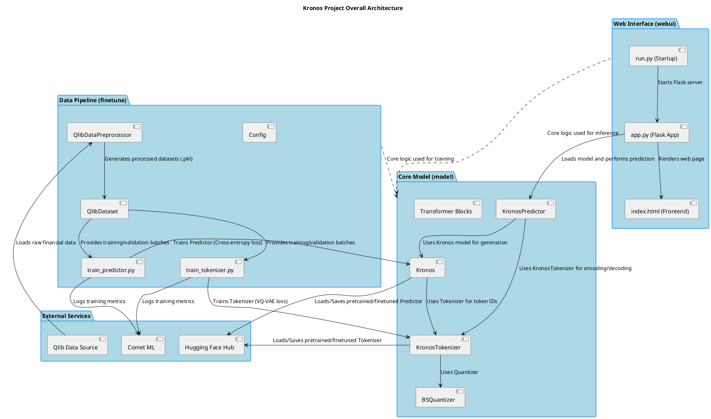

# Kronos - In-Depth Source Code Analysis

## Phase 1: Global Scan & Planning

### 1.1. Full Directory Structure

```
The Kronos project exhibits a clear, modular structure typical of a modern deep learning project, organized around the core components of data processing, model definition, training, and deployment.

```
/home/ubuntu/Kronos_project
├── .git/                               # Git version control metadata (Excluded from analysis)
├── LICENSE                             # Project license file
├── README.md                           # Project overview and documentation
├── examples/                           # Scripts demonstrating model usage and prediction
│   ├── data/                           # Sample financial data for examples
│   └── prediction_*.py                 # Example scripts for single and batch prediction
├── figures/                            # Image assets for documentation (e.g., overview.png)
├── finetune/                           # **Core Module 2: Data Pipeline and Training**
│   ├── config.py                       # Centralized configuration for all hyperparameters and paths
│   ├── dataset.py                      # PyTorch Dataset for Qlib data, handles sliding window and sampling
│   ├── qlib_data_preprocess.py         # Script for loading, cleaning, and splitting Qlib financial data
│   ├── train_predictor.py              # Main script for training the Kronos Causal Language Model
│   ├── train_tokenizer.py              # Main script for training the KronosTokenizer (VQ-VAE)
│   └── utils/                          # Utility functions for DDP setup, logging, and model size calculation
├── finetune_csv/                       # Alternative finetuning pipeline for CSV data (secondary/legacy)
├── model/                              # **Core Module 1: Model Definition**
│   ├── __init__.py                     # Module initialization
│   ├── kronos.py                       # Defines the main Kronos and KronosTokenizer models, and KronosPredictor
│   └── module.py                       # Defines all fundamental building blocks (Transformer, Quantizer, Embeddings)
├── requirements.txt                    # Python dependencies for the core project
├── tests/                              # Unit and regression tests (Excluded from core analysis)
└── webui/                              # **Core Module 3: Web Interface for Inference**
    ├── app.py                          # Flask application logic, API endpoints for data/model loading and prediction
    ├── run.py                          # Startup script for the Flask application
    ├── start.sh                        # Shell script for starting the web server
    └── templates/                      # HTML templates for the frontend (e.g., index.html)
```

The structure clearly separates concerns: the `model` directory contains the reusable intellectual property (the model architecture), `finetune` contains the ML engineering pipeline (data and training), and `webui` contains the deployment and demonstration layer. This separation ensures high modularity and maintainability. The `examples` and `tests` directories provide necessary context for usage and validation.
```

### 1.2. Core Folders for Analysis

*   `/home/ubuntu/Kronos_project/model`: Contains the core PyTorch model definitions, including the main `Kronos` and `KronosTokenizer` classes, the quantization logic, and all fundamental Transformer components. This is the heart of the project's intellectual property.
*   `/home/ubuntu/Kronos_project/finetune`: Contains the complete data preparation and model training pipeline. This includes configuration (`config.py`), dataset handling (`dataset.py`), data preprocessing (`qlib_data_preprocess.py`), and the main training scripts (`train_tokenizer.py`, `train_predictor.py`).
*   `/home/ubuntu/Kronos_project/finetune/utils`: Contains utility functions essential for the training process, such as DDP setup, seed setting, model size calculation, and time formatting.
*   `/home/ubuntu/Kronos_project/webui`: Contains the Flask-based web application for demonstrating the model's inference capabilities. This includes the main application logic (`app.py`), the startup script (`run.py`), and the frontend template (`templates/index.html`).

## Phase 2: Module-by-Module Deep Analysis

The Kronos project is composed of three primary core modules: `model`, `finetune`, and `webui`.

### 1. Model Module (`/home/ubuntu/Kronos_project/model`)

This module is the core intellectual property, defining the architecture for the hierarchical quantization and causal language model.

| File | Responsibility | Key Classes/Functions |
| :--- | :--- | :--- |
| `module.py` | Defines all fundamental building blocks for the Transformer and Quantization components. | `BSQuantizer`, `TransformerBlock`, `RMSNorm`, `RotaryPositionalEmbedding`, `HierarchicalEmbedding`, `DualHead` |
| `kronos.py` | Defines the main model classes that assemble the components from `module.py`. | `KronosTokenizer`, `Kronos`, `KronosPredictor` |

#### Implementation Details
*   **Quantization**: The `BSQuantizer` implements the **Binary Spherical Quantization** technique, which is a variant of VQ-VAE. It maps continuous data to discrete indices, crucial for the language modeling approach. The `DifferentiableEntropyFunction` is used to enforce codebook usage and prevent collapse, a key challenge in VQ-VAE training.
*   **Transformer Components**: The model uses a standard Transformer block (`TransformerBlock`) but replaces the traditional LayerNorm with **RMSNorm** and uses **Rotary Positional Embedding (RoPE)** for positional encoding, which are common optimizations in modern LLMs (e.g., Llama).
*   **Hierarchical Tokenization**: `KronosTokenizer` and `HierarchicalEmbedding` implement the core idea of splitting the financial data into two token streams ($S_1$ for coarse, $S_2$ for fine) to improve the quality of the discrete representation.
*   **Prediction**: The `KronosPredictor` class encapsulates the entire inference process, including the complex **autoregressive generation** loop, which involves repeated calls to the `Kronos` model and the tokenizer's `decode` method.

### 2. Finetune Module (`/home/ubuntu/Kronos_project/finetune`)

This module manages the entire machine learning pipeline, from data ingestion to model training.

| File | Responsibility | Key Classes/Functions |
| :--- | :--- | :--- |
| `config.py` | Centralizes all configuration parameters. | `Config` |
| `qlib_data_preprocess.py` | Handles data loading from Qlib, feature calculation, and train/val/test splitting. | `QlibDataPreprocessor` |
| `dataset.py` | Implements the PyTorch `Dataset` for time-series sampling. | `QlibDataset` |
| `train_tokenizer.py` | Training script for the `KronosTokenizer` (VQ-VAE). | `train_model` (Tokenizer) |
| `train_predictor.py` | Training script for the `Kronos` Causal Language Model. | `train_model` (Predictor) |

#### Implementation Details
*   **Data Ingestion**: `QlibDataPreprocessor` uses the Qlib library to access financial data, calculates the `amt` (amount) feature, and ensures the data is correctly windowed for the lookback and prediction horizons defined in `Config`.
*   **Sampling Strategy**: `QlibDataset` implements a non-standard sampling strategy where `__getitem__` ignores the input index and instead draws a **random sample** from a pre-computed pool of all possible sliding windows. This is a robust method for training on large, continuous time-series data.
*   **Training Loop**: Both training scripts use **Distributed Data Parallel (DDP)** and a standard optimization loop with **AdamW** and a **OneCycleLR** scheduler. The tokenizer training minimizes reconstruction and quantization loss, while the predictor training minimizes cross-entropy loss on the next token prediction.

### 3. WebUI Module (`/home/ubuntu/Kronos_project/webui`)

This module provides a demonstration and inference interface using the Flask framework.

| File | Responsibility | Key Classes/Functions |
| :--- | :--- | :--- |
| `app.py` | Defines the Flask application, API routes, and model loading/prediction logic. | `load_model`, `predict`, `create_prediction_chart` |
| `run.py` | Startup script that checks dependencies and launches the Flask server. | `main` |

#### Implementation Details
*   **API Endpoints**: Key endpoints include `/api/load-model` (loads a model from a predefined list of configurations), `/api/data-files` (lists available data), and `/api/predict` (performs the core prediction).
*   **Inference Integration**: The `predict` endpoint uses the `KronosPredictor` to generate forecasts. It handles input data validation, time-series slicing, and parameter passing (temperature, top-p, sample count) for the generative model.
*   **Visualization**: The `create_prediction_chart` function uses the **Plotly** library to generate interactive candlestick charts, visualizing the historical data, the predicted future data, and optionally, the actual future data for comparison. The chart is returned as a JSON object for the frontend.

### Module PlantUML Diagrams

@startuml module_model
title Core Model Module (/model)

package "Quantization" {
    class DifferentiableEntropyFunction <<Function>>
    class BinarySphericalQuantizer {
        + embed_dim: int
        + beta: float
        + gamma0: float
        + gamma: float
        + zeta: float
        + quantize(z)
        + forward(z)
        + soft_entropy_loss(z)
    }
    class BSQuantizer {
        + s1_bits: int
        + s2_bits: int
        + codebook_dim: int
        + forward(z, half)
    }
}

package "Transformer Components" {
    class RMSNorm
    class FeedForward
    class RotaryPositionalEmbedding
    class MultiHeadAttentionWithRoPE
    class MultiHeadCrossAttentionWithRoPE
    class TransformerBlock {
        + norm1: RMSNorm
        + self_attn: MultiHeadAttentionWithRoPE
        + norm2: RMSNorm
        + ffn: FeedForward
        + forward(x)
    }
}

package "Embeddings & Heads" {
    class FixedEmbedding
    class TemporalEmbedding {
        + minute_embed: Embed
        + hour_embed: Embed
        ...
        + forward(x)
    }
    class HierarchicalEmbedding {
        + emb_s1: nn.Embedding
        + emb_s2: nn.Embedding
        + fusion_proj: nn.Linear
        + split_token(token_ids)
        + forward(token_ids)
    }
    class DualHead {
        + proj_s1: nn.Linear
        + proj_s2: nn.Linear
        + compute_loss(...)
        + forward(x)
        + cond_forward(x2)
    }
    class DependencyAwareLayer {
        + cross_attn: MultiHeadCrossAttentionWithRoPE
        + forward(hidden_states, sibling_embed)
    }
}

package "Main Models" {
    class KronosTokenizer <<PyTorchModelHubMixin>> {
        + encoder: nn.ModuleList
        + decoder: nn.ModuleList
        + tokenizer: BSQuantizer
        + embed: nn.Linear
        + head: nn.Linear
        + forward(x)
        + encode(x)
        + decode(x)
    }
    class Kronos <<PyTorchModelHubMixin>> {
        + embedding: HierarchicalEmbedding
        + time_emb: TemporalEmbedding
        + transformer: nn.ModuleList
        + dep_layer: DependencyAwareLayer
        + head: DualHead
        + forward(s1_ids, s2_ids, stamp)
    }
    class KronosPredictor {
        + model: Kronos
        + tokenizer: KronosTokenizer
        + generate(...)
        + predict(...)
        + predict_batch(...)
    }
}

' Relationships
BinarySphericalQuantizer <.. DifferentiableEntropyFunction : uses
BSQuantizer *-- BinarySphericalQuantizer : wraps
KronosTokenizer *-- BSQuantizer : uses
KronosTokenizer *-- TransformerBlock : uses (encoder/decoder)
Kronos *-- HierarchicalEmbedding : uses
Kronos *-- TemporalEmbedding : uses
Kronos *-- TransformerBlock : uses
Kronos *-- DependencyAwareLayer : uses
Kronos *-- DualHead : uses
TransformerBlock *-- MultiHeadAttentionWithRoPE : uses
TransformerBlock *-- FeedForward : uses
MultiHeadAttentionWithRoPE *-- RotaryPositionalEmbedding : uses
MultiHeadCrossAttentionWithRoPE *-- RotaryPositionalEmbedding : uses
DependencyAwareLayer *-- MultiHeadCrossAttentionWithRoPE : uses
TemporalEmbedding *-- FixedEmbedding : uses (or nn.Embedding)
KronosPredictor *-- Kronos : aggregates
KronosPredictor *-- KronosTokenizer : aggregates

@enduml

@startuml module_finetune
title Finetune Module (/finetune)

package "Configuration" {
    class Config {
        + qlib_data_path: str
        + lookback_window: int
        + predict_window: int
        + train_time_range: list
        + batch_size: int
        + tokenizer_learning_rate: float
        + predictor_learning_rate: float
    }
}

package "Data Pipeline" {
    class QlibDataPreprocessor {
        + initialize_qlib()
        + load_qlib_data()
        + prepare_dataset()
    }
    class QlibDataset <<PyTorch Dataset>> {
        + __init__(data_type)
        + __len__()
        + __getitem__(idx)
        + set_epoch_seed(epoch)
    }
}

package "Training Scripts" {
    class TrainingUtils
    class TrainTokenizer {
        + main()
        + train_model()
    }
    class TrainPredictor {
        + main()
        + train_model()
    }
}

' Relationships
Config <.. QlibDataPreprocessor : Reads parameters
Config <.. QlibDataset : Reads parameters
Config <.. TrainTokenizer : Reads parameters
Config <.. TrainPredictor : Reads parameters
QlibDataPreprocessor --> QlibDataset : Prepares and saves data
QlibDataset <.. TrainTokenizer : Provides batches
QlibDataset <.. TrainPredictor : Provides batches
TrainTokenizer ..> TrainingUtils : Uses DDP setup/utilities
TrainPredictor ..> TrainingUtils : Uses DDP setup/utilities
TrainTokenizer ..> KronosTokenizer : Trains
TrainPredictor ..> Kronos : Trains
TrainPredictor ..> KronosTokenizer : Uses for tokenization

@enduml

@startuml module_webui
title WebUI Module (/webui)

package "Frontend" {
    [index.html] as IH
}

package "Backend" {
    class FlaskApp <<app.py>> {
        + load_data_files()
        + load_data_file(path)
        + save_prediction_results(...)
        + create_prediction_chart(...)
        + / (index)
        + /api/load-model (POST)
        + /api/predict (POST)
    }
    class StartupScript <<run.py>> {
        + check_dependencies()
        + main()
    }
}

' Relationships
StartupScript --> FlaskApp : Launches server
FlaskApp --> IH : Renders template
FlaskApp ..> KronosPredictor : Uses for prediction
FlaskApp ..> pandas : Data handling
FlaskApp ..> plotly : Chart generation

@enduml

## Phase 3: Overall Architecture & Summary

### 3.1. Overall Architecture Analysis

#### 3.1.1. Core Abstractions

The Kronos project is built upon a **Hierarchical Quantization and Transformer-based Language Modeling** philosophy, specifically adapted for financial time-series data.

### Core Abstractions

1.  **Hierarchical Quantization (BSQuantizer)**: The project's most critical abstraction is the use of a **Binary Spherical Quantizer (BSQuantizer)**, implemented in `model/module.py`. This acts as a Vector Quantized Variational Autoencoder (VQ-VAE) component, translating continuous financial data (OHLCV) into discrete, hierarchical tokens.
    *   **BSQuantizer** is a wrapper around `BinarySphericalQuantizer`, which maps a continuous vector `z` to a binary vector `zhat` (values in $\{-1, 1\}$) and calculates a quantization loss.
    *   The **Hierarchical** aspect is achieved by splitting the total codebook dimension into two parts: $S_1$ bits (coarse token) and $S_2$ bits (fine token). This allows for a two-stage tokenization and prediction process, improving efficiency and representation power.

2.  **KronosTokenizer (VQ-VAE)**: This class (`model/kronos.py`) implements the full VQ-VAE structure. It consists of:
    *   **Encoder**: A stack of Transformer blocks that maps the input time-series data ($X$) to a latent representation ($Z$).
    *   **Quantizer**: The `BSQuantizer` which converts $Z$ into discrete token indices ($S_1$ and $S_2$).
    *   **Decoder**: A stack of Transformer blocks that reconstructs the original input ($X'$) from the quantized representation.
    *   The tokenizer's primary role is to learn a compact, discrete representation of the continuous financial data, effectively creating a **financial vocabulary**.

3.  **Kronos (Causal Language Model)**: This is the main prediction model (`model/kronos.py`), which operates entirely in the discrete token space, similar to a standard decoder-only Transformer (like GPT).
    *   It uses **HierarchicalEmbedding** to combine the $S_1$ and $S_2$ token IDs into a single embedding vector.
    *   It incorporates **TemporalEmbedding** to inject time-based features (minute, hour, day, month) into the sequence.
    *   It uses a stack of **TransformerBlock**s for sequence modeling.
    *   The **DualHead** predicts the probability distribution over the next $S_1$ and $S_2$ tokens, enabling the causal prediction of future financial states.

### Design Philosophy

The project follows a **Two-Stage Training** and **Tokenization-First** philosophy:
1.  **Tokenization (Unsupervised)**: The `KronosTokenizer` is trained first to learn the optimal discrete representation of the financial data, minimizing reconstruction error and maximizing codebook usage (entropy loss). This is an unsupervised pre-training step.
2.  **Prediction (Supervised/Self-Supervised)**: The `Kronos` model is then trained on the sequence of generated tokens using a causal language modeling objective. This decouples the continuous-to-discrete mapping from the sequence prediction task, which is a common and powerful technique in modern generative AI (e.g., VQ-GAN, VQ-Diffusion).

### Lifecycle Management

The lifecycle is managed through standard PyTorch and Hugging Face practices:
*   **Configuration**: The `Config` class (`finetune/config.py`) centralizes all hyperparameters, paths, and data splitting logic, ensuring a single source of truth for the entire pipeline.
*   **Distributed Training**: The training scripts (`train_tokenizer.py`, `train_predictor.py`) are built for **Distributed Data Parallel (DDP)** using `torch.distributed`, enabling efficient scaling across multiple GPUs.
*   **Model Persistence**: Both `KronosTokenizer` and `Kronos` inherit from `PyTorchModelHubMixin`, allowing them to use the `save_pretrained` and `from_pretrained` methods for easy serialization and loading from local paths or the **Hugging Face Hub**.
*   **Inference Abstraction**: The `KronosPredictor` class provides a clean, high-level API (`predict`, `predict_batch`) that abstracts away the underlying tokenization, model inference, and denormalization steps, making the model easy to integrate into applications like the `webui`.

#### 3.1.2. Component Interactions

The Kronos project architecture is centered around the **Kronos** and **KronosTokenizer** models, which are trained and then deployed for inference via a web interface. The core interaction flows are divided into three main phases: Data Preparation, Model Training, and Model Inference.

### 1. Data Preparation and Loading
The data pipeline is managed within the `finetune` module, specifically by `QlibDataPreprocessor` and `QlibDataset`.
*   **QlibDataPreprocessor** (`finetune/qlib_data_preprocess.py`) interacts with the external **Qlib Data Source** to load raw financial data (OHLCV). It processes this data by calculating additional features (like `amt`), performing data cleaning, and splitting it into train, validation, and test sets.
*   The processed data is saved as pickled files (`.pkl`).
*   **QlibDataset** (`finetune/dataset.py`) loads these pickled files and implements a sliding window mechanism to extract time-series samples. Crucially, it performs **instance-level normalization** on the fly for each sample, ensuring the model receives standardized input.

### 2. Model Training (Tokenizer and Predictor)
The training process uses a two-stage approach: first training the tokenizer, then the predictor.
*   **Tokenizer Training** (`finetune/train_tokenizer.py`): The script loads the `QlibDataset` and trains the **KronosTokenizer** (`model/kronos.py`). The input financial data (`x`) is passed to the tokenizer's `forward` method, which performs:
    1.  Linear embedding (`self.embed`).
    2.  Encoder Transformer blocks.
    3.  Quantization embedding (`self.quant_embed`).
    4.  Binary Spherical Quantization (`self.tokenizer`).
    5.  Decoder Transformer blocks.
    The loss function is a combination of **reconstruction loss** (MSE between input `x` and reconstructed output `z`) and the **BSQuantizer loss** (`bsq_loss`), which includes a commitment loss and an entropy penalty.
*   **Predictor Training** (`finetune/train_predictor.py`): This script first loads the *finetuned* `KronosTokenizer` in evaluation mode. It then loads and trains the **Kronos** model (`model/kronos.py`).
    1.  The input financial data (`x`) is passed to the *frozen* tokenizer's `encode` method to get the hierarchical token IDs (`s1_ids`, `s2_ids`).
    2.  These token IDs, along with the time features (`stamp`), are fed into the `Kronos` model's `forward` method.
    3.  The model uses a standard **causal language modeling** objective, predicting the next token (`s1_ids[t+1]`, `s2_ids[t+1]`) based on the current sequence.
    4.  The loss is calculated using the **DualHead**'s `compute_loss` method, which applies cross-entropy loss to both S1 and S2 token logits.

### 3. Model Inference (Web UI)
The web interface provides a user-friendly way to perform predictions.
*   **Model Loading** (`webui/app.py`): The Flask application loads the `Kronos` model and `KronosTokenizer` using the `from_pretrained` method (suggesting a dependency on **Hugging Face Hub**). It then instantiates the **KronosPredictor** class, which encapsulates the entire inference logic.
*   **Prediction** (`webui/app.py` -> `KronosPredictor.predict`):
    1.  The user's input data (`df`) is pre-processed, including normalization using the mean/std of the input data itself.
    2.  The pre-processed data is passed to `KronosPredictor.generate`.
    3.  The `generate` method performs **autoregressive sampling**. In each step, it uses the `Kronos` model to predict the next token IDs, which are then decoded back into the financial data space using the `KronosTokenizer.decode` method.
    4.  The output is denormalized and returned as a prediction DataFrame.
*   **Visualization**: The results are formatted into a Plotly chart (candlestick) for display in the `index.html` template.

### 3.2. Overall Architecture PlantUML Diagram



### 3.3. Design Patterns & Highlights

#### 3.3.1. Design Patterns

The Kronos codebase employs several established software and machine learning design patterns to manage complexity, ensure modularity, and facilitate training.

### 1. Two-Stage Training Pattern (ML Pattern)
This pattern is fundamental to the project's structure, separating the representation learning from the sequence prediction task.

*   **Implementation**:
    *   **Stage 1 (Representation Learning)**: `KronosTokenizer` is trained as a VQ-VAE using `finetune/train_tokenizer.py`. It learns to compress continuous financial data into discrete tokens.
    *   **Stage 2 (Sequence Modeling)**: `Kronos` is trained as a Causal Language Model using `finetune/train_predictor.py`. It learns to predict the next token in a sequence, using the vocabulary learned in Stage 1.

### 2. Adapter Pattern (Structural Pattern)
The `KronosPredictor` class acts as an adapter, simplifying the complex interaction between the `Kronos` model and `KronosTokenizer` for external users (like the `webui`).

*   **Implementation**:
    ```python
    # model/kronos.py (inside KronosPredictor.__init__)
    self.model = model       # The Kronos Causal LM
    self.tokenizer = tokenizer # The KronosTokenizer VQ-VAE
    
    # model/kronos.py (inside KronosPredictor.predict)
    # The predictor handles the full pipeline:
    # 1. Pre-processing/Normalization
    # 2. Autoregressive generation (calling model and tokenizer repeatedly)
    # 3. Denormalization
    pred_df = predictor.predict(...)
    ```
    The `predict` method hides the intricate steps of token encoding, autoregressive loop, token decoding, and denormalization from the caller.

### 3. Composite Pattern (Structural Pattern)
The Transformer architecture naturally lends itself to the Composite pattern, where a complex structure is built from a tree of simpler, uniform components.

*   **Implementation**:
    ```python
    # model/kronos.py (inside Kronos.__init__)
    self.transformer = nn.ModuleList([
        TransformerBlock(...)
        for _ in range(self.n_layers)
    ])
    
    # model/module.py (TransformerBlock)
    class TransformerBlock(nn.Module):
        def __init__(self, ...):
            self.self_attn = MultiHeadAttentionWithRoPE(...)
            self.ffn = FeedForward(...)
            # ...
    ```
    The `Kronos` model is a composite of `TransformerBlock`s, which are themselves composites of `MultiHeadAttentionWithRoPE` and `FeedForward` layers.

### 4. Strategy Pattern (Behavioral Pattern)
The `QlibDataset` uses a strategy for sampling data, which is essential for training on large, time-series datasets where a full epoch is impractical.

*   **Implementation**:
    ```python
    # finetune/dataset.py (QlibDataset.__getitem__)
    # The index `idx` passed to __getitem__ is ignored.
    # Instead, a random index is drawn from the pre-computed pool of indices.
    random_idx = self.py_rng.randint(0, len(self.indices) - 1)
    symbol, start_idx = self.indices[random_idx]
    # ... extract data window
    ```
    This implements a **Random Sampling Strategy** over all possible sliding windows, ensuring that the model sees a diverse set of samples in each training iteration, regardless of the batch size or epoch definition.

### 5. Dependency Injection (Software Pattern)
The training scripts inject the necessary configuration and models into the training functions.

*   **Implementation**:
    ```python
    # finetune/train_predictor.py (main function)
    config_instance = Config()
    main(config_instance.__dict__)
    
    # ...
    # train_model(model, tokenizer, device, config, ...)
    ```
    The `Config` object is created once and its parameters are passed around, ensuring that all parts of the training pipeline (data loading, model initialization, optimization) use the same set of parameters. The `tokenizer` is explicitly loaded and passed to `train_model` for use by the `model`, demonstrating a clear dependency chain.

#### 3.3.2. Project Highlights

The Kronos project demonstrates several innovative and flexible design choices:

*   **Financial Time-Series as a Language (Innovation)**: The core innovation is the application of a **Causal Language Model (CLM)**, typically used for text generation, to financial time-series prediction. This is achieved by:
    *   **Tokenization**: Using the `KronosTokenizer` (a VQ-VAE variant) to translate continuous OHLCV data into discrete tokens, creating a "financial vocabulary."
    *   **Prediction**: Training the `Kronos` CLM to predict the next token in the sequence, which is equivalent to predicting the next price movement. This leverages the powerful sequence modeling capabilities of the Transformer architecture.

*   **Hierarchical Quantization (Flexibility)**: The use of $S_1$ (coarse) and $S_2$ (fine) bits in the `BSQuantizer` and `HierarchicalEmbedding` provides a flexible and robust tokenization scheme.
    *   This allows the model to first capture the **macro-level** price movements ($S_1$) and then refine the prediction with **micro-level** details ($S_2$), potentially improving both stability and accuracy.

*   **Modern Transformer Components (Extensibility)**: The model incorporates state-of-the-art components from the LLM domain:
    *   **RMSNorm** and **Rotary Positional Embedding (RoPE)** are used in the `TransformerBlock`. These choices are known to improve training stability and performance in large-scale sequence models, making the architecture easily extensible to larger model sizes.

*   **Decoupled and Reusable Architecture (Extensibility)**: The clear separation between the `model` definition, the `finetune` pipeline, and the `webui` deployment layer ensures high reusability.
    *   The `KronosPredictor` class is a clean, single-entry point for inference, allowing the core model to be easily integrated into other applications (e.g., trading bots, backtesting platforms) without needing to rewrite the complex autoregressive sampling logic.

*   **Distributed Training Ready (Flexibility)**: The training scripts are fully configured for **Distributed Data Parallel (DDP)**, making the project immediately scalable for training on massive financial datasets using multi-GPU or multi-node setups. This is a critical feature for a foundation model approach.

### 3.4. Summary & Recommendations

#### 3.4.1. Potential Improvements

The Kronos project is well-engineered, but several areas could be optimized for performance, robustness, and modern ML practices.

### 1. Performance Bottlenecks and Optimization
*   **Data Loading Efficiency**: The `QlibDataset.__getitem__` method performs **instance-level normalization** and clipping (`x = (x - x_mean) / (x_std + 1e-5)`, `x = np.clip(x, -self.config.clip, self.config.clip)`) for *every sample* during training. While correct, this repeated calculation and conversion from NumPy to PyTorch can be a bottleneck.
    *   **Suggestion**: Pre-calculate and save the mean/std for each time series during the `QlibDataPreprocessor` stage. Normalize the data once and store it. The `__getitem__` method would then only need to perform the final clipping and tensor conversion.
*   **Quantizer Entropy Loss**: The `BinarySphericalQuantizer` calculates a complex entropy penalty (`soft_entropy_loss` or `get_hard_per_sample_entropy`). The `soft_entropy_loss` involves `torch.einsum` and `softmax` over a potentially large codebook, which can be computationally intensive.
    *   **Suggestion**: Profile the `BSQuantizer` forward pass. If the entropy calculation is a major overhead, consider simplifying the loss term or implementing a more efficient approximation, especially during the later stages of training.

### 2. Architecture Optimization
*   **Decoupling Tokenizer and Predictor**: The `KronosPredictor` class requires both the `Kronos` model and the `KronosTokenizer` to be loaded. The tokenizer is only used for the `encode` and `decode` steps.
    *   **Suggestion**: Merge the necessary tokenization/detokenization logic (specifically `indices_to_bits` and the embedding/head layers) directly into the `Kronos` model's `generate` method. This would allow the `Kronos` model to be a single, self-contained unit for inference, simplifying deployment and reducing the number of objects to manage.

### 3. Code Quality and Robustness
*   **Configuration Management**: The `Config` class uses a flat structure (`self.epochs`, `self.batch_size`). For a project of this complexity, a nested configuration system (e.g., using **Hydra** or **Pydantic**) would improve readability and prevent naming conflicts.
    *   **Suggestion**: Refactor `config.py` to use a structured configuration format, grouping parameters logically (e.g., `config.data.lookback_window`, `config.model.d_model`).
*   **Error Handling in WebUI**: The `webui/app.py` has several `try...except Exception as e` blocks that catch all exceptions and return a generic 500 error.
    *   **Suggestion**: Implement more granular exception handling. For example, catch `FileNotFoundError` for data loading, `ValueError` for invalid parameters, and a custom `ModelNotLoadedError` for prediction attempts, providing more informative error messages to the user.
*   **Type Hinting and Documentation**: While some files are well-documented, extending type hints across all function signatures (especially in `model/module.py`) would improve code maintainability and static analysis. The `KronosPredictor` methods, in particular, would benefit from explicit return type hints.

#### 3.4.2. Secondary Development Guide

The Kronos project is a well-structured, two-stage financial time-series prediction model. Secondary development should focus on the following areas:

### 1. Code Exploration Path
*   **Core Logic**: Start with `/home/ubuntu/Kronos_project/model/kronos.py` and `/home/ubuntu/Kronos_project/model/module.py`. These files define the `Kronos` and `KronosTokenizer` models, the core components (`TransformerBlock`, `BSQuantizer`), and the prediction logic (`KronosPredictor`). Understanding the **Hierarchical Quantization** mechanism in `BSQuantizer` is paramount.
*   **Configuration**: Review `/home/ubuntu/Kronos_project/finetune/config.py` to understand all hyperparameters, data paths, and time-splitting logic. All major modifications to the training process start here.
*   **Data Pipeline**: Examine `/home/ubuntu/Kronos_project/finetune/qlib_data_preprocess.py` and `/home/ubuntu/Kronos_project/finetune/dataset.py` to see how raw Qlib data is transformed into the normalized, windowed samples used for training.

### 2. Secondary Development Best Practices
*   **Feature Engineering**: To introduce new financial features, modify `QlibDataPreprocessor.load_qlib_data` to calculate the features and update `Config.feature_list`. The input dimension (`d_in`) of `KronosTokenizer` will need to be updated accordingly.
*   **Model Architecture Modification**: Changes to the Transformer block structure (e.g., adding a new layer type, changing attention mechanism) should be implemented in `model/module.py` and then integrated into `Kronos` or `KronosTokenizer` in `model/kronos.py`.
*   **Quantization Scheme**: Experimenting with the quantization parameters (e.g., `s1_bits`, `s2_bits`, `beta`, `gamma`) requires modifying `Config` and observing the impact on the `KronosTokenizer` training loss (reconstruction vs. entropy).
*   **Distributed Training**: The training scripts (`train_tokenizer.py`, `train_predictor.py`) are DDP-ready. Use `torchrun` to launch training for maximum efficiency. Ensure all data loading and logging is handled correctly by the rank 0 process to avoid redundancy.
*   **Inference Integration**: For integrating the model into a new application, use the `KronosPredictor` class. It is designed to handle the full inference lifecycle, from data normalization to autoregressive generation, requiring only the input DataFrame and timestamps.

### 3. Testing
*   The `tests` folder contains a regression test (`test_kronos_regression.py`). Any changes to the core model logic should be validated against this test to ensure numerical stability and prevent unintended side effects. New features should be accompanied by new unit tests.

