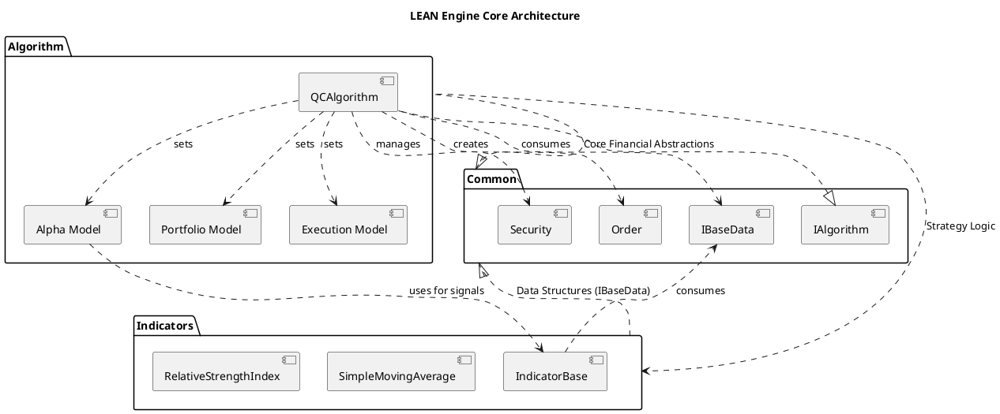

# Lean - In-Depth Source Code Analysis

## Phase 1: Global Scan & Planning

### 1.1. Full Directory Structure

```
The project structure is organized around the core components of a quantitative trading engine, emphasizing a clear separation of concerns between financial abstractions, the algorithm execution layer, and the technical analysis library.

```
/home/ubuntu/FinnewsHunter/thirdparty/Lean/
├── Algorithm/             # Core execution layer and strategy framework
│   ├── Framework/         # Modular components (Alpha, Portfolio, Execution, Risk)
│   └── QCAlgorithm.cs     # The main base class for all trading strategies
├── Common/                # Fundamental financial abstractions and data structures
│   ├── Data/              # Base data types (IBaseData, Slice)
│   ├── Orders/            # Order types and transaction management
│   ├── Securities/        # Security definition, holdings, and financial models
│   └── Interfaces/        # Core interfaces (IAlgorithm, IFeeModel, etc.)
├── Indicators/            # Comprehensive library of technical analysis indicators
│   ├── CandlestickPatterns/ # Specific folder for candlestick pattern recognition
│   └── IndicatorBase.cs   # The generic base class for all indicators
└── ... (Other folders like Data, Configuration, Logging, etc.)
```

The `Common` folder serves as the foundation, defining the core language of the system (Security, Order, Data). The `Algorithm` folder builds upon this foundation to provide the execution environment (`QCAlgorithm`) and the modular strategy pipeline (Framework). The `Indicators` folder provides the necessary tools for signal generation. This structure promotes high cohesion within modules and low coupling between them, making the system highly maintainable and extensible.
```

### 1.2. Core Folders for Analysis

*   `/home/ubuntu/FinnewsHunter/thirdparty/Lean/Common`: Contains the core financial abstractions, data structures, and interfaces for the entire engine, including `Security`, `Order`, and various financial models.
*   `/home/ubuntu/FinnewsHunter/thirdparty/Lean/Algorithm`: Houses the main execution logic, primarily the `QCAlgorithm` base class, and the modular Algorithm Framework components (Alpha, Portfolio, Execution, Risk, Universe Selection).
*   `/home/ubuntu/FinnewsHunter/thirdparty/Lean/Indicators`: A comprehensive library of technical analysis indicators, built on a generic, composable base class (`IndicatorBase<T>`).

## Phase 2: Module-by-Module Deep Analysis

## Module Analysis - Common

The `Common` module is the foundational layer of the LEAN engine, housing the core financial abstractions and data structures that are utilized throughout the entire system.

### Core Responsibility
The module's primary responsibility is to define the **financial domain model** and provide the fundamental building blocks for representing market data, financial instruments, and trading actions.

### Key Abstractions and Implementation Details

#### 1. Financial Instruments (`Securities` sub-folder)
*   **`Security.cs`**: This is the central class representing a tradable asset. It aggregates all necessary financial models (`IFeeModel`, `IFillModel`, `ISlippageModel`, `IBuyingPowerModel`) via the **Strategy Pattern**. This allows for highly realistic and customizable simulation of brokerage behavior. It also contains the `SecurityHolding` object, which tracks the current position.
*   **`SecurityHolding.cs`**: Encapsulates the portfolio position for a single security, tracking `Quantity`, `AveragePrice`, and calculating real-time metrics like `HoldingsValue` and `UnrealizedProfit`.

#### 2. Trading Actions (`Orders` sub-folder)
*   **`Order.cs`**: An abstract base class for all order types. It defines common properties like `Symbol`, `Quantity`, `Type`, and `Status`. Concrete implementations like `MarketOrder`, `LimitOrder`, and `StopMarketOrder` inherit from this, providing the specific logic for each order type.

#### 3. Data Structures
*   **`IBaseData`**: The fundamental interface for all data points consumed by the engine (e.g., `TradeBar`, `Tick`). This ensures a uniform data handling mechanism.
*   **`Slice`**: A container object passed to the algorithm's `OnData` method, holding all new `IBaseData` objects for the current time step.

### Dependencies
The `Common` module is largely self-contained, with its interfaces serving as dependencies for higher-level modules like `Algorithm` and `Indicators`.

## Module Analysis - Algorithm

The `Algorithm` module is the core execution layer of the LEAN engine, providing the base class (`QCAlgorithm`) that users extend to write their trading strategies. It integrates all the foundational components from the `Common` module and introduces the **Algorithm Framework** for modular strategy design.

### Core Responsibility
The module's primary responsibility is to serve as the **entry point and execution context** for a trading strategy. It manages the lifecycle of the algorithm (initialization, data handling, event processing, termination) and provides a rich API for interacting with the market, portfolio, and data.

### Key Abstractions and Implementation Details

#### 1. The Core Algorithm (`QCAlgorithm.cs`)
*   **Inheritance and Interfaces**: `QCAlgorithm` inherits from `MarshalByRefObject` and implements the crucial `IAlgorithm` interface.
*   **Initialization (`Initialize`, `PostInitialize`)**: The constructor sets up all core managers (`Securities`, `Transactions`, `Portfolio`, `Schedule`, `UniverseManager`) and databases (`MarketHoursDatabase`, `SymbolPropertiesDatabase`). The `Initialize()` method is the user's entry point for setting up data subscriptions, cash, and start/end dates.
*   **Data Handling (`OnData`, `OnEndOfTimeStep`)**: The `OnData(Slice slice)` method is the main event loop handler, receiving a `Slice` object containing all new data for the current time step. `OnEndOfTimeStep()` allows for post-data processing before the next step.
*   **Security Management (`AddSecurity`, `RemoveSecurity`)**: Provides overloaded methods like `AddEquity`, `AddForex`, `AddFuture`, etc., which internally call `AddSecurity<T>`. This process involves creating `SubscriptionDataConfig` objects and initializing the `Security` object using the configured `ISecurityInitializer`.

#### 2. The Algorithm Framework (Sub-folders)
The framework implements a **pipeline design pattern** for modular strategy creation, allowing users to compose a strategy from interchangeable components:
*   **`Selection` (Universe Selection)**: Defines how the set of tradable assets is chosen and maintained.
*   **`Alphas` (Alpha Model)**: Responsible for generating trading **insights** (predictions of price movement).
*   **`Portfolio` (Portfolio Construction)**: Translates the generated insights into target portfolio weights.
*   **`Execution` (Execution Model)**: Determines how to convert portfolio targets into actual market orders.
*   **`Risk` (Risk Management)**: Applies risk checks and constraints to the generated orders.

### Dependencies
The `Algorithm` module is heavily dependent on the interfaces and classes defined in the `Common` module, particularly `IAlgorithm`, `Security`, `Order`, and the various model interfaces (`IFeeModel`, `IFillModel`, etc.).

## Module Analysis - Indicators

The `Indicators` module is a comprehensive library for technical analysis, providing a vast collection of financial indicators and patterns. Its design is highly modular, centered around a generic base class that simplifies the creation and chaining of new indicators.

### Core Responsibility
The module's primary function is to provide **reusable, stateful technical analysis components** that can be easily integrated into any trading algorithm. It abstracts the complex mathematical calculations and data management required for indicators, allowing users to focus on strategy logic.

### Key Abstractions and Implementation Details

#### 1. Indicator Base Classes
*   **`IndicatorBase.cs`**: This file defines the core hierarchy:
    *   **`IndicatorBase` (Abstract)**: The non-generic base class implementing the `IIndicator` interface. It manages common properties like `Name`, `Samples`, `IsReady`, and the `Window` (a `RollingWindow<IndicatorDataPoint>`) to store historical output values. It also handles the `Updated` event, a key mechanism for chaining indicators.
    *   **`IndicatorBase<T>` (Abstract Generic)**: The generic base class where `T` is the input data type. It implements the core `Update(IBaseData input)` method, which handles data type validation, time-series checks, and calls the abstract `ComputeNextValue(T input)` method, which is the sole responsibility of the concrete indicator implementation. This is a clear example of the **Template Method Pattern**.

#### 2. Indicator Types and Composition
*   **Simple Indicators**: The vast majority of files (e.g., `SimpleMovingAverage.cs`, `RelativeStrengthIndex.cs`) implement the `IndicatorBase<T>` and override `ComputeNextValue`.
*   **Composite Indicators**: Indicators that combine the output of other indicators, demonstrating the **Decorator Pattern** and **Composite Pattern** (e.g., `CompositeIndicator.cs`).
*   **Specialized Indicators**: Sub-folders like `CandlestickPatterns` contain classes for pattern recognition.

### Dependencies
The module primarily depends on the `Common` module for its core data structures (`IBaseData`, `IndicatorDataPoint`, `RollingWindow`) and the `QuantConnect.Data.Consolidators` namespace for data aggregation.

### Code Highlights
*   **Indicator Chaining**: The design facilitates easy chaining of indicators using operator overloading, allowing users to write concise code like `var macd = EMA(12) - EMA(26)`.
*   **Type Safety and Generics**: The use of generics in `IndicatorBase<T>` ensures that each indicator is strongly typed to the data it consumes.

### Module PlantUML Diagrams

@startuml Common Module
title Common Module - Core Abstractions

interface IAlgorithm
interface ISecurityInitializer
interface IFeeModel
interface IFillModel
interface ISlippageModel
interface IBuyingPowerModel
interface ICurrencyConverter

class Security {
    + Symbol : Symbol
    + Type : SecurityType
    + Price : decimal
    + Holdings : SecurityHolding
    + Exchange : SecurityExchange
    + FeeModel : IFeeModel
    + FillModel : IFillModel
    + SlippageModel : ISlippageModel
    + BuyingPowerModel : IBuyingPowerModel
    + SetLeverage(leverage: decimal)
    + Update(data: IReadOnlyList<BaseData>)
}

class SecurityHolding {
    - _security : Security
    - _currencyConverter : ICurrencyConverter
    + Quantity : decimal
    + AveragePrice : decimal
    + HoldingsCost : decimal
    + HoldingsValue : decimal
    + IsLong : bool
    + IsShort : bool
    + Update(price: decimal)
}

abstract class Order {
    + Id : int
    + Symbol : Symbol
    + Quantity : decimal
    + Price : decimal
    + Type : OrderType
    + Status : OrderStatus
    + Properties : IOrderProperties
    + GetValue(security: Security) : decimal
}

class MarketOrder extends Order
class LimitOrder extends Order
class StopMarketOrder extends Order

IAlgorithm <|-- Security : uses
Security *-- SecurityHolding : contains
Security *-- IFeeModel : uses
Security *-- IFillModel : uses
Security *-- ISlippageModel : uses
Security *-- IBuyingPowerModel : uses
SecurityHolding *-- ICurrencyConverter : uses
Order *-- Symbol : contains
Order *-- IOrderProperties : contains
@enduml

@startuml Algorithm Module
title Algorithm Module - Framework Components

interface IAlgorithm
interface IAlphaModel
interface IPortfolioConstructionModel
interface IExecutionModel
interface IRiskManagementModel
interface IUniverseSelectionModel

class QCAlgorithm {
    - Securities : SecurityManager
    - Portfolio : SecurityPortfolioManager
    - Transactions : SecurityTransactionManager
    + Initialize()
    + OnData(slice: Slice)
    + AddEquity(ticker: string) : Equity
    + SetAlpha(model: IAlphaModel)
    + SetPortfolioConstruction(model: IPortfolioConstructionModel)
    + SetExecution(model: IExecutionModel)
    + SetRiskManagement(model: IRiskManagementModel)
    + SetUniverseSelection(model: IUniverseSelectionModel)
}

class AlphaModel implements IAlphaModel
class PortfolioConstructionModel implements IPortfolioConstructionModel
class ExecutionModel implements IExecutionModel
class RiskManagementModel implements IRiskManagementModel
class UniverseSelectionModel implements IUniverseSelectionModel

QCAlgorithm .up.|> IAlgorithm
QCAlgorithm "1" *-- "1" IAlphaModel : uses
QCAlgorithm "1" *-- "1" IPortfolioConstructionModel : uses
QCAlgorithm "1" *-- "1" IExecutionModel : uses
QCAlgorithm "1" *-- "1" IRiskManagementModel : uses
QCAlgorithm "1" *-- "1" IUniverseSelectionModel : uses

AlphaModel .up.|> IAlphaModel
PortfolioConstructionModel .up.|> IPortfolioConstructionModel
ExecutionModel .up.|> IExecutionModel
RiskManagementModel .up.|> IRiskManagementModel
UniverseSelectionModel .up.|> IUniverseSelectionModel
@enduml

@startuml Indicators Module
title Indicators Module - Core Hierarchy

interface IIndicator {
    + Name : string
    + IsReady : bool
    + Current : IndicatorDataPoint
    + Update(input: IBaseData) : bool
    + Reset()
}

abstract class IndicatorBase {
    + Window : RollingWindow<IndicatorDataPoint>
    + Samples : long
    + OnUpdated(consolidated: IndicatorDataPoint)
}

abstract class "IndicatorBase<T>" as IndicatorBaseT {
    # ComputeNextValue(input: T) : decimal
    + Update(input: IBaseData) : bool
}

class SimpleMovingAverage {
    - _window : RollingWindow<IndicatorDataPoint>
    # ComputeNextValue(input: IndicatorDataPoint) : decimal
}

class RelativeStrengthIndex {
    - _up : RelativeMovingAverage
    - _down : RelativeMovingAverage
    # ComputeNextValue(input: IndicatorDataPoint) : decimal
}

class CompositeIndicator {
    - _indicatorA : IIndicator
    - _indicatorB : IIndicator
}

IIndicator <|-- IndicatorBase
IndicatorBase <|-- IndicatorBaseT
IndicatorBaseT <|-- SimpleMovingAverage
IndicatorBaseT <|-- RelativeStrengthIndex
IndicatorBaseT <|-- CompositeIndicator

CompositeIndicator "1" *-- "2" IIndicator : aggregates
SimpleMovingAverage ..> RollingWindow : uses
RelativeStrengthIndex ..> RelativeMovingAverage : uses
@enduml

## Phase 3: Overall Architecture & Summary

### 3.1. Overall Architecture Analysis

#### 3.1.1. Core Abstractions

The LEAN engine's architecture is built upon a set of fundamental abstractions that define the lifecycle and components of a quantitative trading strategy. The design philosophy centers on **modularity, extensibility, and event-driven processing**.

### Core Abstractions
The system is anchored by three primary financial abstractions:

1.  **`Security`**: Represents a financial instrument (e.g., Equity, Forex, Future). It is the central object for all market-related data and configuration. Crucially, it aggregates all models that define its behavior: `IFeeModel`, `IFillModel`, `ISlippageModel`, and `IBuyingPowerModel`. This aggregation follows the **Strategy Pattern**, allowing for easy customization of trading costs and constraints per asset.
2.  **`Order`**: An abstract base class for all trade requests (e.g., `MarketOrder`, `LimitOrder`). It encapsulates the intent to trade a specific quantity of a `Security`. The separation of `Order` from its execution logic is key to the system's transaction management.
3.  **`IAlgorithm` (Implemented by `QCAlgorithm`)**: The main control plane. It manages the algorithm's state, portfolio, and the flow of data. Its lifecycle is strictly defined:
    *   **Initialization**: The user-defined `Initialize()` method sets up the trading environment (cash, data subscriptions).
    *   **Execution**: The engine repeatedly calls `OnData(Slice slice)` to push new market data to the algorithm.
    *   **Termination**: The algorithm can be stopped via external events or reaching the backtest end date.

### Design Philosophy: The Algorithm Framework
The engine adopts a **modular pipeline** philosophy, formalized in the Algorithm Framework, which breaks down the complex task of strategy creation into five interchangeable components:

| Component | Interface | Responsibility |
| :--- | :--- | :--- |
| **Universe Selection** | `IUniverseSelectionModel` | Determines the set of tradable assets. |
| **Alpha Model** | `IAlphaModel` | Generates trading signals/predictions (`Insight` objects). |
| **Portfolio Construction** | `IPortfolioConstructionModel` | Translates signals into target portfolio weights. |
| **Risk Management** | `IRiskManagementModel` | Filters or adjusts orders based on risk constraints. |
| **Execution** | `IExecutionModel` | Converts final targets into executable `Order` objects. |

This design promotes **Separation of Concerns** and allows developers to mix and match components, greatly enhancing the platform's flexibility and research capabilities.

#### 3.1.2. Component Interactions

The system operates on an **event-driven architecture**, where market data drives the entire process. The primary interaction flow is a sequence of transformations, starting with raw data and ending with a trade order.

### Data Flow Sequence

1.  **Data Ingestion and Consolidation**: Raw market data (Ticks, TradeBars) is loaded and passed through `IDataConsolidator` instances (often implicitly created by the `QCAlgorithm.AddSecurity` methods).
2.  **Algorithm Update**: The engine calls `QCAlgorithm.OnData(Slice slice)`. The `Slice` object contains all new data points for the current time step.
3.  **Universe Selection**: The `IUniverseSelectionModel` processes the data to determine which assets are currently active and tradable. This results in a dynamic list of `Security` objects.
4.  **Alpha Generation**: The `IAlphaModel` consumes the data and generates a collection of `Insight` objects, which are predictions about the direction and magnitude of an asset's price movement.
5.  **Portfolio Construction**: The `IPortfolioConstructionModel` takes the generated `Insight` objects and the current portfolio state, and calculates a set of desired `PortfolioTarget` objects (e.g., "I want 10% of my portfolio in AAPL").
6.  **Risk Management**: The `IRiskManagementModel` intercepts the proposed `PortfolioTarget` objects and applies any necessary risk constraints (e.g., maximum drawdown, position size limits), potentially modifying or rejecting the targets.
7.  **Order Execution**: The `IExecutionModel` takes the final, risk-adjusted targets and translates them into concrete `Order` objects (e.g., `MarketOrder` for 100 shares).
8.  **Transaction Processing**: The `SecurityTransactionManager` receives the `Order` and applies the various models attached to the `Security` (Fee, Fill, Slippage) to simulate the trade execution and update the `SecurityHolding` and `SecurityPortfolioManager` state.

### Key Communication Patterns

*   **Observer Pattern (Indicators)**: Indicators use the `Updated` event to notify dependent indicators of a new value. This allows for complex indicator chains (e.g., RSI of an EMA) to update automatically.
*   **Dependency Injection (Models)**: The `QCAlgorithm` class uses setter methods (`SetAlpha`, `SetExecution`, etc.) to inject concrete implementations of the strategy interfaces, adhering to the **Inversion of Control** principle.
*   **Manager-Centric Access**: Core state is managed by dedicated classes (`SecurityManager`, `SecurityPortfolioManager`, `SecurityTransactionManager`) which are exposed as properties on `QCAlgorithm`, centralizing access to the trading environment.

### 3.2. Overall Architecture PlantUML Diagram



### 3.3. Design Patterns & Highlights

#### 3.3.1. Design Patterns

The LEAN engine leverages several established design patterns to achieve its modularity, extensibility, and maintainability.

| Pattern | Description | Implementation Example |
| :--- | :--- | :--- |
| **Strategy Pattern** | Defines a family of algorithms, encapsulates each one, and makes them interchangeable. | The `Security` class aggregates various strategy interfaces: `IFeeModel`, `IFillModel`, `ISlippageModel`, and `IBuyingPowerModel`. A user can swap a `ConstantFeeModel` for a `PercentageFeeModel` without changing the core `Security` logic. |
| **Template Method Pattern** | Defines the skeleton of an algorithm in a base class, deferring some steps to subclasses. | The `IndicatorBase<T>` abstract class defines the `Update` method's flow (data validation, sample counting, event firing) but delegates the core calculation to the abstract `ComputeNextValue(T input)` method, which must be implemented by every concrete indicator (e.g., `SimpleMovingAverage`). |
| **Composite Pattern** | Composes objects into tree structures to represent part-whole hierarchies. | The `CompositeAlphaModel` allows multiple `IAlphaModel` instances to be treated as a single model. Similarly, the `CompositeIndicator` allows combining indicators (e.g., `IndicatorA + IndicatorB`). |
| **Observer Pattern** | Defines a one-to-many dependency between objects so that when one object changes state, all its dependents are notified and updated automatically. | The `IndicatorBase` class exposes the `Updated` event. This is used extensively for **indicator chaining**, where one indicator (the subject) updates, and a dependent indicator (the observer) automatically receives the new value for its own calculation. |
| **Factory Method Pattern** | Defines an interface for creating an object, but lets subclasses decide which class to instantiate. | The `Securities.CreateSecurity` method acts as a factory, using the `SecurityType` to determine which concrete `Security` subclass (`Equity`, `Future`, `Option`, etc.) to instantiate. |

#### 3.3.2. Project Highlights

The LEAN engine's design incorporates several innovative features that contribute to its power and flexibility as a backtesting and live trading platform.

*   **Modular Algorithm Framework**: The separation of the trading strategy into five distinct, interchangeable models (`Alpha`, `Portfolio`, `Execution`, `Risk`) is the most significant highlight. This modularity allows for rapid prototyping, component-level testing, and the creation of highly sophisticated, multi-component strategies.
*   **Extensive Indicator Library and Chaining**: The `Indicators` module, with over 200 implementations, is a robust feature. The use of operator overloading on the `IndicatorBase` class (e.g., `indicatorA + indicatorB`) enables a highly intuitive and concise syntax for creating complex, chained technical analysis signals.
*   **Data Abstraction and Uniformity**: The use of `IBaseData` and `Slice` ensures that all data types (Ticks, TradeBars, custom data) are handled uniformly by the `QCAlgorithm`. This abstraction simplifies the process of integrating new data sources without modifying the core algorithm logic.
*   **Python Integration Support**: The design explicitly supports polyglot programming, with partial classes in `QCAlgorithm.Python.cs` dedicated to bridging the C# core with Python algorithms via `Python.Runtime`. This allows a single engine to serve both C# and Python developers, greatly expanding its user base.
*   **Model-Driven Financial Logic**: By externalizing financial logic (fees, fills, slippage, buying power) into dedicated model interfaces, the engine achieves a high degree of realism and configurability. A user can simulate different brokerage environments simply by injecting different model implementations into the `Security` object.

### 3.4. Summary & Recommendations

#### 3.4.1. Potential Improvements

Based on the deep analysis of the core modules, the following suggestions are offered to optimize the architecture, improve performance, and enhance code quality.

### Performance Bottlenecks and Optimization
1.  **Parallelize Algorithm Framework Execution**: The current event-driven model processes the Algorithm Framework pipeline (Alpha, Portfolio, Execution) sequentially within the `OnData` call. For algorithms managing a large universe of securities, this can become a bottleneck. The **Alpha Model** and **Portfolio Construction Model** could be executed in parallel across different securities or insights, provided thread-safe data access is ensured. This would require a careful refactoring of the data managers to support concurrent reads.
2.  **Optimize `RollingWindow` for Memory**: While the `RollingWindow` is efficient, for extremely long backtests or high-frequency data, the memory footprint of hundreds of indicators, each maintaining its own window, can be substantial. Exploring memory-mapped files or a more centralized, shared history service for indicators could reduce memory pressure.

### Architecture Optimization
1.  **Formalize Dependency Injection (DI)**: The `QCAlgorithm` currently uses direct setter methods (`SetAlpha`, `SetExecution`) to configure the strategy. While functional, adopting a more formal DI container pattern (e.g., using a lightweight IoC container) would make the system configuration more robust, testable, and easier to manage for complex deployments. This would decouple the `QCAlgorithm` from the concrete implementation details of the models.
2.  **Strongly-Typed Event Handling**: The `OnCommand` method uses the `dynamic` keyword, which bypasses compile-time type checking and can lead to runtime errors. Refactoring this to use a strongly-typed command pattern with a dedicated command dispatcher would significantly improve code quality and maintainability.

#### 3.4.2. Secondary Development Guide

For developers looking to extend or build upon the LEAN engine, the following path is recommended for code exploration and secondary development:

### 1. Code Exploration Starting Point
*   **Core Abstraction**: Begin by examining `Common/Securities/Security.cs` and `Common/Orders/Order.cs` to understand the fundamental financial objects.
*   **Control Flow**: Next, study `Algorithm/QCAlgorithm.cs` and `Common/Interfaces/IAlgorithm.cs` to grasp the algorithm's lifecycle, the `Initialize()` setup, and the `OnData(Slice)` event loop.

### 2. Implementing a New Trading Strategy
The most effective way to implement a new strategy is by creating custom components for the **Algorithm Framework**:

*   **New Alpha Model**: To generate a new trading signal, create a class that implements `IAlphaModel`. The core logic will reside in the `Update` method, which should return a list of `Insight` objects based on the input data.
*   **New Risk Management Model**: To enforce a custom risk rule (e.g., a maximum daily loss), implement `IRiskManagementModel`. This model's logic will filter or modify the `PortfolioTarget` objects before they are converted into orders.

### 3. Creating a Custom Technical Indicator
To add a new technical indicator to the library:

1.  **Inherit from `IndicatorBase<T>`**: Choose the appropriate input type `T` (e.g., `TradeBar` or `IndicatorDataPoint`).
2.  **Implement `ComputeNextValue(T input)`**: This is the single, critical method where the indicator's mathematical calculation must be implemented.
3.  **Chain Dependencies**: If the new indicator depends on others (e.g., a new moving average), use the existing indicator factory methods and the operator overloading feature to easily chain them within the constructor. For example: `_dependency = new SimpleMovingAverage(period).Of(inputData);`.

