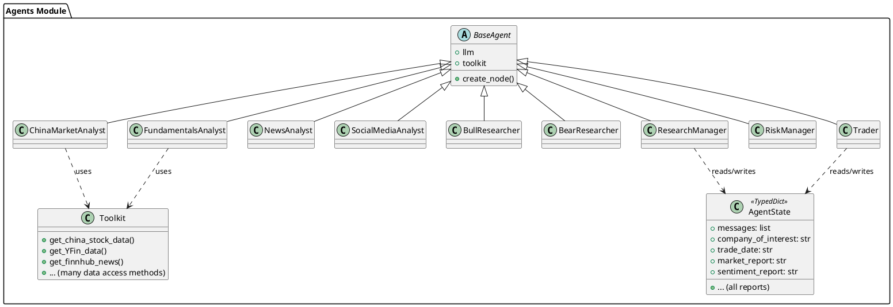
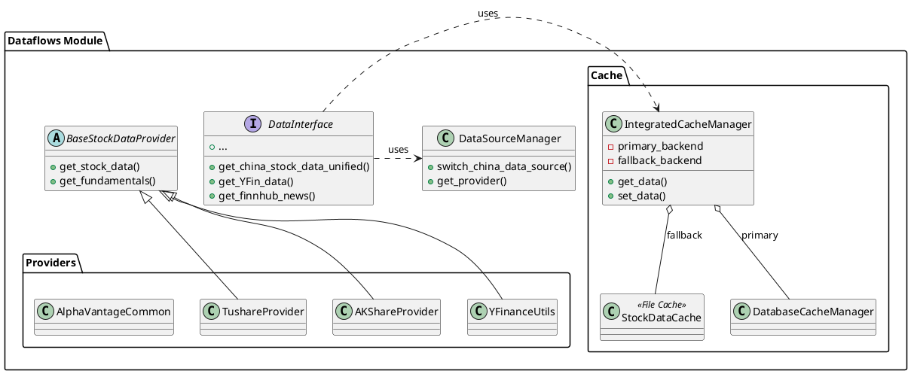
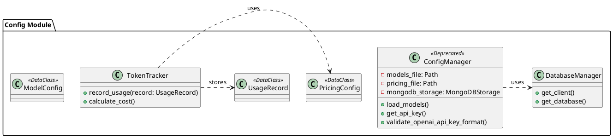
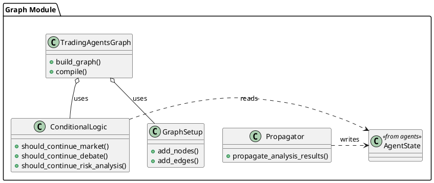
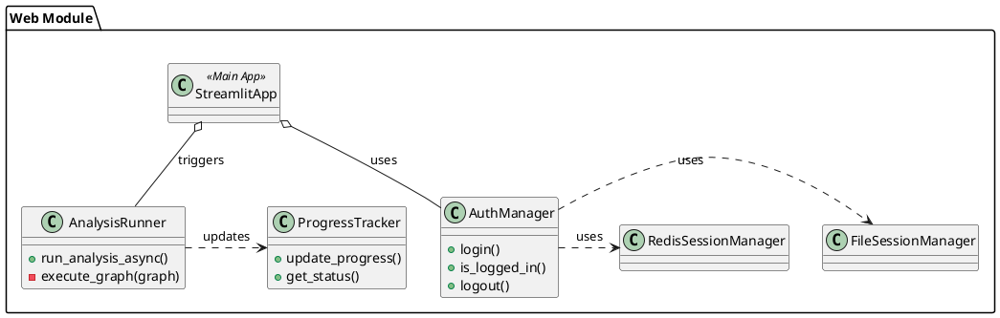

# TradingAgents-CN - In-Depth Source Code Analysis

## Phase 1: Global Scan & Planning

### 1.1. Full Directory Structure

```
The project, **TradingAgents-CN**, is a comprehensive, multi-agent LLM financial trading framework. Its structure is highly modular, separating the core business logic (agents, data, graph) from the infrastructure (config, docker) and the user interface (web, cli).

The root directory `/home/ubuntu/TradingAgents-CN` contains:
*   `tradingagents/`: The core Python package containing all the business logic. This is the heart of the application.
*   `web/`: A Streamlit-based web application for user interaction, visualization, and management.
*   `cli/`: Command-line interface tools for running the agents and managing the system.
*   `config/`: Contains configuration files and default settings.
*   `data/`: Storage for logs, cache, and other runtime data.
*   `docker/`: Docker-related files for containerization and deployment.
*   `tests/`: Unit and integration tests (excluded from analysis).
*   `docs/`: Documentation files.

The core logic resides within the `tradingagents` package, which is further subdivided into critical modules:
*   `tradingagents/agents`: Implements the various LLM-powered agents (Analyst, Researcher, Manager, Trader) and their associated state and utility classes.
*   `tradingagents/dataflows`: Manages all data acquisition, caching, and external data provider interfaces, abstracting away the complexity of financial data sources (Tushare, yfinance, etc.).
*   `tradingagents/config`: Centralized configuration management, including API keys, model pricing, and database connections.
*   `tradingagents/graph`: Implements the multi-agent orchestration logic, likely using a state machine or graph-based framework like LangGraph to manage the flow of analysis and debate.
*   `tradingagents/utils`: General utility functions, including logging, stock validation, and tool logging.

The separation of concerns is clearly enforced, with the `tradingagents` package providing the backend service, and `web` and `cli` acting as frontends.
```

### 1.2. Core Folders for Analysis

*   `/home/ubuntu/TradingAgents-CN/tradingagents/agents`: Core implementation of the multi-agent system, including analysts, researchers, managers, and the trader.
*   `/home/ubuntu/TradingAgents-CN/tradingagents/dataflows`: Data abstraction layer, handling external data providers, caching, and data completeness checks.
*   `/home/ubuntu/TradingAgents-CN/tradingagents/config`: Configuration management, model pricing, API key handling, and database connection setup.
*   `/home/ubuntu/TradingAgents-CN/tradingagents/graph`: Orchestration logic for the multi-agent workflow, defining the state machine and conditional transitions.
*   `/home/ubuntu/TradingAgents-CN/web`: The Streamlit-based web interface, including UI components, session management, and analysis runners.

## Phase 2: Module-by-Module Deep Analysis

## 1. tradingagents/agents (Multi-Agent System Core)

**Core Responsibility**: Implements the various LLM-powered agents that perform financial analysis, debate, risk management, and trading. It defines the roles and the communication structure for the multi-agent system.

**Key Files**:
*   `agents/__init__.py`: Exports all agent creation functions and utility classes.
*   `agents/analysts/`: Contains specialized analysts: `fundamentals_analyst.py`, `market_analyst.py`, `news_analyst.py`, `social_media_analyst.py`.
*   `agents/researchers/`: Implements the `bull_researcher.py` and `bear_researcher.py` for investment debate.
*   `agents/managers/`: Contains `research_manager.py` and `risk_manager.py` for high-level coordination.
*   `agents/trader/trader.py`: The final decision-making agent responsible for generating trading signals.
*   `agents/utils/agent_states.py`: Defines the core state structures (`AgentState`, `InvestDebateState`, `RiskDebateState`) used by the graph orchestrator.
*   `agents/utils/toolkit.py`: Defines the `Toolkit` class, which bundles all available data access functions for the agents to use.

**Core Implementation**:
The agents are implemented as functions (e.g., `create_china_market_analyst`) that return a node function for a graph-based workflow (likely LangGraph). Each agent function:
1.  Defines a highly specialized **system message** (prompt) tailored to its role (e.g., "专业的中国股市分析师").
2.  Selects a subset of **tools** from the global `Toolkit` relevant to its task.
3.  Constructs a LangChain `ChatPromptTemplate` using `MessagesPlaceholder` to maintain conversation history.
4.  The node function takes the `state` (an `AgentState` dictionary) as input, invokes the LLM with the prompt and tools, and updates the state with the result (e.g., `china_market_report`).

**Dependencies**:
*   **Internal**: Heavily depends on `tradingagents.dataflows.interface` for data access (via the `Toolkit`), `tradingagents.utils.logging_init` for logging, and `tradingagents.agents.utils.agent_states` for state management.
*   **External**: `langchain_core.prompts`, `langchain_core.messages`, and the underlying LLM library (e.g., `openai`, `dashscope`).

## 2. tradingagents/dataflows (Data Abstraction Layer)

**Core Responsibility**: Provides a unified, cached interface for accessing diverse financial data sources, including market data, news, and fundamentals, with a strong focus on Chinese market data.

**Key Files**:
*   `dataflows/interface.py`: Defines the public API for data access (e.g., `get_china_stock_data_unified`, `get_YFin_data`).
*   `dataflows/cache/`: Contains various caching implementations (`file_cache.py`, `db_cache.py`, `integrated.py`, `adaptive.py`). The `IntegratedCacheManager` provides a fallback mechanism (MongoDB/Redis -> File).
*   `dataflows/providers/china/`: Specific providers for the Chinese market (`tushare.py`, `akshare.py`, `baostock.py`).
*   `dataflows/providers/us/`: Providers for the US market (`yfinance.py`, `alpha_vantage_common.py`).
*   `dataflows/data_source_manager.py`: Manages the selection and configuration of different data providers.

**Core Implementation**:
The module employs the **Adapter Pattern** to standardize access to disparate data sources. The `interface.py` acts as the Facade, exposing simple functions that internally manage:
1.  **Caching**: All data retrieval functions first check the `IntegratedCacheManager`.
2.  **Provider Selection**: For Chinese data, it can switch between Tushare, AKShare, and BaoStock via `switch_china_data_source`.
3.  **Data Standardization**: Raw data from providers is converted into a standardized format (often a string or a Pandas DataFrame) before being returned.

**Dependencies**:
*   **Internal**: `tradingagents.config.database_manager` for database connection details, `tradingagents.utils.logging_manager`.
*   **External**: `pandas`, `yfinance`, `tushare`, `akshare`, `pymongo` (optional for DB cache).

## 3. tradingagents/config (Configuration and Settings)

**Core Responsibility**: Centralized management of application settings, API keys, LLM model configurations, and token usage tracking.

**Key Files**:
*   `config/config_manager.py`: The main class `ConfigManager` handles loading and saving configurations from JSON files or MongoDB. **Note**: This file is marked as `DEPRECATED`, suggesting a migration to a service-based approach.
*   `config/database_manager.py`: Manages the connection to the MongoDB database for persistent storage of configuration and usage data.
*   `config/usage_models.py`: Defines data classes (`ModelConfig`, `PricingConfig`, `UsageRecord`) for structured configuration data.
*   `config/providers_config.py`: Contains specific configuration logic for different LLM providers (e.g., DashScope, OpenAI).

**Core Implementation**:
The `ConfigManager` uses a **Fallback Strategy**: it attempts to load configuration from environment variables (`.env` file), then from local JSON files, and finally from a MongoDB instance if configured. It includes logic for:
1.  **API Key Validation**: Specifically for OpenAI keys (`validate_openai_api_key_format`).
2.  **Token Tracking**: The `TokenTracker` class records LLM usage based on `UsageRecord` objects, allowing for cost calculation using `PricingConfig`.

**Dependencies**:
*   **Internal**: `tradingagents.utils.logging_manager`.
*   **External**: `dotenv`, `pymongo` (optional), `dataclasses`.

## 4. tradingagents/graph (Agent Orchestration)

**Core Responsibility**: Defines the state machine and conditional logic that orchestrates the flow of analysis and decision-making among the various agents.

**Key Files**:
*   `graph/trading_graph.py`: The main class `TradingAgentsGraph` that constructs and compiles the workflow graph.
*   `graph/conditional_logic.py`: Contains the crucial conditional functions (e.g., `should_continue_market`, `should_continue_debate`) that determine the next node in the graph based on the current `AgentState`.
*   `graph/setup.py`: Handles the initialization and setup of the graph, including adding nodes and edges.
*   `graph/propagation.py`: Defines the `Propagator` class, which is responsible for passing the final analysis results to the `ResearchManager`.

**Core Implementation**:
The module uses the **State Machine Pattern** (likely implemented with LangGraph) to manage the complex multi-step process:
1.  **Analysis Phase**: Parallel execution of analysts (Market, News, Social, Fundamentals).
2.  **Debate Phase**: Sequential, turn-based interaction between `BullResearcher` and `BearResearcher` (controlled by `should_continue_debate`).
3.  **Management Phase**: `ResearchManager` synthesizes the debate and analysis reports.
4.  **Risk Phase**: `RiskManager` and debators (`RiskyDebator`, `SafeDebator`) discuss the final recommendation.
5.  **Trading Phase**: `Trader` makes the final decision.

The `ConditionalLogic` class is critical for preventing infinite loops in the LLM tool-calling process by checking tool call counts and report completeness.

**Dependencies**:
*   **Internal**: `tradingagents.agents.utils.agent_states`, all agent creation functions from `tradingagents.agents`.
*   **External**: `langgraph`.

## 5. web (Web Interface)

**Core Responsibility**: Provides a user-friendly Streamlit web interface for configuring the system, running analyses, and viewing results and logs.

**Key Files**:
*   `web/app.py`: The main entry point for the Streamlit application.
*   `web/run_web.py`: Script to launch the web application.
*   `web/components/`: Contains reusable Streamlit components (`analysis_form.py`, `analysis_results.py`, `sidebar.py`).
*   `web/utils/analysis_runner.py`: Handles the asynchronous execution of the `TradingAgentsGraph` workflow.
*   `web/utils/auth_manager.py`: Manages user authentication and session state.
*   `web/utils/progress_tracker.py`: Tracks the progress of the long-running analysis workflow and updates the UI.

**Core Implementation**:
The web interface is built on Streamlit, leveraging its reactive nature and component model. The `analysis_runner.py` is key, as it encapsulates the execution of the core business logic (`TradingAgentsGraph`) in a separate thread or process to prevent the UI from blocking. Session management and persistence are handled by classes like `FileSessionManager` and `RedisSessionManager` (in `web/utils/`).

**Dependencies**:
*   **Internal**: `tradingagents.config.config_manager`, `tradingagents.graph.trading_graph`.
*   **External**: `streamlit`, `redis` (optional).

### Module PlantUML Diagrams

## 1. tradingagents/agents



## 2. tradingagents/dataflows



## 3. tradingagents/config



## 4. tradingagents/graph



## 5. web



## Phase 3: Overall Architecture & Summary

### 3.1. Overall Architecture Analysis

#### 3.1.1. Core Abstractions

The **TradingAgents-CN** project is built upon a robust **Multi-Agent System (MAS) architecture**, leveraging the **LangGraph** framework for orchestration. The core design philosophy is centered on **Role-Based Specialization** and **Data Abstraction**, mirroring the structure of a professional financial research firm.

**Core Abstractions**:
1.  **Agent (Node)**: Each agent (e.g., `ChinaMarketAnalyst`, `BullResearcher`, `Trader`) is an independent, specialized component implemented as a LangGraph node. This enforces the **Single Responsibility Principle (SRP)**, making each agent's prompt and toolset highly focused.
2.  **State (`AgentState`)**: A central, mutable data structure (`TypedDict`) that holds the collective knowledge and progress of the entire workflow. It acts as the shared memory and communication channel between all agents. This is a critical abstraction for the state machine pattern.
3.  **Toolkit**: A collection of standardized data access functions that are passed to the agents. This abstraction decouples the agent's reasoning logic from the complexity of data retrieval and caching.
4.  **Data Provider/Interface**: The `dataflows` module abstracts external financial APIs (Tushare, yfinance) behind a unified interface, allowing the core system to be agnostic to the underlying data source.

**Design Philosophy**:
*   **Modularity and Decoupling**: The system is cleanly separated into five major modules (`agents`, `dataflows`, `config`, `graph`, `web`), minimizing cross-module dependencies and facilitating maintenance and scaling.
*   **State Machine Orchestration**: The use of LangGraph in the `graph` module provides a deterministic, traceable, and conditional execution flow, which is essential for complex, multi-step decision-making processes like financial analysis and debate.
*   **Chinese Market Focus**: The project is explicitly tailored for the Chinese market, with specialized agents (`ChinaMarketAnalyst`) and data providers (`TushareProvider`, `AKShareProvider`), which is a key differentiator from its original counterpart.
*   **Caching and Fallback**: The `IntegratedCacheManager` in `dataflows` ensures performance and resilience by providing multiple layers of caching (MongoDB/Redis, File) and a graceful fallback mechanism when primary data sources fail.

**Lifecycle Management**:
The lifecycle of a single analysis run is managed by the `TradingAgentsGraph`:
1.  **Initialization**: The `AgentState` is initialized with the target stock and date.
2.  **Parallel Analysis**: Multiple analysts run concurrently, fetching data via the `Toolkit` and writing their reports to the `AgentState`.
3.  **Sequential Debate**: The `BullResearcher` and `BearResearcher` engage in a turn-based debate, with the `ConditionalLogic` controlling the flow until a consensus or maximum rounds are reached.
4.  **Synthesis and Decision**: The `ResearchManager` and `RiskManager` synthesize the reports and debate outcomes, leading to the final trading decision by the `Trader`.
5.  **Termination**: The graph terminates, and the final decision is propagated to the `web` module for display.

#### 3.1.2. Component Interactions

The system's communication is primarily mediated by the central **AgentState** object, following a **Shared State/Blackboard Pattern**.

**Key Interaction Flows**:

1.  **Agent-to-Data Interaction (Data Flow)**:
    *   **Agent**: An agent (e.g., `FundamentalsAnalyst`) needs data.
    *   **Communication**: The agent calls a function from the injected `Toolkit` (e.g., `toolkit.get_china_stock_data`).
    *   **Data Flow**: `Toolkit` -> `dataflows.interface` -> `IntegratedCacheManager` (Cache Check) -> `DataSourceManager` (Provider Selection) -> External API (e.g., Tushare).
    *   **Response**: The data is returned to the agent, which then uses it to generate its report.

2.  **Agent-to-Agent Interaction (Orchestration Flow)**:
    *   **Communication**: Agents communicate indirectly by reading from and writing to the shared `AgentState`.
    *   **Example (Debate)**:
        *   `BullResearcher` reads the initial `AgentState` and writes its bullish argument to the state's message history.
        *   The `ConditionalLogic` checks the state and routes the flow to the `BearResearcher`.
        *   `BearResearcher` reads the state (including the bullish argument) and writes its bearish counter-argument.
        *   This loop continues until the `ConditionalLogic` determines the debate is complete, then routes to the `ResearchManager`.

3.  **Frontend-to-Backend Interaction**:
    *   **Frontend (`web` module)**: The user submits a request via the Streamlit UI.
    *   **Communication**: The `AnalysisRunner` in the `web` module asynchronously executes the `TradingAgentsGraph`.
    *   **Data Flow**: The `ProgressTracker` (in `web/utils`) monitors the graph's execution state and updates the UI in real-time, providing feedback to the user.

**Communication Patterns**:
*   **Shared State (Blackboard)**: The primary pattern for agent-to-agent communication, enabling asynchronous and decoupled interactions.
*   **Facade/Adapter**: Used in the `dataflows` module to simplify and standardize access to complex external data sources.
*   **Tool-Use/Function Calling**: The LLM agents use the `Toolkit` functions via the LLM's function-calling capability, allowing the model to decide when and how to retrieve data.

### 3.2. Overall Architecture PlantUML Diagram

```plantuml
@startuml
@startuml
skinparam handwritten true
skinparam classAttributeIconVisible false

title TradingAgents-CN Overall Architecture

rectangle "External Financial APIs" as APIs

package "tradingagents" {
    package "Dataflows (Data Abstraction)" as Dataflows {
        interface DataInterface
        class IntegratedCacheManager
        class DataSourceManager
        DataInterface .> IntegratedCacheManager
        DataInterface .> DataSourceManager
    }

    package "Config (Settings & Pricing)" as Config {
        class ConfigManager
        class TokenTracker
    }

    package "Agents (LLM Nodes)" as Agents {
        class Toolkit
        class Analysts
        class Researchers
        class Managers
        class Trader
        Toolkit .> Dataflows : uses
    }

    package "Graph (Orchestration)" as Graph {
        class TradingAgentsGraph
        class ConditionalLogic
        class AgentState <<Shared State>>
        TradingAgentsGraph o-- ConditionalLogic
        TradingAgentsGraph o-- AgentState
        Analysts -> AgentState : writes report
        Researchers -> AgentState : writes debate
        Managers -> AgentState : reads/writes
        Trader -> AgentState : reads/writes
    }

    Dataflows .> APIs : fetches data
    Agents .> Toolkit : calls tools
    Agents .> Config : reads LLM settings
    Graph .> Agents : orchestrates
}

package "Web (Streamlit Frontend)" as Web {
    class StreamlitApp
    class AnalysisRunner
    StreamlitApp -> AnalysisRunner : triggers
    AnalysisRunner -> Graph : executes
}

Web .> Graph : monitors progress
Config .> APIs : stores API keys
@enduml
@enduml
```

### 3.3. Design Patterns & Highlights

#### 3.3.1. Design Patterns

The codebase effectively utilizes several established design patterns to manage complexity and promote maintainability.

| Design Pattern | Description | Specific Implementation in TradingAgents-CN |
| :--- | :--- | :--- |
| **State Machine** | An object whose behavior is determined by its state, transitioning between states based on inputs. | Implemented using **LangGraph** in `tradingagents/graph`. The `TradingAgentsGraph` defines the nodes (agents) and edges (transitions), with `ConditionalLogic` handling the state-based routing (e.g., continuing a debate or moving to the next phase). |
| **Adapter** | Converts the interface of a class into another interface clients expect. | The `dataflows` module uses this pattern extensively. `TushareProvider`, `AKShareProvider`, and `YFinanceUtils` all adapt their respective external APIs to conform to the internal `BaseStockDataProvider` interface. |
| **Facade** | Provides a unified interface to a set of interfaces in a subsystem. | `dataflows/interface.py` acts as a facade, providing simple, high-level functions (e.g., `get_china_stock_data_unified`) that hide the complexity of caching, provider selection, and API calls. |
| **Strategy** | Defines a family of algorithms, encapsulates each one, and makes them interchangeable. | The caching system in `dataflows/cache` implements this. The `IntegratedCacheManager` can switch between `FileCache`, `DatabaseCacheManager`, and `AdaptiveCacheSystem` based on configuration (`TA_CACHE_STRATEGY`). |
| **Singleton** | Ensures a class has only one instance and provides a global point of access to it. | Implicitly used for core managers like `ConfigManager` and `DataSourceManager`, which are often initialized once and accessed globally via helper functions (e.g., `get_data_source_manager()`). |

#### 3.3.2. Project Highlights

The project demonstrates several innovative and well-designed features that enhance its functionality, extensibility, and flexibility.

*   **Advanced Multi-Agent Orchestration**: The use of LangGraph for a complex financial workflow is a significant highlight. The system goes beyond simple sequential processing by incorporating **parallel analysis**, **turn-based debate** (`BullResearcher` vs. `BearResearcher`), and **conditional routing** based on the state. This sophisticated orchestration allows for more nuanced and robust decision-making.
*   **Comprehensive Data Abstraction and Resilience**: The `dataflows` module is exceptionally well-structured.
    *   **Unified Interface**: Standardizes access across diverse data sources (China, US, HK).
    *   **Integrated Caching**: The multi-layered caching system (`IntegratedCacheManager`) with file and database fallbacks ensures high performance and resilience against temporary API outages.
    *   **Chinese Market Specialization**: The inclusion of multiple Chinese data providers (Tushare, AKShare, BaoStock) and the ability to switch between them is crucial for a China-focused application.
*   **Extensible LLM Provider Support**: The `llm_adapters` module is designed for easy integration of new LLMs (DashScope, DeepSeek, Google, OpenAI). The use of a base compatible class (`openai_compatible_base.py`) ensures that new providers can be added with minimal changes to the core agent logic.
*   **Detailed Configuration and Cost Tracking**: The `config` module's ability to track token usage and calculate costs based on model-specific pricing (`PricingConfig`) is a valuable feature for managing the operational expenses of an LLM-intensive application.
*   **User-Friendly Web Interface**: The Streamlit-based `web` module provides a clean, interactive front-end for running analyses, which is essential for usability. The `AnalysisRunner` and `ProgressTracker` effectively handle the long-running nature of the agent workflow, providing a good user experience.

### 3.4. Summary & Recommendations

#### 3.4.1. Potential Improvements

The architecture is robust, but several areas can be optimized for performance, maintainability, and future-proofing.

## Performance Bottlenecks and Optimization
1.  **Graph Execution Time**: The sequential nature of the debate phase (`BullResearcher` vs. `BearResearcher`) and the risk discussion phase is a major time sink, as each turn requires a full LLM call.
    *   **Suggestion**: Implement a **"Fast-Track" Conditional Logic** where the debate is skipped or shortened if the initial analysis reports (Market, Fundamentals, News) are highly consistent or if the stock is deemed low-risk early on.
2.  **Deprecated Config Manager**: The `ConfigManager` is marked as deprecated, but its usage persists. This creates technical debt and potential for configuration conflicts (JSON vs. MongoDB).
    *   **Suggestion**: Complete the migration to the new service-based configuration system (`app.services.config_service.ConfigService`) and fully remove the deprecated `tradingagents/config` module to simplify the configuration loading process and centralize state management.
3.  **Data Serialization Overhead**: The `AgentState` is a large, shared object that is passed between all nodes. If the underlying LangGraph implementation serializes and deserializes this state for each transition, the overhead can become significant, especially with large reports.
    *   **Suggestion**: Investigate using a more efficient, in-memory state management solution (e.g., Redis) for the `AgentState` during a single graph run, or use LangGraph's built-in memory management features to optimize state persistence.

## Architecture Optimization and Code Quality
1.  **Toolkit Decoupling**: The `Toolkit` class is a monolithic collection of all data access functions. While convenient, it violates the **Interface Segregation Principle (ISP)**, as every agent receives a massive toolkit, most of which it does not need.
    *   **Suggestion**: Refactor the `Toolkit` into smaller, role-specific interfaces (e.g., `MarketDataToolkit`, `NewsDataToolkit`, `FundamentalsToolkit`). Each agent should only be injected with the specific toolkit it requires.
2.  **Explicit Data Models**: The system heavily relies on passing strings and dictionaries (e.g., reports, dataframes serialized as strings) within the `AgentState`. This is error-prone and lacks type safety.
    *   **Suggestion**: Introduce explicit Pydantic models for all data structures passed between agents (e.g., `MarketReportModel`, `DebateSummaryModel`). This will improve code quality, enable better validation, and simplify the logic in the `ResearchManager` and `RiskManager`.
3.  **Unified Logging**: While a unified logging system exists, the conditional logic functions in `graph/conditional_logic.py` are heavily polluted with detailed logging for debugging deadlocks.
    *   **Suggestion**: Abstract the deadlock detection and logging into a dedicated `GraphMonitor` or `DebugMiddleware` class, keeping the `ConditionalLogic` clean and focused solely on the transition logic.

#### 3.4.2. Secondary Development Guide

This guide outlines the best path for developers looking to explore the codebase or extend its functionality.

## 1. Code Exploration Path
The project's complexity is best understood by following the execution flow from the entry point to the core logic.

| Step | Module to Explore | Key Files | Focus |
| :--- | :--- | :--- | :--- |
| **1. Entry Point** | `web` or `cli` | `web/app.py`, `cli/main.py` | Understand how the application starts and how user input is collected. |
| **2. Orchestration** | `graph` | `graph/trading_graph.py`, `graph/conditional_logic.py` | This is the **most critical** module. Trace the `TradingAgentsGraph` definition to see the sequence of analysis, debate, and decision-making. |
| **3. Agent Logic** | `agents` | `agents/analysts/`, `agents/researchers/` | Select an agent (e.g., `fundamentals_analyst.py`) to see how the system prompt is constructed, which tools are used, and how the report is generated. |
| **4. Data Access** | `dataflows` | `dataflows/interface.py`, `dataflows/cache/integrated.py` | Examine the `Toolkit` and trace a data call (e.g., `get_china_stock_data_unified`) to understand the caching and provider abstraction layers. |
| **5. Configuration** | `config` | `config/config_manager.py`, `config/usage_models.py` | Understand how API keys and model pricing are loaded and managed. |

## 2. Extending Functionality

### A. Adding a New Agent Role
1.  **Create Agent File**: Create a new file in `tradingagents/agents/` (e.g., `macro_analyst.py`).
2.  **Define Logic**: Implement a function (e.g., `create_macro_analyst`) that defines the system prompt, selects necessary tools from the `Toolkit`, and returns a LangGraph node function.
3.  **Update Graph**: Modify `tradingagents/graph/trading_graph.py` to add the new agent as a node and define its edges (e.g., run it in parallel with other analysts).
4.  **Update State**: If the new agent generates a new type of report, update the `AgentState` in `tradingagents/agents/utils/agent_states.py` to include a field for the new report.

### B. Integrating a New Data Source
1.  **Create Provider**: Create a new file in `tradingagents/dataflows/providers/` (e.g., `europe/eurostat_provider.py`) that inherits from `BaseStockDataProvider` and implements the required data retrieval methods.
2.  **Update Manager**: Modify `dataflows/data_source_manager.py` to register the new provider.
3.  **Update Interface**: Add a new function to `dataflows/interface.py` to expose the new data source via the unified interface.
4.  **Update Toolkit**: Add the new interface function to the `Toolkit` class in `tradingagents/agents/utils/toolkit.py` so agents can access it.

### C. Modifying the Workflow
To change the decision-making process (e.g., adding a pre-screening step), modify the `TradingAgentsGraph` in `tradingagents/graph/trading_graph.py` and adjust the transition logic in `tradingagents/graph/conditional_logic.py`. This is the central control point for the entire system.

