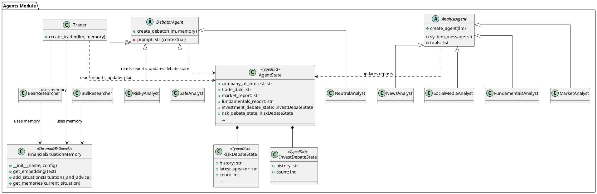
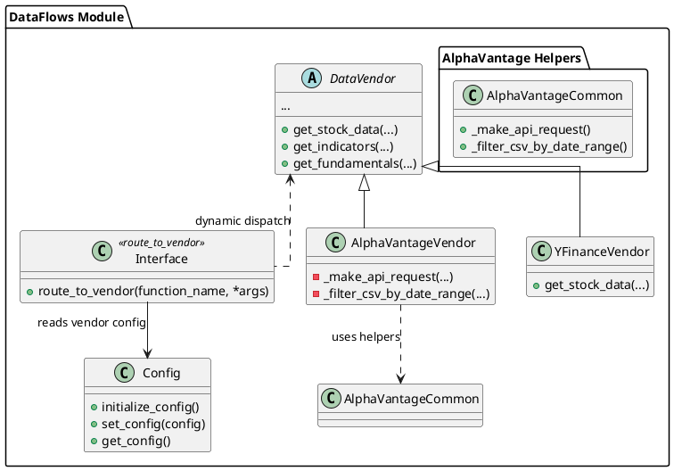

# TradingAgents - In-Depth Source Code Analysis

## Phase 1: Global Scan & Planning

### 1.1. Full Directory Structure

```
The project is structured to support a multi-agent system for financial trading, built primarily on Python and the LangGraph framework. The core logic is cleanly separated into three main components: `agents`, `dataflows`, and `graph`, reflecting a clear separation of concerns between the cognitive layer, the data access layer, and the orchestration layer.

```
/home/ubuntu/TradingAgents
|-- cli/
|   |-- main.py             # Command-line interface entry point for running the agent system.
|   |-- models.py           # Data models for CLI arguments (e.g., Pydantic models).
|   |-- utils.py            # Utility functions for the CLI.
|-- main.py                 # Main entry point for the core application logic (likely for non-CLI use).
|-- tradingagents/          # Core package for the multi-agent framework
|   |-- agents/             # The "Brain" - Defines all LLM-powered agents and their logic.
|   |   |-- analysts/       # Specialized agents for data analysis (Market, News, Fundamentals).
|   |   |-- managers/       # Agents responsible for managing the debate flow (Research, Risk).
|   |   |-- researchers/    # Agents for the investment debate (Bull, Bear).
|   |   |-- risk_mgmt/      # Agents for the risk debate (Risky, Safe, Neutral).
|   |   |-- trader/         # The final decision-making agent.
|   |   |-- utils/          # Agent-specific utilities, state definitions, and memory (ChromaDB).
|   |-- dataflows/          # The "Data Layer" - Handles all external API interactions and data fetching.
|   |   |-- alpha_vantage/  # Specific implementations for Alpha Vantage data access.
|   |   |-- y_finance.py    # Implementation for Yahoo Finance data access.
|   |   |-- interface.py    # Core abstraction layer for routing data requests to vendors.
|   |   |-- config.py       # Configuration management for data vendors.
|   |-- graph/              # The "Orchestration Layer" - Implements the multi-agent workflow using LangGraph.
|   |   |-- conditional_logic.py # Defines state-based routing logic for the graph.
|   |   |-- propagation.py  # Handles state initialization and passing data between nodes.
|   |   |-- reflection.py   # Logic for post-trade reflection and memory update.
|   |   |-- trading_graph.py# Main class to build and run the LangGraph state machine.
|   |-- default_config.py   # Default settings for the entire framework.
```

The `tradingagents` directory is the heart of the project, containing the three main modules: `agents` (the cognitive layer), `dataflows` (the data layer), and `graph` (the orchestration layer). The `cli` directory provides a command-line interface for interacting with the core framework. This structure is highly modular, facilitating maintenance and extension.
```

### 1.2. Core Folders for Analysis

*   `/home/ubuntu/TradingAgents/tradingagents/agents`: Contains the implementation of all specialized LLM agents, including analysts, researchers, risk debators, and the final trader. This module is responsible for the decision-making logic and memory management.
*   `/home/ubuntu/TradingAgents/tradingagents/dataflows`: Contains the data abstraction layer, which handles fetching financial and news data from various external vendors (e.g., Alpha Vantage, Yahoo Finance). It provides a unified toolset for the agents.
*   `/home/ubuntu/TradingAgents/tradingagents/graph`: Contains the LangGraph-based orchestration logic, defining the state machine, conditional transitions, and the overall flow of the multi-agent system.

## Phase 2: Module-by-Module Deep Analysis

### Module: `tradingagents/agents`
**Core Responsibility:** To implement the specialized roles of the multi-agent system, process reports, engage in structured debates, and make final trading decisions. It acts as the **cognitive layer** of the framework.

**File Enumeration:**
*   `agents/utils/agent_states.py`: Defines `AgentState` (the global state), `InvestDebateState`, and `RiskDebateState` using `TypedDict` for LangGraph.
*   `agents/utils/memory.py`: Implements `FinancialSituationMemory` using `chromadb` for vector-based retrieval of past trading lessons.
*   `agents/analysts/*`: Implements four key analysts (`fundamentals`, `market`, `news`, `social_media`) using LangChain's `ChatPromptTemplate` and tool-binding to generate comprehensive reports.
*   `agents/researchers/*`: Implements the `bull_researcher` and `bear_researcher` for the investment debate.
*   `agents/risk_mgmt/*`: Implements the three risk debators (`aggresive_debator`, `conservative_debator`, `neutral_debator`).
*   `agents/trader/trader.py`: Implements the final `trader_node` which uses the accumulated reports and memory to output a `FINAL TRANSACTION PROPOSAL: **BUY/HOLD/SELL**`.

**Implementation Details:**
Each agent is implemented as a function (e.g., `create_fundamentals_analyst(llm)`) that returns a LangGraph node function. This node function takes the current `state` as input, uses an LLM with a highly specialized system prompt and bound tools, and returns an updated `state` dictionary. The use of `FinancialSituationMemory` is a key feature, allowing agents to learn from past, similar market situations via a Retrieval-Augmented Generation (RAG) approach. The agents' system prompts are highly detailed, guiding the LLM to act in a specific role (e.g., "You are a Bull Analyst advocating for investing in the stock") and to use the provided data reports to build their arguments.

### Module: `tradingagents/dataflows`
**Core Responsibility:** To abstract and manage all external data sources, providing a consistent, tool-friendly interface for the agents. It is the **data access layer**.

**File Enumeration:**
*   `dataflows/interface.py`: Contains the crucial `route_to_vendor` function, which dynamically selects the correct data fetching function based on the configured vendor for a given data type (e.g., `core_stock_apis`, `fundamental_data`).
*   `dataflows/config.py`: Manages the runtime configuration, allowing users to switch data vendors without changing agent code.
*   `dataflows/alpha_vantage_common.py`: Provides low-level utilities like `_make_api_request` and error handling (`AlphaVantageRateLimitError`).
*   `dataflows/alpha_vantage_*.py`: Specific implementations for fetching stock, indicator, fundamental, and news data from Alpha Vantage.

**Implementation Details:**
The module employs a **Strategy Pattern** via the `route_to_vendor` function. This decouples the data request from the data source implementation. For example, `get_stock_data` in `agents/utils/core_stock_tools.py` calls `route_to_vendor("get_stock_data", ...)` which then routes the call to the appropriate vendor-specific function (e.g., `alpha_vantage_stock.get_stock`). This design ensures the agent logic remains clean and vendor-agnostic. The Alpha Vantage implementations handle API key retrieval, request formatting, and response parsing (including CSV filtering via Pandas).

### Module: `tradingagents/graph`
**Core Responsibility:** To define the sequential and conditional workflow of the multi-agent system, ensuring a structured, multi-step decision-making process. It is the **orchestration layer**.

**File Enumeration:**
*   `graph/trading_graph.py`: The main class `TradingAgentsGraph` that builds the LangGraph `StateGraph`.
*   `graph/conditional_logic.py`: Implements the conditional routing functions (e.g., `should_continue_debate`, `should_continue_risk_analysis`) that determine the next node in the graph based on the current state (e.g., number of debate rounds completed, presence of tool calls).
*   `graph/propagation.py`: Contains `Propagator` class for state initialization (`create_initial_state`) and managing graph arguments.
*   `graph/reflection.py`: Contains `Reflector` class for post-trade analysis, generating reflections using an LLM, and updating the `FinancialSituationMemory`.

**Implementation Details:**
The system uses a **State Machine** architecture implemented with LangGraph. The flow is highly structured: it begins with a research phase (tool-call loops), moves to a two-party investment debate (Bull/Bear), then to a Trader decision, followed by a three-party risk debate (Risky/Safe/Neutral), and concludes with a final decision and a reflection phase to update the memory. The `ConditionalLogic` is critical, using counters (`count`) and the last speaker (`latest_speaker`) to manage the turn-based, fixed-round debates.

### Module PlantUML Diagrams

### Module: `tradingagents/agents`



### Module: `tradingagents/dataflows`



### Module: `tradingagents/graph`



```plantuml
@startuml
skinparam linetype polyline
skinparam linetype ortho

package "Graph Module" {
    
    class TradingAgentsGraph {
        + __init__(llm, memory, ...)
        + build_graph()
        + run_graph(company, date)
        --
        - graph: StateGraph
    }
    
    class ConditionalLogic {
        + should_continue_market(state)
        + should_continue_debate(state)
        + should_continue_risk_analysis(state)
    }
    
    class Propagator {
        + create_initial_state(company, date)
    }
    
    class Reflector {
        + __init__(quick_thinking_llm)
        + reflect_bull_researcher(...)
        + reflect_trader(...)
        + _get_reflection_prompt()
    }
    
    TradingAgentsGraph *-- ConditionalLogic : uses for edges
    TradingAgentsGraph *-- Propagator : uses for setup
    TradingAgentsGraph *-- Reflector : uses for final node
    
    Reflector ..> FinancialSituationMemory : updates memory
    
    note right of TradingAgentsGraph
        Built using LangGraph
        Nodes: Analysts, Debators, Trader, Managers, Tools
        Edges: ConditionalLogic
    end note
}
@enduml
```,project_highlights:

## Phase 3: Overall Architecture & Summary

### 3.1. Overall Architecture Analysis

#### 3.1.1. Core Abstractions

The **TradingAgents** framework is built upon three core abstractions that define its architecture: **Specialized Agents**, **State Machine Orchestration**, and **Vendor-Agnostic Data Access**.

1.  **Specialized Agents (Cognitive Layer):**
    *   **Abstraction:** Each component of a traditional trading firm (analyst, researcher, risk manager, trader) is abstracted into a dedicated, LLM-powered agent.
    *   **Design Philosophy:** The system adopts a **Role-Based Multi-Agent System** philosophy, where complex tasks are broken down into sub-tasks handled by experts. This mimics real-world organizational structure, leading to more robust and less hallucinated outputs.
    *   **Implementation:** Agents are implemented as LangGraph nodes, each with a highly specific system prompt and a limited set of bound tools. For example, the `MarketAnalyst` is only given tools for technical indicators and stock data, ensuring focus.

2.  **State Machine Orchestration (Graph Layer):**
    *   **Abstraction:** The entire trading decision process is abstracted as a **Finite State Machine (FSM)** using the LangGraph library.
    *   **Design Philosophy:** This ensures a structured, non-linear, and auditable workflow. The process is divided into distinct phases: **Research**, **Investment Debate**, **Trader Decision**, and **Risk Debate**. Conditional logic dictates the flow, allowing for dynamic looping (e.g., continuing a debate until a round limit is reached) and tool-call resolution.
    *   **Lifecycle Management:** The `AgentState` (`tradingagents/agents/utils/agent_states.py`) acts as the single source of truth, managing the entire lifecycle of a trading session. All information (reports, debate history, final decision) is propagated through this state object.

3.  **Vendor-Agnostic Data Access (Data Layer):**
    *   **Abstraction:** All external data fetching is abstracted behind a unified `route_to_vendor` interface.
    *   **Design Philosophy:** This implements the **Strategy Pattern**, making the framework flexible and resilient to changes in data providers. Agents request data using generic tool names (e.g., `get_stock_data`), and the `dataflows` module handles the routing to the currently configured vendor (e.g., Alpha Vantage or YFinance). This promotes **loose coupling** between the cognitive and data layers.

#### 3.1.2. Component Interactions



### 3.2. Overall Architecture PlantUML Diagram

```plantuml
@startuml
```plantuml
@startuml
skinparam linetype polyline
skinparam linetype ortho

package "TradingAgents Framework" {
    
    package "1. Orchestration Layer (graph)" as Graph {
        class TradingAgentsGraph
        class ConditionalLogic
        class Propagator
        class Reflector
    }

    package "2. Cognitive Layer (agents)" as Agents {
        class AgentState <<TypedDict>>
        class FinancialSituationMemory <<ChromaDB/OpenAI>>
        
        package "Analysts" {
            class MarketAnalyst
            class NewsAnalyst
            class FundamentalsAnalyst
            class SocialMediaAnalyst
        }
        
        package "Debators" {
            class BullResearcher
            class BearResearcher
            class RiskyAnalyst
            class SafeAnalyst
            class NeutralAnalyst
        }
        
        class Trader
        
        package "Tools" {
            class DataTools <<LangChain Tool>>
        }
    }

    package "3. Data Layer (dataflows)" as DataFlows {
        class Interface <<route_to_vendor>>
        class Config
        package "Vendors" {
            class AlphaVantage
            class YFinance
        }
    }
    
    ' Relationships
    
    ' Graph to Agents/State
    TradingAgentsGraph --> AgentState : manages state
    TradingAgentsGraph --> ConditionalLogic : uses for routing
    TradingAgentsGraph --> Propagator : initializes state
    TradingAgentsGraph --> Reflector : updates memory
    
    ' Agents to DataFlows/Tools
    MarketAnalyst ..> DataTools : uses
    FundamentalsAnalyst ..> DataTools : uses
    DataTools --> Interface : routes request
    
    ' Memory
    Reflector --> FinancialSituationMemory : updates
    Trader ..> FinancialSituationMemory : retrieves lessons
    BullResearcher ..> FinancialSituationMemory : retrieves lessons
    BearResearcher ..> FinancialSituationMemory : retrieves lessons
    
    ' DataFlows
    Interface --> AlphaVantage : calls vendor
    Interface --> YFinance : calls vendor
    
    ' Agent Flow (Simplified)
    Analysts --> Debators : generate reports
    Debators --> Trader : generate investment plan
    Trader --> Debators : generates initial decision
    Debators --> Graph : final decision
}

@enduml
```,component_interactions:
@enduml
```

### 3.3. Design Patterns & Highlights

#### 3.3.1. Design Patterns

The codebase effectively utilizes several software design patterns to manage complexity and promote flexibility.

| Pattern | Description | Implementation in TradingAgents |
| :--- | :--- | :--- |
| **Strategy Pattern** | Defines a family of algorithms, encapsulates each one, and makes them interchangeable. | Implemented in the `dataflows` module. The `route_to_vendor` function in `interface.py` acts as the context, dynamically selecting a concrete strategy (e.g., `AlphaVantageVendor` or `YFinanceVendor`) based on the configuration to fulfill a data request (e.g., `get_stock_data`). |
| **State Machine Pattern** | An object whose behavior is determined by its internal state, and which transitions between states based on input. | Implemented using the **LangGraph** library in the `graph` module. The `AgentState` is the state object, and the `ConditionalLogic` class defines the transition rules (edges) between the agent nodes (states). This ensures a structured, multi-step decision-making process. |
| **Chain of Responsibility Pattern** | Passes a request along a chain of handlers. Each handler decides either to process the request or pass it to the next handler in the chain. | Implicitly used in the **Research Phase** of the graph. The request for information flows through a sequence of analyst agents (Market -> News -> Fundamentals), where each agent adds its specialized report to the shared `AgentState` before passing the state to the next. |
| **Observer Pattern** | An object (subject) maintains a list of its dependents (observers) and notifies them automatically of any state changes. | Used in the **Debate Phases**. The shared `AgentState` acts as the subject. When one debator (e.g., `BullResearcher`) updates the state with a new argument, the next debator (e.g., `BearResearcher`) is notified (triggered by the graph edge) and reacts to the new state. |
| **Retrieval-Augmented Generation (RAG)** | Augments an LLM with an external knowledge base to improve the quality of generated responses. | Implemented via the `FinancialSituationMemory` class in `agents/utils/memory.py`. This class uses ChromaDB and OpenAI embeddings to store and retrieve past trading situations and their outcomes, allowing the Trader and Researchers to "learn from experience." |

#### 3.3.2. Project Highlights


### 3.4. Summary & Recommendations

#### 3.4.1. Potential Improvements

Based on the analysis, the following areas present opportunities for performance, architecture, and code quality improvements:

*   **Performance Bottleneck: Synchronous Data Fetching:** The current data fetching model appears to be synchronous, as each analyst node must complete its tool calls before the next node can execute. For a multi-agent system, converting the data fetching in the `dataflows` module to use **asynchronous I/O (asyncio)** would allow multiple data requests (e.g., fetching news, fundamentals, and technical data) to run concurrently, drastically reducing the overall research phase time.
*   **Architecture Optimization: Centralized Tool Definition:** The LangChain tools are currently defined in `agents/utils/*_tools.py` and act as wrappers around `dataflows.interface.route_to_vendor`. While functional, a cleaner separation would be to define the tools directly within the `dataflows` module, making the `dataflows` module a self-contained, tool-exposing service. This would simplify the `agents` module and reinforce the data layer's role.
*   **Code Quality: Configuration Management:** The configuration logic in `dataflows/config.py` uses global variables (`_config`, `DATA_DIR`), which can lead to hard-to-track side effects. A better practice would be to use a dedicated configuration object (e.g., a Singleton or a Pydantic settings class) that is explicitly passed to the `TradingAgentsGraph` constructor and then injected into the necessary components (like `FinancialSituationMemory` and `Interface`).
*   **Robustness: Vendor Fallback Mechanism:** The `dataflows` module currently routes to a single configured vendor. Implementing a **Decorator Pattern** or an explicit fallback mechanism within `route_to_vendor` would enhance robustness. If the primary vendor (e.g., Alpha Vantage) fails due to a rate limit or API error, the system could automatically attempt the request with a secondary vendor (e.g., YFinance) before failing the agent task.

#### 3.4.2. Secondary Development Guide

For a developer looking to extend or modify the TradingAgents framework, the following steps provide the best path for code exploration and secondary development:

1.  **Understand the State:** Start by reviewing `tradingagents/agents/utils/agent_states.py`. The `AgentState` class is the central data structure. Understanding what data is available and how it is structured is crucial for modifying any agent or graph node.
2.  **Trace the Workflow:** Examine `tradingagents/graph/trading_graph.py` to understand the sequence of operations. The `build_graph` method clearly defines the nodes (agents) and the edges (transitions). This is the primary file for modifying the overall decision-making flow.
3.  **Modify Agent Behavior (Prompts):** To change an agent's reasoning or output format, modify the system prompt within the agent's definition (e.g., in `tradingagents/agents/analysts/market_analyst.py`). Ensure the new prompt still guides the LLM to use its bound tools correctly.
4.  **Add New Data Sources (DataFlows):** To integrate a new data API:
    *   Create a new file in `tradingagents/dataflows` (e.g., `my_new_vendor.py`) with functions that match the required signatures (e.g., `get_stock_data`).
    *   Update the configuration in `tradingagents/default_config.py` to include the new vendor as an option.
    *   The existing agent tools will automatically route requests to the new vendor if it is selected in the configuration, thanks to the Strategy Pattern in `dataflows/interface.py`.
5.  **Extend Learning (Memory):** To enhance the system's memory, examine `tradingagents/graph/reflection.py` and `tradingagents/agents/utils/memory.py`. The `Reflector` is where the "lessons" are generated. Modifying the `reflection_system_prompt` can change the quality and focus of the stored memories, directly impacting future agent decisions.
6.  **Extend Debate Logic:** To add a new debator or change the debate rules, modify the agent creation functions in `tradingagents/agents/researchers` or `tradingagents/agents/risk_mgmt`, and update the conditional logic in `tradingagents/graph/conditional_logic.py` to include the new agent in the turn-based flow.

