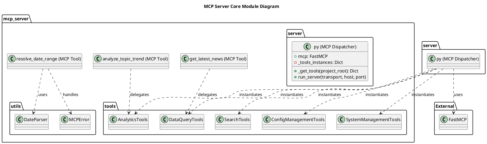
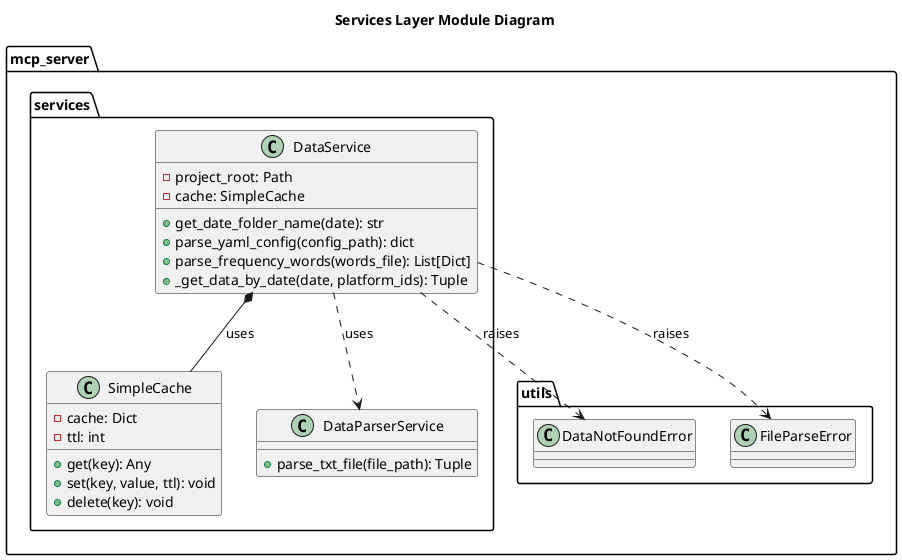
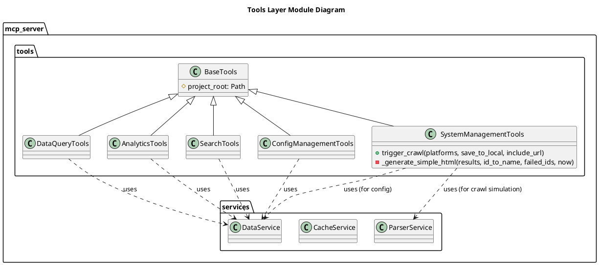
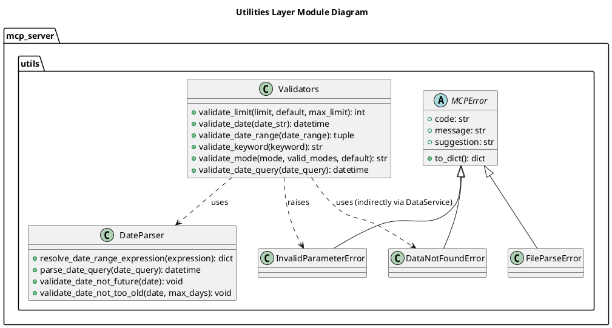
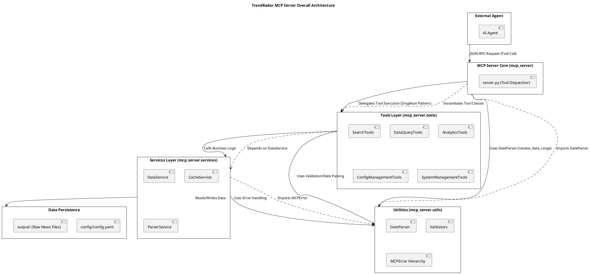

# TrendRadar - In-Depth Source Code Analysis

## Phase 1: Global Scan & Planning

### 1.1. Full Directory Structure

```
```
/
├── config/                     # Application configuration files (config.yaml, frequency_words.txt)
├── docker/                     # Docker and containerization setup (Dockerfile, docker-compose.yml, manage.py)
├── main.py                     # Main application entry point
├── mcp_server/                 # Core package for the Model Context Protocol (MCP) server
│   ├── server.py               # FastAPI server definition and API endpoints
│   ├── services/               # Service layer for business logic
│   │   ├── cache_service.py    # Caching mechanisms
│   │   ├── data_service.py     # Data access and persistence
│   │   └── parser_service.py   # News data parsing and processing
│   ├── tools/                  # Callable tools exposed to the MCP Agent
│   │   ├── analytics.py        # Data analysis and reporting tools
│   │   ├── config_mgmt.py      # Configuration management tools
│   │   ├── data_query.py       # Data querying tools
│   │   ├── search_tools.py     # Search functionality tools
│   │   └── system.py           # System interaction tools
│   └── utils/                  # General utility functions
│       ├── date_parser.py      # Date and time parsing helpers
│       ├── errors.py           # Custom exception definitions
│       └── validators.py       # Data validation logic
├── output/                     # Storage for processed data and logs
└── requirements.txt            # Python dependency list
```
```

### 1.2. Core Folders for Analysis

- `/home/ubuntu/TrendRadar/mcp_server` (MCP Server Core)
- `/home/ubuntu/TrendRadar/mcp_server/services` (Services Layer)
- `/home/ubuntu/TrendRadar/mcp_server/tools` (Agent Tools)
- `/home/ubuntu/TrendRadar/mcp_server/utils` (Utilities)
- `/home/ubuntu/TrendRadar/main.py` (Application Entry Point)
- `/home/ubuntu/TrendRadar/config` (Configuration Files - to be analyzed with the code that uses them)

## Phase 2: Module-by-Module Deep Analysis

## Module Analysis: MCP Server Core (/home/ubuntu/TrendRadar/mcp_server)

### Module Core Responsibility
The `mcp_server` module serves as the **Model Context Protocol (MCP) Server** entry point and tool dispatcher for the TrendRadar project. It is built on the `FastMCP 2.0` framework, enabling the exposure of 13 high-level, data-centric tools to an external AI Agent. Its primary functions are server lifecycle management (supporting `stdio` and `http` transport) and delegating tool requests to specialized service classes.

### Key File Identification
- **`server.py`**: The main file. It defines the `FastMCP` application instance, registers all 13 MCP tools using the `@mcp.tool` decorator, and contains the `run_server` function for server startup.
- **`__init__.py`**: Standard package initializer, primarily used for relative imports.

### Code Detail Analysis
- **Core Implementation (Tool Dispatch):** The `_get_tools` function implements a **Singleton Pattern** to ensure that instances of the underlying tool classes (e.g., `DataQueryTools`, `AnalyticsTools`) are created only once upon the first request. This ensures consistent state and resource management across all tool calls. Each registered MCP tool function (e.g., `get_latest_news`) acts as a thin, asynchronous wrapper that validates input, calls the corresponding method on the singleton tool instance, and formats the result as a JSON string.
- **Critical Utility (`resolve_date_range`):** The `resolve_date_range` tool is a standout feature, designed to be called *first* by the Agent. It uses the `DateParser` utility to reliably translate natural language date expressions (e.g., "this week", "last 7 days") into a standardized `{"start": "YYYY-MM-DD", "end": "YYYY-MM-DD"}` format. This standardization is crucial for the consistency and accuracy of all subsequent data-querying and analysis tools.
- **Dependencies:** The module is tightly coupled with the `FastMCP` library and depends on all tool classes in the `tools` sub-module and utility classes like `DateParser` and `MCPError` from the `utils` sub-module.

## Module Analysis: Services Layer (/home/ubuntu/TrendRadar/mcp_server/services)

### Module Core Responsibility
The `services` module implements the core business logic for data handling, caching, and news parsing. It acts as the **data access and processing layer**, abstracting the raw file system storage and configuration details from the higher-level tool logic.

### Key File Identification
- **`data_service.py`**: The central service for data retrieval. It handles reading raw news data from the file system (`output` directory), parsing the data, and aggregating it for query tools. It also manages configuration parsing (`config.yaml` and `frequency_words.txt`).
- **`cache_service.py`**: Provides a simple, in-memory caching mechanism (`SimpleCache`) to speed up repeated data access, especially for the large file-based data store.
- **`parser_service.py`**: Contains the logic (`DataParserService`) for parsing the raw `.txt` files generated by the crawler, extracting titles, ranks, and platform information.

### Code Detail Analysis
- **Core Implementation (Data Persistence):** The `DataService` class is the primary interface for data. It uses the `Path` object from `pathlib` to manage file paths, indicating a modern Python approach to file system interaction. The raw data is stored in a hierarchical structure: `output/{date_folder}/txt/{timestamp}.txt`. The `_get_data_by_date` method is critical, as it handles cache lookups, file system traversal, and data aggregation from multiple time-stamped files into a single daily view.
- **Caching Mechanism:** The `CacheService` implements a basic **Least Recently Used (LRU)**-like cache using a dictionary, with a Time-To-Live (TTL) mechanism to ensure data freshness. This is essential for a file-based data store to avoid slow disk I/O on every request.
- **Configuration Parsing:** `DataService` includes methods (`parse_yaml_config`, `parse_frequency_words`) to read and structure the application's configuration and keyword lists, which are then used by other services and tools. The keyword parsing supports complex logic with required (`+`) and filter (`!`) words.
- **Dependencies:** This module depends heavily on `pathlib` for file operations, `yaml` for configuration parsing, and custom exceptions from `mcp_server.utils.errors` (e.g., `DataNotFoundError`, `FileParseError`). It also uses the `CacheService` internally.

## Module Analysis: Tools Layer (/home/ubuntu/TrendRadar/mcp_server/tools)

### Module Core Responsibility
The `tools` module contains the **concrete implementations** of the business logic that are exposed as MCP tools. Each file defines a class that groups related functionalities, acting as the bridge between the high-level MCP server wrappers (`server.py`) and the low-level data services (`services`).

### Key File Identification
- **`data_query.py`**: Implements basic data retrieval methods like `get_latest_news`, `get_trending_topics`, and `get_news_by_date`. It relies heavily on `DataService` for data access.
- **`analytics.py`**: Implements advanced data analysis tools, including `analyze_topic_trend_unified`, `analyze_data_insights_unified`, `analyze_sentiment`, `find_similar_news`, and `generate_summary_report`. This is the core of the project's intelligence.
- **`search_tools.py`**: Implements various search functionalities, such as `search_news_unified` (supporting exact, fuzzy, and entity search) and `search_related_news_history`.
- **`config_mgmt.py`**: Provides the `get_current_config` method, which uses `DataService` to read and return configuration settings.
- **`system.py`**: Implements system-level operations like `get_system_status` and the crucial `trigger_crawl` method, which simulates a news crawl and handles data saving.

### Code Detail Analysis
- **Core Implementation (Tool Classes):** All tool classes (e.g., `DataQueryTools`, `AnalyticsTools`) inherit from a base class (implied or a simple structure) and are initialized with a `project_root`. They encapsulate the logic for processing tool arguments, calling the necessary services, and applying business rules.
- **`AnalyticsTools` Logic:** This class is complex, implementing unified methods that dispatch to different internal analysis logic based on the `analysis_type` or `insight_type` parameter. This **Strategy Pattern** allows the MCP tool interface to remain clean while supporting multiple analytical modes (e.g., trend, lifecycle, viral).
- **`SystemManagementTools` (`trigger_crawl`):** This method is a key component of the project's data pipeline. It simulates a news crawl, aggregates the results, and, if `save_to_local` is true, persists the data to the `output` directory in a structured format (`.txt` and `.html` files). It includes logic for generating a simple HTML report for visualization.
- **Dependencies:** The tools layer is the primary consumer of the `services` layer (`DataService`, `CacheService`, `ParserService`) and the `utils` layer (`DateParser`, `MCPError`). It also uses external libraries like `datetime` and `json`.

## Module Analysis: Utilities Layer (/home/ubuntu/TrendRadar/mcp_server/utils)

### Module Core Responsibility
The `utils` module provides essential, reusable, low-level functionalities for the entire MCP server, primarily focusing on **date/time manipulation, input validation, and custom error handling**. This ensures data integrity and robust error reporting to the consuming AI Agent.

### Key File Identification
- **`date_parser.py`**: Contains the `DateParser` class, which is responsible for translating natural language date expressions (e.g., "yesterday", "last week") into precise date ranges or specific dates. This is a critical component for the `resolve_date_range` MCP tool.
- **`validators.py`**: A collection of validation functions (e.g., `validate_limit`, `validate_date_range`, `validate_keyword`) used to sanitize and check the parameters passed to the MCP tools. It enforces business rules like date range validity and keyword length limits.
- **`errors.py`**: Defines a hierarchy of custom exceptions, all inheriting from `MCPError`. This allows the server to catch specific errors and return structured, user-friendly error messages to the AI Agent, which is a key requirement for the MCP specification.

### Code Detail Analysis
- **Core Implementation (Date Parsing):** The `DateParser` class uses the `datetime` module extensively. It defines methods like `resolve_date_range_expression` which is the core logic for translating natural language into a standard date range object. It also includes validation methods like `validate_date_not_future` and `validate_date_not_too_old` to ensure queries are within the system's data limits.
- **Error Handling:** The custom exception hierarchy (`MCPError` -> `InvalidParameterError`, `DataNotFoundError`, `FileParseError`) is a clean implementation of the **Chain of Responsibility** or **Custom Exception Pattern**. By raising specific exceptions, the tool wrappers in `server.py` can consistently format error responses for the Agent.
- **Input Validation:** The `validators.py` file centralizes all input checks, preventing invalid data from reaching the core business logic. The `validate_date_range` function is particularly important, as it checks for correct format, logical order (start <= end), and ensures the dates are not in the future, even dynamically checking the available data range via `DataService`.

### Module PlantUML Diagrams

### Module Class Diagram Generation (MCP Server Core)



### Module Class Diagram Generation (Services Layer)



### Module Class Diagram Generation (Tools Layer)



### Module Class Diagram Generation (Utilities Layer)



## Phase 3: Overall Architecture & Summary

### 3.1. Overall Architecture Analysis

#### 3.1.1. Core Abstractions

The TrendRadar project is fundamentally designed around the **Model Context Protocol (MCP)**, which dictates a clear separation of concerns between the AI Agent (the consumer) and the data/logic server (the provider).

**Core Abstractions:**
1.  **MCP Tool:** The primary abstraction, represented by the `@mcp.tool` decorated functions in `server.py`. These are the public, high-level functions that the AI Agent can call. They are designed to be self-documenting (via docstrings) and return structured JSON, adhering strictly to the MCP specification.
2.  **Tool Class (e.g., `DataQueryTools`):** A middle-layer abstraction that groups related business logic. These classes are instantiated once (Singleton pattern) and hold the actual implementation of the tool's functionality, acting as the **Service Facade** for the MCP tool wrappers.
3.  **Service (e.g., `DataService`):** The lowest-level abstraction for business logic, responsible for interacting with external resources like the file system (data persistence) and configuration files. It abstracts away the complexity of data storage and retrieval.
4.  **Data Persistence:** The file system (`output/`) is abstracted as the primary data store, where data is organized by date and time-stamped files. This is a simple, robust, and easily inspectable form of persistence.

**Design Philosophy:**
The design follows a **Layered Architecture** with a strong emphasis on **Tool-Centric Design**.
-   **Tool Layer (MCP):** Focuses on clear, Agent-friendly interfaces and robust input/output handling.
-   **Business Logic Layer (Tools):** Focuses on implementing complex features (e.g., unified trend analysis) by orchestrating services.
-   **Data/Utility Layer (Services & Utils):** Focuses on data integrity, performance (caching), and reusable utilities (date parsing, validation).
The **"Date First"** philosophy is evident in the `resolve_date_range` tool, which is explicitly recommended for priority calling to ensure all subsequent data queries use standardized, server-validated date parameters.

**Lifecycle Management:**
The server lifecycle is managed by the `run_server` function in `server.py`.
-   **Initialization:** Tool instances are created once via `_get_tools` (Singleton) during server startup.
-   **Execution:** The server runs indefinitely, listening for requests via either `stdio` (for local/testing) or `http` (for production) transport, as managed by the `FastMCP` framework.
-   **Data Flow:** Data is primarily loaded from the file system into memory/cache upon request, and new data is written back to the file system via the `trigger_crawl` tool.

#### 3.1.2. Component Interactions

**Communication Pattern:**
The primary communication pattern is **Request-Response** via the MCP. The AI Agent sends a JSON-RPC request to the server, which identifies the requested tool and parameters, executes the corresponding Python function, and returns a structured JSON response.

**Key Interaction Flows:**

1.  **Date Resolution Flow (Pre-Query):**
    -   **Agent** calls `resolve_date_range(expression="本周")`.
    -   **MCP Server** delegates to `DateParser.resolve_date_range_expression`.
    -   **DateParser** returns a standardized `{"start": "YYYY-MM-DD", "end": "YYYY-MM-DD"}` JSON object.
    -   **Agent** uses this standardized output in subsequent data tools.

2.  **Data Query Flow (e.g., `get_latest_news`):**
    -   **Agent** calls `get_latest_news(limit=50)`.
    -   **MCP Server** delegates to `DataQueryTools.get_latest_news`.
    -   **DataQueryTools** calls `DataService._get_data_by_date` (for today's data).
    -   **DataService** checks `SimpleCache`.
    -   **Cache Miss:** `DataService` reads and aggregates multiple `.txt` files from the `output/{date}/txt/` directory, parses them via `DataParserService`, and stores the result in `SimpleCache`.
    -   **DataService** returns the aggregated data to `DataQueryTools`.
    -   **MCP Server** returns the final JSON to the Agent.

3.  **System Management Flow (`trigger_crawl`):**
    -   **Agent** calls `trigger_crawl(save_to_local=True)`.
    -   **MCP Server** delegates to `SystemManagementTools.trigger_crawl`.
    -   **SystemManagementTools** simulates the crawl, aggregates results, and calls file system operations to write the new data to the `output` directory as both `.txt` (raw data) and `.html` (report).

**Data Flow:**
-   **Input:** User request (via Agent) -> MCP Tool parameters.
-   **Processing:** MCP Tool -> Tool Class -> Service Class -> Data (File System/Cache).
-   **Output:** Structured JSON (News lists, analysis results, status reports) -> MCP Tool -> Agent.

### 3.2. Overall Architecture PlantUML Diagram


@enduml
```

### 3.3. Design Patterns & Highlights

#### 3.3.1. Design Patterns

| Pattern Name | Description | Implementation Details |
| :--- | :--- | :--- |
| **Singleton** | Ensures a class has only one instance, and provides a global point of access to it. | Implemented in `mcp_server/server.py` via the `_get_tools` function, which uses a dictionary (`_tools_instances`) to store and return the single instance of each tool class (e.g., `DataQueryTools`, `AnalyticsTools`). |
| **Facade** | Provides a unified interface to a set of interfaces in a subsystem. | The MCP Tool functions in `server.py` act as a Facade to the complex business logic contained within the `Tools` classes (e.g., `DataQueryTools`). The Agent only sees the simple tool interface. |
| **Strategy** | Defines a family of algorithms, encapsulates each one, and makes them interchangeable. | Implemented in `AnalyticsTools` via methods like `analyze_topic_trend_unified` and `analyze_data_insights_unified`. These methods accept an `analysis_type` or `insight_type` string, which determines which specific internal analysis algorithm (strategy) to execute. |
| **Custom Exception** | Defines a hierarchy of domain-specific exceptions for robust error handling. | Implemented in `mcp_server/utils/errors.py` with the base `MCPError` and its subclasses (`InvalidParameterError`, `DataNotFoundError`, `FileParseError`). This allows for structured, machine-readable error responses to the Agent. |

#### 3.3.2. Project Highlights

-   **Model Context Protocol (MCP) Integration:** The use of `FastMCP 2.0` is the primary highlight, instantly transforming the data pipeline into a powerful, AI-callable service. This allows any compliant AI Agent to leverage TrendRadar's data and analysis capabilities without needing to understand the underlying Python code or data storage.
-   **Standardized Date Resolution:** The dedicated `resolve_date_range` tool is an innovative feature that solves a common pain point in Agent-Tool interactions: inconsistent date parsing. By forcing the Agent to use a server-side, validated date range, it ensures data query accuracy and consistency across all analytical tools.
-   **Unified Tool Interfaces:** The `AnalyticsTools` and `SearchTools` use "unified" methods (e.g., `analyze_topic_trend_unified`) that accept a `type` parameter to select the specific analysis mode. This design keeps the number of exposed MCP tools low and the Agent's cognitive load minimal, while maintaining high functional coverage.
-   **Simple, Inspectable Data Persistence:** Storing data in a structured file system (`output/{date}/txt/{timestamp}.txt`) provides excellent flexibility and inspectability. It avoids the overhead of a database while still allowing for time-series data aggregation. The use of a `SimpleCache` mitigates the performance impact of file I/O.
-   **Extensibility:** The layered architecture makes the system highly extensible.
    -   **New Tool:** Add a new method to an existing Tool Class (e.g., `AnalyticsTools`) and register a new wrapper in `server.py`.
    -   **New Data Source:** The `DataService` and `ParserService` can be extended to handle new data formats or sources without affecting the Tool or MCP layers.
    -   **New Analysis Strategy:** A new analysis type can be added to `AnalyticsTools` by implementing the new logic and updating the `unified` dispatcher method.

### 3.4. Summary & Recommendations

#### 3.4.1. Potential Improvements

The TrendRadar architecture is well-suited for its current file-based data model and MCP-centric design. However, several areas can be optimized for performance and maintainability:

1.  **Performance Bottleneck: File I/O and Caching:**
    -   **Suggestion:** Upgrade the `SimpleCache` to a more robust, dedicated in-memory cache (e.g., Redis or a dedicated LRU cache library). The current cache is simple but lacks features like automatic eviction policies beyond TTL.
    -   **Optimization:** The `DataService._get_data_by_date` method involves reading and aggregating multiple `.txt` files on a cache miss. For large datasets, this I/O operation will be a significant bottleneck. Consider a background process to pre-aggregate daily data into a single, optimized file format (e.g., Parquet or a compressed JSON line file) to minimize read operations.

2.  **Architecture Optimization: Dependency Management:**
    -   **Suggestion:** Implement a lightweight **Dependency Injection (DI)** pattern. Currently, `DataService` is instantiated directly in `DataQueryTools`, and `DataService` is implicitly imported in `validators.py` (via a try-except block) to check available dates. This tight coupling makes testing and refactoring difficult.
    -   **Optimization:** Pass the `DataService` instance to the `Tools` classes during initialization in `server.py`. This would make dependencies explicit and improve unit testability.

3.  **Code Quality and Maintainability:**
    -   **Suggestion:** Introduce comprehensive **Type Hinting** across all module methods, especially in the `Tools` and `Services` layers. While some type hints exist, full coverage would improve code clarity and enable static analysis tools.
    -   **Optimization:** Implement unit tests for the complex logic in `AnalyticsTools` and the file parsing logic in `ParserService`. The current system lacks a visible testing suite, which is crucial for a project with complex data processing.

#### 3.4.2. Secondary Development Guide

For a developer looking to extend the TrendRadar project, the following path is recommended:

1.  **Code Exploration Path (Bottom-Up):**
    -   **Start with Data:** Examine `DataService` and the `output/` directory structure to understand how raw news data is stored and retrieved.
    -   **Understand Utilities:** Review `validators.py` and `date_parser.py` to grasp the input constraints and date standardization logic.
    -   **Trace Tool Logic:** Follow the flow from a tool wrapper in `server.py` (e.g., `get_latest_news`) down to its implementation in `DataQueryTools` and the subsequent call to `DataService`.

2.  **Adding a New MCP Tool (e.g., `get_top_platforms`):**
    -   **Step 1: Service Implementation:** If the new tool requires new data logic, add a method to `DataService` (or create a new service class in `mcp_server/services`).
    -   **Step 2: Tool Class Wrapper:** Add the new method to an existing Tool Class (e.g., `ConfigManagementTools`) or create a new one in `mcp_server/tools`. This method will contain the business logic and call the service.
    -   **Step 3: MCP Registration:** In `mcp_server/server.py`, define a new asynchronous function decorated with `@mcp.tool`. This function should call the method from the Tool Class instance obtained via `_get_tools()`, handle any `MCPError` exceptions, and return the result as a JSON string.

3.  **Integrating a New Data Source/Crawler:**
    -   **Step 1: Update Configuration:** Modify `config/config.yaml` to include the new platform ID and configuration details.
    -   **Step 2: Update `trigger_crawl`:** The `SystemManagementTools.trigger_crawl` method currently simulates the crawl. To integrate a real crawler, the simulation logic must be replaced with the actual crawler invocation, ensuring the output format matches the expected structure for `ParserService`.
    -   **Step 3: Data Persistence:** Ensure the new crawler's output is saved to the `output/` directory in the expected time-stamped `.txt` format, which is the contract for the `DataService`.

