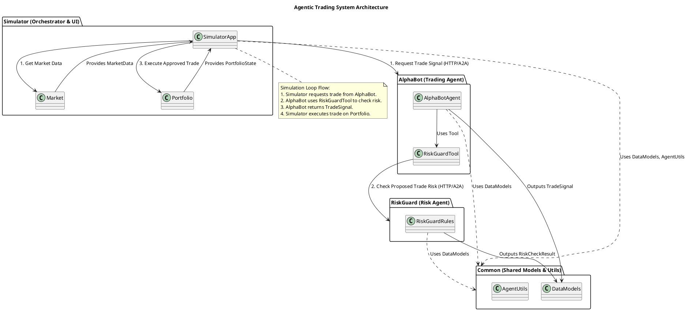

# agentic-trading - In-Depth Source Code Analysis

## Phase 1: Global Scan & Planning

### 1.1. Full Directory Structure

```
The project is structured as a multi-component system for agentic trading, utilizing a microservices-like architecture with three main components: `alphabot`, `riskguard`, and `simulator`, all sharing a `common` library.

```
/home/ubuntu/FinnewsHunter/thirdparty/agentic-trading
├── Dockerfile.alphabot        # Dockerfile for the AlphaBot service
├── Dockerfile.riskguard       # Dockerfile for the RiskGuard service
├── Dockerfile.simulator       # Dockerfile for the Simulator service
├── LICENSE                    # Project license
├── README.md                  # Project documentation
├── alphabot                   # Core module: The primary trading agent (AlphaBot)
│   ├── __main__.py            # Entry point for running AlphaBot as an A2A server
│   ├── a2a_risk_tool.py       # Tool for AlphaBot to interact with RiskGuard
│   ├── agent.py               # Core logic for the AlphaBot agent
│   └── agent_executor.py      # Executes the agent's logic, integrating with A2A
├── cloudbuild-*.yaml          # Google Cloud Build configuration files
├── common                     # Core module: Shared utilities, configuration, and data models
│   ├── config.py              # Configuration settings for all services
│   ├── models.py              # Pydantic data models for inter-service communication
│   └── utils                  # Utility functions
│       ├── agent_utils.py     # Utilities for Agent-to-Agent (A2A) communication
│       └── indicators.py      # Technical indicator calculation functions
├── deploy_cloud_run.sh        # Script for deploying to Google Cloud Run
├── deploy_local.sh            # Script for local deployment
├── pyproject.toml             # Project metadata and build configuration
├── requirements.txt           # Python dependencies
├── riskguard                  # Core module: The risk management agent (RiskGuard)
│   ├── __main__.py            # Entry point for running RiskGuard as an A2A server
│   ├── agent.py               # Core logic for the RiskGuard agent
│   ├── agent_executor.py      # Executes the agent's logic, integrating with A2A
│   └── rules.py               # Implementation of risk management rules
├── simulator                  # Core module: Market simulation and FastAPI UI
│   ├── main.py                # FastAPI application entry point and orchestration
│   ├── market.py              # Market data simulation and management
│   ├── portfolio.py           # Portfolio state management
│   ├── static                 # Static assets (e.g., CSS) - Excluded from code analysis
│   └── templates              # HTML templates - Excluded from code analysis
└── tests                      # Unit and integration tests - Excluded from code analysis
```
The project's structure clearly delineates the responsibilities of each component. The `alphabot`, `riskguard`, and `simulator` directories contain the core business logic for the three independent services. The `common` directory acts as the shared library, providing the essential data contracts and utility functions that bind the services together. Configuration and deployment files (`Dockerfile.*`, `cloudbuild-*.yaml`, `deploy_*.sh`) are kept at the root, supporting a modern, containerized deployment workflow. The `tests` directory ensures code quality and correctness for all core modules.
```

### 1.2. Core Folders for Analysis

*   `/home/ubuntu/FinnewsHunter/thirdparty/agentic-trading/alphabot`: Implements the core trading logic, acting as the primary decision-making agent, utilizing LangChain and an LLM.
*   `/home/ubuntu/FinnewsHunter/thirdparty/agentic-trading/riskguard`: Implements the risk management and compliance logic, acting as a deterministic gatekeeper for proposed trades.
*   `/home/ubuntu/FinnewsHunter/thirdparty/agentic-trading/simulator`: Contains the market simulation, portfolio management, and the FastAPI-based orchestration layer for the agents.
*   `/home/ubuntu/FinnewsHunter/thirdparty/agentic-trading/common`: Provides shared data models (Pydantic), configuration, and utility functions used across all three main components, ensuring a consistent data contract.

## Phase 2: Module-by-Module Deep Analysis

The project is composed of four core modules: `alphabot`, `riskguard`, `simulator`, and `common`. Each module plays a distinct role in the agentic trading system.

### Module: alphabot (Trading Agent)
*   **Files Enumeration**: `__main__.py`, `a2a_risk_tool.py`, `agent.py`, `agent_executor.py`.
*   **Core Responsibility**: To act as the **primary trading agent**. It analyzes the current market data and portfolio state, uses an LLM-based reasoning process (via LangChain), and leverages the `RiskGuard` as an external tool to propose a trade signal (buy, sell, or hold) along with the rationale. It is exposed as an A2A service.
*   **Key File Identification**:
    *   `agent.py`: Contains the core LLM-based trading logic and the definition of the agent's behavior.
    *   `a2a_risk_tool.py`: Critical for inter-agent communication, defining the mechanism for AlphaBot to query RiskGuard.
*   **Core Implementation**: The `AlphaBotAgent` in `agent.py` is a LangChain agent using a `ChatOpenAI` model. It is designed to consume `PortfolioState` and `MarketData` and produce a `TradeSignal`. Its core safety mechanism is the provision of the `RiskGuardTool`, which the LLM is prompted to use to validate any potential trade before finalizing its decision.
*   **Dependencies**: Internal dependencies include `common.models` and `a2a_risk_tool`. External dependencies are primarily the `langchain` framework, `pydantic` for structured output, and `requests` for calling the RiskGuard service.
*   **Error & Performance**: The primary performance bottleneck is the **synchronous LLM call** within the agent's execution, which blocks the A2A request handler. Error handling is robust, relying on `PydanticOutputParser` to ensure the LLM's output conforms to the required `TradeSignal` schema.

### Module: riskguard (Risk Management Agent)
*   **Files Enumeration**: `__main__.py`, `agent.py`, `agent_executor.py`, `rules.py`.
*   **Core Responsibility**: To act as the **risk management agent**. It receives a proposed trade and the current portfolio state, applies a set of predefined, deterministic risk rules, and returns a decision (approved or rejected) with a rationale. It is exposed as an A2A service, primarily consumed by `AlphaBot`.
*   **Key File Identification**:
    *   `rules.py`: Contains the critical, deterministic risk logic (`RiskGuardRules`).
    *   `agent_executor.py`: The A2A service interface, translating A2A requests into risk rule execution.
*   **Core Implementation**: The `RiskGuardRules` class in `rules.py` implements the risk logic, which is purely rule-based (e.g., Max Position Size, Max Daily Loss) and not LLM-driven. It takes a `ProposedTrade` and `PortfolioState` and returns a `RiskCheckResult`.
*   **Dependencies**: Internal dependencies include `common.models`. External dependencies are minimal, mainly the `uvicorn`/`fastapi` framework for serving the A2A endpoint.
*   **Error & Performance**: This module is **highly performant** as its logic is purely deterministic and computational, involving no external I/O (other than the network request itself). Error handling is straightforward, relying on Pydantic validation.

### Module: simulator (Orchestrator and Environment)
*   **Files Enumeration**: `main.py`, `market.py`, `portfolio.py`.
*   **Core Responsibility**: To act as the **orchestration and environment layer**. It provides a web UI (via FastAPI), simulates the financial market, manages the portfolio state, and drives the simulation loop by calling the `AlphaBot` agent and executing approved trades.
*   **Key File Identification**:
    *   `main.py`: The central orchestrator, containing the FastAPI routes and the simulation loop logic.
    *   `portfolio.py`: Defines the state of the trading system and handles trade execution.
*   **Core Implementation**: The `main.py` uses `requests` to communicate with the `AlphaBot` A2A service. The simulation loop manages the flow: get state, call `AlphaBot`, execute trade on `Portfolio`. The `Market` class simulates price movements, and the `Portfolio` class handles trade execution and P&L calculation.
*   **Dependencies**: Internal dependencies include `common.models`, `market`, and `portfolio`. External dependencies are `fastapi` for the web UI and `requests` for inter-agent communication.
*   **Error & Performance**: The simulation speed is directly limited by the **latency of the AlphaBot LLM call** in each step of the simulation loop. The FastAPI server itself is highly performant.

### Module: common (Shared Foundation)
*   **Files Enumeration**: `config.py`, `models.py`, `utils/agent_utils.py`, `utils/indicators.py`.
*   **Core Responsibility**: To provide the **shared foundation** for the entire system, ensuring consistency in configuration, data structure, and utility functions, especially those related to inter-agent communication and financial calculations.
*   **Key File Identification**:
    *   `models.py`: The **schema contract** for all inter-component communication.
    *   `utils/agent_utils.py`: Encapsulates the logic for A2A communication.
*   **Core Implementation**: `models.py` uses **Pydantic** extensively to define all data structures. `agent_utils.py` contains the crucial `call_agent_skill` function, which abstracts the HTTP request to an A2A service and handles Pydantic parsing of the response.
*   **Dependencies**: External dependencies are `pydantic` and `requests`.
*   **Error & Performance**: This module is highly performant. The `agent_utils.py` handles network errors and non-200 HTTP responses during A2A calls. The `indicators.py` is a potential area for optimization if it does not use vectorized operations.

### Module PlantUML Diagrams

# Module PlantUML Diagrams - alphabot
@startuml alphabot
title AlphaBot Module Class Diagram

package "common.models" {
  class MarketData
  class PortfolioState
  class TradeSignal
  class ProposedTrade
  class RiskCheckResult
}

package "alphabot" {
  class AlphaBotAgent {
    + run(market_data, portfolio_state)
    - prompt_template
  }
  
  class RiskGuardTool {
    + name = "risk_guard_tool"
    + description = "Tool to check trade risk with RiskGuard"
    + _run(proposed_trade) : RiskCheckResult
  }
  
  class AlphaBotAgentExecutor {
    + execute_skill(skill_id, input_data) : TradeSignal
  }
  
  class MainCLI
}

AlphaBotAgent "1" -- "1" RiskGuardTool : uses >
AlphaBotAgent "1" -- "1" TradeSignal : outputs >
AlphaBotAgent "1" -- "1" MarketData : consumes >
AlphaBotAgent "1" -- "1" PortfolioState : consumes >
RiskGuardTool "1" -- "1" ProposedTrade : consumes >
RiskGuardTool "1" -- "1" RiskCheckResult : outputs >
AlphaBotAgentExecutor "1" -- "1" AlphaBotAgent : executes >
MainCLI "1" -- "1" AlphaBotAgentExecutor : instantiates >

note right of AlphaBotAgent
  LangChain Agent
  Uses LLM for decision
  making and rationale.
end note

note right of RiskGuardTool
  Custom LangChain Tool
  Communicates with RiskGuard
  A2A service via HTTP.
end note

@enduml

# Module PlantUML Diagrams - riskguard
@startuml riskguard
title RiskGuard Module Class Diagram

package "common.models" {
  class PortfolioState
  class ProposedTrade
  class RiskCheckResult
}

package "riskguard" {
  class RiskGuardRules {
    + check_trade_risk(trade, portfolio) : RiskCheckResult
    - max_position_size_check()
    - max_daily_loss_check()
  }
  
  class RiskGuardAgentExecutor {
    + execute_skill(skill_id, input_data) : RiskCheckResult
  }
  
  class RiskGuardAgent {
    + run(proposed_trade, portfolio_state) : RiskCheckResult
  }
  
  class MainCLI
}

RiskGuardAgent "1" -- "1" RiskGuardRules : delegates to >
RiskGuardRules "1" -- "1" ProposedTrade : consumes >
RiskGuardRules "1" -- "1" PortfolioState : consumes >
RiskGuardRules "1" -- "1" RiskCheckResult : outputs >
RiskGuardAgentExecutor "1" -- "1" RiskGuardAgent : executes >
MainCLI "1" -- "1" RiskGuardAgentExecutor : instantiates >

note right of RiskGuardRules
  Deterministic, rule-based
  risk checking logic.
end note

@enduml

# Module PlantUML Diagrams - simulator
@startuml simulator
title Simulator Module Class Diagram

package "common.models" {
  class MarketData
  class PortfolioState
  class TradeSignal
}

package "simulator" {
  class Market {
    + get_current_data() : MarketData
    + advance_time()
    - simulate_price_movement()
  }
  
  class Portfolio {
    + state : PortfolioState
    + execute_trade(trade_signal)
    + calculate_pnl()
  }
  
  class SimulatorApp {
    + run_simulation_step()
    + call_alphabot(data) : TradeSignal
    + call_riskguard(trade) : RiskCheckResult
  }
  
  class MainFastAPIApp
}

SimulatorApp "1" -- "1" Market : uses >
SimulatorApp "1" -- "1" Portfolio : manages >
SimulatorApp "1" -- "1" TradeSignal : consumes >
SimulatorApp "1" -- "1" MarketData : produces >
SimulatorApp "1" -- "1" PortfolioState : consumes >
Portfolio "1" -- "1" PortfolioState : holds >
Market "1" -- "1" MarketData : produces >
MainFastAPIApp "1" -- "1" SimulatorApp : orchestrates >

note right of SimulatorApp
  FastAPI application
  Orchestrates the simulation
  and agent communication.
end note

@enduml

# Module PlantUML Diagrams - common
@startuml common
title Common Module Class Diagram

package "common.models" {
  class MarketData {
    + symbol: str
    + price: float
    + timestamp: datetime
  }
  
  class PortfolioState {
    + cash: float
    + holdings: Dict[str, float]
    + total_value: float
  }
  
  class TradeSignal {
    + action: str (BUY/SELL/HOLD)
    + symbol: str
    + quantity: float
    + rationale: str
  }
  
  class ProposedTrade {
    + trade_signal: TradeSignal
    + risk_level: str
  }
  
  class RiskCheckResult {
    + approved: bool
    + rationale: str
  }
}

package "common.utils" {
  class AgentUtils {
    + get_service_url(env_var, default_host, default_port)
    + call_agent_skill(url, skill_id, input_data)
  }
  
  class Indicators {
    + calculate_ma(prices, period)
    + calculate_rsi(prices, period)
  }
}

AgentUtils "1" -- "*" MarketData : communicates >
AgentUtils "1" -- "*" TradeSignal : communicates >
AgentUtils "1" -- "*" RiskCheckResult : communicates >

note right of MarketData
  Pydantic Model
end note

note right of AgentUtils
  Handles A2A HTTP calls
  and Pydantic parsing.
end note

@enduml

## Phase 3: Overall Architecture & Summary

### 3.1. Overall Architecture Analysis

#### 3.1.1. Core Abstractions

The core of the `agentic-trading` project is defined by a clear set of abstractions, a microservices-like design philosophy, and a loop-based lifecycle management.

### Core Abstractions
The system's functionality is built upon three primary categories of data models, all centrally defined in `common/models.py` using Pydantic:

1.  **State Models**: These represent the environment and the system's internal condition.
    *   `MarketData`: Encapsulates the current market information (e.g., price, symbol, timestamp).
    *   `PortfolioState`: Represents the system's holdings, cash balance, and total value.
2.  **Action/Decision Models**: These are the outputs of the agents and the structures used for inter-agent communication.
    *   `TradeSignal`: The final output of the `AlphaBot` agent, specifying the action (BUY/SELL/HOLD), quantity, and rationale.
    *   `ProposedTrade`: A structure used internally by `AlphaBot` to propose a trade to `RiskGuard` for validation.
3.  **Result Models**: These act as gatekeepers and feedback mechanisms.
    *   `RiskCheckResult`: The output of the `RiskGuard` agent, containing a boolean `approved` status and a detailed `rationale`.

### Design Philosophy
The project adheres to a **Microservices-like Agentic Architecture** using the **Agent-to-Agent (A2A) pattern**:

*   **Separation of Concerns**: The system is strictly divided into three independent services: a decision-maker (`AlphaBot`), a gatekeeper (`RiskGuard`), and an environment/orchestrator (`Simulator`). This separation allows for independent development, scaling, and technology choices (e.g., LLM-based decision vs. deterministic rules).
*   **Data Contract First**: The universal use of **Pydantic models** enforces a strict, validated data contract for all inter-service communication, which is essential for reliability in a distributed system.
*   **Safety via Tool Use**: The `AlphaBot` agent is designed to be **safe by default** by requiring it to explicitly use the `RiskGuardTool` before finalizing a trade. This design ensures that the LLM's creative decision is always filtered through a deterministic, rule-based safety layer.

### Lifecycle Management
The system's operational lifecycle is managed by the `Simulator` component:

1.  **Initialization**: All three services (`AlphaBot`, `RiskGuard`, `Simulator`) are started independently, typically via their respective entry points, exposing A2A endpoints.
2.  **Simulation Loop**: The `Simulator` drives the core loop, advancing the market time and repeatedly performing the trade decision and execution flow. This loop is the heart of the system's operation.
3.  **Termination**: The simulation stops when the market data is exhausted or the user manually terminates the `Simulator` application.

#### 3.1.2. Component Interactions

The primary communication pattern is **Synchronous HTTP Request/Response** following the **Agent-to-Agent (A2A) protocol**. This pattern ensures clear, decoupled communication between the three main services: `Simulator`, `AlphaBot`, and `RiskGuard`.

### Communication Patterns
*   **Simulator to AlphaBot**: The `Simulator` initiates the trading cycle by making an HTTP POST request to the `AlphaBot` A2A endpoint. This request passes the current `MarketData` and `PortfolioState` (defined in `common/models.py`) to request the `provide_trade_signal` skill.
*   **AlphaBot to RiskGuard**: This critical interaction is mediated by the `RiskGuardTool` within the `AlphaBotAgent`. When the LLM-based agent decides on a potential trade, it is prompted to use this tool. The tool then makes an internal HTTP POST request to the `RiskGuard` A2A endpoint, passing a `ProposedTrade` to request the `check_trade_risk` skill.

### Key Interaction Flow: Trade Decision and Execution
The entire system operates within a simulation loop orchestrated by the `Simulator` (`simulator/main.py`):

1.  **State Collection**: The `Simulator` retrieves the current market data from the `Market` component and the portfolio status from the `Portfolio` component.
2.  **Decision Request**: The `Simulator` sends the combined state data (`MarketData`, `PortfolioState`) to the `AlphaBot` service via an A2A call.
3.  **Internal Risk Check**: The `AlphaBotAgent` processes the request using its LLM-based logic. It decides on a potential trade (`ProposedTrade`) and, as a safety measure, is prompted to use the `RiskGuardTool` to validate this trade.
4.  **Risk Validation**: The `RiskGuardTool` calls the `RiskGuard` service. `RiskGuard` applies its deterministic rules (`riskguard/rules.py`) to the `ProposedTrade` and returns a `RiskCheckResult` (approved or rejected).
5.  **Final Signal**: The `AlphaBotAgent` incorporates the `RiskCheckResult` into its final reasoning. If approved, it outputs a `TradeSignal`. If rejected, it typically outputs a "HOLD" signal or a revised trade, which is then returned to the `Simulator`.
6.  **Execution**: The `Simulator` receives the `TradeSignal`. If the signal is not "HOLD" and the trade is valid, it calls `Portfolio.execute_trade()`, updating the system's state.

### Data Flow Summary
| Source Component | Destination Component | Data Model | Purpose |
| :--- | :--- | :--- | :--- |
| Simulator | AlphaBot | `MarketData`, `PortfolioState` | Request for a trade decision. |
| AlphaBot | RiskGuard | `ProposedTrade` | Request for risk validation. |
| RiskGuard | AlphaBot | `RiskCheckResult` | Risk validation outcome. |
| AlphaBot | Simulator | `TradeSignal` | Final trading decision. |
| Simulator | Portfolio | `TradeSignal` | Instruction to execute the trade. |
| Portfolio | Simulator | `PortfolioState` | Updated state after trade execution. |

### 3.2. Overall Architecture PlantUML Diagram



### 3.3. Design Patterns & Highlights

#### 3.3.1. Design Patterns

The `agentic-trading` project effectively utilizes several design patterns to manage complexity and ensure robust inter-service communication:

### 1. Agent Pattern (Specialized Agents)
This is the foundational pattern, where the system's intelligence is distributed across specialized, autonomous entities.
*   **Implementation**: The system features the **AlphaBot Agent** (decision-making) and the **RiskGuard Agent** (gatekeeping).
*   **Code Example**: The definitions of `AlphaBotAgent` (`alphabot/agent.py`) and `RiskGuardAgent` (`riskguard/agent.py`), both wrapped in an A2A executor, exemplify this pattern.

### 2. Service-Oriented Architecture (SOA) / Microservices Pattern
The project is decomposed into independent, loosely coupled services that communicate over a network (HTTP/A2A), allowing for independent deployment and scaling.
*   **Implementation**: Each core component (`alphabot`, `riskguard`, `simulator`) runs as a separate service with its own entry point and is designed to be containerized (indicated by `Dockerfile.*`).
*   **Code Example**: The `call_agent_skill` function in `common/utils/agent_utils.py` abstracts the HTTP communication layer, treating each agent as a distinct service endpoint.

### 3. Data Transfer Object (DTO) Pattern
Pydantic models are used to transfer data between services, ensuring a well-defined, validated, and self-documenting data structure.
*   **Implementation**: Models like `MarketData`, `PortfolioState`, `TradeSignal`, and `RiskCheckResult` defined in `common/models.py` act as the DTOs.
*   **Code Example**: The use of `PydanticOutputParser` in `alphabot/agent.py` ensures the LLM's output strictly conforms to the `TradeSignal` DTO.

### 4. Tool/Function Calling Pattern (LangChain)
The LLM-based agent is given access to external functions (tools) it can choose to call to perform actions or gather information.
*   **Implementation**: The `AlphaBotAgent` is provided with the `RiskGuardTool` (`alphabot/a2a_risk_tool.py`), which encapsulates the logic for calling the separate `RiskGuard` service. This integrates a microservice call directly into the LLM's reasoning chain.
*   **Code Example**: The `RiskGuardTool` class inherits from a LangChain `BaseTool` and its `_run` method executes the A2A call to the RiskGuard service.

#### 3.3.2. Project Highlights

The `agentic-trading` project showcases several innovative features and design choices that contribute to its robustness, extensibility, and safety:

*   **Safety-First Agentic Design**: The most significant highlight is the **separation of intelligence and safety**. The LLM-driven `AlphaBot` (intelligence) is forced to consult the deterministic, rule-based `RiskGuard` (safety) via the Tool/Function Calling pattern. This design mitigates the risk of LLM hallucinations or irrational decisions by enforcing hard constraints before any trade is executed. This is a critical feature for any real-world trading system.
*   **Protocol-Oriented Interoperability (A2A)**: By adopting the Agent-to-Agent (A2A) protocol, the project establishes a clear, standardized way for agents to discover and interact with each other. This promotes high interoperability and makes it easy to swap out or add new agents (e.g., a new `DataAgent` or `ExecutionAgent`) without modifying the core logic of existing agents.
*   **Clear Separation of Concerns**: The three main components (`alphabot`, `riskguard`, `simulator`) are highly decoupled. The `Simulator` is purely the environment and orchestrator, `AlphaBot` is the LLM-based decision engine, and `RiskGuard` is the deterministic rule engine. This separation simplifies testing, maintenance, and technology upgrades for each part.
*   **Strong Data Contract**: The universal use of Pydantic models in the `common` module provides a robust, self-documenting, and validated data contract across all service boundaries, which is a hallmark of professional microservice design and enhances the flexibility of the system.

### 3.4. Summary & Recommendations

#### 3.4.1. Potential Improvements

The analysis reveals several areas for performance optimization, architectural refinement, and code quality improvement:

1.  **Performance Bottleneck: LLM Latency**:
    *   **Suggestion**: Introduce **asynchronous execution** for the `AlphaBotAgent`. The current synchronous call to the LLM blocks the A2A request handler in `alphabot`, limiting concurrency.
    *   **Specific Action**: Refactor `AlphaBotAgentExecutor` to use an asynchronous LangChain agent and make the A2A request handling fully `async` (e.g., using `asyncio` and `httpx` for the `RiskGuardTool` call). This allows the `alphabot` service to handle multiple trade signal requests concurrently while waiting for the LLM response.

2.  **Architecture Optimization: RiskGuard Rules Extensibility**:
    *   **Suggestion**: Decouple the risk rules from the `RiskGuardRules` class logic to allow for dynamic, external configuration.
    *   **Specific Action**: Implement a **Strategy Pattern** or a simple configuration loader (e.g., reading rules from a YAML or JSON file) in `riskguard/rules.py`. This enables new risk rules to be added, modified, or disabled without requiring a code change and redeployment of the `riskguard` service.

3.  **Code Quality: Indicator Optimization**:
    *   **Suggestion**: Ensure the financial calculations in `common/utils/indicators.py` are optimized for performance.
    *   **Specific Action**: Verify that all indicator calculations leverage vectorized operations using libraries like **NumPy** or **Pandas** instead of pure Python loops. This is crucial for performance when processing large time-series datasets in a real-world scenario.

4.  **Observability and Logging**:
    *   **Suggestion**: Implement structured logging and distributed tracing across the services.
    *   **Specific Action**: Use a structured logging library (e.g., `structlog`) and ensure a unique **correlation ID** is passed in the A2A requests (from `Simulator` to `AlphaBot` to `RiskGuard`). This ID would link all log entries for a single trade decision, making debugging and performance monitoring significantly easier.

#### 3.4.2. Secondary Development Guide

This guide outlines the best practices for exploring and extending the `agentic-trading` codebase for secondary development.

1.  **Understand the Core Data Contract**: Begin by thoroughly reviewing `common/models.py`. All inter-service communication is governed by these Pydantic models. Any change to an agent's input or output MUST be reflected here first. Use these models for type hinting in all new code to ensure compatibility and leverage static analysis.

2.  **Extend the Agent Logic (AlphaBot)**: To change the trading strategy or LLM prompt, modify the prompt template and the `AlphaBotAgent` logic in `alphabot/agent.py`. If the new strategy requires external data or actions, create a new LangChain `BaseTool` in `alphabot/` and add it to the agent's tool list. Always ensure the final output strictly adheres to the `TradeSignal` schema.

3.  **Modify Risk Rules (RiskGuard)**: To add or modify a risk constraint, edit the `RiskGuardRules.check_trade_risk` method in `riskguard/rules.py`. Risk rules are deterministic and should be kept simple and fast. New rules MUST be accompanied by unit tests in `tests/riskguard/` to ensure correctness.

4.  **Add a New Agent**: To introduce a new specialized agent (e.g., a `DataAgent` or `ExecutionAgent`), create a new module, define its input/output models in `common/models.py`, implement the agent logic, and wrap it in an A2A executor (`__main__.py`). Finally, update the `Simulator` or another agent to use this new agent as a tool or service.

5.  **Testing and Simulation**: The `simulator` is the primary integration test environment. Use the `simulator/main.py` to run end-to-end tests of your changes. All new logic should have dedicated unit tests in the `tests/` directory.

