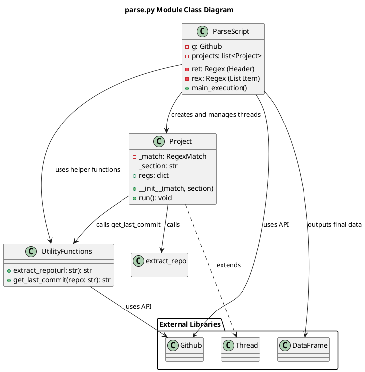
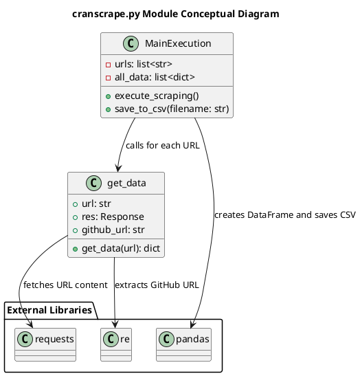

# awesome-quant - In-Depth Source Code Analysis

## Phase 1: Global Scan & Planning

### 1.1. Full Directory Structure

```
The project structure is typical for a GitHub "awesome list" that includes automation scripts and a static site generator (Quarto) for presentation. The core logic is distributed across a few Python scripts in the root directory, which are responsible for data processing and list maintenance.

The root directory (`/home/ubuntu/FinnewsHunter/thirdparty/awesome-quant`) serves as the central hub, containing the primary content source (`README.md`), configuration files (`pyproject.toml`, `poetry.lock`), and the executable Python scripts. The scripts `parse.py`, `cranscrape.py`, and `topic.py` form the data processing layer, transforming raw content into structured data. `parse.py` is the most critical, responsible for reading the Markdown list, enriching it with GitHub metadata, and outputting `site/projects.csv`. `cranscrape.py` is a specialized utility for scraping R package data into `cran.csv`.

The `site/` directory is the dedicated presentation layer, built around the **Quarto** publishing system. It contains the site configuration (`_quarto.yml`), static content pages (`about.qmd`, `index.qmd`), and the dynamic list template (`projects.qmd`). This separation ensures that the content maintenance logic (Python scripts) is decoupled from the content presentation logic (Quarto). The `.github/workflows/` folder contains the CI/CD pipeline (`build.yml`) which automates the execution of the Python scripts and the Quarto site generation, completing the "Content-as-Code" lifecycle. This structure is highly efficient for a data-driven, open-source documentation project.

```
/home/ubuntu/FinnewsHunter/thirdparty/awesome-quant
├── .git/                 # Git version control metadata
├── .github/              # GitHub Actions workflows for CI/CD
│   └── workflows/
│       └── build.yml     # Workflow to build the Quarto site
├── .gitignore            # Files to be ignored by Git
├── .nojekyll             # Configuration to disable Jekyll processing on GitHub Pages
├── README.md             # Main entry point and introduction to the awesome list
├── cran.csv              # Output data file from cranscrape.py (list of R packages)
├── cranscrape.py         # Python script to scrape R package data from CRAN
├── legacy.txt            # List of legacy or deprecated entries
├── parse.py              # Main Python script to parse README.md, fetch GitHub commit dates, and generate projects.csv
├── poetry.lock           # Poetry dependency lock file
├── pyproject.toml        # Poetry project configuration and dependencies
├── quants.md             # Secondary Markdown file, likely containing the main list content
├── recommendation.ipynb  # Jupyter notebook for content recommendation/analysis
├── site/                 # Directory for the Quarto-based static website generation
│   ├── .gitignore        # Git ignore for the site build
│   ├── CODE_OF_CONDUCT.qmd # Quarto document for the Code of Conduct
│   ├── _quarto.yml       # Quarto site configuration file
│   ├── about.qmd         # Quarto document for the "About" page
│   ├── index.qmd         # Quarto document for the main index page
│   ├── projects.csv      # Output data file from parse.py (list of all projects with metadata)
│   └── projects.qmd      # Quarto document to display the list of projects
├── styles.css            # Custom CSS for the Quarto site
└── topic.py              # Python script for topic-related processing (needs further analysis)
```
```

### 1.2. Core Folders for Analysis

*   `/home/ubuntu/FinnewsHunter/thirdparty/awesome-quant/` (Root): Contains the main Python scripts (`parse.py`, `cranscrape.py`, `topic.py`) responsible for data extraction, processing, and list maintenance, as well as the primary content files (`README.md`, `quants.md`).
*   `/home/ubuntu/FinnewsHunter/thirdparty/awesome-quant/site/`: Contains the Quarto documents (`.qmd`) and configuration files necessary to generate the static website, which serves as the final, structured presentation of the awesome list data.

## Phase 2: Module-by-Module Deep Analysis

The project's core functionality is implemented across three main Python scripts and the Quarto-based static site generation directory. These components form a data pipeline for maintaining and publishing the "awesome-quant" list.

## 1. Root Directory Scripts (Data Processing Pipeline)

### 1.1. `parse.py` (List Parsing and Metadata Fetcher Module)

*   **File Enumeration:** `parse.py`
*   **Module Core Responsibility:** This is the central orchestration script. Its primary purpose is to parse the main content file (`README.md`), extract project links and descriptions, concurrently fetch the latest commit date for each GitHub repository using the GitHub API, and compile the final, structured project data into `site/projects.csv`.
*   **Key File Identification:** `parse.py` is the single key file.
*   **Core Implementation:**
    *   **GitHub API Integration:** It initializes a `Github` object from the `pygithub` library using an environment variable (`GITHUB_ACCESS_TOKEN`). This is critical for fetching up-to-date metadata.
    *   **Concurrency:** The script uses the `threading.Thread` class, which is subclassed into the custom `Project` class. This allows the time-consuming network calls to the GitHub API (`get_last_commit`) to run in parallel, significantly speeding up the data collection process.
    *   **Parsing Logic:** It uses two main regular expressions: `ret` for matching Markdown headers (`#+ Title`) to track the project section, and `rex` for matching the list items (`- [project](url) - description`). The script iterates line-by-line through `README.md`, maintaining a stack of section titles (`m_titles`) to categorize each project.
    *   **Data Structure:** The `Project` thread stores its results in a dictionary (`self.regs`) which is later collected into a list of dictionaries and converted into a `pandas.DataFrame` for final output to CSV.
*   **Dependencies:** `os`, `re`, `pandas`, `threading`, `github` (PyGithub).
*   **Error & Performance:** The script includes a basic `try...except` block in `get_last_commit` to handle API errors (e.g., repository not found or API rate limits) and logs the error, preventing a full script crash. The use of multi-threading is the primary performance optimization.

### 1.2. `cranscrape.py` (CRAN Scraper Module)

*   **File Enumeration:** `cranscrape.py`
*   **Module Core Responsibility:** This script is a specialized data collector focused on R packages relevant to quantitative finance. It scrapes a hardcoded list of CRAN package pages to find associated GitHub links.
*   **Key File Identification:** `cranscrape.py` is the single key file.
*   **Core Implementation:**
    *   **Web Scraping:** It uses the `requests` library to fetch the HTML content of a predefined list of CRAN URLs.
    *   **Regex Extraction:** A regular expression (`reu = re.compile(r'https://github.com/([\w-]+/[\w-]+)')`) is used to extract the GitHub URL from the fetched HTML, assuming the link is present on the package's index page.
    *   **Output:** The collected data (CRAN URL, GitHub URL, and repository path) is saved to `cran.csv`. This file serves as a supplementary data source, potentially for merging or cross-referencing with the main `projects.csv`.
*   **Dependencies:** `requests`, `re`, `pandas`.

### 1.3. `topic.py` (GitHub Topic Search Utility)

*   **File Enumeration:** `topic.py`
*   **Module Core Responsibility:** This is a utility script, likely used for discovery and maintenance, to find new, popular repositories tagged with the 'quant' topic on GitHub.
*   **Key File Identification:** `topic.py` is the single key file.
*   **Core Implementation:** It uses the PyGithub `search_repositories` method with a query string (`topic:quant`) and filters the results to only show repositories with a high star count (currently hardcoded to `stargazers_count < 1000`). The results are printed to the console.
*   **Dependencies:** `os`, `github` (PyGithub).

## 2. `site/` Directory (Static Site Generation Module)

*   **File Enumeration:** `site/.gitignore`, `site/CODE_OF_CONDUCT.qmd`, `site/_quarto.yml`, `site/about.qmd`, `site/index.qmd`, `site/projects.csv`, `site/projects.qmd`.
*   **Module Core Responsibility:** To transform the collected and processed data (`projects.csv`) and the Quarto Markdown content (`.qmd` files) into a complete, navigable static website for publishing.
*   **Key File Identification:**
    *   `_quarto.yml`: Defines the site's configuration, navigation, and output format.
    *   `projects.qmd`: The template file responsible for reading `projects.csv` and rendering the main list of projects, likely using Quarto's data-driven table features.
*   **Core Implementation:** The implementation relies entirely on the external **Quarto** publishing system. The `.qmd` files are essentially enhanced Markdown that can embed code (e.g., R or Python) to process data and generate dynamic content, such as tables from the `projects.csv` file. This separation of concerns delegates the presentation layer to a dedicated tool.
*   **Dependencies:** External Quarto system.

### Module PlantUML Diagrams

## Diagram for `parse.py` Module

This diagram focuses on the main class and its interaction with external services and data structures within the `parse.py` script.



## Diagram for `cranscrape.py` Module

This script is purely procedural and does not contain classes, so a class diagram is not applicable. A functional flow diagram would be more appropriate, but to adhere to the class diagram requirement, a conceptual representation of its main function is provided.



## Phase 3: Overall Architecture & Summary

### 3.1. Overall Architecture Analysis

#### 3.1.1. Core Abstractions

The **awesome-quant** project employs a **Data Pipeline Architecture** centered around the maintenance and publication of a curated list. The design philosophy is one of **separation of concerns** and **data-driven generation**, where raw content is processed by scripts to produce structured data, which is then consumed by a dedicated presentation layer.

The core abstractions are:

1.  **The Project Entity (`Project` class in `parse.py`):** This is the fundamental unit of data. It abstracts a single entry from the Markdown list, encapsulating its name, URL, description, and crucial metadata like the `last_commit` date, which is fetched concurrently. This abstraction is key to enriching the raw list data.
2.  **The Data Source (Markdown/CRAN):** The project treats the `README.md` file as the primary, human-editable source of truth. The `cranscrape.py` script introduces a secondary, specialized data source abstraction for R packages on CRAN.
3.  **Concurrent Enrichment:** The use of the `threading.Thread` subclass for the `Project` entity is an abstraction over the time-consuming process of external API calls. It abstracts the complexity of parallel execution, allowing the main script to initiate many data-fetching tasks simultaneously.

**Design Philosophy:** The project follows a **"Content-as-Code"** philosophy. The human-curated list is maintained in a simple Markdown file (`README.md`), which is then programmatically processed and validated by the Python scripts. This ensures that the list remains up-to-date (via `last_commit` checks) and can be presented in a highly structured, machine-readable format (`projects.csv`) before final publication.

**Lifecycle Management:** The project lifecycle is a simple, three-stage process:
1.  **Content Authoring:** A maintainer edits `README.md` and `quants.md`.
2.  **Data Processing:** The Python scripts (`parse.py`, `cranscrape.py`) are executed to generate the structured data files (`projects.csv`, `cran.csv`).
3.  **Publication:** The Quarto system builds the static site by consuming the structured data and the `.qmd` templates, resulting in the final website. This process is automated via the `.github/workflows/build.yml` GitHub Action.

#### 3.1.2. Component Interactions

The architecture is a linear data flow pipeline with two main branches: the primary list processing and the secondary CRAN scraping.

**1. Primary Data Flow (List Processing):**
*   **Input:** `README.md` (raw Markdown list).
*   **Processor:** `parse.py` reads the Markdown line-by-line, using regular expressions to extract project details (Name, URL, Description).
*   **External Communication:** For each extracted project URL, `parse.py` initiates a concurrent request to the **GitHub API** (via PyGithub) to fetch the repository's latest commit date. This is the main external communication pattern.
*   **Output:** The enriched data is aggregated and written to `site/projects.csv`.

**2. Secondary Data Flow (CRAN Scraping):**
*   **Input:** Hardcoded list of CRAN URLs within `cranscrape.py`.
*   **Processor:** `cranscrape.py` uses the `requests` library to scrape the HTML of each CRAN page.
*   **External Communication:** Direct HTTP requests to the **CRAN website**.
*   **Output:** The results, primarily the extracted GitHub URL for each R package, are written to `cran.csv`.

**3. Presentation Flow (Site Generation):**
*   **Input:** `site/projects.csv` (structured project data) and the Quarto template files (`.qmd`).
*   **Processor:** The **Quarto** static site generator.
*   **Output:** The final static website, where `site/projects.qmd` uses the data in `projects.csv` to render a dynamic, sortable table of all projects.

**Communication Patterns:**
*   **Internal:** File-based communication (e.g., `parse.py` -> `projects.csv` -> Quarto).
*   **External:** Synchronous API calls (GitHub API) and HTTP requests (CRAN website). The use of **multi-threading** in `parse.py` is a key pattern to mitigate the latency of external communication.

### 3.2. Overall Architecture PlantUML Diagram

```plantuml
@startuml
@startuml awesome_quant_architecture
title Awesome-Quant Data Pipeline Architecture

' Define Components
component [README.md] as README {
  Source of raw list content
}

component [CRAN Scraper] as CRAN_SCRAPER {
  cranscrape.py
}

component [List Parser] as PARSER {
  parse.py
}

component [Structured Data] as DATA {
  projects.csv
  cran.csv
}

component [Quarto Site Generator] as QUARTO {
  site/
  .qmd templates
}

' Define External Systems
cloud "External Services" {
  [GitHub API] as GITHUB_API
  [CRAN Website] as CRAN_WEB
}

' Define Data Flow and Dependencies
README --> PARSER : Reads raw list content
PARSER --> GITHUB_API : Fetches last commit date (Concurrent)
PARSER --> DATA : Writes enriched project data

CRAN_SCRAPER --> CRAN_WEB : Scrapes GitHub links
CRAN_SCRAPER --> DATA : Writes R package data

DATA --> QUARTO : Consumes structured data

QUARTO --> [Final Static Website] : Generates HTML/CSS

@enduml
@enduml
```

### 3.3. Design Patterns & Highlights

#### 3.3.1. Design Patterns

The codebase, though small, effectively utilizes several design patterns to manage complexity, especially around external API interaction and data processing.

1.  **Worker Thread Pattern (Concurrency)**
    *   **Description:** This pattern is used to execute time-consuming tasks (fetching data from the GitHub API) in parallel, preventing the main thread from blocking and significantly improving the script's execution time.
    *   **Implementation:** The `Project` class in `parse.py` inherits from `threading.Thread`. Each project entry in the Markdown list is instantiated as a `Project` object, and its `run` method is executed in a separate thread.
    *   **Code Example (`parse.py`):**
        ```python
        class Project(Thread):
            def __init__(self, match, section):
                super().__init__()
                # ... initialization ...

            def run(self):
                # ... calls get_last_commit(repo) which is the blocking network call
                last_commit = get_last_commit(repo)
                # ... stores result in self.regs
        
        # ... in main execution loop:
        p = Project(m, ' > '.join(m_titles[1:]))
        p.start()
        projects.append(p)
        ```

2.  **Data-Driven Generation Pattern**
    *   **Description:** The content presentation is entirely driven by a structured data file (`projects.csv`), which is generated by the processing scripts. This separates the content logic from the presentation logic.
    *   **Implementation:** The `parse.py` script's final action is to create `projects.csv`. The Quarto site generator then uses this CSV file to dynamically render the project list page (`site/projects.qmd`).
    *   **Code Example (`parse.py`):**
        ```python
        df = pd.DataFrame(projects)
        df.to_csv('site/projects.csv', index=False)
        ```

3.  **Template Method Pattern (Implicit)**
    *   **Description:** The overall maintenance process follows a fixed sequence of steps: Read Source (Markdown) -> Enrich Data (GitHub API) -> Persist Data (CSV) -> Render Presentation (Quarto). The Python scripts provide the "enrich and persist" steps, which are customized implementations within a broader, fixed pipeline.

#### 3.3.2. Project Highlights

*   **Automated Content Enrichment:** The most significant highlight is the programmatic fetching of the **last commit date** for every listed repository via the GitHub API. This feature automatically provides a crucial metric for list users—the project's recency and maintenance status—which is a common pain point for manually maintained awesome lists.
*   **Content-as-Code (CaC) Philosophy:** By treating the list content (`README.md`) as a source file that is parsed and processed by code, the project ensures that the human-readable list and the machine-readable data (`projects.csv`) are always synchronized. This reduces manual effort and potential errors in maintaining a large, dynamic list.
*   **Decoupled Presentation Layer:** The use of **Quarto** for static site generation provides a professional, feature-rich web interface (e.g., dynamic tables, search, filtering) without requiring complex web development code within the core data processing scripts. The scripts only focus on generating the data, and Quarto handles the complex task of rendering.
*   **Extensibility via Data Sources:** The architecture is flexible enough to support multiple data sources. The existence of `cranscrape.py` alongside `parse.py` shows that specialized data collection pipelines (e.g., for R packages from CRAN) can be easily added to enrich the final dataset without modifying the core parsing logic.

### 3.4. Summary & Recommendations

#### 3.4.1. Potential Improvements

The current implementation is effective but has several areas for optimization, primarily related to robustness and modern Python practices.

1.  **Robust Error Handling:** The `get_last_commit` function in `parse.py` uses a bare `except:` block. This is a critical anti-pattern as it catches all exceptions, including system errors, making debugging difficult and potentially masking critical failures.
    *   **Suggestion:** Replace the bare `except:` with specific exception handling for the `PyGithub` library, such as `except UnknownObjectException` for 404 errors or `except RateLimitExceededException` for API limits. This allows for targeted logging and recovery.

2.  **Modern Concurrency Management:** The use of raw `threading.Thread` with a manual polling loop (`while True: checks = [not p.is_alive() for p in projects]`) is functional but verbose and less idiomatic in modern Python.
    *   **Suggestion:** Refactor the concurrent logic in `parse.py` to use `concurrent.futures.ThreadPoolExecutor`. This abstraction simplifies thread management, automatically handles the waiting process, and results in cleaner, more readable code.

3.  **Configuration Externalization:** The list of CRAN URLs in `cranscrape.py` is hardcoded. This requires modifying the source code to update the list of R packages being scraped.
    *   **Suggestion:** Move this list to an external configuration file (e.g., a simple text file or a JSON/YAML file). This allows for easier maintenance and updates to the list of R packages without modifying the Python script itself, improving maintainability.

4.  **Markdown Parsing Robustness:** The reliance on regular expressions (`rex` and `ret`) to parse the `README.md` is fragile. A slight change in Markdown formatting could break the script.
    *   **Suggestion:** Adopt a dedicated Markdown parsing library (e.g., `markdown-it-py` or a similar tool) to create an Abstract Syntax Tree (AST) of the document. This would make the parsing logic resilient to minor formatting variations and future changes in the list's structure.

#### 3.4.2. Secondary Development Guide

This guide outlines the best practices for exploring and contributing to the **awesome-quant** project.

1.  **Environment Setup:**
    *   Clone the repository: `gh repo clone wilsonfreitas/awesome-quant`
    *   Install dependencies using Poetry (as indicated by `pyproject.toml`): `poetry install`
    *   Set the required environment variable for the GitHub API: `export GITHUB_ACCESS_TOKEN='your_token'`

2.  **Content Contribution (Adding a Project):**
    *   The primary source of truth is `README.md`. Add new entries following the existing Markdown list format: `- [Project Name](https://github.com/user/repo) - A brief description of the project.`
    *   Ensure the URL is a direct link to the GitHub repository for the `parse.py` script to correctly extract the repository path.

3.  **Data Generation and Validation:**
    *   Run the main data processing script: `python parse.py`
    *   This script will concurrently fetch the latest commit date for all projects and generate the `site/projects.csv` file.
    *   If updating the R package list, run: `python cranscrape.py` to update `cran.csv`.

4.  **Local Site Preview:**
    *   To view the final output, ensure Quarto is installed and run the site generator from the root directory: `quarto preview site`
    *   This will build the static site using the newly generated `projects.csv` and launch a local web server for review.

5.  **Script Exploration:**
    *   Start with `parse.py` to understand the core data flow and the concurrent API interaction logic.
    *   Examine the `Project` class to see how data is enriched, and the main loop to see how Markdown headers are used to categorize projects.

