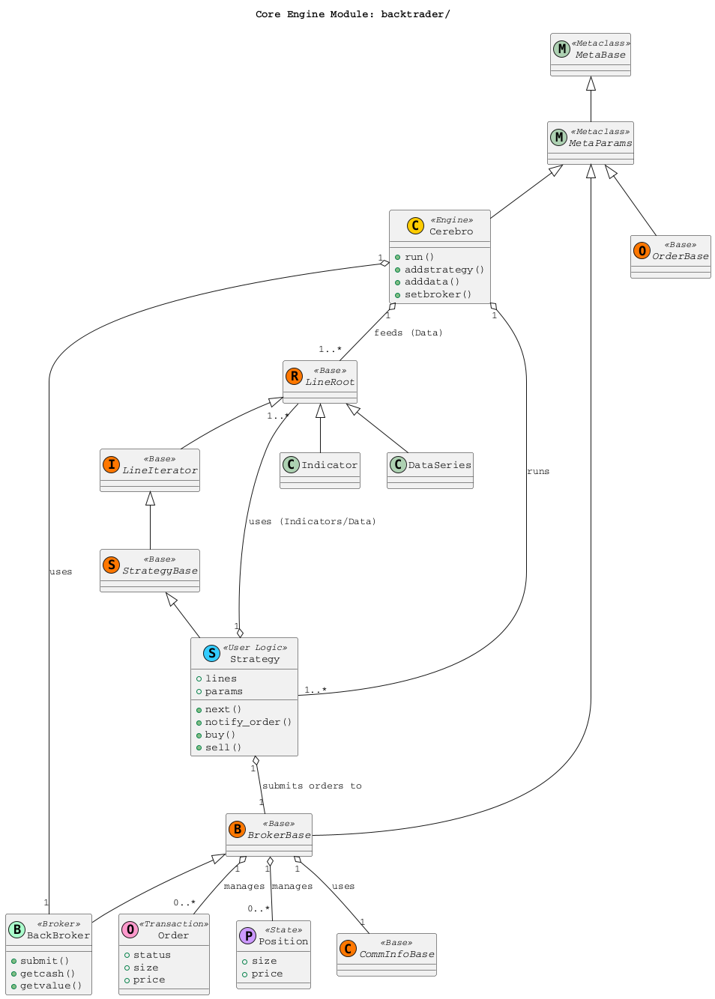
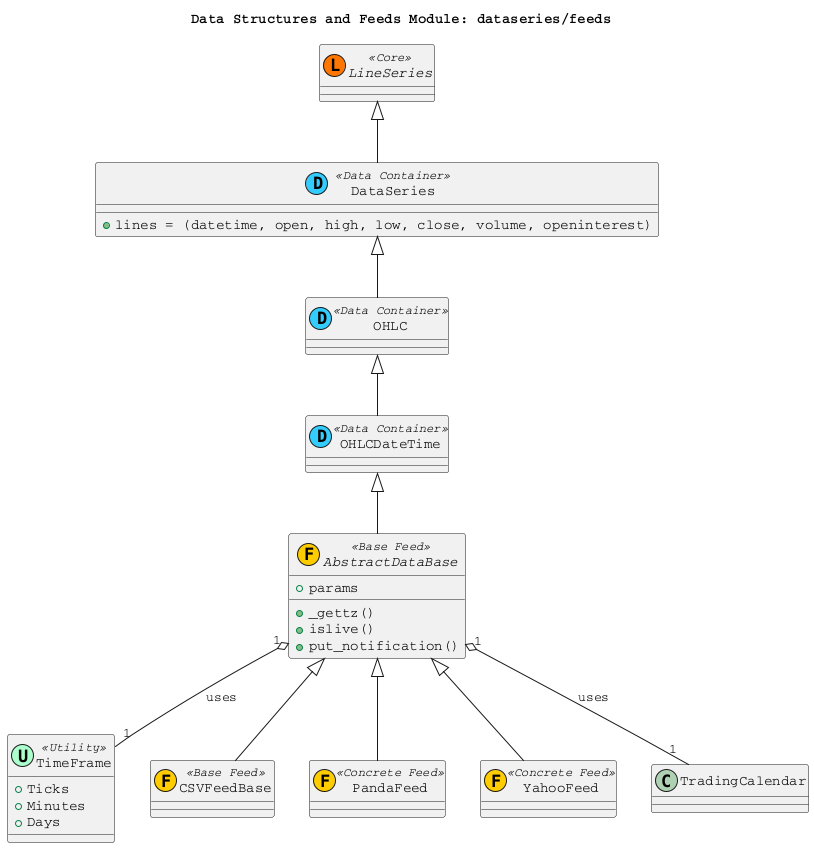
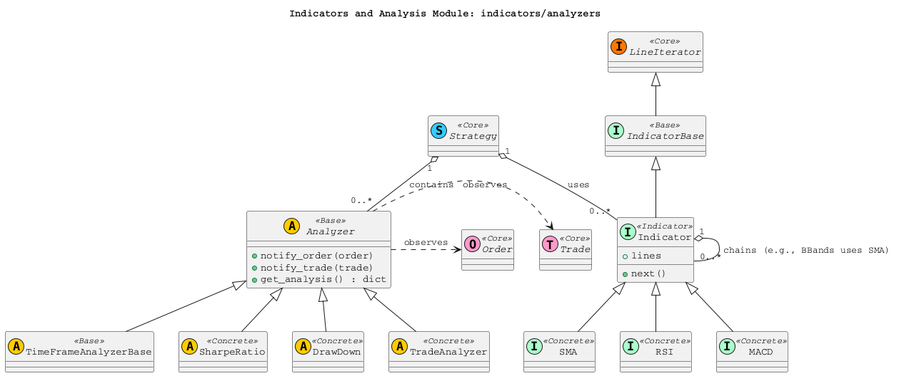
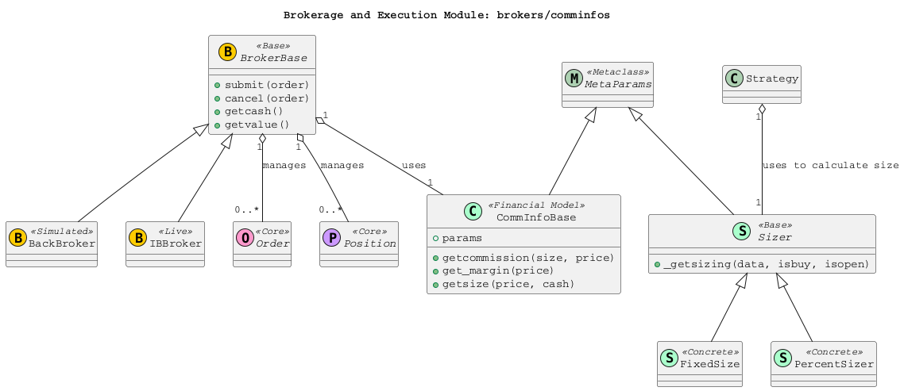
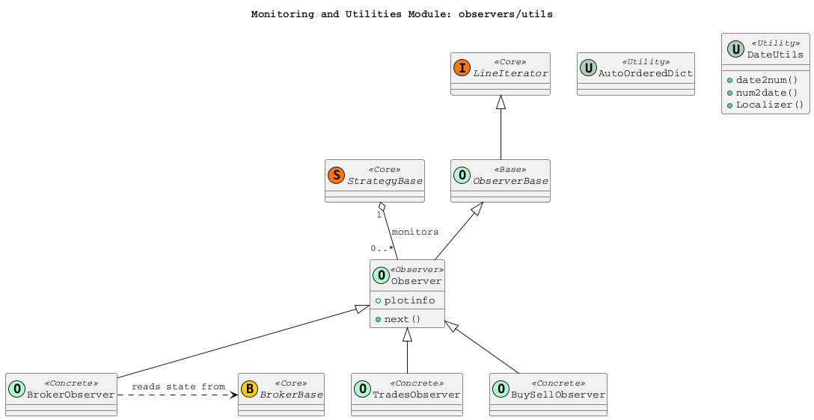
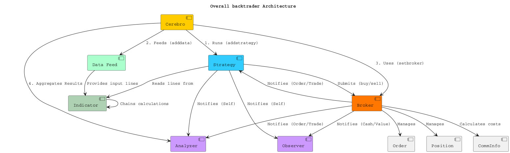

# backtrader - In-Depth Source Code Analysis

## Phase 1: Global Scan & Planning

### 1.1. Full Directory Structure

```
The project structure is typical for a Python package, with the core logic residing in the `backtrader` directory. The main `backtrader/` directory serves as the core Python package containing the framework's logic. It is organized into several sub-modules: `analyzers/` for performance metrics, `brokers/` for trade execution simulation and integration, `comminfos/` for commission and slippage models, `dataseries/` for time-series data structures, `feeds/` for data loading mechanisms, `indicators/` for technical analysis tools, `observers/` for backtest monitoring, `strategies/` for user-defined trading logic base classes, and `utils/` for general helper functions. Outside the core package, the repository includes `docs/` for documentation, `examples/` for usage demonstrations, `tests/` for unit and integration testing, and `tools/` for command-line utilities. This modular structure clearly separates the core engine, financial modeling, data handling, and user-facing logic, which is a hallmark of a well-designed, extensible framework.
```

### 1.2. Core Folders for Analysis

- `/home/ubuntu/backtrader/backtrader` (Main Engine and Core Classes)
- `/home/ubuntu/backtrader/backtrader/analyzers` (Performance Metrics)
- `/home/ubuntu/backtrader/backtrader/brokers` (Broker Simulation and Integration)
- `/home/ubuntu/backtrader/backtrader/comminfos` (Commission and Slippage Models)
- `/home/ubuntu/backtrader/backtrader/dataseries` (Time Series Data Handling)
- `/home/ubuntu/backtrader/backtrader/feeds` (Data Loading and Management)
- `/home/ubuntu/backtrader/backtrader/indicators` (Technical Analysis Indicators)
- `/home/ubuntu/backtrader/backtrader/observers` (Backtest Monitoring and Visualization)
- `/home/ubuntu/backtrader/backtrader/strategies` (Strategy Definition Base Classes)
- `/home/ubuntu/backtrader/backtrader/utils` (Helper Functions and Mixins)

## Phase 2: Module-by-Module Deep Analysis

# Module Analysis: Core Engine and Base Classes (`/backtrader`)

## 3. Module Core Responsibility
This module, which is the root `backtrader` directory, contains the **core execution engine** and the **fundamental base classes** that define the entire framework's architecture. Its primary responsibility is to manage the backtesting lifecycle, synchronize data, execute trading logic, and simulate market interactions.

## 3.1 Key Files and Responsibilities

| File | Core Responsibility |
| :--- | :--- |
| `cerebro.py` | **The Brain/Engine**: Manages the backtesting run, aggregates strategies, data feeds, brokers, and observers. Controls the main execution loop (`run()`). |
| `strategy.py` | **User Logic Base**: Defines the `Strategy` and `SignalStrategy` base classes where users implement their trading logic (`next()`, `notify_order()`). |
| `broker.py` | **Market Simulation Base**: Defines `BrokerBase` and `BackBroker` for simulating cash, portfolio value, order submission, and position management. |
| `order.py` | **Transaction Object**: Defines `OrderBase` and `Order` objects, including various order types (Market, Limit, Stop) and their execution details (`OrderExecutionBit`). |
| `dataseries.py` | **Time-Series Data**: Defines the core data structures like `DataSeries`, `OHLC`, and `OHLCDateTime` which encapsulate financial time-series data. |
| `indicator.py` | **Technical Analysis Base**: Defines the `Indicator` base class, which is a specialized `LineIterator` for calculating technical values. |
| `metabase.py` | **Metaclass System**: Contains `MetaParams`, the custom metaclass that enables the powerful parameter and line-based system used throughout the framework. |
| `linebuffer.py`, `lineiterator.py`, `lineroot.py`, `lineseries.py` | **Data Flow and Synchronization**: Defines the abstract classes (`LineRoot`, `LineIterator`, `LineSeries`) that manage data synchronization, lookback, and calculation dependencies. |

## 4. Code Detail Analysis

### 4.1 Core Implementation: The Line-Based System

The most critical and innovative part of the `backtrader` core is its **Line-Based System**, implemented through a hierarchy of classes: `LineRoot`, `LineSingle`, `LineMultiple`, and `LineSeries`.

*   **`LineRoot`**: The base class for any object that holds a series of values (a "line"). It uses the custom `MetaParams` metaclass to handle class-level parameters.
*   **`LineIterator`**: A mixin/base class that allows objects (like `Strategy` and `Indicator`) to iterate over their input lines, ensuring synchronization.
*   **`LineSeries`**: Represents a time-series of values, providing array-like access (`self.lines[0][0]`) and lookback functionality (`self.lines[0][-1]`).

This system is the foundation for:
1.  **Data Synchronization**: The `Cerebro` engine uses the `LineIterator` mechanism to ensure that all data feeds, indicators, and strategies are advanced synchronously bar-by-bar.
2.  **Lookback and Dependency Management**: Indicators automatically manage their required lookback period (`_minperiod`) by inspecting the dependencies defined in their `__init__` method.

### 4.2 Dependencies

The core module has strong internal dependencies, forming a tightly coupled system:
*   **`Cerebro`** depends on:
    *   `Strategy` (to run the logic)
    *   `BrokerBase` (to handle execution)
    *   `DataSeries` and `FeedBase` (to provide data)
    *   `Observer` (to collect statistics)
*   **`Strategy`** depends on:
    *   `BrokerBase` (to submit orders)
    *   `Order` (to create transactions)
    *   `Sizer` (to calculate position size)
    *   `Indicator` (for technical analysis)
*   **`BrokerBase`** depends on:
    *   `CommInfoBase` (for commission calculation)
    *   `Order` and `Position` (for state management)

### 4.3 Error & Performance

*   **Error Handling**: The core uses custom exceptions defined in `errors.py` (e.g., `BacktraderError`, `StrategySkipError`). The `Cerebro` engine is responsible for catching and notifying strategies of order-related errors (e.g., `Margin` error).
*   **Performance**: The `Cerebro` class includes parameters like `preload` and `runonce` (lines 63-72 in `cerebro.py`) to optimize performance.
    *   `preload=True`: Loads all data into memory before the backtest starts.
    *   `runonce=True`: Enables vectorized execution for indicators, significantly speeding up calculations by leveraging NumPy-like operations on the entire data series at once, rather than bar-by-bar. This is a key performance feature.

# Module Analysis: Data Structures and Feeds (`/dataseries` and `/feeds`)

## 3. Module Core Responsibility
This module is responsible for the **ingestion, representation, and time-synchronization of financial time-series data**. It provides the fundamental data structures (`DataSeries`) and the mechanisms (`AbstractDataBase` and concrete feeds) to load data from various sources (CSV, Pandas, live feeds) and prepare it for the core engine (`Cerebro`).

## 3.1 Key Files and Responsibilities

| File | Core Responsibility |
| :--- | :--- |
| `dataseries.py` | Defines the `DataSeries`, `OHLC`, and `OHLCDateTime` classes, which are the canonical data containers for financial data. Also defines `TimeFrame` constants. |
| `feed.py` | Defines `AbstractDataBase`, the base class for all data feeds. It manages parameters, time-zone handling, date filtering, and live data notifications. |
| `feeds/btcsv.py` | Implementation for loading data from backtrader's default CSV format. |
| `feeds/pandafeed.py` | Implementation for seamlessly integrating Pandas DataFrames as a data source. |
| `feeds/yahoo.py` | Implementation for fetching historical data from Yahoo Finance. |
| `feeds/ibdata.py` | Implementation for connecting to Interactive Brokers for live and historical data. |

## 4. Code Detail Analysis

### 4.1 Core Implementation: Data Representation and Time Management

The data module is built upon the core `LineSeries` concept.
*   **`DataSeries`**: Extends `LineSeries` and introduces standard financial fields as lines: `open`, `high`, `low`, `close`, `volume`, `openinterest`, and `datetime`. This standardization allows indicators and strategies to access data consistently.
*   **`TimeFrame`**: A utility class defining constants for various time granularities (Ticks, Seconds, Minutes, Days, Weeks, etc.), which are crucial for data aggregation and resampling.
*   **`AbstractDataBase`**: This class acts as the bridge between the raw data source and the `Cerebro` engine. It implements complex logic for:
    *   **Timezone Handling**: Using parameters like `tz` and `tzinput` to correctly localize and convert timestamps.
    *   **Date Filtering**: Applying `fromdate` and `todate` to limit the data range.
    *   **Resampling/Replaying**: It is the base for data resampling and replaying mechanisms (though the implementation details are in `resamplerfilter.py`), allowing users to mix data of different timeframes.

### 4.2 Dependencies

The module's primary dependency is on the core `LineSeries` for its data structure foundation. It also depends on:
*   **`backtrader.utils`**: For date/time utilities (`date2num`, `num2date`, `tzparse`).
*   **`backtrader.tradingcal`**: For integrating market calendars to handle trading sessions and holidays, particularly in `AbstractDataBase`.
*   **`backtrader.resamplerfilter`**: For the actual logic of changing data granularity.

### 4.3 Error & Performance

*   **Performance**: The `AbstractDataBase` is designed to support the `preload` and `runonce` performance flags from `Cerebro`. For live feeds, it includes a `qcheck` parameter (in `feed.py`) to define a timeout for checking for new data events, which is critical for non-blocking live trading.
*   **Extensibility**: The design is highly extensible. New data sources only need to inherit from `AbstractDataBase` and implement the logic to parse their specific format and push data into the inherited line series. The `/feeds` directory is a clear example of this pattern.

# Module Analysis: Indicators and Analysis (`/indicators` and `/analyzers`)

## 3. Module Core Responsibility
This module provides the **quantitative tools** for the backtesting framework. The `/indicators` directory contains the technical analysis components used within strategies, while the `/analyzers` directory contains the performance measurement components used to evaluate the strategy's results.

## 3.1 Key Files and Responsibilities

| Directory | File Example | Core Responsibility |
| :--- | :--- | :--- |
| `/backtrader` | `indicator.py` | Defines the `Indicator` base class, which is the foundation for all technical indicators. |
| `/indicators` | `sma.py`, `rsi.py`, `macd.py` | Implementations of specific technical analysis indicators. |
| `/backtrader` | `analyzer.py` | Defines the `Analyzer` base class, which hooks into the strategy lifecycle to collect performance data. |
| `/analyzers` | `sharpe.py` | Calculates the Sharpe Ratio of the strategy's returns. |
| `/analyzers` | `drawdown.py` | Tracks and calculates the maximum drawdown and related metrics. |
| `/analyzers` | `tradeanalyzer.py` | Provides detailed statistics on individual trades (wins, losses, duration, etc.). |

## 4. Code Detail Analysis

### 4.1 Core Implementation: Indicator Chaining and Vectorization

Indicators are the primary example of the **Line-Based System** in action.
*   **Indicator Definition**: An indicator is essentially a specialized `LineSeries` that calculates its output line(s) based on its input line(s) (which can be a data feed line or the output of another indicator).
*   **`next()` vs. Vectorization**: Indicators are designed to be calculated bar-by-bar in the `next()` method for live/event-driven mode. However, the `Cerebro` engine, when configured with `runonce=True`, leverages the indicator's internal structure to perform calculations in a vectorized (NumPy-like) manner over the entire data series, offering a significant performance boost.
*   **Chaining**: The `Indicator` class handles the dependency chain automatically. For example, a Bollinger Band indicator depends on a Simple Moving Average (SMA) indicator, which in turn depends on a data line (e.g., `data.close`). The framework ensures the SMA is calculated before the Bollinger Band for each bar.

### 4.2 Core Implementation: Analyzer Hooks

The `Analyzer` class is a powerful example of the **Observer Pattern**.
*   **Lifecycle Integration**: Analyzers are instantiated within a `Strategy` and automatically receive callbacks from the `Cerebro` engine at key points in the backtest lifecycle:
    *   `notify_order(order)`: When an order status changes.
    *   `notify_trade(trade)`: When a trade is opened or closed.
    *   `notify_cashvalue(cash, value)`: Before each bar's processing.
    *   `next()`: For bar-by-bar calculations (e.g., tracking daily returns).
*   **Hierarchical Analysis**: The `Analyzer` class supports a parent-child structure (`_children` list), allowing complex analyzers to be composed of simpler ones, and ensuring notifications are propagated down the hierarchy.

### 4.3 Dependencies

*   **Indicators** depend on:
    *   `LineSeries` (for data structure).
    *   `mathsupport` (for mathematical functions).
    *   Other `Indicator` classes (for chaining).
*   **Analyzers** depend on:
    *   `Strategy` (for context and notifications).
    *   `Trade` and `Order` (for input data).
    *   `TimeFrame` (for time-based analysis like `TimeFrameAnalyzerBase`).

# Module Analysis: Brokerage and Execution (`/brokers` and `/comminfos`)

## 3. Module Core Responsibility
This module is responsible for **simulating the trading environment**, including managing cash, portfolio value, executing orders, and calculating the financial impact of trades (commissions, margin, interest). The `/brokers` directory contains the broker implementations, and the core `comminfo.py` file defines the rules for transaction costs.

## 3.1 Key Files and Responsibilities

| File | Core Responsibility |
| :--- | :--- |
| `broker.py` (Core) | Defines `BrokerBase`, the abstract interface for all brokers, and `BackBroker`, the default simulated broker used for backtesting. |
| `comminfo.py` (Core) | Defines `CommInfoBase`, the class responsible for calculating commissions, margin requirements, and interest charges for different asset types (stock-like vs. futures-like). |
| `brokers/bbroker.py` | Contains the `BackBroker` implementation, which handles the core logic of order matching, position updates, and cash management in a backtesting context. |
| `brokers/ibbroker.py` | Provides integration with the Interactive Brokers API for live trading. |
| `sizer.py` (Core) | Defines the `Sizer` base class, which is used by strategies to determine the size of a trade (e.g., `FixedSize`, `PercentSizer`). |

## 4. Code Detail Analysis

### 4.1 Core Implementation: The `CommInfoBase` Engine

The `CommInfoBase` class is a sophisticated financial modeler. It uses a parameter-driven approach to define the financial characteristics of an asset:
*   **Asset Type**: Determined by `stocklike` and `margin` parameters, allowing it to model both stock/forex (percentage commission, no margin) and futures (fixed commission, margin required) trading.
*   **Calculations**: It provides methods for:
    *   `getcommission(size, price)`: Calculates the transaction cost.
    *   `get_margin(price)`: Calculates the margin required per unit.
    *   `getsize(price, cash)`: Calculates the maximum tradable size given current cash.
    *   `profitandloss(size, price, newprice)`: Calculates P&L.
    *   `get_credit_interest(...)`: Calculates interest on short positions.

### 4.2 Core Implementation: `BackBroker` Execution

The `BackBroker` (in `bbroker.py`) is the concrete implementation of `BrokerBase` for backtesting.
*   **Order Matching**: It implements the logic to match submitted orders (`Order` objects) against the incoming data bar. This includes handling various order types (Market, Limit, Stop) and simulating slippage and partial fills.
*   **State Management**: It maintains the current cash, value, and a dictionary of open `Position` objects for each data feed.
*   **Cheat-on-Open**: It supports the `cheat_on_open` mechanism, allowing orders to be executed at the opening price of the current bar, which is a common feature in backtesting platforms.

### 4.3 Dependencies

*   **`BrokerBase`** depends on:
    *   `CommInfoBase` (for all financial calculations).
    *   `Order` and `Position` (for state and transaction objects).
    *   `Sizer` (to delegate position sizing logic).
*   **`CommInfoBase`** is self-contained but relies on the `MetaParams` metaclass for its parameter system.

# Module Analysis: Monitoring and Utilities (`/observers` and `/utils`)

## 3. Module Core Responsibility
This module provides the **monitoring and visualization** components (`/observers`) and the essential **helper functions and classes** (`/utils`) that support the entire framework. Observers are crucial for collecting data during the backtest for later plotting and analysis, while utilities handle common tasks like date/time manipulation and custom data structures.

## 3.1 Key Files and Responsibilities

| Directory | File Example | Core Responsibility |
| :--- | :--- | :--- |
| `/backtrader` | `observer.py` | Defines the `Observer` base class, which is a specialized `LineIterator` for monitoring the backtest state. |
| `/observers` | `broker.py` | Implements `Broker` observer to track cash and portfolio value over time. |
| `/observers` | `trades.py` | Implements `Trades` observer to track the entry and exit points of all trades. |
| `/observers` | `buysell.py` | Implements `BuySell` observer to mark buy and sell signals on the plot. |
| `/utils` | `py3.py` | Compatibility layer for Python 2/3 differences. |
| `/utils` | `date.py` | Date and time utilities, including timezone handling and conversion between datetime objects and floating-point numbers used internally. |
| `/utils` | `autodict.py` | Defines custom dictionary classes like `AutoOrderedDict` for convenient attribute access. |

## 4. Code Detail Analysis

### 4.1 Core Implementation: The Observer Pattern

The `Observer` class is a specialized `LineIterator` that is attached to a `Strategy` or `Cerebro`.
*   **Monitoring**: Unlike indicators, observers do not influence the trading logic. Their purpose is purely to record state changes. They implement the `next()` method to capture data points (e.g., portfolio value) at each bar.
*   **Plotting**: Observers are the primary source of data for the built-in plotting system. For example, the `Broker` observer tracks the `cash` and `value` lines, which are then plotted to visualize portfolio performance.
*   **Strategy-Wide vs. Data-Specific**: Observers can be defined to monitor the entire strategy (e.g., portfolio value) or specific data feeds (e.g., a trade observer for a single stock).

### 4.2 Core Implementation: Utilities

The `/utils` module is vital for maintaining code consistency and cross-platform compatibility.
*   **Date Handling**: `date.py` is crucial for handling the internal representation of time. `backtrader` uses a floating-point number (Julian date-like) to represent datetimes internally for fast comparison and calculation, and `date.py` provides the necessary conversion functions (`date2num`, `num2date`) and timezone localization (`Localizer`).
*   **Custom Data Structures**: `autodict.py` provides classes like `AutoOrderedDict`, which allows dictionary keys to be accessed as object attributes (e.g., `bar.close` instead of `bar['close']`), enhancing code readability for users.

### 4.3 Dependencies

*   **Observers** depend on:
    *   `LineIterator` (for synchronization).
    *   `Broker` and `Trade` (to extract monitoring data).
*   **Utilities** are generally self-contained but are imported heavily by almost all other modules in the framework.

### Module PlantUML Diagrams

# Core Engine Module: backtrader/


# Data Structures and Feeds Module: dataseries/feeds


# Indicators and Analysis Module: indicators/analyzers


# Brokerage and Execution Module: brokers/comminfos


# Monitoring and Utilities Module: observers/utils


## Phase 3: Overall Architecture & Summary

### 3.1. Overall Architecture Analysis

#### 3.1.1. Core Abstractions

The **core abstraction** of backtrader is the **Line-Based System**, implemented through classes like `LineRoot`, `LineSeries`, and `LineIterator`. This system treats all time-series data—whether raw data, indicator outputs, or observer values—as synchronized "lines" of data. This abstraction provides:
1.  **Automatic Synchronization**: All lines advance together, ensuring that the strategy operates on a consistent view of the market at any given bar.
2.  **Lookback Management**: The system automatically calculates and enforces the minimum required lookback period (`_minperiod`) for indicators and strategies, preventing look-ahead bias.
3.  **Vectorization Support**: The line-based structure allows for seamless switching between bar-by-bar iteration and vectorized calculation (via `runonce=True`), a key performance feature.

The **design philosophy** is a strong **Separation of Concerns** based on the Model-View-Controller (MVC) pattern, adapted for a backtesting engine:
*   **Controller (Cerebro)**: The central orchestrator, managing the simulation loop and component registration.
*   **Model (Data, Broker, Order, Position)**: The state and environment components, representing market data, account status, and transaction details.
*   **View (Observer, Analyzer)**: The monitoring and reporting components, collecting data for visualization and final analysis.
*   **User Logic (Strategy)**: The component where the user defines the trading rules, isolated from the core engine mechanics.

The **lifecycle management** is driven by the `Cerebro.run()` method, which executes an **event-driven loop**:
1.  **Initialization**: Components are instantiated, parameters are set (often via the `MetaParams` metaclass), and dependencies are resolved.
2.  **Pre-Run**: Data is optionally preloaded (`preload=True`), and the minimum period for all components is calculated.
3.  **Main Loop (Bar-by-Bar)**: `Cerebro` advances the clock, pushing the next bar of data to all feeds.
    *   The `Broker` processes pending orders against the new bar's prices.
    *   Indicators calculate their new values.
    *   The `Strategy.next()` method is called, allowing the user to read indicator values and submit new orders.
    *   `Analyzers` and `Observers` record the new state.
4.  **Finalization**: The loop ends, and `Analyzers` are instructed to finalize their results.

#### 3.1.2. Component Interactions

The framework's communication is highly structured, relying on method calls and a notification system.

### Key Interaction Flows

| Interaction | Source | Target | Communication Pattern | Description |
| :--- | :--- | :--- | :--- | :--- |
| **Data Synchronization** | `Cerebro` | `Data Feed`, `Indicator`, `Strategy` | Sequential Method Call (`next()`) | `Cerebro` drives the simulation by calling `next()` on all components in a fixed order, ensuring data consistency. |
| **Order Submission** | `Strategy` | `Broker` | Direct Method Call (`broker.buy()`, `broker.sell()`) | The strategy initiates a transaction by calling a method on the `Broker` instance. |
| **Order/Trade Update** | `Broker` | `Strategy`, `Analyzer`, `Observer` | Notification Method Call (`notify_order()`, `notify_trade()`) | The `Broker` acts as a central event source, notifying all interested parties (Strategy for logic, Analyzer/Observer for recording) about changes in order status or trade execution. |
| **Indicator Calculation** | `Indicator` | `Indicator` / `Data Feed` | Line Access / Dependency Chain | An indicator reads the lines of its input (data or another indicator) to calculate its own output line. This is managed implicitly by the `LineIterator` system. |

### Data Flow

1.  **Input Data**: Raw data (e.g., CSV, Pandas DataFrame) is loaded by a concrete `Data Feed` (e.g., `PandaFeed`) and converted into the internal `OHLCDateTime` format, which is a collection of synchronized `LineSeries`.
2.  **Transformation**: The `LineSeries` flow into `Indicator` objects, which transform the raw price data into technical metrics (e.g., SMA, RSI).
3.  **Decision**: The `Strategy` reads the transformed data (Indicator lines) and raw data lines to make a trading decision.
4.  **Execution**: The decision is sent to the `Broker` as an `Order` object. The `Broker` uses `CommInfo` to calculate the financial impact (cost, margin).
5.  **Feedback**: The `Broker` updates the `Position` and `Trade` objects and sends notifications back to the `Strategy` (to update its state) and the `Analyzer`/`Observer` components (for performance tracking).

### 3.2. Overall Architecture PlantUML Diagram



### 3.3. Design Patterns & Highlights

#### 3.3.1. Design Patterns

The backtrader framework makes extensive use of classic object-oriented design patterns to achieve its flexibility and power.

| Pattern | Description | Implementation Example |
| :--- | :--- | :--- |
| **Template Method** | Defines the skeleton of an algorithm in a base class, deferring some steps to subclasses. | The `Strategy` class defines the `__init__`, `next`, `notify_order`, and `stop` methods. Users must override `next()` and optionally others to implement their logic. |
| **Observer** | Defines a one-to-many dependency between objects so that when one object changes state, all its dependents are notified and updated automatically. | The `Broker` acts as the subject, notifying `Strategy`, `Analyzer`, and `Observer` objects when an `Order` or `Trade` status changes. |
| **Chain of Responsibility** | Passes a request along a chain of handlers. | The **Line-Based System** is a form of this. When a line is updated, it triggers the calculation of dependent indicators, which in turn trigger their dependents, forming a calculation chain. |
| **Factory Method** | Defines an interface for creating an object, but lets subclasses decide which class to instantiate. | The `Cerebro` class acts as a factory for creating and configuring the entire backtesting environment (e.g., `addstrategy`, `adddata`). |
| **Metaclass (Custom Pattern)** | A non-standard but critical pattern used to inject functionality into classes at creation time. | The `MetaParams` metaclass automatically handles class-level parameters (`params` tuple) and maps them to instance attributes, simplifying parameter management across the entire framework. |

#### 3.3.2. Project Highlights

The backtrader framework is highly regarded for its innovative design, which provides both high performance and exceptional flexibility.

*   **The Line-Based System**: This is the single most innovative feature. By abstracting all time-series data into synchronized "lines," it enables:
    *   **Indicator Chaining**: Indicators can be effortlessly chained together without manual data passing.
    *   **Automatic Lookback**: The system automatically determines the minimum required data points for all calculations, preventing runtime errors and look-ahead bias.
*   **Vectorized Execution (`runonce`)**: The ability to run indicators in a vectorized mode dramatically improves performance for historical backtesting, allowing users to choose between the flexibility of bar-by-bar logic and the speed of batch processing.
*   **Extensibility via Inheritance**: The framework is designed around abstract base classes (`Strategy`, `BrokerBase`, `AbstractDataBase`, `Analyzer`). Extending the framework is straightforward: users simply subclass the relevant base class and override the necessary methods (e.g., creating a new data feed, a custom broker, or a new indicator).
*   **Parameter Management (`MetaParams`)**: The custom metaclass system simplifies parameter handling. Users define parameters as a class attribute tuple (`params = (...)`), and the metaclass automatically handles default values, inheritance, and instance attribute assignment, leading to clean, readable strategy code.
*   **Data Resampling and Replaying**: The built-in support for resampling (aggregating data to a lower frequency, e.g., 1-minute to 1-hour) and replaying (mixing different timeframes, e.g., daily data with 1-minute data) is a powerful feature for complex multi-timeframe strategies.

### 3.4. Summary & Recommendations

#### 3.4.1. Potential Improvements

While backtrader is a mature and powerful library, a few areas could be considered for improvement or modernization.

*   **Performance Bottlenecks (Python GIL)**: The core backtesting loop in `Cerebro` is single-threaded and bound by the Python Global Interpreter Lock (GIL). While optimization is available via `runonce`, true parallel backtesting (e.g., running multiple strategies or optimizations simultaneously) is limited by the current architecture.
    *   **Suggestion**: Explore using `multiprocessing` more aggressively for optimization runs, or refactor core calculation loops to leverage libraries like Numba or Cython for C-level speed.
*   **Modern Python Typing and Structure**: The codebase was developed before modern Python type hinting became standard. Adopting type hints would significantly improve code clarity, maintainability, and allow for better static analysis.
    *   **Suggestion**: Introduce type hints across the entire codebase, especially in public interfaces like `Strategy.next()` and `Broker.notify_order()`.
*   **Data Handling Modernization**: The internal date/time handling uses a custom float-based system and relies on `pytz` for timezones. While functional, modern Python development often prefers native `datetime` objects with built-in timezone support or dedicated libraries like `dateutil`.
    *   **Suggestion**: Investigate migrating internal date/time representation to a more standard format, potentially leveraging NumPy's `datetime64` for performance gains in vectorized operations.
*   **Decoupling of Plotting**: The plotting logic is tightly coupled with the `Observer` and `Indicator` classes via the `plotinfo` attribute. This makes it difficult to use alternative plotting backends (e.g., Plotly, Bokeh) without custom wrappers.
    *   **Suggestion**: Introduce a dedicated Plotting Interface/Adapter layer to decouple the core components from the visualization implementation.

#### 3.4.2. Secondary Development Guide

For a developer looking to extend or modify the backtrader framework, the following steps and best practices are recommended:

1.  **Understand the Core Abstraction (The Line-Based System)**: Start by reading `lineroot.py`, `lineseries.py`, and `indicator.py`. Grasping how data is represented as synchronized lines is fundamental to all other components.
2.  **Trace the Execution Flow (The Cerebro Loop)**: Examine `cerebro.py` to understand the sequence of events in the `run()` method. This is the master control flow that dictates when `Broker`, `Strategy`, and `Indicator` methods are called.
3.  **Extending User Logic (Strategy)**:
    *   To create a new strategy, subclass `backtrader.Strategy`.
    *   Use the `params` tuple for configuration, not `__init__` arguments directly.
    *   Implement trading logic in `next()`.
    *   Handle order and trade status updates in `notify_order()` and `notify_trade()`.
4.  **Creating a New Indicator**:
    *   Subclass `backtrader.Indicator`.
    *   Define input lines in `lines = (...)` and output lines in `lines = (...)`.
    *   Implement the calculation logic in `next()`. The framework handles the lookback and synchronization automatically.
5.  **Adding a New Data Source**:
    *   Subclass `backtrader.feeds.AbstractDataBase`.
    *   The primary task is to implement the logic to read the source data and push it into the inherited `lines` (especially `datetime`, `open`, `high`, `low`, `close`).
    *   Pay close attention to timezone handling and data alignment, as this is the most complex part of data integration.
6.  **Testing**: The `tests/` directory contains a comprehensive suite of unit tests. Any new feature or modification should be accompanied by new tests that validate the expected behavior, particularly for financial calculations and data synchronization.
7.  **Leverage `MetaParams`**: When creating any new component that requires configuration, use the `MetaParams` pattern (by inheriting from a class that uses it, like `CommInfoBase` or `Strategy`) to ensure consistent and robust parameter handling.

