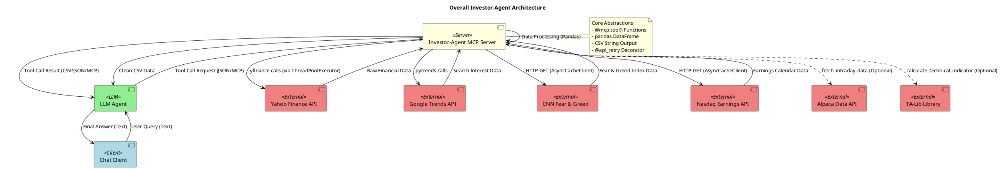

# investor-agent - In-Depth Source Code Analysis

## Phase 1: Global Scan & Planning

### 1.1. Full Directory Structure

```
The project exhibits a highly streamlined and focused directory structure, typical for a single-purpose Model Context Protocol (MCP) server application.

```
/home/ubuntu/investor-agent
├── .git/                     # Git version control metadata, used for tracking changes.
├── .github/                  # Contains GitHub Actions workflows, specifically for continuous integration and publishing.
├── .gitignore                # Defines files and directories to be excluded from version control.
├── .python-version           # Specifies the required Python version (e.g., 3.11) for environment consistency.
├── LICENSE                   # The open-source license under which the project is distributed.
├── README.md                 # Primary documentation, providing setup instructions and usage examples.
├── chat.py                   # The client-side demonstration script, used to interact with the MCP server via an LLM agent.
├── investor_agent/           # The core Python package containing the server logic.
│   ├── __init__.py           # Package initialization file (currently empty).
│   └── server.py             # The main implementation file for the Investor-Agent MCP server.
├── pyproject.toml            # Project configuration file, managing dependencies, build system, and metadata.
└── uv.lock                   # Dependency lock file generated by the `uv` package manager, ensuring reproducible builds.
```

**Annotation:**
The structure is minimal, emphasizing a single, core function. The **`investor_agent/`** directory is the sole source code package, with all server logic consolidated into **`server.py`**. This file is responsible for initializing the `FastMCP` server, defining all the financial data tools, and handling external API integrations. The **`chat.py`** file is crucial for understanding the project's execution context, as it demonstrates how an LLM agent connects to and utilizes the MCP server via standard I/O (`MCPServerStdio`). The use of `pyproject.toml` and `uv.lock` indicates a modern approach to Python dependency management, prioritizing reproducible environments. The overall design is highly modular, with the entire financial logic encapsulated within the `investor_agent` package, making it easy to deploy and integrate as a specialized tool.
```

### 1.2. Core Folders for Analysis

*   **`/home/ubuntu/investor-agent/investor_agent`**: Contains the primary source code for the Investor-Agent MCP server. This is where all the financial data retrieval and analysis tools are implemented and exposed to the Large Language Model (LLM).
*   **`/home/ubuntu/investor-agent`**: The root directory contains the essential client-side demonstration script (`chat.py`), which is necessary for understanding the project's execution and communication flow with the MCP server.

## Phase 2: Module-by-Module Deep Analysis

## Module: investor_agent (Core MCP Server)

### File Enumeration
*   `/home/ubuntu/investor-agent/investor_agent/server.py` (748 lines)
*   `/home/ubuntu/investor-agent/investor_agent/__init__.py` (1 line, empty)

### Core Responsibility
The `investor_agent` module functions as a **Model Context Protocol (MCP) server**, providing a specialized suite of financial data and analysis tools to a Large Language Model (LLM). Its core purpose is to abstract the complexities of multiple external financial APIs (Yahoo Finance, Google Trends, Nasdaq, etc.) and data processing libraries (`pandas`, `talib`), exposing their capabilities as clean, reliable, and LLM-consumable functions (tools).

### Key Implementation Details (`server.py`)

#### 1. Initialization and Utilities
The file begins by initializing the `FastMCP` server instance: `mcp = FastMCP("Investor-Agent", dependencies=["yfinance", "pandas", "pytrends"])`. It also includes utility functions critical for data integrity and network resilience:
*   **`api_retry` Decorator**: A unified, robust retry mechanism using `tenacity`. It implements exponential backoff and specifically handles rate-limiting errors (`YFRateLimitError`) and common HTTP errors (5xx, 429), ensuring high reliability for external API calls.
*   **HTTP Client**: `create_async_client` utilizes `httpx` and `hishel.httpx.AsyncCacheClient` to provide an asynchronous, cached HTTP client, improving performance and reducing load on external servers.
*   **Data Cleaning**: The `to_clean_csv(df: pd.DataFrame) -> str` function is essential. It cleans DataFrames by removing empty columns and converts the result to a clean, index-less CSV string, which is the project's optimized format for LLM consumption.
*   **Validation**: Functions like `validate_ticker` and `validate_date` ensure input parameters are correctly formatted before API calls are made.

#### 2. Core MCP Tools (Financial Data Retrieval)
The module exposes numerous tools, primarily using `yfinance` and web scraping:

| Tool Name | Core Function | Data Source | Concurrency/Optimization |
| :--- | :--- | :--- | :--- |
| `get_ticker_data` | Comprehensive data (info, news, calendar, recommendations). | `yfinance` | Uses `ThreadPoolExecutor` to run multiple blocking `yfinance` calls in parallel. |
| `get_price_history` | Historical OHLCV data. | `yfinance` | Simple wrapper for `yf_call`. |
| `get_financial_statements` | Income, balance, and cash flow statements. | `yfinance` | Uses `ThreadPoolExecutor` for parallel fetching of different statement types. |
| `get_options` | Options chain data. | `yfinance` | Uses `ThreadPoolExecutor` to fetch options chains for multiple expiry dates concurrently. |
| `get_market_movers` | Top gainers, losers, and most active stocks. | Yahoo Finance (Web Scraping) | Uses `fetch_text` and `pandas.read_html` to parse data from Yahoo Finance web pages. |
| `get_nasdaq_earnings_calendar` | Earnings announcements for a specific date. | Nasdaq API | Uses `fetch_json` with custom headers. |
| `get_cnn_fear_greed_index` | Current and historical Fear & Greed index data. | CNN API | Uses `fetch_json`. |
| `get_google_trends` | Relative search interest for keywords. | `pytrends` | Uses the `pytrends` library to build and fetch payload. |

#### 3. Optional Tools (Conditional Registration)
The module demonstrates excellent modularity by conditionally registering tools based on dependency availability:
*   **`calculate_technical_indicator`**: Only registered if `talib` is installed. It uses `yfinance` data and `talib` functions (SMA, EMA, RSI, MACD, BBANDS) to calculate technical indicators, returning both price and indicator data as separate CSV strings.
*   **`fetch_intraday_data`**: Only registered if `alpaca-py` is installed. It uses Alpaca's API for high-resolution intraday data, requiring `ALPACA_API_KEY` and `ALPACA_API_SECRET` environment variables.

## Client: chat.py (Demonstration Interface)

### File Enumeration
*   `/home/ubuntu/investor-agent/chat.py` (58 lines)

### Core Responsibility
The `chat.py` file is a **client-side demonstration** script. It illustrates the standard pattern for connecting an LLM-based agent to the `Investor-Agent` MCP server, providing a simple, interactive command-line chat interface.

### Key Implementation Details
The script uses the `pydantic_ai` library:
1.  **Server Connection**: It launches the `investor-agent` server as a subprocess using `MCPServerStdio('uv', args=['run', 'investor-agent', 'stdio'], ...)`. This establishes the communication bridge over standard I/O.
2.  **Agent Initialization**: An `Agent` is created, and the `MCPServerStdio` instance is passed as a toolset: `agent = Agent(model_identifier, toolsets=[server])`.
3.  **Chat Loop**: The `main` asynchronous function manages the interactive loop, taking user input and calling `agent.run()` to process the query. This is where the LLM decides whether to use the tools provided by the MCP server. The script ensures a graceful exit and basic error logging.

### Module PlantUML Diagrams

# investor_agent Module Diagram

@startuml
title Investor-Agent Module Class Diagram

package "investor_agent" {
    class FastMCP as InvestorAgent {
        + mcp : FastMCP
        + run()
    }

    component "HTTP Client Utilities" as HttpUtils {
        + create_async_client() : AsyncCacheClient
        + fetch_json(url) : dict
        + fetch_text(url) : str
    }

    component "Data Utilities" as DataUtils {
        + validate_ticker(ticker) : str
        + validate_date(date_str) : date
        + to_clean_csv(df) : str
        + api_retry(func) : func
    }

    component "YFinance Wrapper" as YFinanceWrapper {
        + yf_call(ticker, method, ...)
        + get_options_chain(ticker, expiry, type) : DataFrame
    }

    component "Concurrency Manager" as ThreadPool {
        + ThreadPoolExecutor
    }

    component "Pandas Data Structure" as DataFrame {
        + DataFrame
    }

    InvestorAgent --> HttpUtils : uses
    InvestorAgent --> DataUtils : uses
    InvestorAgent --> YFinanceWrapper : uses

    ' Tools - functions exposed to the LLM
    package "MCP Tools" {
        class get_ticker_data {
            + get_ticker_data(ticker, ...) : dict
        }
        class get_financial_statements {
            + get_financial_statements(ticker, ...) : dict
        }
        class get_market_movers {
            + get_market_movers(category, ...) : str
        }
        class get_google_trends {
            + get_google_trends(keywords, ...) : str
        }
        class get_options {
            + get_options(ticker, ...) : str
        }
        class get_nasdaq_earnings_calendar {
            + get_nasdaq_earnings_calendar(date, ...) : str
        }
        class get_cnn_fear_greed_index {
            + get_cnn_fear_greed_index(...) : dict
        }
        class calculate_technical_indicator {
            + calculate_technical_indicator(ticker, indicator, ...) : dict
        }
    }

    get_ticker_data ..> YFinanceWrapper : calls
    get_ticker_data ..> ThreadPool : uses for parallel calls
    get_financial_statements ..> YFinanceWrapper : calls
    get_financial_statements ..> ThreadPool : uses for parallel calls
    get_market_movers ..> HttpUtils : calls fetch_text
    get_google_trends ..> YFinanceWrapper : calls
    get_options ..> YFinanceWrapper : calls
    get_nasdaq_earnings_calendar ..> HttpUtils : calls fetch_json
    get_cnn_fear_greed_index ..> HttpUtils : calls fetch_json

    ' All tools return or process DataFrames
    "MCP Tools" ..> DataFrame : processes/returns CSV from
    YFinanceWrapper ..> DataFrame : returns
    HttpUtils ..> DataFrame : processes HTML tables
    DataUtils ..> DataFrame : cleans/converts
}

@enduml

## Phase 3: Overall Architecture & Summary

### 3.1. Overall Architecture Analysis

#### 3.1.1. Core Abstractions

The Investor-Agent is fundamentally an **LLM-Tooling** project built upon the **Model Context Protocol (MCP)**, which shapes its core abstractions and design philosophy.

**Core Abstractions:**
1.  **The Tool (MCP Function)**: The most critical abstraction is the function decorated with `@mcp.tool()` in `server.py`. This abstracts away the complexity of API interaction, data cleaning, and error handling, presenting a clean, self-contained, and well-documented interface to the LLM. Each tool encapsulates a specific financial data task, such as retrieving historical prices or financial statements.
2.  **The Data Frame (Pandas)**: Internally, the `pandas.DataFrame` is the central data structure. It abstracts raw, often messy API responses (JSON, HTML tables) into a structured, manipulable tabular format. This allows for consistent data processing, cleaning, and transformation.
3.  **The CSV String (LLM Output)**: The final output abstraction is the CSV string, generated by the `to_clean_csv` utility. This is a deliberate design choice to ensure the data returned to the LLM is highly structured, easily parsable, and token-efficient, which is crucial for reliable LLM reasoning and cost-effectiveness.

**Design Philosophy:**
The project adheres to the philosophy of **"Specialized, Reliable, and LLM-Optimized."**
*   **Specialized**: The agent focuses exclusively on financial data, integrating multiple specialized libraries (`yfinance`, `pytrends`, `talib`, `alpaca-py`) to provide deep domain expertise.
*   **Reliable**: Reliability is achieved through the robust, unified **`@api_retry`** mechanism using `tenacity` and the use of an HTTP cache (`hishel`), ensuring resilience against transient network issues and rate-limiting errors common with external financial APIs.
*   **LLM-Optimized**: Data is aggressively cleaned and structured (CSV format) to maximize the LLM's ability to interpret and use the information effectively, minimizing hallucination and improving accuracy.

**Lifecycle Management:**
The lifecycle is managed by the client-server relationship:
1.  **Server Startup**: The `chat.py` client launches the `investor-agent` server as a subprocess using `MCPServerStdio`. The `FastMCP` instance initializes and registers all `@mcp.tool()` functions.
2.  **Execution**: The LLM sends a tool call request, which is executed by the server. Blocking I/O is managed by `ThreadPoolExecutor` to maintain server responsiveness.
3.  **Shutdown**: The server process is terminated when the client exits, ensuring a clean resource release.

#### 3.1.2. Component Interactions

The project operates on a clear three-tier architecture: **Client (LLM Agent) -> MCP Server -> External APIs**. This structure ensures a clean separation of concerns, with the MCP Server acting as a specialized financial data broker for the LLM.

**Component Interactions:**
1.  **Client (`chat.py`) and LLM Agent**: The `chat.py` script serves as the command-line interface, initializing the LLM Agent (`pydantic_ai.Agent`) and injecting the MCP Server as a toolset. The user's text query is passed to the LLM, which then decides whether to invoke one of the available tools.
2.  **LLM Agent and MCP Server (`server.py`)**: This is the core communication channel, utilizing the **Model Context Protocol (MCP)** over standard I/O. The LLM sends a structured JSON request for a tool call (e.g., `get_ticker_data(ticker="TSLA")`), and the MCP Server responds with a JSON object containing the result.
3.  **MCP Server and External APIs**: The server interacts with external services using two primary patterns:
    *   **Synchronous Blocking Calls**: Used for the `yfinance` library (e.g., `yf_call`). To prevent the asynchronous server from blocking, these calls are strategically wrapped in a **`concurrent.futures.ThreadPoolExecutor`** (e.g., in `get_ticker_data`) to execute them concurrently and reduce overall latency.
    *   **Asynchronous HTTP Calls**: Used for general web scraping and API calls (e.g., CNN Fear & Greed, Nasdaq Earnings). These leverage `httpx` and the `AsyncCacheClient` for non-blocking, cached requests.

**Data Flow:**
The data flow is designed to maximize LLM efficiency:
1.  **Inbound**: User Query (Text) -> LLM Agent -> Tool Call Request (JSON) -> MCP Server.
2.  **Processing**: MCP Server receives the request, executes the corresponding Python function, and calls External APIs (e.g., `yfinance.Ticker().history()`). Raw data (JSON, HTML) is received and processed into a **`pandas.DataFrame`**.
3.  **Outbound**: The `pandas.DataFrame` is passed through the `to_clean_csv()` utility, resulting in a clean, structured **CSV String**. This CSV String (or a structured dictionary) is wrapped in a JSON Tool Call Response and sent back to the LLM Agent for final reasoning and text generation. This CSV-centric output is a critical design choice for reliable LLM consumption.

### 3.2. Overall Architecture PlantUML Diagram



### 3.3. Design Patterns & Highlights

#### 3.3.1. Design Patterns

The codebase, despite its minimal size, effectively utilizes several established software design patterns to enhance robustness, modularity, and maintainability.

1.  **Adapter Pattern**
    *   **Description**: Converts the interface of a class into another interface clients expect.
    *   **Implementation**: The entire `server.py` module acts as an Adapter layer. It takes the raw, often complex and inconsistent APIs of `yfinance`, `pytrends`, and various web endpoints, and adapts them into a uniform, simple, and LLM-friendly interface of `@mcp.tool()` functions that return clean CSV strings.
    *   **Code Example (Implicit in `server.py`):** The `yf_call` function (lines 117-121) is a micro-adapter that wraps various `yfinance.Ticker` methods (`get_info`, `history`, `option_chain`) into a single, retry-enabled function call, standardizing access to the underlying library.

2.  **Decorator Pattern**
    *   **Description**: Attaches additional responsibilities to an object dynamically and transparently.
    *   **Implementation**: The **`@api_retry`** decorator (lines 51-64) is a critical implementation of this pattern. It wraps core API-calling functions (`fetch_json`, `fetch_text`, `yf_call`) with robust error handling and retry logic using the `tenacity` library, without altering the core logic of the wrapped functions.
    *   **Code Example (server.py:51-53, 75):**
        ```python
        # Decorator definition
        def api_retry(func):
            return retry(
                stop=stop_after_attempt(3),
                # ... retry logic ...
            )(func)

        # Decorator usage
        @api_retry
        async def fetch_json(url: str, headers: dict | None = None) -> dict:
            """Generic JSON fetcher with retry logic."""
            # ...
        ```

3.  **Strategy Pattern (Conditional Registration)**
    *   **Description**: Defines a family of algorithms, encapsulates each one, and makes them interchangeable.
    *   **Implementation**: The conditional registration of optional tools (`calculate_technical_indicator` and `fetch_intraday_data`) based on the availability of `talib` and `alpaca-py` (lines 613-614, 662-663) allows the server to dynamically switch its available capabilities (strategies) based on the user's installed environment. This makes the core agent lightweight while allowing for powerful extensions.
    *   **Code Example (server.py:662-663):**
        ```python
        # Only register the technical indicator tool if TA-Lib is available
        if _ta_available:
            @mcp.tool()
            def calculate_technical_indicator(...):
                # ... TA-Lib logic ...
        ```

#### 3.3.2. Project Highlights

The Investor-Agent project demonstrates several innovative and flexible design choices that contribute to its effectiveness as an LLM tool.

*   **Robustness and Resilience via Unified Retry Mechanism**:
    *   The project implements a single, unified **`@api_retry`** decorator using `tenacity`. This decorator is applied to all external API calls (`yfinance`, `fetch_json`, `fetch_text`). This centralized approach ensures that the agent can reliably handle the common fragility of external financial APIs, including network timeouts, transient errors, and specific rate-limiting exceptions (`YFRateLimitError`), with automatic exponential backoff.

*   **LLM-Centric Data Formatting (CSV Optimization)**:
    *   The aggressive use of `pandas` and the custom **`to_clean_csv`** utility is a key highlight. This utility removes empty columns and converts the resulting DataFrame into a clean, index-less CSV string. This structured, minimal format is highly optimized for LLM consumption, minimizing token usage and maximizing the LLM's ability to accurately parse and reason over the data.

*   **Performance Optimization through Concurrency**:
    *   The strategic use of **`concurrent.futures.ThreadPoolExecutor`** within asynchronous tool functions (e.g., `get_ticker_data`, `get_financial_statements`) is a significant performance feature. It allows multiple blocking `yfinance` calls to execute in parallel, drastically reducing the total latency for comprehensive data requests and preventing the asynchronous server from being blocked.

*   **Extensibility and Modularity via Conditional Registration**:
    *   The core MCP design promotes extensibility, but the conditional registration of optional tools (e.g., `calculate_technical_indicator` for TA-Lib and `fetch_intraday_data` for Alpaca) is a sophisticated modularity feature. This allows users to install only the dependencies they need, keeping the core agent lightweight while enabling powerful, specialized extensions.

*   **Asynchronous Caching for Web Requests**:
    *   The use of **`hishel.httpx.AsyncCacheClient`** provides automatic, persistent caching for all web-scraped and general API data. This reduces the load on external servers, speeds up repeated requests for static data, and further enhances the agent's reliability and performance.

### 3.4. Summary & Recommendations

#### 3.4.1. Potential Improvements

The Investor-Agent is well-engineered for robustness, but several architectural and code quality improvements could further enhance its performance and maintainability.

1.  **Asynchronous `yfinance` Integration**:
    *   **Issue**: The current implementation wraps blocking `yfinance` calls in a `ThreadPoolExecutor`. While functional, this adds overhead and is less idiomatic for an `async` server.
    *   **Suggestion**: Explore using an asynchronous wrapper for `yfinance` (if available) or migrating to a fully asynchronous financial data library. This would eliminate the need for the `ThreadPoolExecutor`, simplifying the code and improving the server's overall non-blocking performance.

2.  **Standardized Data Output Schema (Pydantic)**:
    *   **Issue**: Complex tools like `get_ticker_data` return a raw dictionary, which lacks strong type checking and requires the LLM to infer the structure.
    *   **Suggestion**: Define explicit Pydantic models for the output of complex tools. MCP supports Pydantic models, which would provide a reliable, strongly-typed contract for the LLM, reducing ambiguity and improving the reliability of tool-use reasoning.

3.  **Centralized Configuration Management**:
    *   **Issue**: API keys and settings (e.g., Alpaca credentials) are managed via environment variables, which can be scattered and difficult to manage in complex deployments.
    *   **Suggestion**: Implement a dedicated configuration library (e.g., Pydantic Settings or `python-decouple`) to manage settings centrally. This would improve security, allow for environment-specific configuration files, and make the application easier to deploy in various environments.

4.  **Enhanced Error Reporting Detail**:
    *   **Issue**: The `api_retry` mechanism is robust, but the final error message to the LLM can be generic (e.g., "Failed to retrieve data").
    *   **Suggestion**: Enhance exception handling within each tool to provide more specific, actionable error messages to the LLM (e.g., "Ticker 'XYZ' not found on Yahoo Finance" or "Invalid date range provided"). This allows the LLM to better self-correct or provide more informative feedback to the user.

#### 3.4.2. Secondary Development Guide

The Investor-Agent is highly modular and designed for easy extension via the Model Context Protocol (MCP). Secondary development should focus on adding new `@mcp.tool()` functions to expand the agent's financial data capabilities.

1.  **Setup and Environment**:
    *   Clone the repository and install dependencies using the project's preferred package manager (e.g., `uv pip install -e .`).
    *   Set up necessary environment variables, such as `ALPACA_API_KEY` and `ALPACA_API_SECRET`, if the optional Alpaca tool is to be used.
    *   Test the existing functionality by running the client with `python chat.py`.

2.  **Adding a New Financial Tool**:
    *   **Locate `investor_agent/server.py`**. All new tool logic must be implemented here.
    *   **Define the Function**: Create a new asynchronous function that encapsulates the data retrieval logic (e.g., fetching data from a new API).
    *   **Apply Decorator**: Decorate the function with `@mcp.tool()` to expose it to the LLM.
    *   **Implement Robustness**: Ensure all external API calls within the function are wrapped with the `@api_retry` decorator to inherit the project's error handling and retry logic.
    *   **Format Output**: Use `pandas` for data manipulation and ensure the final return value is a clean, structured CSV string via `to_clean_csv(df)` or a well-defined dictionary/Pydantic model, as this is the preferred format for LLM consumption.

3.  **Dependency Management**:
    *   If a new tool requires a new library, add it to `pyproject.toml`. If the dependency is optional, implement conditional registration in `server.py` (similar to TA-Lib and Alpaca) to maintain a lightweight core for users who do not need the feature.

