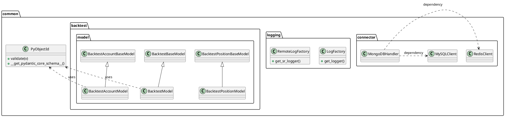
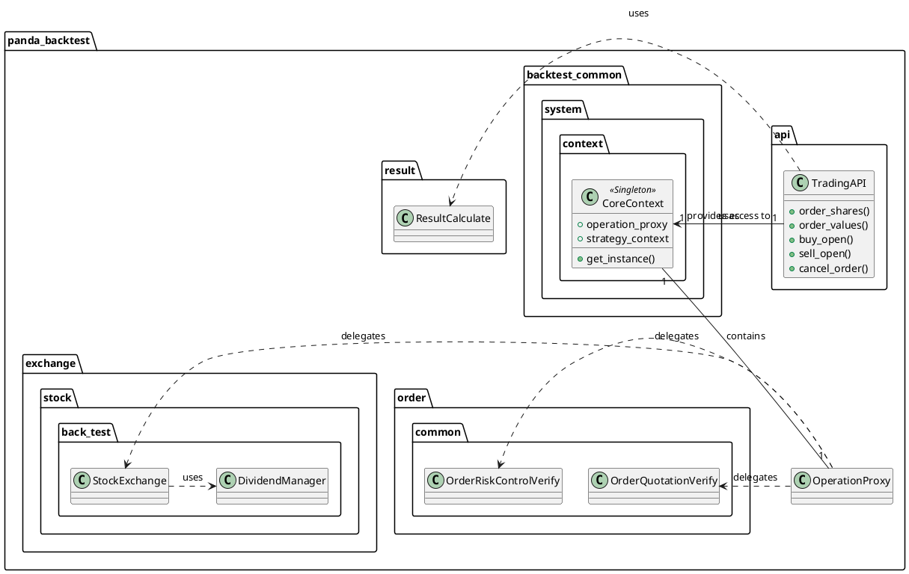
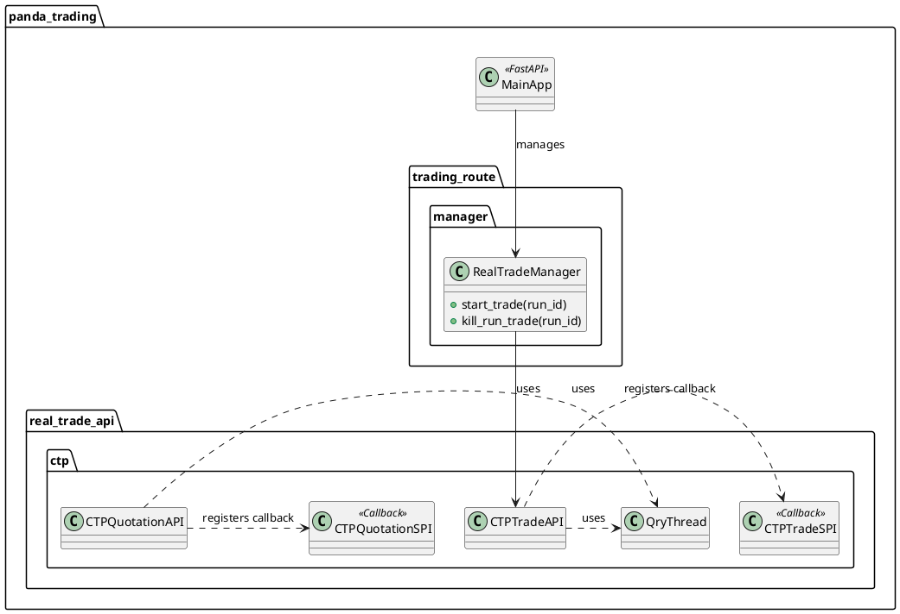
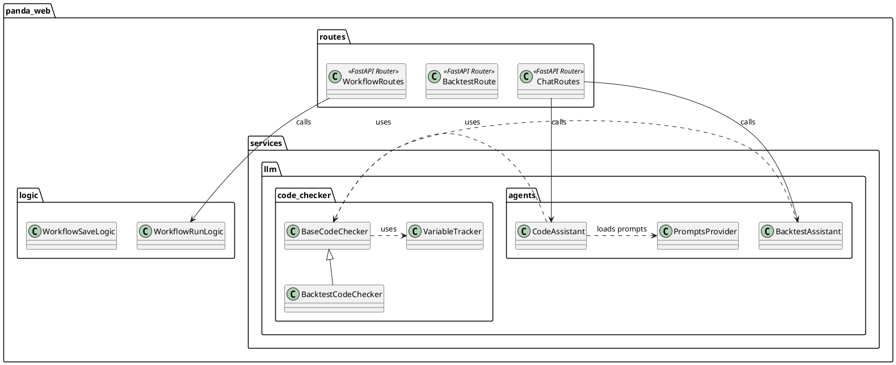
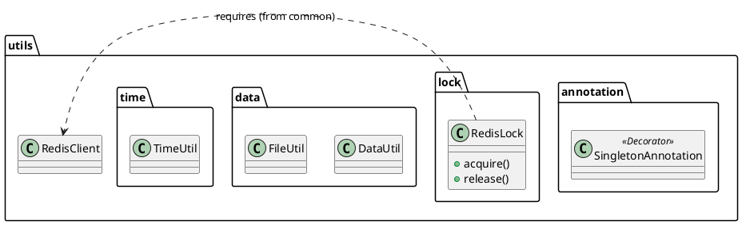
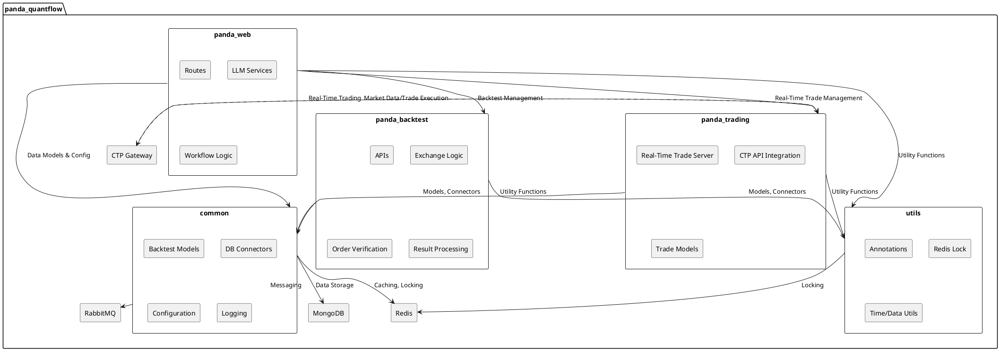

# panda_quantflow - In-Depth Source Code Analysis

## Phase 1: Global Scan & Planning

### 1.1. Full Directory Structure

```
The project, `panda_quantflow`, exhibits a clear, multi-layered structure typical of a complex Python application that combines a web interface, a backtesting engine, and a real-time trading service. The root directory contains standard project files (`.gitignore`, `Dockerfile`, `pyproject.toml`) and the main source code under the `src` directory.

The `src` directory is divided into four primary, high-level modules: `common`, `panda_backtest`, `panda_trading`, and `panda_web`, along with a `utils` module.

*   **`src/common`**: This module serves as the foundational infrastructure layer. It houses generic components like data models for backtest results (`backtest/model`), database connection handlers (`connector` for MongoDB, MySQL, Redis), system configuration (`config`), and logging utilities. This module is designed for reusability across the backtesting and trading services.
*   **`src/panda_backtest`**: This is the core backtesting engine. It is highly structured, containing the user-facing trading APIs (`api`), the core context and constant definitions (`backtest_common`), a robust exception handling system (`exception`), and the simulated exchange logic (`exchange`) for various asset classes (stock, future, fund). It also includes the logic for order verification and result processing.
*   **`src/panda_trading`**: This module is dedicated to real-time trading execution. It includes a FastAPI application (`__main__.py`) to manage trade processes, data models for real-time accounts, and the critical integration with external trading gateways, notably the CTP (China Futures Trading) API (`real_trade_api/ctp`). It also contains logic for trade monitoring and routing.
*   **`src/panda_web`**: This module functions as the application's web backend and API gateway. It defines the FastAPI routes (`routes`) for user interaction (backtest management, workflow control, chat), the business logic (`logic`) for handling these routes, and a sophisticated LLM-powered service layer (`services/llm`) for code assistance and strategy generation. The presence of static assets suggests it also serves the frontend.
*   **`src/utils`**: This module contains miscellaneous, general-purpose utilities that are not specific to trading or backtesting, such as annotation helpers (e.g., for Singleton), data manipulation tools, Redis-based distributed locking, and threading helpers.

This structure clearly separates concerns: **Infrastructure** (`common`, `utils`), **Simulation Logic** (`panda_backtest`), **Real-Time Execution** (`panda_trading`), and **User Interface/API** (`panda_web`).

```
/home/ubuntu/panda_quantflow
├── .git/
├── Dockerfile
├── README.md
├── pyproject.toml
└── src/
    ├── common/ (Infrastructure: Models, DB Connectors, Config)
    │   ├── backtest/model/ (Pydantic models for backtest data)
    │   ├── config/ (Project configuration)
    │   ├── connector/ (MongoDB, MySQL, Redis clients)
    │   ├── cron/ (Scheduled task management)
    │   ├── logging/ (System and user logging)
    │   └── utils/ (General common utilities)
    ├── panda_backtest/ (Backtesting Engine Core)
    │   ├── api/ (User-facing trading APIs)
    │   ├── backtest_common/ (Core context, constants, data structures)
    │   ├── exception/ (Custom exception handling)
    │   ├── exchange/ (Simulated exchange logic for assets)
    │   ├── model/ (Quotation and result models)
    │   ├── order/ (Order verification and building)
    │   ├── result/ (Backtest result calculation)
    │   ├── system/ (Core context and time management)
    │   └── util/ (Backtest-specific utilities)
    ├── panda_trading/ (Real-Time Trading Service)
    │   ├── models/ (Real-time trade models)
    │   ├── real_trade_api/ctp/ (CTP API integration)
    │   ├── trading/ (Core real-time trading logic)
    │   ├── trading_account_monitor/ (Account monitoring service)
    │   └── trading_route/ (Trade management server)
    ├── panda_web/ (Web API and LLM Services)
    │   ├── logic/ (Business logic for API routes)
    │   ├── messaging/ (RabbitMQ consumers)
    │   ├── models/ (API request/response models)
    │   ├── routes/ (FastAPI endpoints)
    │   └── services/llm/ (LLM Agents and Code Checkers)
    └── utils/ (General Utilities: Lock, Thread, Time)
```
```

### 1.2. Core Folders for Analysis

*   `/home/ubuntu/panda_quantflow/src/common`: Foundational components, including backtest data models, database connectors (MongoDB, Redis, MySQL), configuration, and logging utilities. This forms the core infrastructure layer.
*   `/home/ubuntu/panda_quantflow/src/panda_backtest`: The comprehensive backtesting engine. It contains the trading APIs, core context management, data structures for accounts and positions, exception handling, and the logic for simulating various financial instruments (stock, future, fund).
*   `/home/ubuntu/panda_quantflow/src/panda_trading`: The real-time trading module. This includes the FastAPI server for trade management, models for real-time accounts, and the critical integration with external trading gateways, specifically the CTP (China Futures Trading) API.
*   `/home/ubuntu/panda_quantflow/src/panda_web`: The web application backend. It hosts the FastAPI routes, the business logic for managing workflows, and the advanced LLM-powered services (assistants and code checkers).
*   `/home/ubuntu/panda_quantflow/src/utils`: A collection of general-purpose utility functions, including singleton annotation, file/data manipulation, Redis-based distributed locking, logging factory, and threading utilities.

## Phase 2: Module-by-Module Deep Analysis

The project is logically partitioned into four main Python modules, each with distinct responsibilities, supported by a general `utils` module.

### 1. Module: `src/common`
**Core Responsibility**: Provides the fundamental infrastructure, data models, and connectivity services used by the higher-level backtesting and trading modules. It acts as the shared foundation of the application.

**Key Files and Responsibilities**:
*   `backtest/model/*.py`: Defines Pydantic models (`BacktestAccountModel`, `BacktestModel`, `BacktestPositionModel`, etc.) for persistent backtest data, often stored in MongoDB. The custom `PyObjectId` class handles MongoDB ID serialization.
*   `connector/mongodb_handler.py`: Manages the connection and CRUD operations for MongoDB, the primary data store for models and results.
*   `connector/redis_client.py`: Provides a client for Redis, used for caching, session management, and message queuing.
*   `config/config.py`, `config/project.py`: Handles application configuration loading and access.
*   `logging/system_logger.py`, `logging/user_logger.py`: Implements distinct logging mechanisms for internal system events and user-facing strategy logs.

**Implementation Details**: The module heavily relies on **Pydantic** for data integrity and **MongoDB** as the primary document store. The separation of system and user logging is a crucial feature for a platform where user-written code (strategies) is executed.

### 2. Module: `src/panda_backtest`
**Core Responsibility**: The complete backtesting engine, responsible for simulating trading strategies against historical data, managing virtual accounts, and calculating performance metrics.

**Key Files and Responsibilities**:
*   `api/api.py`: The main entry point for user-written strategies, exposing high-level functions like `order_shares`, `order_values`, `buy_open`, and `cancel_order`.
*   `backtest_common/system/context/core_context.py`: The central **Singleton** class that holds the state of the current backtest run.
*   `backtest_common/exchange/stock/back_test/stock_exchange.py`: Contains the core logic for simulating stock market operations (e.g., handling dividends, splits, and trade execution).
*   `order/common/order_quotation_verify.py`: Logic to check if an order is valid based on current market data (e.g., price limits).
*   `result/result_calculate.py`: Computes final backtest performance metrics (Sharpe ratio, Max Drawdown, Alpha, etc.).

**Implementation Details**: The module implements a complex simulation environment. The trading APIs are generic, relying on the `CoreContext` to dispatch actions to the appropriate simulated exchange logic. The extensive use of sub-modules for different asset types (`fund`, `future`, `stock`) and logic layers (`exchange`, `order`, `result`) demonstrates a high degree of modularity.

### 3. Module: `src/panda_trading`
**Core Responsibility**: Manages real-time trading execution, primarily focusing on the integration with external trading gateways like CTP (China Futures Trading Platform).

**Key Files and Responsibilities**:
*   `__main__.py`: The entry point for the real-time trading service, which runs a **FastAPI** server to receive commands (start/stop trade).
*   `trading_route/manager/real_trade_manager.py`: Manages the lifecycle of real-time trading processes.
*   `real_trade_api/ctp/*.py`: Contains the CTP-specific implementation, including the `ctp_trade_api.py` and `ctp_quotation_api.py` for trade and market data, and the corresponding SPI (Service Provider Interface) classes (`ctp_trade_spi.py`, `ctp_quotation_spi.py`) to handle asynchronous callbacks from the CTP gateway.
*   `models/trading/trading_future_account.py`: Pydantic model for real-time future trading accounts.

**Implementation Details**: This module is a dedicated microservice. It uses a **Producer-Consumer Pattern** where the `panda_web` module acts as the producer (sending start/stop commands) and this module acts as the consumer/executor. The CTP integration is a complex, low-level component that uses a thread-based query mechanism (`qry_thread.py`) to manage synchronous and asynchronous API calls.

### 4. Module: `src/panda_web`
**Core Responsibility**: The user-facing API and business logic layer, including workflow management and advanced LLM-powered features.

**Key Files and Responsibilities**:
*   `routes/*.py`: Defines the FastAPI endpoints for backtesting, trading, workflow management, and chat.
*   `logic/workflow_run_logic.py`: Core business logic for initiating and managing strategy runs.
*   `services/llm/agents/*.py`: Defines the LLM-powered assistants (`backtest_assistant.py`, `code_assistant.py`) that handle user queries and code generation/checking.
*   `services/llm/code_checker/*.py`: Contains logic for static analysis of user-submitted code, including rule definitions and variable tracking.
*   `messaging/workflow_consumer.py`: A consumer that listens to the RabbitMQ queue to process workflow execution tasks.

**Implementation Details**: This module is the application's brain. It implements the **Command Pattern** by translating API requests into internal commands (logic calls) and external messages (RabbitMQ). The LLM service is a sophisticated feature, employing a **Chain of Responsibility** or **Strategy Pattern** to route user requests to the correct assistant and then validate the generated code using the `code_checker` sub-module.

### 5. Module: `src/utils`
**Core Responsibility**: General-purpose, reusable utilities.

**Key Files and Responsibilities**:
*   `annotation/singleton_annotation.py`: Mechanism to easily apply the Singleton pattern to classes.
*   `lock/redis_lock.py`: Implements a distributed lock using Redis, essential for coordinating actions across multiple services (e.g., preventing concurrent updates to the same account).
*   `time/time_util.py`: Utility functions for time and date manipulation.

**Implementation Details**: This module ensures that common, non-domain-specific tasks are centralized and reusable, promoting a DRY (Don't Repeat Yourself) principle across the entire project. The distributed locking mechanism is critical for the integrity of a multi-service financial platform.

### Module PlantUML Diagrams

### Module: `src/common`



### Module: `src/panda_backtest`



### Module: `src/panda_trading`



### Module: `src/panda_web`



### Module: `src/utils`



## Phase 3: Overall Architecture & Summary

### 3.1. Overall Architecture Analysis

#### 3.1.1. Core Abstractions

The **panda_quantflow** project is built upon a set of core abstractions that enforce a clear separation between the trading logic, data management, and application infrastructure.

**1. Core Context and State Management (`CoreContext`)**
The most critical abstraction is the **CoreContext** (`panda_backtest/backtest_common/system/context/core_context.py`), which implements the **Singleton Pattern**. This class serves as the central registry for all runtime components and state within a single backtest or trading run. It encapsulates:
*   **Strategy Context**: Holds run-specific parameters (start date, end date, capital, etc.).
*   **Operation Proxy**: The interface for all trading actions (ordering, canceling, subscribing).
*   **Data Sources**: Access to historical and real-time quotation data.
*   **Account/Position Models**: The current state of the trading account.
This design ensures that all parts of a running strategy have a consistent, single source of truth for the environment and available actions.

**2. Data Modeling (`BaseModel` and `PyObjectId`)**
The project extensively uses **Pydantic's `BaseModel`** for defining data structures, ensuring data validation and clear schema definition across all components.
*   Classes like `BacktestModel`, `FutureAccountModel`, and `WorkflowModel` define the persistent state of the system.
*   The custom **`PyObjectId`** class handles the serialization and validation of MongoDB's `ObjectId` within the Pydantic framework, abstracting away the database-specific ID type for cleaner application logic.

**3. Service Interface (`OperationProxy` and LLM Agents)**
The **OperationProxy** acts as a facade, providing a unified interface for trading operations while hiding the complexity of order verification, risk control, and exchange interaction. This allows the strategy code to remain clean and agnostic to the underlying execution environment (backtest simulation vs. real-time CTP connection).

The **LLM Agents** (`panda_web/services/llm/agents`) are a key abstraction for the AI-powered features. Agents like `CodeAssistant` and `BacktestAssistant` abstract the complex logic of interacting with large language models, prompt engineering, and code checking (`code_checker`) into simple, callable services.

**4. Lifecycle Management**
The lifecycle of a strategy run is managed by the **Workflow Logic** in `panda_web`.
*   **Start**: A request triggers `workflow_run_logic.py`, which prepares the environment and dispatches the task via RabbitMQ.
*   **Execution**: The consumer process (`panda_backtest` or `panda_trading`) initializes the `CoreContext` and executes the strategy.
*   **End**: The execution process saves the final results to MongoDB and updates the run status, completing the lifecycle. The use of `uvicorn` and `FastAPI` in `panda_trading` also suggests a managed, long-running service lifecycle for real-time execution.

#### 3.1.2. Component Interactions

The system operates as a multi-component service-oriented architecture, primarily communicating through internal Python function calls, database interactions, and a message queue.

**1. Web-to-Logic Flow (Workflow Execution)**
The primary entry point is the `panda_web` module, which exposes FastAPI routes (`routes`).
*   A user request (e.g., to run a backtest or a real-time strategy) hits a route in `panda_web/routes`.
*   The route calls the corresponding business logic in `panda_web/logic` (e.g., `workflow_run_logic.py`).
*   The logic layer uses the `common` module's database connectors (e.g., `mongodb_handler.py`) to retrieve workflow and strategy details.
*   For execution, the logic layer likely sends a message to a message queue (RabbitMQ, via `panda_web/messaging/rabbitmq_client.py`) to trigger the actual backtest or trading service.

**2. Backtest Execution Flow**
*   The `panda_backtest` module, likely running as a consumer process (`workflow_consumer.py`), receives the execution message.
*   It initializes the core context (`CoreContext` in `panda_backtest/backtest_common/system/context/core_context.py`).
*   The strategy code is executed, making calls to the high-level trading APIs (`panda_backtest/api/api.py`).
*   These APIs delegate operations (e.g., `order_shares`, `cancel_order`) to an `OperationProxy` instance within the `CoreContext`.
*   The `OperationProxy` orchestrates the process:
    *   **Order Verification**: Calls modules in `panda_backtest/order` (e.g., `order_quotation_verify.py`, `order_risk_control_verify.py`) to check limits and risk.
    *   **Exchange Simulation**: Interacts with the simulated exchange logic in `panda_backtest/backtest_common/exchange` to update account and position models.
    *   **Data Persistence**: Uses `common/connector` to save results (`BacktestModel`, `BacktestAccountModel`, etc.) to MongoDB.

**3. Real-Time Trading Flow**
*   The `panda_trading` module runs a dedicated FastAPI server (`panda_trading/__main__.py`) to manage real-time strategies.
*   The `RealTradeManager` handles starting and stopping trade processes.
*   The core trading logic (`panda_trading/trading/extensions/real_trade/main.py`) uses the CTP API integration (`panda_trading/real_trade_api/ctp`) to connect to the exchange.
*   The CTP SPI (Service Provider Interface) classes (`ctp_trade_spi.py`, `ctp_quotation_spi.py`) handle asynchronous communication with the CTP gateway, receiving market data and trade confirmations.
*   Trade data and account updates are persisted to MongoDB and Redis using the `common` and `utils` modules.

**Key Communication Patterns:**
*   **API Gateway Pattern**: `panda_web` acts as the gateway, routing requests to specialized internal services.
*   **Message Queue (Asynchronous)**: Used for decoupling the web request from the long-running backtest/trading execution.
*   **Shared Database (MongoDB)**: Centralized storage for models, configurations, and results, facilitating communication between services.
*   **Shared Cache (Redis)**: Used for session management, real-time data caching, and distributed locking (`utils/lock/redis_lock.py`).

### 3.2. Overall Architecture PlantUML Diagram



### 3.3. Design Patterns & Highlights

#### 3.3.1. Design Patterns

The codebase demonstrates the application of several common and domain-specific design patterns to manage complexity and enforce structure.

**1. Singleton Pattern**
*   **Implementation**: The `CoreContext` class (`panda_backtest/backtest_common/system/context/core_context.py`) and various logging/factory classes (e.g., `LogFactory`, `RemoteLogFactory`) use the Singleton pattern to ensure a single, globally accessible instance of a resource.
*   **Example**: The `CoreContext.get_instance()` method ensures that all parts of a strategy run access the same environment and state, which is crucial for consistent backtesting and trading. The `utils/annotation/singleton_annotation.py` file suggests a custom decorator or mechanism is used to enforce this pattern.

**2. Factory Pattern**
*   **Implementation**: The `log_factory.py` and `remote_log_factory.py` files in `common/logging` and `panda_backtest/util/log` use the Factory pattern to abstract the creation of logger instances.
*   **Example**: `LogFactory.get_logger()` returns a configured logger instance, decoupling the logging client code from the specific implementation details of the logging system.

**3. Builder Pattern**
*   **Implementation**: The exception handling mechanism uses a Builder pattern to construct complex exception objects.
*   **Example**: `risk_control_exception_builder.py` and `strategy_exception_builder.py` are responsible for assembling detailed, contextualized exception messages and objects, which is a common practice for robust error reporting in financial systems.

**4. Strategy Pattern (Implicit in LLM Services)**
*   **Implementation**: The LLM services are structured to follow the Strategy pattern, where different "assistants" (e.g., `backtest_assistant`, `code_assistant`, `factor_assistant`) implement a common interface (`llm_service.py`) but contain distinct logic for handling different types of user queries.
*   **Example**: The logic files (`backtest_assistant_stream_logic.py`, `code_assistant_nonstream_logic.py`) represent different strategies for fulfilling the assistant's request (streaming vs. non-streaming response).

**5. Data Access Object (DAO) Pattern**
*   **Implementation**: The database connector classes in `common/connector` (`mongodb_handler.py`, `mysql_client.py`, `redis_client.py`) act as Data Access Objects, abstracting the CRUD operations for their respective databases. This isolates the application logic from the specifics of the data persistence layer.

**6. Adapter Pattern**
*   **Implementation**: The `panda_trading` module uses an Adapter pattern to interface with the CTP trading gateway.
*   **Example**: `future_trade_adapter.py` likely translates the project's internal, generic trading commands into the specific data structures and function calls required by the CTP API, allowing the core logic to remain clean. The CTP SPI classes (`ctp_trade_spi.py`, `ctp_quotation_spi.py`) also serve as adapters for the asynchronous CTP callback mechanism.

#### 3.3.2. Project Highlights

The **panda_quantflow** project features several innovative and well-designed aspects that contribute to its flexibility and power as a quantitative trading platform.

*   **Integrated LLM-Powered Code Assistance**: The inclusion of the `services/llm` module is a significant highlight. It provides a **Code Assistant** and **Backtest Assistant** that can generate, check, and debug user-submitted strategy code. This lowers the barrier to entry for users and significantly enhances the development experience by integrating AI-driven static analysis and code generation directly into the platform's workflow. The `code_checker` sub-module, with its rules and variable tracking, is a robust implementation of this feature.

*   **Clear Separation of Concerns (Backtest vs. Real-Time)**: The architecture strictly separates the simulation environment (`panda_backtest`) from the real-time execution environment (`panda_trading`). This is a best practice in quantitative finance, ensuring that the complex, non-deterministic nature of real-time trading (e.g., CTP API callbacks, network latency) does not pollute the deterministic, reproducible environment required for backtesting.

*   **Extensible Trading API via `OperationProxy`**: The core trading functions (e.g., `order_shares`) are exposed through a clean, high-level API in `panda_backtest/api/api.py`. This API delegates all work to an `OperationProxy` within the `CoreContext`. This **Facade/Proxy Pattern** makes the system highly extensible. To support a new exchange or a new backtest feature, one only needs to update the `OperationProxy` implementation without changing the user-facing strategy code.

*   **Robust Infrastructure with Distributed Primitives**: The `common` and `utils` modules provide production-grade infrastructure components. The `RedisLock` utility is critical for maintaining data integrity in a distributed environment, preventing race conditions when multiple services (web, backtest, trading) might be accessing or modifying the same user account or workflow state.

*   **Pydantic-Enforced Data Integrity**: The pervasive use of Pydantic `BaseModel` for all internal and external data structures (models, requests, responses) ensures strong data validation and clear documentation (via FastAPI/Pydantic schema generation). This drastically improves the reliability and maintainability of the entire system.

### 3.4. Summary & Recommendations

#### 3.4.1. Potential Improvements

The project is well-structured but has several areas where architectural clarity, performance, and maintainability could be improved.

**1. Decoupling and Abstraction**
*   **Suggestion**: Introduce a clearer **Repository Pattern** for data access. Currently, the `common/connector` classes are used directly by logic modules. A dedicated repository layer (e.g., `BacktestRepository`, `WorkflowRepository`) would abstract the database operations further, allowing the core logic to be database-agnostic and simplifying unit testing.
*   **Benefit**: Reduces coupling between business logic and the persistence layer (MongoDB/MySQL).

**2. Consistency in Data Handling and Typing**
*   **Suggestion**: Enforce consistent use of Python's native `datetime` objects instead of string representations for dates and times in Pydantic models. The current mix of `Optional[str]` and `Optional[datetime]` for time fields (e.g., in `BacktestBaseModel`) is error-prone.
*   **Benefit**: Improves type safety, simplifies date arithmetic, and prevents runtime parsing errors.

**3. Performance Optimization in Backtesting**
*   **Suggestion**: The backtesting engine should be reviewed for potential performance bottlenecks, especially in data loading and iteration. Consider using vectorized operations with libraries like NumPy or Polars instead of pure Python loops where possible for high-frequency data processing.
*   **Benefit**: Significantly speeds up backtest execution, especially for long time periods or high-resolution data.

**4. Clearer Separation of Concerns in `panda_backtest`**
*   **Suggestion**: The `panda_backtest` module is very large and contains both high-level APIs and low-level exchange simulation logic. Consider splitting it into two distinct modules: `panda_strategy_api` (the user-facing API) and `panda_simulation_core` (the internal engine logic).
*   **Benefit**: Enforces a cleaner boundary between the user-facing interface and the complex internal mechanics, making both easier to maintain and evolve.

**5. LLM Service Robustness**
*   **Suggestion**: Implement robust rate-limiting and caching mechanisms for the LLM services in `panda_web/services/llm`. LLM API calls are expensive and slow. Caching common code check results or prompt responses can reduce cost and latency.
*   **Benefit**: Improves application responsiveness and reduces operational costs associated with external API usage.

#### 3.4.2. Secondary Development Guide

For secondary development, a new developer should focus on the modular structure and core abstractions.

**1. Environment Setup and Configuration**
*   **Configuration**: Start by understanding `common/config/project.py` and the `.ini` files in `panda_trading/trading_route`. All environment-specific settings (database connections, server IPs, CTP credentials) are managed here.
*   **Dependencies**: Ensure all required external services (MongoDB, Redis, RabbitMQ) are running, as the system is highly dependent on them for state and messaging.

**2. Code Exploration Path**
*   **Trading Logic**: To understand how orders are placed, start at `panda_backtest/api/api.py` (for backtest) or `panda_trading/trading/extensions/real_trade/trade` (for real-time). Follow the call chain to the `CoreContext` and `OperationProxy`.
*   **Data Models**: All persistent data structures are defined using Pydantic in `common/backtest/model` and `panda_backtest/backtest_common/model`. Understanding these models is key to tracing data flow.
*   **LLM Integration**: New AI features should be added as new "Agents" in `panda_web/services/llm/agents`, following the pattern of existing assistants. This involves defining new prompts in `prompts_provider.py` and implementing the logic in `logic`.

**3. Best Practices**
*   **Type Consistency**: Maintain strict type hinting using Pydantic models for all data transfer objects (DTOs) and API requests/responses.
*   **Contextual Logging**: Use the provided `SRLogger` (Remote Logger) for all strategy-related output, as this is designed for remote monitoring and user-facing logs.
*   **Avoid Direct DB Calls**: Always interact with the database through the DAO classes in `common/connector` to maintain abstraction and consistency.
*   **Unit Testing**: The `panda_web/services/llm/tests` directory provides examples of how to test the LLM-powered components; ensure new features are covered with similar tests.

