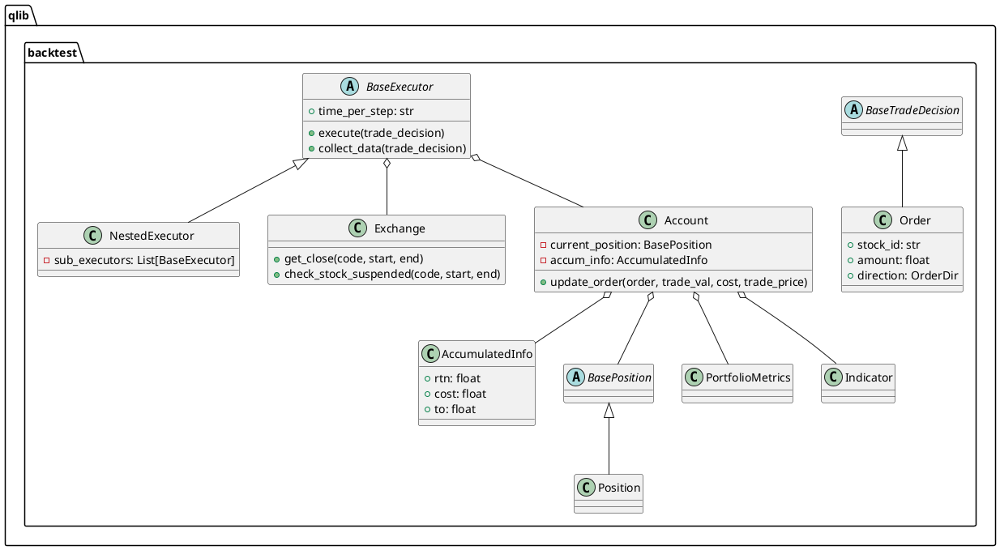
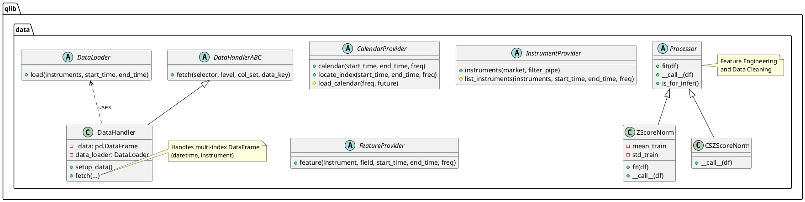
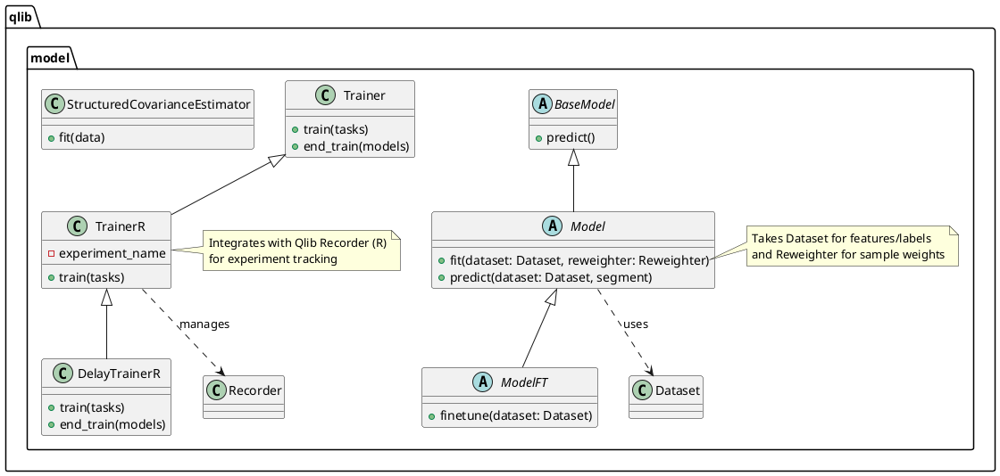
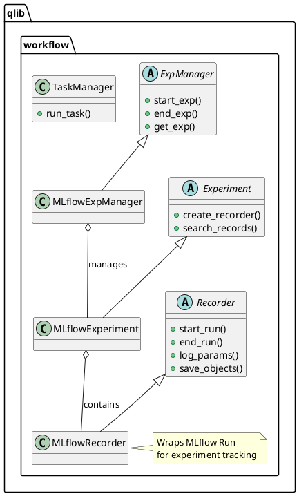
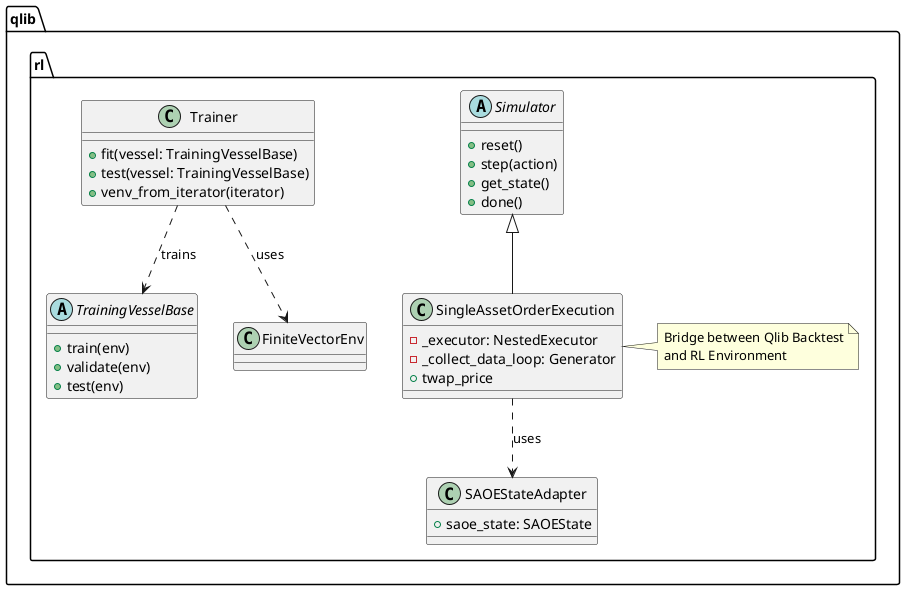
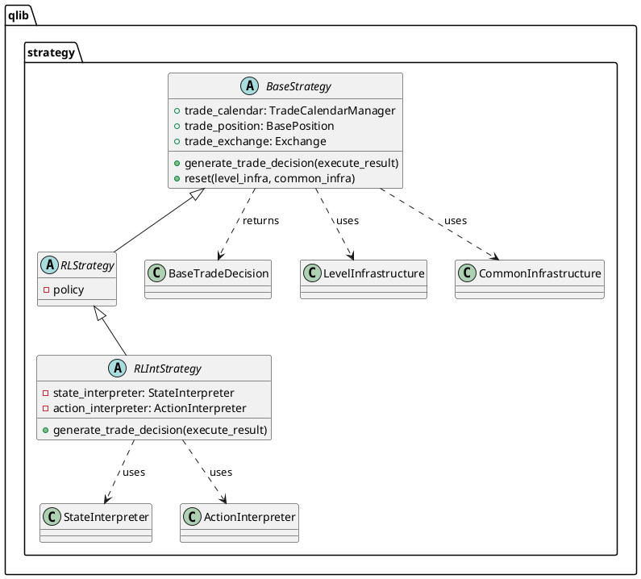
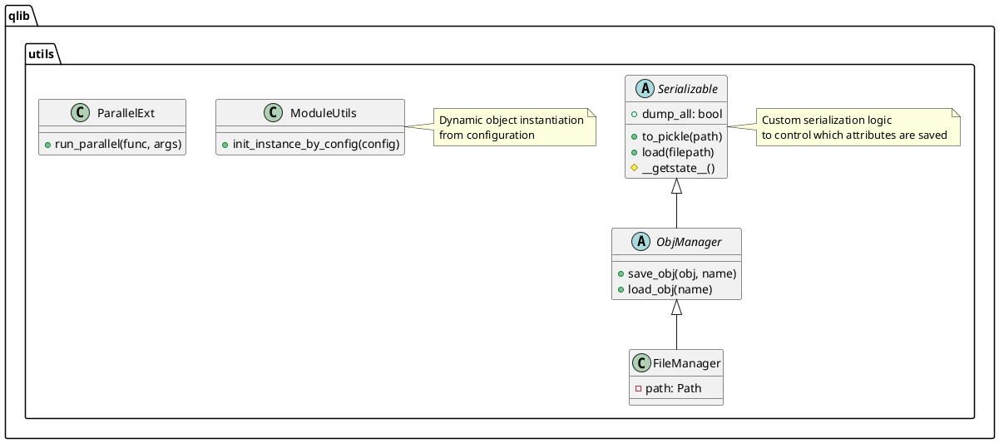

# qlib - In-Depth Source Code Analysis

## Phase 1: Global Scan & Planning

### 1.1. Full Directory Structure

```
The Qlib project, located at `/home/ubuntu/FinnewsHunter/thirdparty/qlib`, is structured as a comprehensive Python package for quantitative investment research. The top-level directory contains the main source code package (`qlib`), along with supporting directories for documentation, examples, and utilities.

The library's core functionality is encapsulated within the `qlib` package, which follows a modular design:

*   **`qlib/`**: This is the core Python package containing the entire library's logic. It is subdivided into modules that represent the main functional components of the quantitative investment platform.
*   **`qlib/backtest`**: The engine for simulating trading strategies, including components for account management, decision making, exchange simulation, position tracking, and performance reporting.
*   **`qlib/data`**: Manages all aspects of data, from storage and caching to dataset creation, filtering, and time-series operations. This module is critical for feature engineering and preventing look-ahead bias.
*   **`qlib/model`**: Contains the base classes and implementations for machine learning models, trainers, and specialized components like risk models and ensemble methods.
*   **`qlib/strategy`**: Defines the interface and base classes for implementing trading strategies, acting as the decision-making layer.
*   **`qlib/workflow`**: Handles the end-to-end management of quantitative experiments, including task recording, result management, and integration with MLflow for reproducibility.
*   **`qlib/rl`**: Dedicated module for Reinforcement Learning applications, particularly in optimal order execution, providing specialized simulators and trainers.
*   **`qlib/utils`**: A collection of general-purpose utilities used across the library, including serialization, dynamic object creation, and time/data helpers.
*   **`examples/`**: Contains various example workflows, tutorials (e.g., Jupyter notebooks), and configuration files demonstrating how to use the Qlib library.
*   **`scripts/`**: Houses utility scripts, primarily for data collection and management, including data collectors for various sources and scripts for dumping and checking data health.
*   **`tests/`**: Contains unit and integration tests for various components, ensuring code quality and reliability.
```

### 1.2. Core Folders for Analysis

*   `/home/ubuntu/FinnewsHunter/thirdparty/qlib/qlib/backtest`: Core backtesting engine components, including account, position, exchange simulation, and execution logic.
*   `/home/ubuntu/FinnewsHunter/thirdparty/qlib/qlib/data`: Data management, storage, feature engineering, and dataset creation.
*   `/home/ubuntu/FinnewsHunter/thirdparty/qlib/qlib/model`: Machine learning model abstraction, training infrastructure, and specialized risk/ensemble models.
*   `/home/ubuntu/FinnewsHunter/thirdparty/qlib/qlib/strategy`: Trading strategy base classes and interfaces for generating trade decisions.
*   `/home/ubuntu/FinnewsHunter/thirdparty/qlib/qlib/workflow`: Experiment management, tracking, and reproducibility via the Recorder system (MLflow-based).
*   `/home/ubuntu/FinnewsHunter/thirdparty/qlib/qlib/rl`: Dedicated components for Reinforcement Learning applications, particularly for optimal order execution.
*   `/home/ubuntu/FinnewsHunter/thirdparty/qlib/qlib/utils`: General utility functions for serialization, dynamic object creation, and parallel processing.
*   `/home/ubuntu/FinnewsHunter/thirdparty/qlib/scripts`: External data collection and management utilities.

## Phase 2: Module-by-Module Deep Analysis

## Module: qlib/backtest

### Core Responsibility
The `qlib/backtest` module is the **core simulation engine** of Qlib, responsible for executing trading strategies against historical data. It manages the trading environment, including the account, positions, market exchange, and the execution of trade decisions. Its primary function is to provide a realistic and high-performance simulation of a quantitative investment strategy's performance over time, including the calculation of detailed portfolio and trading metrics.

### Key Files and Functions
| File | Primary Classes/Functions | Responsibility |
| :--- | :--- | :--- |
| `backtest.py` | `backtest_loop`, `collect_data_loop` | Defines the main backtesting loop, which orchestrates the interaction between the `BaseStrategy` and `BaseExecutor`. It collects portfolio and indicator metrics at the end of the simulation. |
| `executor.py` | `BaseExecutor`, `NestedExecutor` | Abstract base for trade execution. `NestedExecutor` implements the critical **nested decision execution** pattern, allowing for multi-frequency or hierarchical strategies (e.g., daily strategy deciding on minute-level execution). |
| `account.py` | `Account`, `AccumulatedInfo` | Manages the trading account, tracking cash, positions (`BasePosition`), accumulated return, cost, and turnover. It is responsible for updating the account state after each trade and at the end of each trading bar. |
| `decision.py` | `Order`, `BaseTradeDecision` | Defines the fundamental data structures for trading. `Order` represents a single buy/sell instruction. `BaseTradeDecision` is the abstract interface for a strategy's output, which the executor consumes. |
| `exchange.py` | `Exchange` | Simulates the market environment, providing price data, checking for stock suspensions, and calculating the actual trade price and volume based on market conditions and order size. |
| `position.py` | `BasePosition`, `Position` | Tracks the holdings of the account, including the amount and cost basis of each stock. `Position` is the concrete implementation. |
| `report.py` | `Indicator`, `PortfolioMetrics` | Defines the classes for calculating and storing performance metrics, such as alpha, beta, Sharpe ratio, and trading indicators like price advantage (PA) and fulfill rate (FFR). |

### Core Implementation Details
The backtesting process is driven by a generator pattern in `backtest.py`'s `collect_data_loop`. The loop iteratively calls the strategy to generate a `BaseTradeDecision` and then passes it to the executor for processing.

**Nested Execution:** The `NestedExecutor` is a key abstraction. It holds a list of sub-executors, each potentially operating at a different frequency (e.g., day, minute). A decision from an outer (slower) executor is passed down to an inner (faster) executor, which then executes the decision over its own calendar steps. The `Account` object is shallow-copied across nested levels, ensuring that while positions are shared, each level can maintain its own set of trading metrics.

**Order Processing:** An `Order` object is created by the strategy and contains the `stock_id`, `amount` (adjusted), `direction`, and time range. The `Exchange` determines the actual `deal_amount` and `trade_price`. The `Account` then updates its cash and position based on the executed trade, and the `AccumulatedInfo` tracks overall trading statistics. The `Account`'s `_update_state_from_order` method handles the complex calculation of return (`rtn`) and cost, ensuring that the return calculation is consistent with the end-of-bar earning calculation.

**Example: Order Structure**
The `Order` class in `decision.py` uses a `dataclass` and an `IntEnum` (`OrderDir`) for clarity:
```python
@dataclass
class Order:
    stock_id: str
    amount: float
    direction: OrderDir  # OrderDir.SELL or OrderDir.BUY
    start_time: pd.Timestamp
    end_time: pd.Timestamp
    deal_amount: float = 0.0
    factor: Optional[float] = None
```

### Dependencies
The `qlib/backtest` module has critical dependencies on:
*   **`qlib.strategy.base`**: Depends on `BaseStrategy` to receive trade decisions.
*   **`qlib.data`**: Implicitly depends on the data module via `Exchange` to fetch market data (prices, volumes, suspension status).
*   **`qlib.utils`**: Uses `init_instance_by_config` for dynamic object creation (e.g., `BasePosition` implementation) and time utilities like `Freq.parse`.
*   **`pandas`**: Heavily relies on `pd.Timestamp` and `pd.DataFrame` for time series and data handling.

## Module: qlib/data

### Core Responsibility
The `qlib/data` module is the **Data Layer** of the Qlib platform. Its responsibility is to manage all aspects of data, from raw data access and storage to advanced feature engineering and dataset creation for machine learning models. It abstracts the underlying data source and provides a unified, time-series-aware interface for the rest of the system.

### Key Files and Functions
| File | Primary Classes/Functions | Responsibility |
| :--- | :--- | :--- |
| `data.py` | `CalendarProvider`, `InstrumentProvider`, `FeatureProvider` | Defines the abstract interfaces for accessing market calendar, instrument lists (stock pools), and raw feature data. It is the foundation for all data access. |
| `dataset/handler.py` | `DataHandlerABC`, `DataHandler` | The central class for data preparation. It loads data via a `DataLoader`, stores it in a multi-index `pd.DataFrame` (indexed by `datetime` and `instrument`), and provides the `fetch` method for accessing processed data slices. |
| `dataset/processor.py` | `Processor`, `ZScoreNorm`, `CSZScoreNorm` | Defines the base class for all feature engineering and data cleaning steps. Concrete implementations like `ZScoreNorm` and `CSZScoreNorm` (Cross-Sectional Z-Score Normalization) are applied to the data before it is consumed by models. |
| `dataset/loader.py` | `DataLoader` | Abstract interface for loading raw data into the `DataHandler`. |
| `storage/` | `FileStorage` | Handles the persistence layer, managing how data is stored and retrieved from disk. |

### Core Implementation Details
The data flow is highly structured:
1.  **Data Loading**: A concrete `DataLoader` implementation fetches raw data.
2.  **Data Handling**: The `DataHandler` receives the raw data and stores it in a multi-index DataFrame. This structure is fundamental, allowing for efficient time-series and cross-sectional operations.
3.  **Feature Processing**: A pipeline of `Processor` objects is applied to the data. The `Processor` base class includes a `fit` method (for learning parameters like mean/std from a training set) and a `__call__` method (for applying the transformation). This separation is crucial for preventing **look-ahead bias** in quantitative research. For example, `MinMaxNorm` and `ZScoreNorm` fit their parameters only on the historical data defined by `fit_start_time` and `fit_end_time`.
4.  **Data Access**: The `fetch` method of `DataHandler` allows other modules (like `qlib/model` or `qlib/backtest`) to retrieve specific slices of the processed data, typically separated into `raw`, `infer`, and `learn` data keys.

### Dependencies
The `qlib/data` module is largely self-contained but relies heavily on:
*   **`pandas` and `numpy`**: For all data manipulation, especially multi-index DataFrame operations.
*   **`qlib.utils`**: For serialization (`Serializable`), dynamic object creation (`init_instance_by_config`), and parallel processing (`datetime_groupby_apply`).

## Module: qlib/model

### Core Responsibility
The `qlib/model` module provides the **Model Abstraction and Training Infrastructure** for quantitative research. It defines the interfaces for all learnable models, handles the training lifecycle, and includes specialized components for ensemble methods and risk modeling.

### Key Files and Functions
| File | Primary Classes/Functions | Responsibility |
| :--- | :--- | :--- |
| `base.py` | `BaseModel`, `Model`, `ModelFT` | Defines the fundamental interfaces. `BaseModel` for prediction, `Model` adds the `fit` method for training on a `Dataset`, and `ModelFT` (Fine-Tunable) adds the `finetune` method. |
| `trainer.py` | `Trainer`, `TrainerR`, `DelayTrainerR` | Manages the training process for one or more models (tasks). `TrainerR` uses the Qlib Recorder (`R`) for logging and saving models. `DelayTrainerR` supports delayed execution, which is useful for parallelizing the training of multiple models. |
| `ens/ensemble.py` | `RollingEnsemble` | Provides mechanisms for combining multiple models, often used in a rolling window fashion to simulate real-world deployment. |
| `riskmodel/structured.py` | `StructuredCovarianceEstimator` | Implements advanced risk modeling techniques, such as estimating the covariance matrix of asset returns using a structured approach (e.g., factor models). |
| `meta/model.py` | `MetaModel` | Supports meta-learning or model-agnostic meta-learning (MAML) approaches, where a model learns to quickly adapt to new tasks. |

### Core Implementation Details
**Model Abstraction:** The `Model` class enforces a clear separation between the `fit` and `predict` phases. The `fit` method takes a `Dataset` object, which is responsible for providing the processed features and labels. This design ensures that models operate on clean, pre-processed data, decoupling the modeling logic from the data engineering pipeline.

**Training Workflow:** The `Trainer` classes, particularly `TrainerR`, integrate tightly with the `qlib.workflow.R` (Recorder) system. The `task_train` function encapsulates the end-to-end process:
1.  Start a new Recorder (`R.start`).
2.  Log the task configuration.
3.  Initialize the `Model` and `Dataset` from the configuration.
4.  Call `model.fit(dataset)`.
5.  Save the trained model and the configured (but not data-dumped) dataset to the Recorder.
6.  Generate prediction, backtest, and analysis records.

The `DelayTrainer` concept is an advanced feature that allows the system to quickly create "placeholders" for models in the `train` phase and defer the actual, time-consuming model fitting to the `end_train` phase, often executed in parallel or on a separate cluster.

## Module: qlib/workflow

### Core Responsibility
The `qlib/workflow` module is the **Experiment Management and Tracking System** of Qlib. It provides a robust, MLflow-based infrastructure for defining, executing, tracking, and reproducing quantitative research experiments. It manages the lifecycle of experiments and individual runs (Recorders).

### Key Files and Functions
| File | Primary Classes/Functions | Responsibility |
| :--- | :--- | :--- |
| `recorder.py` | `Recorder`, `MLflowRecorder` | Defines the interface for logging a single experiment run. It handles logging parameters, metrics, tags, and saving artifacts (models, predictions) to the artifact store, typically backed by MLflow. |
| `expm.py` | `ExpManager`, `MLflowExpManager` | Manages the collection of experiments. It provides methods to create, get, and search for experiments, and handles the activation/deactivation of the current experiment context. |
| `exp.py` | `Experiment`, `MLflowExperiment` | Defines the interface for an experiment, which is a collection of runs (Recorders). |
| `task/manage.py` | `TaskManager`, `run_task` | Provides utilities for managing and executing a set of tasks, often used in conjunction with `Trainer` to orchestrate multi-model training. |
| `record_temp.py` | `SignalRecord`, `PortAnalysisRecord` | Contains concrete implementations of records that can be generated after a model is trained, such as recording prediction signals or backtest analysis results. |

### Core Implementation Details
The workflow system is built around the **MLflow** tracking system, which Qlib abstracts with its own interfaces (`Recorder`, `Experiment`, `ExpManager`). This abstraction allows Qlib to add custom logic (like auto-logging uncommitted code or environment variables) while leveraging MLflow's robust backend for tracking and artifact storage.

**Experiment Lifecycle:** The process begins with `ExpManager.start_exp()`, which sets up the context for a new experiment run and returns an active `Recorder`. The `Trainer` then uses this active `Recorder` to log all training details, model parameters, and save the final model object as an artifact using `Recorder.save_objects()`. This ensures that every step of the quantitative research process is traceable and reproducible.

**Task Management:** The `task` submodule is crucial for defining a quantitative workflow as a configuration dictionary (a "task"). This configuration typically includes the `dataset`, `model`, and a list of `record` actions to perform. The `run_task` function orchestrates the execution of this configuration, ensuring the model is trained and the necessary records (predictions, backtest reports) are generated and logged.

## Module: qlib/rl

### Core Responsibility
The `qlib/rl` module is dedicated to **Reinforcement Learning (RL) applications** within the quantitative finance domain, with a strong focus on **Optimal Order Execution (OOE)**. It provides a specialized RL environment, data integration, and a training framework tailored for financial tasks.

### Key Files and Functions
| File | Primary Classes/Functions | Responsibility |
| :--- | :--- | :--- |
| `order_execution/simulator_qlib.py` | `SingleAssetOrderExecution` | Implements the RL environment (simulator) for the Single-Asset Order Execution (SAOE) problem, built on top of the core `qlib/backtest` engine. It translates the backtest loop into an RL step-by-step interaction. |
| `order_execution/strategy.py` | `SAOEStrategy`, `SAOEStateAdapter` | Defines the RL strategy interface and an adapter to convert the backtest state into an RL state (`SAOEState`) that the agent can observe. |
| `trainer/trainer.py` | `Trainer` | A sophisticated RL training utility (similar to PyTorch Lightning) that manages the training loop, including collecting policy-env interactions, updating the policy, and handling callbacks and logging. |
| `trainer/vessel.py` | `TrainingVesselBase` | A container that bundles all necessary RL components (policy, simulator, state/action/reward interpreters) for a specific training task. |
| `utils/finite_env.py` | `FiniteVectorEnv` | Provides a vectorized environment wrapper, allowing multiple RL episodes (simulations) to run in parallel for efficient data collection. |

### Core Implementation Details
**RL-Backtest Integration:** The `SingleAssetOrderExecution` class is the bridge between the core Qlib backtest and the RL framework. It uses the `collect_data_loop` from `qlib/backtest` as a generator, yielding control back to the RL agent at each time step to receive an action (the amount to deal). The `SAOEStateAdapter` converts the complex backtest state (position, account info) into a simplified `SAOEState` (e.g., time remaining, volume remaining) for the agent.

**Training Framework:** The `Trainer` class is designed for complex RL workflows. It operates in "collect" iterations, where the agent interacts with the environment (`FiniteVectorEnv`) to gather experience. It supports:
*   **Vectorized Environments**: Running multiple simulations concurrently for faster data collection.
*   **Callbacks**: Hooks for custom logic during training (e.g., checkpointing, early stopping).
*   **State Management**: `state_dict` and `load_state_dict` methods for saving and resuming the entire training state.

**The Training Vessel:** The `TrainingVesselBase` is a key abstraction, ensuring that all components required for an RL task (policy, environment, reward function, etc.) are correctly configured and passed to the `Trainer`.

## Module: qlib/strategy

### Core Responsibility
The `qlib/strategy` module defines the **Strategy Abstraction** and the interface for generating trading decisions. It acts as the brain of the backtesting process, deciding what to buy, sell, and when, based on market data and model predictions.

### Key Files and Functions
| File | Primary Classes/Functions | Responsibility |
| :--- | :--- | :--- |
| `base.py` | `BaseStrategy` | The abstract base class for all trading strategies. It provides access to the backtesting infrastructure (`trade_calendar`, `trade_position`, `trade_exchange`) and defines the core method `generate_trade_decision`. |
| `base.py` | `RLStrategy`, `RLIntStrategy` | Specialized base classes for strategies driven by Reinforcement Learning agents. `RLIntStrategy` includes `state_interpreter` and `action_interpreter` to bridge the RL agent's state/action space with the Qlib backtesting environment. |

### Core Implementation Details
**The Strategy-Executor Loop:** The central contract is the `generate_trade_decision` method in `BaseStrategy`. In each step of the backtest loop, the executor calls this method, passing the result of the previous execution step (`execute_result`). The strategy then uses this information, along with market data (via `trade_exchange`) and its current position (`trade_position`), to generate a new `BaseTradeDecision` (which typically contains a list of `Order` objects).

**Infrastructure Access:** `BaseStrategy` is initialized with `LevelInfrastructure` and `CommonInfrastructure`, giving it access to the current state of the simulation. This is a crucial design choice, as it allows strategies to be context-aware without tightly coupling them to the executor's implementation details.

**RL Integration:** The `RLIntStrategy` demonstrates Qlib's extensibility. It wraps an RL `policy` and uses interpreters to:
1.  **State Interpretation**: Convert the `execute_result` (raw simulation output) into a state representation (`_interpret_state`) suitable for the RL policy.
2.  **Action Interpretation**: Convert the RL policy's action (`_action`) into a Qlib-compatible `BaseTradeDecision` (`_trade_decision`).

This pattern is an example of the **Adapter Pattern**, enabling the integration of external components (RL agents) into the core framework.

## Module: qlib/utils

### Core Responsibility
The `qlib/utils` module serves as the **Utility and Infrastructure Layer** for the entire Qlib project. It provides essential, non-domain-specific functionalities such as object serialization, dynamic object creation, parallel processing helpers, and time/data manipulation routines.

### Key Files and Functions
| File | Primary Classes/Functions | Responsibility |
| :--- | :--- | :--- |
| `serial.py` | `Serializable` | Defines the base class for all objects that need to be pickled/unpickled. It implements custom logic (`__getstate__`, `__setstate__`) to control which attributes are saved, allowing for selective dumping (e.g., saving model parameters but not large dataframes). |
| `objm.py` | `ObjManager`, `FileManager` | Provides an abstract interface for object management (saving, loading, listing). `FileManager` is a concrete implementation that uses the local file system for object persistence. |
| `mod.py` | `init_instance_by_config` | A critical utility for Qlib's configuration-driven design. It dynamically loads and instantiates Python objects (classes) based on a configuration dictionary that specifies the class name and module path. |
| `paral.py` | `ParallelExt` | Contains utilities for parallelizing tasks, often used in data processing or multi-model training. |
| `time.py` | `Freq` | Provides utilities for handling time frequencies (e.g., 'day', 'minute') and converting between time formats. |

### Core Implementation Details
**Configuration-Driven Design:** The `init_instance_by_config` function is a cornerstone of Qlib's architecture. It allows users to define complex workflows (data handlers, models, strategies) entirely through configuration files (e.g., YAML), promoting flexibility and reproducibility without writing custom Python code for every new experiment.

**Serialization Control:** The `Serializable` class is essential for experiment tracking. By overriding `__getstate__`, it implements a policy for attribute dumping: attributes starting with `_` are dropped by default, unless `dump_all` is set or they are explicitly included. This prevents large, transient objects (like in-memory dataframes) from being saved with the model, keeping experiment artifacts small and manageable.

**Object Management:** The `ObjManager` abstraction, implemented by `FileManager`, is used by the `Recorder` to save and load artifacts (models, predictions) to the artifact store, ensuring that the persistence layer is modular and potentially swappable.

### Module PlantUML Diagrams

## Module: qlib/backtest



## Module: qlib/data



## Module: qlib/model



## Module: qlib/workflow



## Module: qlib/rl



## Module: qlib/strategy



## Module: qlib/utils



## Phase 3: Overall Architecture & Summary

### 3.1. Overall Architecture Analysis

#### 3.1.1. Core Abstractions

The Qlib architecture is built on a **Configuration-Driven, Modular, and Extensible** design philosophy, centered around four core abstractions: **Data, Model, Strategy, and Workflow**.

### Core Abstractions
1.  **The Dataset/DataHandler Abstraction (`qlib/data`)**: This abstraction is responsible for providing a unified, time-series-aware view of the financial data. The `DataHandler` manages a multi-index DataFrame (indexed by `datetime` and `instrument`), and the `Processor` classes enforce a strict separation between feature engineering and model training to prevent look-ahead bias.
2.  **The Model Abstraction (`qlib/model`)**: The `Model` interface (`Model.fit`, `Model.predict`) decouples the learning algorithm from the data source and the execution environment. This allows for easy integration of various machine learning models (e.g., LightGBM, PyTorch models) into the Qlib ecosystem.
3.  **The Strategy Abstraction (`qlib/strategy`)**: The `BaseStrategy` defines the decision-making logic, which is separated from the execution mechanics. This allows researchers to focus purely on alpha generation logic, while the `backtest` module handles the complex simulation details.
4.  **The Workflow/Recorder Abstraction (`qlib/workflow`)**: This abstraction, primarily implemented by the `Recorder` and `ExpManager`, manages the entire lifecycle of a quantitative experiment. It ensures **reproducibility** by logging all parameters, metrics, and artifacts (models, predictions) to a persistent store (MLflow), making it possible to trace every result back to its exact configuration and trained model.

### Design Philosophy
The primary design intention is to create an **end-to-end platform for quantitative research** that is both **flexible** and **rigorous**.
*   **Flexibility through Configuration**: The heavy reliance on `init_instance_by_config` (from `qlib/utils/mod.py`) allows users to define complex pipelines entirely through YAML configuration, enabling rapid experimentation and component swapping.
*   **Rigour through Abstraction**: Strict interfaces (e.g., `Processor` for data cleaning, `BaseStrategy` for decision-making) enforce best practices, such as preventing data leakage and ensuring a clean separation of concerns.
*   **Extensibility**: The use of abstract base classes (e.g., `BaseExecutor`, `BaseStrategy`, `BaseModel`) and the `contrib` module encourages community contributions and the integration of new algorithms or data sources.

### Lifecycle Management
The typical Qlib lifecycle is managed by the `qlib/workflow` module:
1.  **Configuration**: A task is defined in a configuration file (YAML/Dict).
2.  **Training**: The `Trainer` initializes the `Dataset` and `Model`, calls `model.fit()`, and logs the results to the `Recorder`.
3.  **Backtesting**: The trained `Model` is used by a `Strategy` inside the `Backtest` loop to generate trading decisions.
4.  **Reporting**: The `Backtest` module generates detailed `PortfolioMetrics` and `Indicator` reports, which are then logged by the `Recorder`.
5.  **Deployment/Inference**: The saved `Model` and `Dataset` configuration can be loaded for online inference, often utilizing the `DelayTrainer` concept for parallel or distributed execution.

#### 3.1.2. Component Interactions

The Qlib system is a tightly integrated pipeline where data flows sequentially from preparation to simulation and finally to reporting.

### Key Interaction Flows

| Source Module | Target Module | Interaction Description |
| :--- | :--- | :--- |
| **`qlib/data`** | **`qlib/model`** | **Data Provision for Training**: The `Dataset` object (managed by `DataHandler`) is passed to `Model.fit()`. The `Dataset.prepare()` method provides the model with processed features and labels, ensuring the data is correctly segmented (train/valid/test) and free of look-ahead bias. |
| **`qlib/model`** | **`qlib/strategy`** | **Prediction Generation**: A trained `Model` is often used within a concrete `BaseStrategy` implementation. The strategy calls `model.predict()` on the current market data slice to generate a prediction signal (e.g., stock scores) which informs the trading decision. |
| **`qlib/strategy`** | **`qlib/backtest`** | **Decision-Execution Loop**: The `BaseStrategy.generate_trade_decision()` method is called by the `BaseExecutor` in the `backtest` module. The strategy returns a `BaseTradeDecision` (containing `Order` objects), which the `Executor` then attempts to fulfill via the `Exchange`. |
| **`qlib/backtest`** | **`qlib/backtest`** | **Nested Execution**: The `NestedExecutor` is a critical internal pattern. An outer (e.g., daily) executor passes its decision to an inner (e.g., minute) executor, which breaks down the trade into smaller, higher-frequency steps. This allows for multi-frequency trading simulation. |
| **`qlib/backtest`** | **`qlib/workflow`** | **Result Logging**: At the end of the backtest, the `Account` and `Report` objects generate `PortfolioMetrics` and `Indicator` data. This data is passed to the `Recorder` to be logged as artifacts and metrics, completing the experiment loop. |
| **`qlib/utils`** | **All Modules** | **Infrastructure Services**: The `qlib/utils` module provides core services like dynamic object creation (`init_instance_by_config`) and controlled object persistence (`Serializable`), which are used ubiquitously across all other modules to maintain the configuration-driven and reproducible nature of the platform. |

### Data Flow
1.  **Raw Data**: Loaded by `DataLoader` -> Stored in `DataHandler` (Multi-Index DataFrame).
2.  **Processed Data**: `DataHandler` applies `Processor` pipeline (e.g., `ZScoreNorm`) -> `Dataset` segments the data.
3.  **Model Input**: `Dataset` provides `(X_train, y_train)` to `Model.fit()`.
4.  **Signal**: Trained `Model` generates prediction scores (signals).
5.  **Order**: `Strategy` converts signals into `Order` objects.
6.  **Execution**: `Executor` processes `Order` via `Exchange` -> updates `Account` and `Position`.
7.  **Metrics**: `Account` generates `PortfolioMetrics` -> `Recorder` logs results.

### 3.2. Overall Architecture PlantUML Diagram

```plantuml
@startuml
@startuml
skinparam componentStyle rectangle
skinparam defaultFontName Courier
skinparam monochrome true

title Qlib Overall Architecture

package "qlib.utils" as Utils {
    [Serializable]
    [init_instance_by_config]
}

package "qlib.data" as Data {
    [DataHandler]
    [Processor]
    [Dataset]
}

package "qlib.model" as Model {
    [Model]
    [Trainer]
}

package "qlib.strategy" as Strategy {
    [BaseStrategy]
    [RLIntStrategy]
}

package "qlib.backtest" as Backtest {
    [BaseExecutor]
    [NestedExecutor]
    [Account]
    [Exchange]
}

package "qlib.workflow" as Workflow {
    [ExpManager]
    [Recorder]
}

package "qlib.rl" as RL {
    [SAOE Simulator]
}

' Dependencies and Data Flow
Data --> Model : Provides (Dataset)
Model --> Strategy : Provides (Prediction Signal)
Strategy --> Backtest : Provides (Trade Decision/Order)
Backtest --> Data : Requests (Market Data via Exchange)
Backtest --> Workflow : Logs (Metrics/Reports)
Model --> Workflow : Logs (Model Artifacts)
Workflow ..> Utils : Uses (Serialization)
Data ..> Utils : Uses (Dynamic Config)
Model ..> Utils : Uses (Dynamic Config)
Strategy ..> Utils : Uses (Dynamic Config)
Backtest ..> Utils : Uses (Dynamic Config)

' Specialized Flows
RL --> Strategy : Implements (RLIntStrategy)
RL --> Backtest : Uses (SAOE Simulator wraps Executor)

' Key Abstractions
[DataHandler] .up.|> [Dataset]
[Model] .up.|> [Trainer]
[BaseStrategy] .up.|> [BaseExecutor]

@enduml
@enduml
```

### 3.3. Design Patterns & Highlights

#### 3.3.1. Design Patterns

Qlib extensively uses several fundamental design patterns to achieve its modularity and flexibility.

1.  **Strategy Pattern**:
    *   **Implementation**: The `BaseStrategy` class in `qlib/strategy` defines the interface for an algorithm (the trading logic). Concrete strategies (e.g., `SingleOrderStrategy`) implement this interface. The `BaseExecutor` holds a reference to a `BaseStrategy` and calls its `generate_trade_decision` method, allowing the execution logic to be independent of the decision-making logic.
    *   **Example**: Different trading strategies can be swapped out simply by changing the configuration passed to the backtest.

2.  **Factory Method / Abstract Factory Pattern (via Configuration)**:
    *   **Implementation**: The `init_instance_by_config` utility in `qlib/utils/mod.py` acts as a generic factory. It takes a configuration dictionary (which specifies the class path and keyword arguments) and dynamically creates an instance of that class. This pattern is used to instantiate `DataHandler`s, `Model`s, `Strategy`s, and `Executor`s.
    *   **Benefit**: This is the core mechanism for Qlib's configuration-driven workflow, allowing the system to be assembled from components defined in a YAML file.

3.  **Adapter Pattern**:
    *   **Implementation**: The `RLIntStrategy` in `qlib/strategy` and the `SAOEStateAdapter` in `qlib/rl` are prime examples. They adapt the complex, internal state of the Qlib backtesting engine into the simplified state/action space required by an external RL agent (policy).
    *   **Example**: The `SAOEStateAdapter` converts the backtest's `Account` and `Exchange` data into a simple `SAOEState` object for the RL agent.

4.  **Template Method Pattern**:
    *   **Implementation**: The `BaseExecutor` in `qlib/backtest` defines the skeleton of the backtesting algorithm (`collect_data`), but defers the specific execution details to abstract methods like `_collect_data` which are implemented by concrete executors (e.g., `NestedExecutor`). Similarly, `BaseModel` defines the `fit`/`predict` template.

5.  **Decorator Pattern (Implicit)**:
    *   **Implementation**: The `Processor` classes in `qlib/data/dataset/processor.py` wrap the raw data (`DataFrame`) and add new behavior (normalization, cleaning) before passing it to the next stage. A pipeline of processors effectively decorates the data.

#### 3.3.2. Project Highlights

*   **Nested Decision Execution**: This highly innovative feature addresses a critical need in quantitative finance: simulating multi-frequency strategies. The `NestedExecutor` allows a high-level strategy (e.g., daily rebalancing) to delegate execution to a lower-level strategy (e.g., minute-level optimal execution), providing a more realistic and powerful simulation environment.
*   **Look-Ahead Bias Prevention**: The explicit `fit` method in `Processor` and the segmentation logic in `Dataset` are designed to prevent data leakage. By forcing the normalization parameters (mean, std) to be learned only on the training set and then applied to the test set, Qlib enforces scientific rigor in the research process.
*   **MLflow-Based Reproducibility**: By abstracting MLflow into the `qlib/workflow` module, Qlib provides first-class support for experiment tracking. Every model, prediction, and backtest result is automatically logged with its full configuration, ensuring that research findings are fully reproducible and auditable.
*   **RL-Backtest Integration**: The dedicated `qlib/rl` module, which seamlessly integrates the backtesting engine with a modern RL training framework (e.g., PyTorch-based policies), positions Qlib as a cutting-edge platform for research in areas like Optimal Order Execution (OOE) and portfolio management using reinforcement learning.
*   **Controlled Serialization (`Serializable`)**: The ability to selectively save object attributes is a key flexibility feature. It allows large, memory-intensive objects (like raw data) to be excluded from the model artifact, making it practical to save and share thousands of trained models without excessive storage overhead.

### 3.4. Summary & Recommendations

#### 3.4.1. Potential Improvements

The Qlib architecture is robust, but a few areas present opportunities for optimization and enhanced clarity.

### Performance Bottlenecks
The most significant performance challenge stems from the heavy reliance on **Pandas DataFrames** for all data handling within `qlib/data`. While Pandas is flexible, its memory footprint and performance can degrade substantially with high-frequency or large-scale datasets. Specifically, cross-sectional operations in `qlib/data/dataset/processor.py`, which often involve grouping and applying functions across time steps, can be slow.
*   **Suggestion**: Investigate integrating high-performance data libraries like **Polars** or **Apache Arrow** for the core data storage and manipulation layers, especially for the multi-index DataFrames in `DataHandler`. This could drastically reduce memory usage and accelerate data processing.

### Architecture Optimization
The tight coupling between the `Trainer` in `qlib/model` and the `qlib.workflow.R` (Recorder) abstraction, which is itself a wrapper around MLflow, limits flexibility.
*   **Suggestion**: Introduce a more generic **Experiment Tracking Interface** that sits between the Qlib components and the MLflow-specific `MLflowRecorder`. This would allow users to easily plug in alternative experiment tracking systems (e.g., Weights & Biases, custom database) without modifying the core `Trainer` logic.

### Code Quality and Clarity
The serialization logic in `qlib/utils/serial.py` is overly complex. The `Serializable` class uses a set of implicit rules (`_is_kept`) to determine which attributes to dump, which can be confusing and lead to subtle bugs.
*   **Suggestion**: Simplify the serialization mechanism. Instead of relying on name-based conventions (e.g., attributes starting with `_`), adopt a more explicit approach using Python's built-in `dataclasses` or `attrs` library with explicit field metadata to control serialization. Additionally, the "trick" of using a shallow copy of `Account` in `NestedExecutor` should be replaced with a more explicit and well-documented pattern to reduce the risk of future maintenance errors.

#### 3.4.2. Secondary Development Guide

The Qlib framework is designed for extensibility, primarily through its configuration-driven architecture and well-defined abstract base classes. Secondary development should follow these best practices:

1.  **Understand the Configuration Flow**: All core components are instantiated via `qlib.utils.init_instance_by_config`. To understand a workflow, start by examining the YAML configuration file and tracing how the components (DataHandler, Model, Strategy, Executor) are initialized and linked together.

2.  **Adding a New Model**:
    *   Inherit from `qlib.model.base.Model`.
    *   Implement the `fit(dataset)` method, which takes a `Dataset` object. Use `dataset.prepare()` to get the training features and labels (`x_train`, `y_train`) as Pandas DataFrames.
    *   Implement the `predict(dataset, segment)` method, which should return a Pandas Series or DataFrame of prediction scores.

3.  **Adding a New Strategy**:
    *   Inherit from `qlib.strategy.base.BaseStrategy`.
    *   Implement the core method `generate_trade_decision(execute_result)`. This method is called at each time step of the backtest.
    *   Use the inherited properties like `self.trade_exchange` to fetch current market data and `self.trade_position` to check current holdings. The method must return a `BaseTradeDecision` (typically a list of `Order` objects).

4.  **Debugging and Reproducibility**:
    *   Leverage the `qlib.workflow.R` (Recorder) system. All parameters and artifacts are logged.
    *   To debug a specific run, use the Recorder's API to load the exact model and task configuration that produced the result, ensuring full reproducibility of the environment.
    *   For backtesting issues, focus on the interaction between the `generate_trade_decision` method in your strategy and the `execute_result` returned by the executor.

